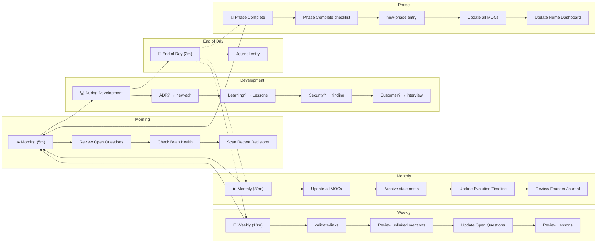

## Morning Routine (5 minutes)
1. Open `00-Home/index.md` — the Dashboard
2. Review Open Questions — anything need attention?
3. Check Brain Health — any broken links?
4. Scan Recent Decisions — anything to follow?

## During Development
1. When you make an architecture decision → Create ADR (`bash brain.sh new-adr`)
2. When you learn something → Add to Lessons Library
3. When you find a security issue → Create finding (`bash brain.sh new-security-finding`)
4. When you talk to a customer → Create interview note (`bash brain.sh new-interview`)

## End of Day (2 minutes)
1. Create journal entry (`bash brain.sh new-journal`)
2. Record what changed, what you learned, what's next

## Phase Completion
1. Run the Phase Complete checklist
2. Use `bash brain.sh new-phase` to create the entry
3. Update all affected MOCs
4. Update Home Dashboard

## Weekly (10 minutes)
1. Fix broken links (`bash brain.sh validate-links`)
2. Review unlinked mentions in Obsidian
3. Update Open Questions
4. Review Lessons Library — anything to add?

## Monthly (30 minutes)
1. Update all MOCs for completeness
2. Archive stale notes
3. Review Brain Health Dashboard
4. Update Evolution Timeline if needed
5. Review Founder Journal — any reflections?

## Daily Flow

