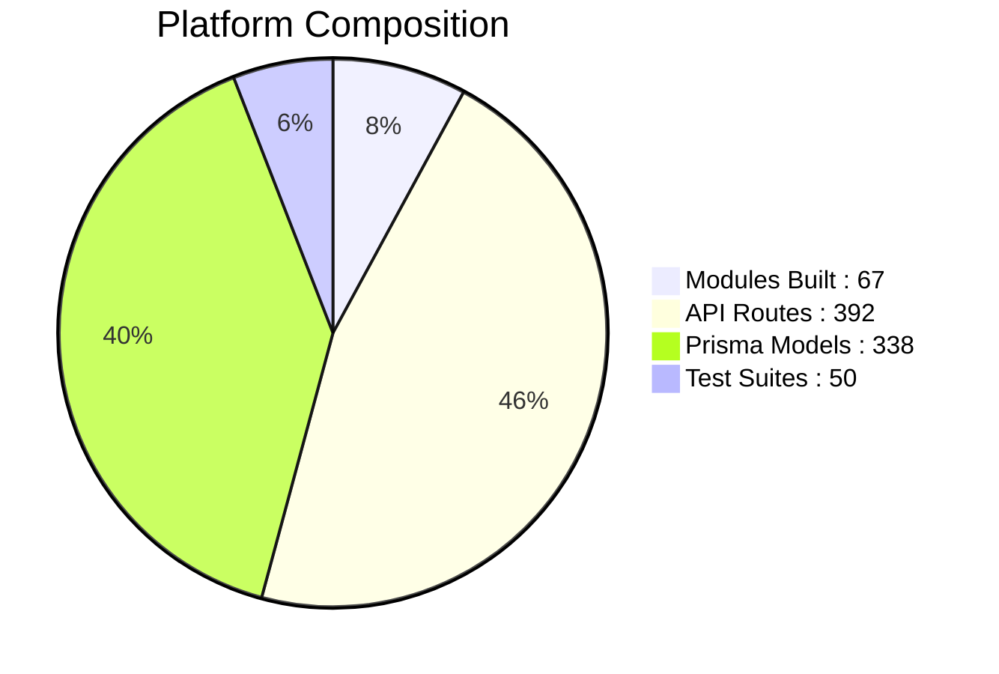
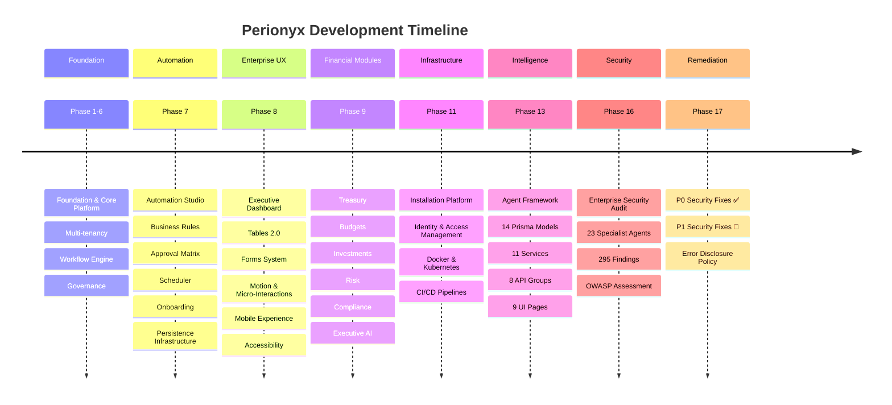

# ⬡ Perionyx Brain

> *The thinking behind the code.*

---

## Status Bar

> [!info]- Platform Status
> | Field | Value |
> |---|---|
> | **Current Phase** | Phase 17.1 — P0 Security Remediation `COMPLETE` |
> | **Platform Version** | `v1.0.0` |
> | **Release Date** | `2026-07-09` |
> | **Total Phases** | 17 |
> | **Architecture Version** | Frozen @ v1 |

---

## Quick Navigation

> [!tip] Maps of Content
> The vault is organized into **16 Maps of Content (MOCs)**. Each MOC is a hub that connects notes, decisions, and artifacts within its domain.

| Column A | Column B | Column C | Column D |
|---|---|---|---|
| [[01-Vision-Strategy\|🎯 Vision & Strategy]] | [[03-Architecture\|🏗️ Architecture]] | [[05-Engineering\|⚙️ Engineering]] | [[07-Enterprise-Workflows\|🔄 Enterprise Workflows]] |
| [[02-Product\|📦 Product]] | [[04-Security\|🛡️ Security]] | [[06-Experience-UX\|✨ Experience & UX]] | [[08-AI-Workforce\|🤖 AI Workforce]] |
| [[09-Customer-Discovery\|🔍 Customer Discovery]] | [[10-Research\|📚 Research]] | [[11-ADR\|📋 ADR]] | [[12-Roadmaps\|🗺️ Roadmaps]] |
| [[13-Engineering-Journal\|📓 Engineering Journal]] | [[14-Competitive-Intelligence\|🕵️ Competitive Intelligence]] | [[15-Pilot-Readiness\|🚀 Pilot Readiness]] | [[16-References\|📎 References]] |

### Knowledge System

| Link | Description |
|------|-------------|
| [[open-questions\|Open Questions]] | 32 unresolved questions across 6 domains |
| [[lessons-learned\|Lessons Library]] | 23 engineering lessons |
| [[evolution-timeline\|Evolution Timeline]] | Project history from Phase 1-17 |
| [[decision-network\|Decision Network]] | 25+ architecture decisions connected |
| [[founder-journal\|Founder Journal]] | Private reflection and strategy |
| [[brain-health\|Brain Health]] | Knowledge system self-assessment |
| [[knowledge-lifecycle\|Lifecycle Guide]] | How the Brain stays updated |

---

## Current Focus

> [!warning]+ Active Priorities
>
> | Priority | Item | Status | Owner |
> |---|---|---|---|
> | **P0** | Security Remediation (5 items) | `COMPLETE` ✅ | — |
> | **P1** | Error Message Disclosure Policy | `IN PROGRESS` 🔄 | — |
> | **P1** | P1 Security Remediation (12 items) | `PLANNED` 📋 | — |

> [!abstract] Phase 17.1 Deliverables
> - [[ADR-005]] — Error Message Disclosure Policy
> - Production error response sanitization
> - Health endpoint information disclosure remediation
> - Webhook SSRF protection implementation

---

## Recent Decisions

> [!note] Latest ADRs
> Architecture Decision Records capture the *why* behind every significant technical choice.
>
> | # | Decision | Status | Date |
> |---|---|---|---|
> | [[ADR-001]] | CSRF Conditional Enforcement | `ACCEPTED` | 2026-07-17 |
> | [[ADR-002]] | Workflow Approval Authorization | `ACCEPTED` | 2026-07-18 |
> | [[ADR-003]] | CRM Tenant Isolation | `ACCEPTED` | 2026-07-19 |
> | [[ADR-004]] | Session Validation Hybrid | `ACCEPTED` | 2026-07-20 |
> | [[ADR-005]] | Error Message Disclosure Policy | `PROPOSED` | 2026-07-20 |

> See [[11-ADR]] for the full decision log and superseded records.

---

## Architecture Status

| Metric | Count | Notes |
|---|---|---|
| **Modules Built** | 67 | Across 15 domains |
| **API Routes** | 392 | Including 8 agent endpoints |
| **Prisma Models** | 338 | 16 new in Phase 7E.2 |
| **Test Suites** | 50 | 85% coverage threshold |
| **UI Components** | 200+ | Enterprise design system |
| **Pages** | 96 | 26 DesktopOnly, 41 Responsive |

> See [[03-Architecture]] for the full system architecture and component inventory.

---

## Security Status

> [!danger]- Security Posture — 2026-07-20
>
> | Metric | Current | Target |
> |---|---|---|
> | **OWASP Score** | `6.0 / 10` | `8.0 / 10` |
> | **Compliance** | Partially Compliant (7/10) | Full Compliance |
> | **P0 Items** | `5 / 5 Resolved` ✅ | — |
> | **P1 Items** | `12 Open` 🔄 | — |
> | **P2 Items** | `28 Planned` 📋 | — |
> | **P3 Items** | `31 Planned` 📋 | — |
> | **Last Audit** | `2026-07-20` | — |
> | **Total Findings** | 295 | — |
> | **Critical** | 23 (resolved: 5) | 0 |
> | **High** | 58 (resolved: 0) | <5 |

> [!tip] Strengths
> - AES-256-GCM encryption
> - Tamper-evident audit chains
> - RBAC + ABAC permission model
> - Prisma parameterized queries (zero raw SQL)
> - Zero `dangerouslySetInnerHTML`, zero `eval()`

> See [[04-Security]] and [[SECURITY_REMEDIATION_PLAN]] for full audit results and remediation roadmap.

---

## Knowledge System

| Metric | Value |
|--------|-------|
| Total Notes | 50 |
| MOCs | 17 |
| Templates | 15 |
| Canvas Boards | 6 |
| Mermaid Diagrams | 10 |
| Open Questions | 32 |
| Lessons Learned | 23 |
| Brain Health | [[brain-health\|Dashboard]] |

---

## Product Timeline

> See [[12-Roadmaps]] for detailed phase plans and upcoming work.

---

## Quick Links

> [!note] Core References
>
> | Resource | Description |
> |---|---|
> | [[Brain Constitution]] | Governing principles for this vault |
> | [[Getting Started]] | How to navigate and contribute |
> | [[Templates Overview]] | Standard note templates for all MOCs |
> | [[03-Architecture]] | System architecture and design decisions |
> | [[04-Security]] | Security posture and audit findings |
> | [[12-Roadmaps]] | Product roadmap and phase plans |
> | [[11-ADR]] | Architecture Decision Record index |
> | [[16-References]] | External references and research |

---

## Outstanding Questions

> See [[open-questions]] for the full list.

**Top Priority**:
1. When to implement MFA? — [[open-questions#Security Questions]]
2. Redis or keep in-memory? — [[open-questions#Infrastructure Questions]]
3. Which ERP integration first? — [[open-questions#Finance Questions]]
4. Minimum viable pilot criteria? — [[open-questions#Product Questions]]
5. AI provider default selection? — [[open-questions#AI Questions]]

---

## Learning Library

> See [[16-References/index|References]] and [[lessons-learned]].

**Key Lessons**:
- [[lessons-learned#In-memory stores are fine for v1]]
- [[lessons-learned#CSRF needs conditional enforcement]]
- [[lessons-learned#Error messages are attack surface]]
- [[lessons-learned#Progressive disclosure over everything]]
- [[lessons-learned#Build the constitution first]]

---

*Last updated: 2026-07-20 — Perionyx Brain v1.0.0*
