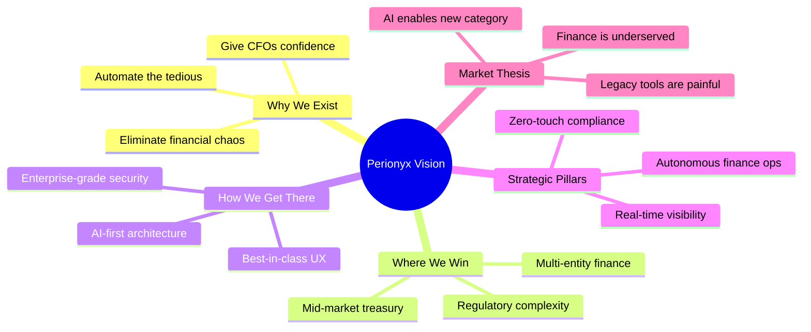

# Vision & Strategy

This MOC captures the north star of Perionyx — why we exist, where we're going, and how we position ourselves in the enterprise finance automation market. Every product decision, architectural choice, and go-to-market motion should trace back to these foundations.

---

## Core Vision

- [[vision-statement]] — The one-sentence north star
- [[mission-principles]] — How we execute against the vision daily
- [[market-thesis]] — Why now, why this market, why the timing is right

## Positioning & Narrative

- [[positioning-framework]] — How we describe ourselves vs. alternatives
- [[value-propositions]] — The 3–5 reasons a CFO chooses Perionyx
- [[narrative-arc]] — The story we tell from problem → solution → outcome

## Strategic Pillars

- [[strategic-pillars]] — The 3–4 bets we're making for the next 2–3 years
- [[target-segments]] — Who we serve first and why
- [[expansion-strategy]] — How we grow from initial wedge → platform

## Competitive Moat

- [[competitive-moat]] — What's defensible over time
- [[network-effects]] — Where usage compounds value
- [[data-advantage]] — How financial data becomes a flywheel

## Business Model

- [[business-model]] — Pricing, packaging, revenue model
- [[unit-economics]] — CAC, LTV, payback assumptions
- [[go-to-market]] — Sales motion, channels, partnerships

---

---

## Cross-References

| MOC | Relationship |
|---|---|
| [[02-Product/index\|Product]] | Vision drives product strategy |
| [[14-Competitive-Intelligence/index\|Competitive Intelligence]] | Market thesis validated by landscape analysis |
| [[09-Customer-Discovery/index\|Customer Discovery]] | Vision grounded in real customer pain |
| [[10-Research/index\|Research]] | Market thesis supported by research |
| [[12-Roadmaps/index\|Roadmaps]] | Vision expressed as phased execution |

## Decision Log

| Decision | Date | Status |
|---|---|---|
| AI-first, not AI-only | 2026-07 | Accepted |
| Target mid-market first | 2026-07 | Accepted |
| Enterprise-grade from day 1 | 2026-07 | Accepted |

---

*Last updated: 2026-07-20*
