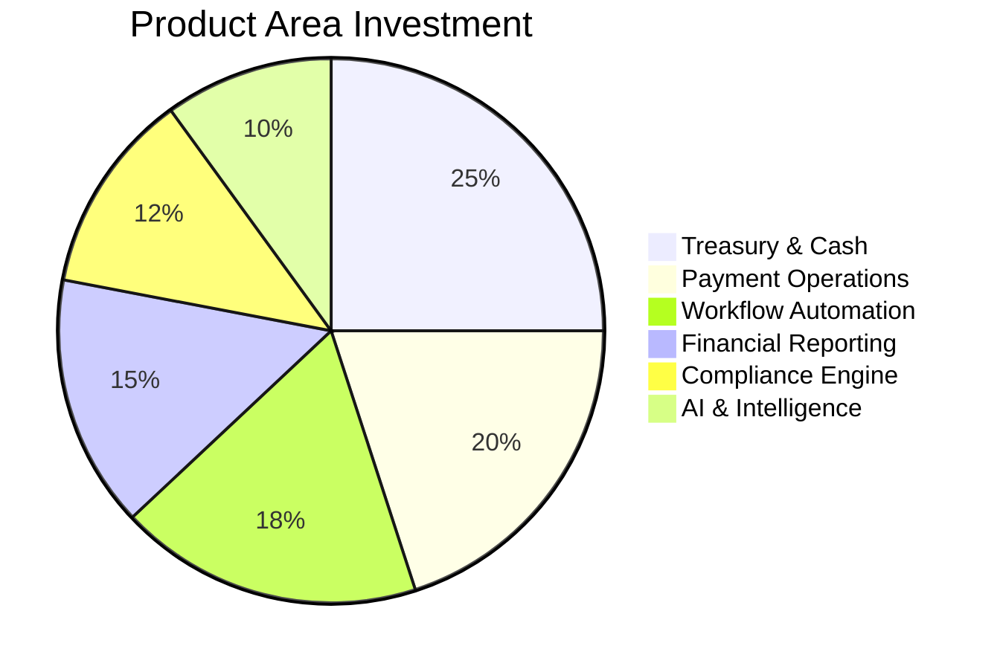

# Product

This MOC is the single source of truth for product decisions — features, user stories, personas, and the rationale behind every choice. Every feature ships because it serves a specific persona with a specific job-to-be-done.

---

## Personas & Users

- [[persona-cfo]] — CFO: strategic oversight, board reporting, risk visibility
- [[persona-treasurer]] — Treasurer: daily cash ops, bank connectivity, FX
- [[persona-controller]] — Controller: close process, reconciliations, audit trail
- [[persona-finance-manager]] — Finance Manager: team oversight, workflow approval
- [[persona-auditor]] — Auditor: compliance evidence, read-only access, exports

## Core Product Areas

- [[treasury-management]] — Cash visibility, forecasting, multi-bank connectivity
- [[payment-operations]] — Payment initiation, approval, reconciliation
- [[financial-reporting]] — Real-time dashboards, variance analysis, board packs
- [[workflow-automation]] — Business rules, approval chains, scheduling
- [[compliance-engine]] — Policy enforcement, audit logging, regulatory reporting
- [[ai-assistants]] — AI-powered insights, anomaly detection, recommendations

## Product Decisions

- [[prd-cash-positioning]] — Real-time cash position across all entities
- [[prd-approval-matrix]] — Role-based multi-level approval chains
- [[prd-business-rules]] — No-code rule builder for finance policies
- [[prd-ai-recommendations]] — Proactive suggestions, not just dashboards
- [[prd-multi-entity]] — Consolidated view with entity drill-down

## User Stories & Workflows

- [[user-story-fund-transfer]] — CFO initiates cross-entity fund transfer
- [[user-story-approval-chain]] — Treasurer submits payment, triggers 3-level approval
- [[user-story-cash-forecast]] — Controller reviews 13-week cash forecast
- [[user-story-audit-export]] — Auditor extracts full audit trail for QBR
- [[user-story-anomaly-alert]] — System flags unusual payment pattern

## Feature Prioritization

- [[feature-prioritization-framework]] — RICE scoring, impact vs. effort
- [[feature-backlog]] — Ordered list of upcoming features
- [[feature-decisions-log]] — Why we built/didn't build specific features

## Product Principles

- [[product-principles]] — Clarity > beauty, speed > completeness
- [[product-metrics]] — What we measure to know we're succeeding
- [[product-feedback-loop]] — How customer feedback enters the product process

## Public Website

- [[website-architecture]] — 25-document architecture for the public-facing website
- [[website-content-strategy]] — 6 content pillars, voice framework, governance
- [[website-design-language]] — PEDL extension for public site
- [[website-roadmap]] — 5-phase, 16-week implementation plan

---

---

## Cross-References

| MOC | Relationship |
|---|---|
| [[01-Vision-Strategy/index\|Vision & Strategy]] | Product decisions trace to vision |
| [[06-Experience-UX/index\|Experience & UX]] | How features are designed and delivered |
| [[09-Customer-Discovery/index\|Customer Discovery]] | Features grounded in real pain points |
| [[07-Enterprise-Workflows/index\|Enterprise Workflows]] | Automation features power workflows |
| [[12-Roadmaps/index\|Roadmaps]] | Product timeline and milestones |

## Decision Log

| Decision | Date | Status |
|---|---|---|
| AI proactive, not reactive | 2026-07 | Accepted |
| Multi-entity from v1 | 2026-07 | Accepted |
| No-code business rules | 2026-07 | Accepted |

---

*Last updated: 2026-07-20*
