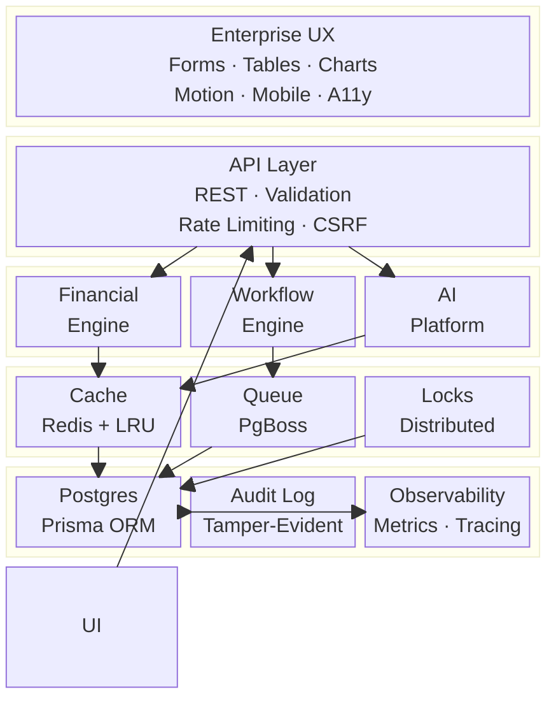

# Architecture

This MOC maps the entire technical architecture of Perionyx — from platform primitives to domain-specific engines. Every architectural decision is documented in [[11-ADR/index|ADR]] and every trade-off is captured here.

---

## Core Platform

- [[architecture-overview]] — High-level system design and principles
- [[platform-primitives]] — Shared services: caching, locks, queues, observability
- [[multi-tenancy]] — Tenant isolation, data partitioning, row-level security
- [[api-design]] — REST conventions, versioning, error handling, pagination
- [[data-model]] — Prisma schema, entity relationships, migration strategy
- [[persistence-layer]] — Repository pattern, adapters (Postgres/MySQL/SQLite)

## Financial Engine

- [[cash-positioning]] — Real-time multi-entity cash aggregation
- [[cash-forecasting]] — 13-week rolling forecast engine
- [[fx-management]] — Currency exposure tracking, hedging support
- [[payment-processing]] — Payment lifecycle: initiation → approval → execution → reconciliation
- [[reconciliation-engine]] — Auto-matching, exception handling, break resolution
- [[financial-calculations]] — Interest, amortization, accrual computations

## Workflow Engine

- [[workflow-engine-core]] — Step execution, state machine, persistence
- [[conditional-branching]] — ConditionEvaluator with operator map
- [[approval-step-executor]] — Approval integration with matrix evaluator
- [[workflow-analytics]] — Step durations, bottleneck detection, failure rates
- [[automation-scheduler]] — Cron, event-driven, manual triggers via PgBoss

## AI Platform

- [[ai-provider-registry]] — Multi-provider support (OpenAI, Anthropic, Gemini, etc.)
- [[ai-model-registry]] — Model catalog, capability mapping, cost tracking
- [[ai-proxy]] — Unified AI API gateway with rate limiting and audit
- [[intelligence-service]] — Pattern detection, anomaly scoring, recommendations
- [[decision-engine]] — Structured decisions with evidence and audit trail
- [[agent-framework]] — Autonomous agents with governance and human oversight

## Enterprise UX

- [[design-system]] — Design tokens, typography, color, spacing
- [[component-library]] — Enterprise primitives: forms, tables, charts, motion
- [[enterprise-forms]] — Form system with auto-save, validation, progressive disclosure
- [[enterprise-tables]] — Data tables with inline editing, exports, multi-sort
- [[analytics-components]] — Executive KPIs, charts, drill-down, AI insights
- [[motion-system]] — Animation tokens, micro-interactions, reduced-motion support
- [[mobile-experience]] — Responsive design, executive mobile, offline support

## Security Architecture

- [[authentication]] — Session management, SSO, MFA plans
- [[authorization]] — RBAC + ABAC, permission registry, tenant isolation
- [[encryption]] — AES-256-GCM, key rotation, field-level encryption
- [[audit-logging]] — Tamper-evident audit chains, compliance exports
- [[api-security]] — Rate limiting, CSRF, input validation, CSP
- [[compliance-architecture]] — SOC 2, PCI DSS, GDPR, ISO 27001 readiness

## Infrastructure

- [[deployment-architecture]] — Docker, Kubernetes, CI/CD pipelines
- [[observability-stack]] — Metrics, tracing, logging, alerting
- [[ha-architecture]] — Circuit breakers, graceful shutdown, auto-reconnect
- [[backup-recovery]] — Backup, restore, snapshot, DR drills
- [[performance-architecture]] — Caching tiers, connection pooling, read replicas

---

---

## Cross-References

| MOC | Relationship |
|---|---|
| [[04-Security/index\|Security]] | Security architecture decisions |
| [[05-Engineering/index\|Engineering]] | Implementation practices and tooling |
| [[07-Enterprise-Workflows/index\|Enterprise Workflows]] | Workflow engine powers finance automation |
| [[08-AI-Workforce/index\|AI Workforce]] | AI platform enables autonomous agents |
| [[11-ADR/index\|ADR]] | All architectural decisions documented |

## Architecture Principles

1. **Pragmatic over pure** — ship the 80%, refactor to 100% later
2. **In-memory first, persist later** — prove logic before adding DB complexity
3. **Zero external dependencies where possible** — custom SVG charts, in-memory stores
4. **Security as foundation, not afterthought** — every feature passes 10-question checklist
5. **Observable by default** — every component emits metrics, traces, and logs

---

*Last updated: 2026-07-20*
