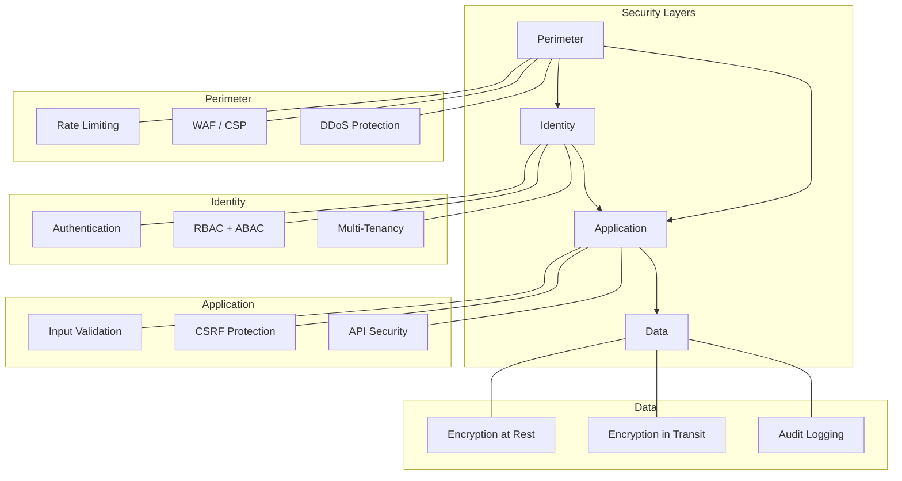

# Security

This MOC tracks all security decisions, threat models, compliance posture, and audit findings for Perionyx. Security is a first-class architectural concern — every feature must pass the [[security-review-checklist]] before merge.

---

## Authentication

- [[authentication-architecture]] — Session-based auth, token lifecycle
- [[sso-integration]] — SAML 2.0, OIDC provider support
- [[mfa-roadmap]] — Multi-factor authentication implementation plan
- [[session-management]] — Session store, expiry, refresh, revocation
- [[password-security]] — Hashing, complexity, rotation, breach detection

## Authorization

- [[rbac-model]] — Role-based access control, permission hierarchy
- [[abac-model]] — Attribute-based policies, contextual access
- [[permission-registry]] — GranularPermission catalog, 100+ permissions
- [[tenant-isolation]] — Row-level security, cross-tenant access prevention
- [[api-key-management]] — API key generation, scoping, rotation

## Multi-Tenancy

- [[tenant-architecture]] — Data partitioning strategy, schema design
- [[tenant-context]] — requireTenantContext(), context propagation
- [[cross-tenant-prevention]] — IDOR prevention, tenant scoping queries
- [[tenant-provisioning]] — New tenant setup, data isolation verification

## Encryption

- [[encryption-at-rest]] — AES-256-GCM for sensitive fields
- [[encryption-in-transit]] — TLS enforcement, HSTS headers
- [[key-management]] — Key rotation schedule, secure storage
- [[field-level-encryption]] — PII, financial data, credentials

## Audit & Compliance

- [[audit-logging]] — Tamper-evident chains, chronological integrity
- [[iam-audit]] — Identity and access audit trail
- [[compliance-matrix]] — SOC 2, PCI DSS, GDPR, ISO 27001 readiness
- [[soc2-readiness]] — SOC 2 Type I/II preparation status
- [[pci-dss-readiness]] — PCI DSS requirements and gaps
- [[gdpr-readiness]] — GDPR compliance, data subject rights
- [[iso27001-readiness]] — ISO 27001 controls implementation

## Threat Models

- [[threat-model-overview]] — STRIDE analysis, attack surface mapping
- [[owasp-top10]] — OWASP Top 10 (2021) assessment: 6.0/10 score
- [[csrf-threat-model]] — CSRF protection and known bypass risks
- [[ssrf-threat-model]] — SSRF risks in webhook and connector systems
- [[prompt-injection]] — AI prompt injection attack vectors

## Audit Findings

- [[audit-findings-summary]] — 295 findings from Phase 16.0 security audit
- [[critical-findings]] — 23 critical findings requiring immediate remediation
- [[remediation-plan]] — 4-phase security remediation roadmap
- [[security-strengths]] — AES-256-GCM, parameterized queries, zero eval()

---

---

## Cross-References

| MOC | Relationship |
|---|---|
| [[03-Architecture/index\|Architecture]] | Security is embedded in architecture |
| [[05-Engineering/index\|Engineering]] | Security practices in engineering workflow |
| [[11-ADR/index\|ADR]] | Security-related architectural decisions |
| [[07-Enterprise-Workflows/index\|Enterprise Workflows]] | Approval chains enforce financial controls |
| [[15-Pilot-Readiness/index\|Pilot Readiness]] | Security gates for production deployment |

## Security Principles

1. **Defense in depth** — multiple overlapping controls
2. **Least privilege** — minimal permissions by default
3. **Fail secure** — deny by default, log all failures
4. **Separation of duties** — no single person can bypass controls
5. **Audit everything** — every security-relevant action is logged

---

*Last updated: 2026-07-20*
