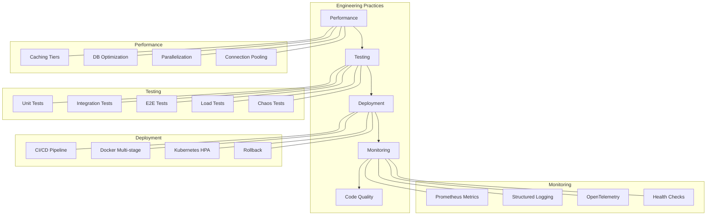

# Engineering

This MOC covers engineering practices, tooling, performance optimization, reliability engineering, and the operational discipline that keeps Perionyx production-ready. Every engineering decision is logged in [[11-ADR/index|ADR]].

---

## Performance

- [[performance-audit]] — Phase 8A.1: 43 findings across 7 domains
- [[database-optimization]] — Phase 8A.2: 18 indexes, 5 N+1 eliminations, pagination
- [[api-optimization]] — Phase 8A.4: 31 files changed, unified error format, Cache-Control
- [[caching-strategy]] — Tiered TTLs (critical 5s → stale 600s), Redis + LRU
- [[parallelization]] — 9 independent DB queries converted from sequential to Promise.all
- [[connection-pooling]] — Database connection management and tuning

## Testing

- [[testing-strategy]] — 18 test suites across 15 categories
- [[test-infrastructure]] — Mock factories, seed factories, fixtures, data builders
- [[coverage-targets]] — 85% coverage threshold, per-domain tracking
- [[e2e-testing]] — End-to-end test scenarios and automation
- [[load-testing]] — Load, stress, and chaos testing patterns
- [[contract-testing]] — API contract verification and schema validation

## Infrastructure

- [[infrastructure-overview]] — Cache, locks, queues, observability layers
- [[cache-architecture]] — LRU in-memory + Redis, tiered TTL, event bus
- [[distributed-locks]] — In-memory + Redis, hierarchical, exponential backoff
- [[queue-persistence]] — PgBoss-based FIFO/priority/delayed/scheduled queues
- [[observability-stack]] — MetricsRegistry, span tracing, HealthRegistry

## Deployment

- [[deployment-pipeline]] — CI/CD: typecheck → lint → test → build → deploy
- [[docker-architecture]] — Multi-stage Dockerfile, healthcheck, entrypoint
- [[kubernetes-deployment]] — Deploy, ingress, HPA, PDB, network policies
- [[rollback-procedure]] — Automated rollback on health check failure
- [[blue-green-deployment]] — Zero-downtime deployment strategy

## Monitoring

- [[monitoring-stack]] — Prometheus exporter, structured JSON logger, OTel bridge
- [[metric-domains]] — 8 metric domains: API, DB, cache, queue, AI, connector, auth, system
- [[alerting-rules]] — Alert thresholds, escalation, on-call routing
- [[health-checks]] — Readiness, liveness, health endpoints

## Code Quality

- [[linting-standards]] — ESLint rules, strict TypeScript, zero warnings policy
- [[code-review-process]] — PR review checklist, security checklist
- [[refactoring-patterns]] — When and how to refactor, technical debt tracking
- [[dependency-management]] — Minimal dependencies, audit, lockfile strategy

---

---

## Cross-References

| MOC | Relationship |
|---|---|
| [[03-Architecture/index\|Architecture]] | Engineering implements architecture |
| [[04-Security/index\|Security]] | Security practices embedded in engineering |
| [[11-ADR/index\|ADR]] | Engineering decisions documented as ADRs |
| [[13-Engineering-Journal/index\|Engineering Journal]] | Daily observations and lessons |
| [[15-Pilot-Readiness/index\|Pilot Readiness]] | Engineering gates for production |

## Engineering Principles

1. **Ship and iterate** — working software > perfect design
2. **Type safety is non-negotiable** — strict TypeScript, no `any`
3. **Zero regressions** — every bug gets a test
4. **Observable by default** — if you can't measure it, you can't improve it
5. **Automate the boring stuff** — manual processes are bugs

---

*Last updated: 2026-07-20*
