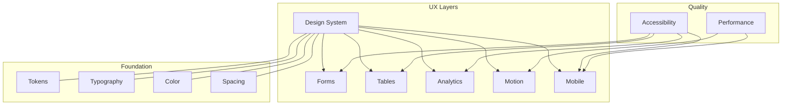

# Experience & UX

This MOC covers the design system, user experience patterns, accessibility standards, motion design, and mobile experience for Perionyx. Every UI decision is justified by the needs of CFOs, Treasurers, Controllers, Finance Managers, and Auditors — not by consumer SaaS aesthetics.

---

## Design System

- [[design-tokens]] — Colors, typography, spacing, shadows, border radius
- [[visual-identity]] — Charcoal surfaces, white typography, gold accents
- [[typography-system]] — Font scale, weights, line heights, responsive sizing
- [[color-system]] — Brand palette, semantic colors, status indicators
- [[spacing-system]] — 4px grid, component spacing, layout rhythm

## Forms

- [[enterprise-form-system]] — Auto-save, validation, progressive disclosure, smart defaults
- [[form-validation]] — Inline on blur, format/range/cross-field/async validation
- [[smart-select]] — Searchable grouped multi-select with keyboard navigation
- [[condition-editor]] — No-code rule builder with AND/OR logic
- [[enterprise-wizard]] — Multi-step wizard with step indicator and back/next/complete

## Tables

- [[enterprise-table-system]] — Density, filtering, grouping, inline editing, exports
- [[cell-formatters]] — Currency, number, date, status, trend, tags
- [[inline-editing]] — Text, number, currency, date, select with validation
- [[multi-sort]] — Priority-based multi-column sort with persistence
- [[export-utils]] — CSV (UTF-8 BOM) and XLS (zero dependencies)

## Analytics

- [[executive-kpi-cards]] — Metric cards with trends, sparklines, thresholds
- [[chart-components]] — Cash flow timeline, forecast, approval analytics, workflow analytics
- [[drill-down-panel]] — Click charts → see per-instance details
- [[insight-panel]] — AI-generated insights and recommendations
- [[executive-summary]] — Post-login dashboard with key metrics

## Motion

- [[motion-tokens]] — Durations (100–600ms), 6 easing curves, 12+ variants
- [[animated-components]] — Card, button, dialog, toast, metric, sidebar, table
- [[page-transitions]] — Fade-in-up page enter, section stagger
- [[loading-states]] — Shimmer skeletons, staggered appearance, presets
- [[reduced-motion]] — prefers-reduced-motion support in all components

## Mobile

- [[responsive-breakpoints]] — 5 breakpoints with clear guidelines
- [[mobile-components]] — MetricCard, ApprovalQuickView, QuickActionBar, AdaptiveNavigation
- [[mobile-pages]] — Mobile dashboard, mobile treasury
- [[touch-interactions]] — 44px touch targets, swipe gestures, haptic feedback
- [[offline-support]] — Connection status, offline indicator, action queue

## Accessibility

- [[accessibility-standards]] — WCAG 2.1 AA compliance targets
- [[skip-navigation]] — Skip links for keyboard users
- [[aria-patterns]] — aria-invalid, aria-describedby, aria-required
- [[keyboard-navigation]] — Tab/Shift+Tab/Enter/Escape for all interactions
- [[screen-reader-support]] — Semantic HTML, ARIA labels, live regions
- [[color-contrast]] — Minimum contrast ratios for all text and UI elements

---

---

## Cross-References

| MOC | Relationship |
|---|---|
| [[02-Product/index\|Product]] | UX delivers product features |
| [[07-Enterprise-Workflows/index\|Enterprise Workflows]] | Workflow UX for approval chains |
| [[08-AI-Workforce/index\|AI Workforce]] | AI insights surfaced through analytics |
| [[03-Architecture/index\|Architecture]] | Component architecture and design tokens |
| [[01-Vision-Strategy/index\|Vision & Strategy]] | UX reflects brand and positioning |

## Design Principles

1. **Clarity** — every screen answers one question; no visual noise
2. **Confidence** — data is stale? label it. action is destructive? confirm it.
3. **Speed** — CFOs don't wait. Metric values render first, charts second
4. **Beauty** — achieved through restraint: generous whitespace, consistent rhythm
5. **Trust** — every number has a source; every state has an explanation

---

*Last updated: 2026-07-20*
