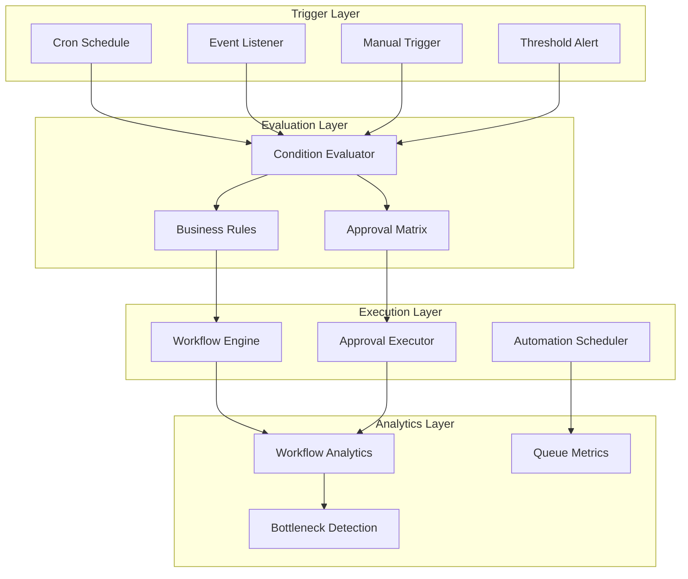

# Enterprise Workflows

This MOC covers the workflow automation layer of Perionyx — the approval engine, business rules builder, scheduler, analytics, and condition evaluator. These are the core automation primitives that give finance teams control without code.

---

## Approval Engine

- [[approval-matrix-evaluator]] — Role/dept/threshold rule matching, escalation, delegation
- [[approval-step-executor]] — Execution bridge: matrix resolution → step action
- [[approval-analytics]] — Approval path donut, cycle time, bottleneck detection
- [[multi-level-approval]] — Sequential and parallel approval chains
- [[escalation-rules]] — Auto-escalation on timeout, delegation chains
- [[delegation-mechanism]] — Temporary delegation with audit trail

## Business Rules

- [[business-rules-builder]] — No-code rule definition with condition groups
- [[rule-conditions]] — ConditionGroup + RuleAction[] structure
- [[condition-evaluator]] — Shared evaluation engine with OPERATOR_MAP
- [[rule-templates]] — Pre-built templates for common finance policies
- [[rule-testing]] — Simulate rules against sample data before activation

## Scheduler

- [[automation-scheduler]] — Cron, event-driven, manual trigger types
- [[trigger-types]] — All 12 trigger types: schedule, event, threshold, etc.
- [[pgboss-integration]] — Queue persistence via PgBoss, no queue duplication
- [[scheduled-actions]] — Payment runs, report generation, reconciliation triggers

## Workflow Analytics

- [[workflow-analytics-service]] — Step durations, bottleneck detection, failure rates
- [[queue-metrics]] — Queue depth, processing time, dead letter analysis
- [[performance-dashboards]] — Real-time workflow health monitoring
- [[bottleneck-detection]] — Identify slow steps and optimize paths

## Condition Evaluator

- [[condition-evaluator-core]] — Shared evaluator used by rules, approvals, branching
- [[operator-map]] — Single source of truth for comparison operators
- [[condition-syntax]] — How conditions are expressed and parsed
- [[condition-testing]] — Unit test patterns for condition evaluation

## Integration Points

- [[workflow-engine-bridge]] — WorkflowEngine.getInstance() shared singleton
- [[governance-integration]] — Policy enforcement, violation recording
- [[notification-integration]] — Enqueued async notifications via PgBoss
- [[connector-integration]] — Bank/ERP connector triggers and callbacks

---

---

## Cross-References

| MOC | Relationship |
|---|---|
| [[03-Architecture/index\|Architecture]] | Workflow engine architecture decisions |
| [[08-AI-Workforce/index\|AI Workforce]] | AI agents can trigger and participate in workflows |
| [[02-Product/index\|Product]] | Workflow features are core product capabilities |
| [[04-Security/index\|Security]] | Approval chains enforce financial controls |
| [[06-Experience-UX/index\|Experience & UX]] | Workflow designer and canvas UX |

## Workflow Principles

1. **No-code first** — finance teams build rules without engineering
2. **Audit every step** — every approval, rejection, and escalation is logged
3. **Fail safely** — workflow failures don't corrupt financial data
4. **Observable** — every workflow run has full execution trace
5. **Composable** — rules, approvals, and schedules compose without conflicts

---

*Last updated: 2026-07-20*
