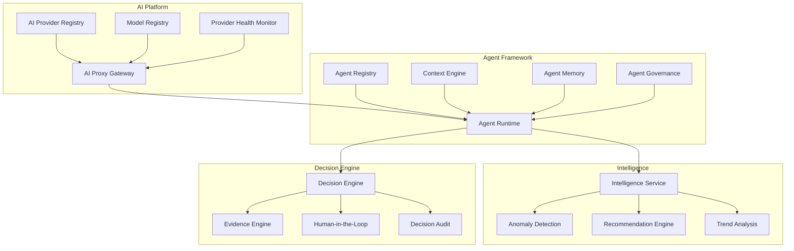

# AI Workforce

This MOC covers the AI platform, agent framework, intelligence services, and decision engine that enable Perionyx to move from reactive dashboards to proactive autonomous finance operations.

---

## Agent Framework

- [[agent-framework-overview]] — 14 Prisma models, 11 services, 8 API groups
- [[agent-registry]] — Registration, discovery, listing, capability mapping
- [[agent-runtime]] — Lifecycle management, sessions, tasks, executions
- [[agent-context-engine]] — Trusted context from 9 sources
- [[agent-memory]] — 5 memory types: semantic, episodic, procedural, working, long-term
- [[agent-governance]] — Permissions, rate limits, safety constraints, human oversight
- [[agent-conversations]] — Human-agent interaction: questions, clarification, feedback
- [[agent-delegation]] — Multi-agent collaboration with traceability

## AI Providers

- [[ai-provider-registry]] — Multi-provider support: OpenAI, Anthropic, Gemini, Azure, Mistral, Grok, Cohere
- [[ai-model-registry]] — Model catalog with capability mapping and cost tracking
- [[ai-proxy-gateway]] — Unified API with rate limiting, retry, and audit
- [[provider-health-monitor]] — Health tracking, failover, circuit breaking
- [[cost-optimization]] — Model selection based on task complexity and cost

## Intelligence Platform

- [[intelligence-service]] — Pattern detection, anomaly scoring, recommendations
- [[anomaly-detection]] — Unusual payment patterns, balance deviations, timing anomalies
- [[recommendation-engine]] — Proactive suggestions for cash optimization, risk mitigation
- [[trend-analysis]] — Historical pattern recognition and forecasting support
- [[natural-language-queries]] — CFO asks questions in plain English, gets answers

## Decision Engine

- [[decision-engine]] — Structured decisions with evidence, audit trail, approval integration
- [[evidence-engine]] — Source tracking, verification, confidence scoring
- [[decision-workflow]] — Decision → evidence → approval → execution → audit
- [[human-in-the-loop]] — Critical decisions require human confirmation
- [[decision-analytics]] — Decision quality tracking, outcome measurement

## AI Security

- [[ai-security-overview]] — Prompt injection, PII leakage, validation gaps
- [[ai-input-validation]] — Schema validation for all AI inputs
- [[ai-output-validation]] — Response verification, hallucination detection
- [[ai-audit-logging]] — Every AI call logged with input, output, cost, latency

---

---

## Cross-References

| MOC | Relationship |
|---|---|
| [[03-Architecture/index\|Architecture]] | AI platform architecture decisions |
| [[07-Enterprise-Workflows/index\|Enterprise Workflows]] | Agents trigger and participate in workflows |
| [[04-Security/index\|Security]] | AI security audit findings and mitigations |
| [[10-Research/index\|Research]] | AI technology evaluation and benchmarks |
| [[02-Product/index\|Product]] | AI features in product roadmap |

## AI Principles

1. **AI assists, humans decide** — autonomous ops only within governance bounds
2. **Evidence-based** — every AI recommendation backed by data and sources
3. **Auditable** — every AI call, decision, and action logged end-to-end
4. **Cost-aware** — model selection balances quality and cost
5. **Fail safe** — AI failure degrades gracefully, never corrupts data

---

*Last updated: 2026-07-20*
