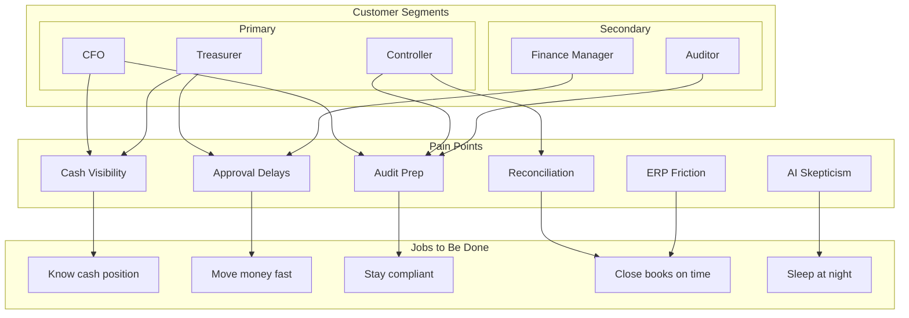

# Customer Discovery

This MOC captures everything we learn from the people we serve — interviews, personas, pain points, feature requests, and insights. Product decisions that aren't grounded in customer reality are guesses.

---

## Personas

- [[persona-cfo-detailed]] — Strategic CFO: board prep, risk visibility, 30,000ft view
- [[persona-treasurer-detailed]] — Operational Treasurer: daily cash, bank calls, FX trades
- [[persona-controller-detailed]] — Detail-oriented Controller: close, reconcile, audit
- [[persona-finance-manager-detailed]] — People-focused Finance Manager: team, approvals, SLAs
- [[persona-auditor-detailed]] — External/Internal Auditor: evidence, compliance, read-only

## Interviews

- [[interview-template]] — Standardized interview structure and questions
- [[interview-adeel-aslam]] — Real estate/construction finance: vendor invoice reconciliation + approval workflows
- [[interview-cfo-series]] — CFO interview transcripts and summaries
- [[interview-treasurer-series]] — Treasurer interview transcripts and summaries
- [[interview-controller-series]] — Controller interview transcripts and summaries
- [[interview-findings]] — Cross-interview pattern analysis

## Pain Points

- [[pain-point-cash-visibility]] — "I don't know my real cash position across entities"
- [[pain-point-approval-delays]] — "Payments sit in approval queues for days"
- [[pain-point-reconciliation]] — "Month-end close takes 2 weeks because of reconciliation"
- [[pain-point-audit-prep]] — "Audit prep is a 3-month fire drill every year"
- [[pain-point-erp-friction]] — "Our ERP integration is brittle and expensive"
- [[pain-point-ai-skepticism]] — "I don't trust AI with my financial data"

## Feature Requests

- [[feature-request-dashboard]] — Real-time multi-entity cash dashboard
- [[feature-request-approvals]] — Mobile-first approval with delegation
- [[feature-request-forecasting]] — 13-week rolling cash forecast
- [[feature-request-compliance]] — Automated compliance evidence collection
- [[feature-request-ai-insights]] — AI-powered anomaly detection and recommendations

## Validated Pain Points (Phase 20.0)

Cross-referenced with workflow validation — these are the pain points where Perionyx partially addresses the need but workflow gaps prevent completion:

| Persona | Pain Point | Current State | Gap |
|---------|-----------|---------------|-----|
| Controller | Month-end close automation | Manual 10-step checklist | No persistence, no progress tracking, no automated step sequencing |
| CFO | Morning briefing with data freshness | Partially implemented | Missing data freshness indicators — CFOs can't tell if numbers are real-time or stale |
| Treasurer | Real-time cash positions + payment approval | Partially wired | Cash position exists but approval-to-submission-to-reconciliation flow is broken |
| Auditor | Complete audit trails | Audit log exists | Workflow gaps mean some actions aren't logged end-to-end |
| Compliance officer | Policy exception workflows | Partially implemented | Exception detection works but resolution workflow has no orchestration |

## Insights

- [[insight-trust-framework]] — What builds/destroys trust in financial AI
- [[insight-adoption-patterns]] — How finance teams adopt new tools
- [[insight-buying-process]] — Who decides, who influences, who blocks
- [[insight-competitive-switching]] — Why teams switch from existing tools
- [[insight-value-metrics]] — What "success" looks like to each persona

---

---

## Cross-References

| MOC | Relationship |
|---|---|
| [[02-Product/index\|Product]] | Pain points drive feature prioritization |
| [[01-Vision-Strategy/index\|Vision & Strategy]] | Customer reality grounds the vision |
| [[06-Experience-UX/index\|Experience & UX]] | Personas shape UX decisions |
| [[14-Competitive-Intelligence/index\|Competitive Intelligence]] | Switching behavior informs positioning |
| [[09-Customer-Discovery/index\|Customer Discovery]] | Self-reference for new entries |

## Discovery Principles

1. **Talk to users weekly** — never go a week without a customer conversation
2. **Listen for pain, not features** — features are solutions; pain is the problem
3. **Validate with behavior** — what people do > what they say
4. **Document everything** — future you will forget context
5. **Share broadly** — every team member should hear customer voices

---

*Last updated: 2026-07-20*
