```mermaid
graph TB
    subgraph "Research Areas"
        MR[Market Research]
        TE[Technology Evaluation]
        BM[Benchmarks]
        LL[Learning Library]
        CR[Competitive Research]
    end

    subgraph "Market"
        MR1[Market Sizing]
        MR2[Trends]
        MR3[Buyer Behavior]
        MR4[Regulatory]
    end

    subgraph "Technology"
        TE1[Framework Choice]
        TE2[ORM Evaluation]
        TE3[Queue Systems]
        TE4[AI Providers]
    end

    subgraph "Benchmarks"
        BM1[Performance]
        BM2[UI / Lighthouse]
        BM3[AI Latency]
        BM4[Load Testing]
    end

    subgraph "Learning"
        LL1[Books]
        LL2[Papers]
        LL3[Articles]
        LL4[Conferences]
    end

    MR --- MR1
    MR --- MR2
    MR --- MR3
    MR --- MR4
    TE --- TE1
    TE --- TE2
    TE --- TE3
    TE --- TE4
    BM --- BM1
    BM --- BM2
    BM --- BM3
    BM --- BM4
    LL --- LL1
    LL --- LL2
    LL --- LL3
    LL --- LL4
```

# Research

This MOC organizes all research efforts — market analysis, technology evaluation, performance benchmarks, and the learning library that keeps the team sharp. Research informs [[01-Vision-Strategy/index|Vision]] and validates [[11-ADR/index|Architecture Decisions]].

---

## Market Research

- [[market-sizing]] — TAM/SAM/SOM for enterprise finance automation
- [[market-trends]] — AI in finance, real-time treasury, compliance automation
- [[buyer-behavior]] — How CFOs evaluate and purchase finance tools
- [[regulatory-landscape]] — SOX, Basel III, MiFID II implications
- [[geo-market-analysis]] — US, EU, MEA market characteristics

## Technology Evaluation

- [[nextjs-evaluation]] — Next.js 16 rationale, App Router, Server Components
- [[prisma-evaluation]] — Prisma ORM: schema-first, migration strategy, performance
- [[pgboss-evaluation]] — PgBoss for job queues: simplicity, reliability, Postgres-native
- [[framer-motion-evaluation]] — Animation library: performance, reduced-motion, API
- [[ai-provider-comparison]] — OpenAI vs Anthropic vs Gemini vs Mistral vs Cohere
- [[charting-approach]] — Why custom SVG over Recharts/D3 (CFO pixel-perfection)

## Benchmarks

- [[performance-benchmarks]] — API response times, DB query performance, cache hit rates
- [[ui-benchmarks]] — Lighthouse scores, FCP, LCP, CLS, INP targets
- [[ai-benchmarks]] — Latency, cost, accuracy per provider and model
- [[load-testing-results]] — Concurrent user capacity, degradation curves

## Learning Library

- [[books-read]] — Key finance/tech books and takeaways
- [[papers-read]] — Research papers on AI, finance, distributed systems
- [[articles-read]] — Notable articles and blog posts
- [[conference-notes]] — Conference talks and workshops attended
- [[course-notes]] — Online courses and certifications

## Competitive Research

- [[competitor-features]] — Feature comparison matrix across competitors
- [[competitor-pricing]] — Pricing model analysis
- [[competitor-ux]] — UX teardowns of competitor products
- [[competitor-tech-stack]] — Public technology stack analysis

---

---

## Cross-References

| MOC | Relationship |
|---|---|
| [[01-Vision-Strategy/index\|Vision & Strategy]] | Market research validates vision |
| [[03-Architecture/index\|Architecture]] | Technology evaluation informs architecture |
| [[14-Competitive-Intelligence/index\|Competitive Intelligence]] | Competitive research feeds positioning |
| [[11-ADR/index\|ADR]] | Research informs architectural decisions |
| [[05-Engineering/index\|Engineering]] | Benchmarks drive performance targets |

## Research Principles

1. **Research before building** — 30 minutes of research saves 3 days of coding
2. **Cite sources** — every claim backed by evidence
3. **Challenge assumptions** — especially our own
4. **Share findings** — research locked in a doc is research wasted
5. **Update regularly** — stale research is worse than no research

---

*Last updated: 2026-07-20*
