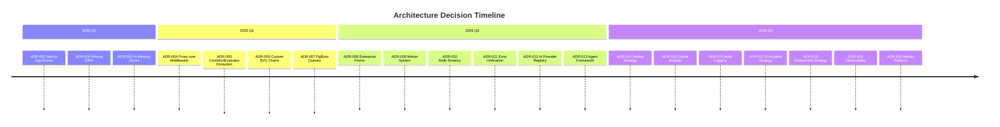

# Architecture Decision Records

This MOC indexes all Architecture Decision Records (ADRs) — the documented rationale behind every significant technical decision. Each ADR captures context, decision, consequences, and status.

---

## ADR Template

- [[adr-template]] — Standard format: Title, Status, Context, Decision, Consequences

## Accepted ADRs

- [[adr-001-nextjs-app-router]] — Use Next.js 16 App Router with Server Components
- [[adr-002-prisma-orm]] — Prisma as primary ORM with schema-first approach
- [[adr-003-in-memory-stores]] — In-memory stores for rules/schedules/matrix before DB persistence
- [[adr-004-proxy-over-middleware]] — src/proxy.ts replaces src/middleware.ts in Next.js 16
- [[adr-005-condition-evaluator-extraction]] — Shared ConditionEvaluator from ConditionalBranchStepExecutor
- [[adr-006-no-chart-library]] — Custom SVG charts instead of Recharts/D3
- [[adr-007-pgboss-queues]] — PgBoss for job queues (Postgres-native, no Redis dependency)
- [[adr-008-enterprise-form-system]] — Custom form system with auto-save, validation, progressive disclosure
- [[adr-009-motion-system]] — Framer Motion with reduced-motion tokens
- [[adr-010-multi-tenancy]] — Row-level security with requireTenantContext()
- [[adr-011-error-unification]] — Shared handleRouteError() / zodErrorResponse() for all 272 endpoints
- [[adr-012-ai-provider-registry]] — Multi-provider AI with fallback and cost tracking
- [[adr-013-agent-framework]] — 14-model agent framework with governance and human oversight
- [[adr-014-testing-strategy]] — 85% coverage threshold, 18 test suites across 15 categories
- [[adr-015-cache-strategy]] — Tiered TTL caching: critical 5s → stale 600s, Redis + LRU
- [[adr-016-audit-logging]] — Tamper-evident audit chains for all security-relevant actions
- [[adr-017-encryption-strategy]] — AES-256-GCM for field-level encryption with key rotation
- [[adr-018-deployment-strategy]] — Docker multi-stage + Kubernetes with HPA and PDB
- [[adr-019-observability]] — Prometheus metrics + structured JSON logging + OpenTelemetry bridge
- [[adr-020-identity-platform]] — In-memory identity provider for Phase 1 (migration to DB planned)

## Proposed ADRs

- [[adr-021-distributed-rate-limiting]] — Redis-backed distributed rate limiting
- [[adr-022-postgres-read-replicas]] — Read replicas for GET endpoints
- [[adr-023-response-compression]] — gzip compression for API responses
- [[adr-024-response-streaming]] — Streaming for AI and analytics endpoints

## Deprecated ADRs

- [[adr-legacy-auto-studio-errors]] — Deprecated: auto-studio-specific error helpers replaced by unified pattern

---

---

## ADR Status Summary

| Status | Count | Description |
|---|---|---|
| Accepted | 20 | Decision made and implemented |
| Proposed | 4 | Under consideration, not yet decided |
| Deprecated | 1 | Superseded by a newer decision |
| Superseded | 0 | Replaced by another ADR |

## Cross-References

| MOC | Relationship |
|---|---|
| [[03-Architecture/index\|Architecture]] | ADRs document architecture decisions |
| [[05-Engineering/index\|Engineering]] | ADRs inform engineering practices |
| [[04-Security/index\|Security]] | Security ADRs (encryption, audit, auth) |
| [[08-AI-Workforce/index\|AI Workforce]] | AI-related ADRs (provider registry, agents) |
| [[10-Research/index\|Research]] | Research informs proposed ADRs |

## ADR Principles

1. **Every significant decision gets an ADR** — if it's hard to change later, write it down
2. **Capture the "why" not just the "what"** — context and trade-offs matter
3. **Status is explicit** — proposed → accepted → deprecated lifecycle
4. **One ADR, one decision** — don't bundle multiple decisions
5. **Review before implementing** — proposed ADRs get team review

---

*Last updated: 2026-07-20*
