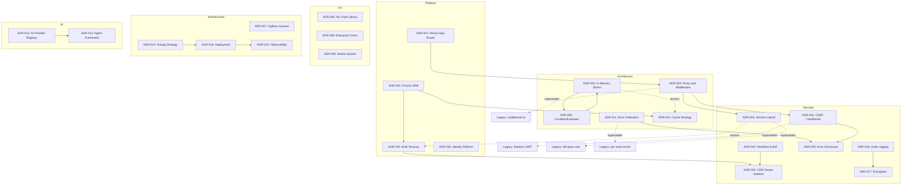

# Decision Network

A map connecting all Architecture Decision Records. Every significant technical decision in Perionyx is captured as an ADR. This note shows how those decisions relate to each other — which ones depend on which, which ones conflict, and which ones superseded others. The network reveals the architecture's decision DNA.

---

## Decision Categories

### Platform

| ADR | Decision | Status | Phase |
|-----|----------|--------|-------|
| [[ADR-001-nextjs-app-router]] | Next.js 16 App Router with Server Components | Accepted | Phase 1 |
| [[ADR-002-prisma-orm]] | Prisma ORM with schema-first approach | Accepted | Phase 1 |
| [[ADR-010-multi-tenancy]] | Row-level security with `requireTenantContext()` | Accepted | Phase 1 |
| [[ADR-020-identity-platform]] | In-memory identity provider for Phase 1 | Accepted | Phase 11C |

### Architecture

| ADR | Decision | Status | Phase |
|-----|----------|--------|-------|
| [[ADR-003-in-memory-stores]] | In-memory stores before DB persistence | Accepted | Phase 1 |
| [[ADR-004-proxy-over-middleware]] | `src/proxy.ts` replaces middleware | Accepted | Phase 7 |
| [[ADR-005-condition-evaluator-extraction]] | Shared ConditionEvaluator | Accepted | Phase 7 |
| [[ADR-011-error-unification]] | Shared `handleRouteError()` / `zodErrorResponse()` | Accepted | Phase 8A |
| [[ADR-015-cache-strategy]] | Tiered TTL caching: critical 5s → stale 600s | Accepted | Phase 7E |

### Security

| ADR | Decision | Status | Phase |
|-----|----------|--------|-------|
| [[ADR-001]] | CSRF conditional enforcement | Accepted | Phase 17 |
| [[ADR-002]] | Workflow approval authorization | Accepted | Phase 17 |
| [[ADR-003]] | CRM tenant isolation | Accepted | Phase 17 |
| [[ADR-004]] | Session validation hybrid (fail-open/closed) | Accepted | Phase 17 |
| [[ADR-005]] | Error message disclosure policy | Proposed | Phase 17 |
| [[ADR-016-audit-logging]] | Tamper-evident audit chains | Accepted | Phase 7F |
| [[ADR-017-encryption-strategy]] | AES-256-GCM with key rotation | Accepted | Phase 7F |

### UX

| ADR | Decision | Status | Phase |
|-----|----------|--------|-------|
| [[ADR-006-no-chart-library]] | Custom SVG charts | Accepted | Phase 8B.5 |
| [[ADR-008-enterprise-form-system]] | Custom form system with auto-save | Accepted | Phase 8B.6 |
| [[ADR-009-motion-system]] | Framer Motion with reduced-motion tokens | Accepted | Phase 8B.7 |

### Infrastructure

| ADR | Decision | Status | Phase |
|-----|----------|--------|-------|
| [[ADR-007-pgboss-queues]] | PgBoss for job queues | Accepted | Phase 7 |
| [[ADR-014-testing-strategy]] | 85% coverage, 18 test suites | Accepted | Phase 7F |
| [[ADR-018-deployment-strategy]] | Docker multi-stage + Kubernetes | Accepted | Phase 7F |
| [[ADR-019-observability]] | Prometheus + structured JSON + OTel bridge | Accepted | Phase 7F |
| [[ADR-021-runtime-platform]] | Runtime: AsyncLocalStorage context + Prisma-backed config/secrets/capabilities | Accepted | Phase 24.0B |
| [[ADR-027-canonical-execution-path]] | withRuntimeContext is the ONLY production runtime | Accepted | Phase 26.0A |

### AI

| ADR | Decision | Status | Phase |
|-----|----------|--------|-------|
| [[ADR-012-ai-provider-registry]] | Multi-provider AI with fallback | Accepted | Phase 5 |
| [[ADR-013-agent-framework]] | 14-model agent framework with governance | Accepted | Phase 13 |

---

## Decision Relationships

### Relationship Legend

| Relationship | Meaning |
|---|---|
| `-->` | **Depends on** — The target decision enables or constrains the source |
| `-.->` | **Supersedes** — The source replaces an older pattern |
| `-.->` (tension) | **Tension** — The decisions have a trade-off that needs management |

---

## Engineering Principles

Permanent rules governing architecture, security, and refactoring work. Codified from hard-won experience.

| Principle | Origin | Status |
|---|---|---|
| Implementation evidence always overrides architectural assumptions | Phase 18.1A — identity directory BLOCKED from deletion despite "zero consumers" report | Permanent |
| Platform primitives must have one authoritative implementation | Phase 18.1B — two loggers, two permission registries, two AI execution paths consolidated to one each | Permanent |
| Financial precision is non-negotiable | Phase 19.0 — Prisma.Decimal for all monetary calculations, never native number | Permanent |
| Financial allocations must include residual handling | Phase 19.1 — last target gets total minus sum of previous | Permanent |
| Product validation requires workflow-level evaluation, not module-level evaluation | Phase 20.0 — modules can be complete but workflows can be broken | Permanent |
| Workflow Success Defines Product Success | Phase 20.0 — Perionyx is evaluated by workflow outcomes, not module completeness | Permanent |
| Cross-cutting UX improvements benefit all personas but do not close domain-specific workflow gaps | Phase 20.2 — 8 cross-cutting fixes improved average 0.7 points; AP/AR still at 5/10 | Permanent |
| Domain scaffolding (UI + types + seed data) is not domain functionality | Phase 21.0 — AP domain had 11 pages, 12 services, 20 components but zero runtime functionality | Permanent |
| Domain architecture design must precede any implementation code | Phase 21A.0 — 10 deliverables (25 entities, 18 VOs, 11 aggregates, 12 state machines, 63 events, 51 commands, 137 invariants) created before any Prisma schema or API route | Permanent |
| Entity classification before schema prevents over-schema | Phase 21A.1 — 25 entities + 18 value objects classified into 4 categories (model/embedded/reference/audit) before writing Prisma; resulted in 25 tables instead of 43 | Permanent |
| Application services own business rules | Phase 21A.2 — 51 command handlers each validating state + authorization + invariants before persistence; zero business logic leaked into repositories or API routes | Permanent |
| API Boundaries Are Trust Boundaries | Phase 21A.3 — Every API endpoint is a trust boundary: authentication proves identity, authorization proves permission, validation proves intent, idempotency proves uniqueness. The correlation ID ties the request lifecycle together. | Permanent |
| Integration tests catch interaction bugs that unit tests miss | Phase 21A.4 — Approval cascade bug (SKIPPED treated as approved) and stale reference pattern in in-memory repos both only discovered through real service-to-service integration tests | Permanent |
| Public communication is curated internal knowledge | Phase 22.0A — The website is a public-facing view of the Brain; never duplicate knowledge, always reference the source, and curate for external audiences while preserving internal truth | Permanent |
| Deterministic seed data generators are schema validators | Phase 21B.2 — Writing seed generators for 10 Prisma models caught 5 schema inconsistencies (missing fields, invalid enums, type mismatches) that TypeScript's type checker missed due to `as any` casts | Permanent |
| Visual consistency enforced through tokens | Phase 22.0B — Design audit found 4 background palettes, 3 gold hex codes, 6 font stacks, 3 motion systems; EDL establishes one canonical token source for every visual value | Permanent |
| Architecture is enforced through tooling, not documentation | Phase 22.0B.5 — 12 ESLint rules, 5 CI scripts, auto-fixer, VS Code integration prevent new violations; documentation alone does not prevent drift | Permanent |
| The Perionyx Platform Constitution is the highest engineering authority | Phase 23.0 — 32 documents, 15 Architectural Laws, 15 Platforms, canonical financial model, provider driver model; every implementation must conform to it | Permanent |
| A constitution gains authority through successful validation | Phase 23.1 — Evidence-based validation of 15 Laws (7 PASS, 7 PARTIAL, 1 FAIL), 15 Platforms (avg maturity 1.4/4), AP reference implementation (7.4/10 CONDITIONAL); 17 debt items registered; Constitution corrected to match reality | Permanent |
| Every shared capability is implemented once, centrally, and inherited by all platforms | Phase 24.0 — 5 foundation platforms (Data Classification, Configuration, Secret Management, Capability Registry, Provider Runtime) built before any new integrations; ProviderDriver base class eliminates per-provider retry/circuit-breaker/rate-limiting duplication | Permanent |
| Context propagation through AsyncLocalStorage makes services automatically context-aware | Phase 24.0B — Runtime Context propagates tenant, request, trace, permission, financial, locale through every async call chain without parameter threading; 16 zero-argument getters, concurrency-safe, backward-compatible | Permanent |
| Knowledge structure enables knowledge growth | Phase 25.0 — A structured knowledge base is not bureaucracy. It is the foundation for institutional memory. Folder architecture, page standards, link requirements, and constitutional authority allow knowledge to compound rather than decay | Permanent |
| Every major platform expansion must be preceded by an evidence-based architecture readiness review | Phase 25.5 — Architecture that is not validated is architecture that is not trusted. The cost of correcting architectural flaws increases exponentially as the platform grows. Review before expansion. | Permanent |
| Structure before content — knowledge graphs must be architecturally ready before evidence arrives | Phase 25.2A — Building the Customer Intelligence structure (People, Interviews, Evidence, Themes) before importing interview transcripts made every import systematic, traceable, and linkable. Content without structure is noise. | Permanent |
| Security fixes are production code, not documentation | Phase 26.0 — A security audit that produces documents without fixing the code is a risk assessment, not remediation. Critical findings (broken HMAC, plaintext passwords, no-op verification) must be fixed with working code in the same session they are confirmed. | Permanent |
| Mass migration requires codemods, not manual edits | Phase 26.0A — When 448 files share the same pattern, a codemod handles repetition, catches edge cases systematically, and produces consistent results. Manual migration is not an option at scale. | Permanent |
| Audits produce hypotheses, not conclusions — evidence before action | Phase 26.1 — Four parallel audits produced alarming findings (encryption "no-op", "73 in-memory stores"). Investigation revealed the encryption is production-grade AES-256-GCM, most "in-memory stores" are either dead code (deleted), by-design caches (correct), or already persisted via the Runtime layer. Every audit finding must be validated against source code before driving action. | Permanent |
| Enterprise foundations are certified through evidence, not confidence — certification requires adversarial review, evidence-based scoring, and formal decision with escalation | Phase 26.2 — 25-domain adversarial review of foundation architecture. 6 conditions (2 Critical, 3 High, 1 Medium). Score: 6.60/10. CERTIFIED WITH CONDITIONS. Architecture is sound (7.2/10) but implementation gaps create unacceptable risk for production financial data. | Permanent |
| 29 | Prevention Outlasts Remediation — Every recurring defect class must be addressed at the tooling or architectural level, not only at the instance level. If a defect can reappear after remediation, the remediation is incomplete. | Phase 26.3 — Fixed all 6 certification conditions. Created BoundedRingBuffer to prevent unbounded memory (5 arrays replaced). Created ESLint rule `no-empty-catch` to prevent silent failure (25 catches fixed). Created CI validation script with 7 automated checks. Made singleton lifecycle explicit (async create + shutdown). Made tenant isolation structural (required tenantId). Removed insecure defaults (sandbox fallback). 0 TypeScript errors, 112/112 tests passing. | Permanent |
| 30 | Workflow Quality Determines Software Quality — Every workflow must reduce the cognitive effort required to make trusted financial decisions. The quality of enterprise software is determined by the quality of its workflows, not by the quality of its code, architecture, or features. | Phase 27.0A — Enterprise Product Specification for AP Reference Workflow. 13 documents, ~5,200 lines. 10 workflow stages, 9 personas, 5 state machines, AI behaviour guide, UX architecture, design system guidelines. Evidence-based: every decision traced to customer evidence or labelled hypothesis. 14 hypotheses registered for validation. 0 production code written (by design). | Permanent |
| 31 | Enterprise products evolve through evidence, not opinions — Every product decision must trace to customer evidence or be explicitly labelled as a hypothesis. Opinions without evidence are technical debt in disguise. | Phase 27.0 — Customer Intelligence Platform Completion. 39 contacts imported, 39 interview records, 8 market themes, 9 product principles. Every principle linked to evidence. Every workflow decision references interviews. Knowledge graph connects People→Pain Points→Workflows→Evidence→Principles. | Permanent |
| 32 | Enterprise software is designed around decisions, not transactions — Every screen must answer: what needs attention, why, what evidence exists, what decision is required, and what happens next. Transactions are infrastructure. Decisions are the product. | Phase 27.1 — Enterprise Product Specification v2.0. 13 EPS documents (~9,110 lines). 10-stage workflow redesigned around decision points. 65 business rules with decision ownership. 10 user journeys with explicit decision points. 5 state machines with decision-readiness guard conditions. AI Behaviour Guide: AI prepares evidence but never decides. Design System Guide: approve button disabled until evidence acknowledged. | Permanent |
| 33 | Every workflow must survive independent product review before it becomes software — The review must challenge assumptions, identify debt, and verify evidence. A specification that has not been challenged contains assumptions the authors cannot see. | Phase 27.1R — 11 review documents, 3,957 lines. Reviewed 13 EPS documents across 8 dimensions. Found: 27 debt items (3 P0), 20 risks (2 Critical), 43% hypothesis rate in business rules, persona inconsistency (9 vs 10), missing critical rule (vendor bank change). Readiness scored 6.75/10 — Conditionally Ready. | Permanent |

---

## Dependency Graph (Detailed)

### Transitive Dependencies

| ADR | Depends On (Direct) | Depends On (Transitive) |
|-----|---------------------|------------------------|
| [[ADR-001-nextjs-app-router\|ADR-001]] | — | — |
| [[ADR-002-prisma-orm\|ADR-002]] | — | — |
| [[ADR-003-in-memory-stores\|ADR-003]] | — | — |
| [[ADR-004-proxy-over-middleware\|ADR-004]] | [[ADR-001-nextjs-app-router\|ADR-001]] | — |
| [[ADR-005-condition-evaluator-extraction\|ADR-005]] | [[ADR-003-in-memory-stores\|ADR-003]] | — |
| [[ADR-006-no-chart-library\|ADR-006]] | — | — |
| [[ADR-007-pgboss-queues\|ADR-007]] | [[ADR-002-prisma-orm\|ADR-002]] | — |
| [[ADR-008-enterprise-form-system\|ADR-008]] | — | — |
| [[ADR-009-motion-system\|ADR-009]] | — | — |
| [[ADR-010-multi-tenancy\|ADR-010]] | [[ADR-002-prisma-orm\|ADR-002]] | — |
| [[ADR-011-error-unification\|ADR-011]] | — | — |
| [[ADR-012-ai-provider-registry\|ADR-012]] | — | — |
| [[ADR-013-agent-framework\|ADR-013]] | [[ADR-012-ai-provider-registry\|ADR-012]] | — |
| [[ADR-014-testing-strategy\|ADR-014]] | [[ADR-018-deployment-strategy\|ADR-018]] | — |
| [[ADR-015-cache-strategy\|ADR-015]] | [[ADR-002-prisma-orm\|ADR-002]] | — |
| [[ADR-016-audit-logging\|ADR-016]] | [[ADR-017-encryption-strategy\|ADR-017]] | — |
| [[ADR-017-encryption-strategy\|ADR-017]] | — | — |
| [[ADR-018-deployment-strategy\|ADR-018]] | — | — |
| [[ADR-019-observability\|ADR-019]] | [[ADR-018-deployment-strategy\|ADR-018]] | — |
| [[ADR-020-identity-platform\|ADR-020]] | [[ADR-002-prisma-orm\|ADR-002]] | — |
| [[ADR-001]] (Security: CSRF) | [[ADR-004-proxy-over-middleware\|ADR-004]] | [[ADR-001-nextjs-app-router\|ADR-001]] |
| [[ADR-002]] (Security: Workflow AuthZ) | [[ADR-010-multi-tenancy\|ADR-010]] | [[ADR-002-prisma-orm\|ADR-002]] |
| [[ADR-003]] (Security: CRM Isolation) | [[ADR-010-multi-tenancy\|ADR-010]] | [[ADR-002-prisma-orm\|ADR-002]] |
| [[ADR-004]] (Security: Session Hybrid) | [[ADR-004-proxy-over-middleware\|ADR-004]] | [[ADR-001-nextjs-app-router\|ADR-001]] |
| [[ADR-005]] (Security: Error Disclosure) | [[ADR-011-error-unification\|ADR-011]] | — |

### Tensions (Managed Trade-offs)

| Pair | Tension | Resolution |
|------|---------|------------|
| [[ADR-003-in-memory-stores\|ADR-003]] ↔ [[ADR-015-cache-strategy\|ADR-015]] | In-memory stores for rules + cache layer for DB — two caching strategies | Resolved: In-memory is for domain data (rules/schedules); cache layer is for DB query results. Different layers, no conflict. |
| [[ADR-004-session-validation\|ADR-004]] ↔ [[ADR-010-multi-tenancy\|ADR-010]] | Fail-open session validation could bypass tenant isolation | Resolved: Fail-open window is bounded (24h) + revocation cache preserves tenant isolation during outage. |
| [[ADR-006-no-chart-library\|ADR-006]] ↔ [[ADR-009-motion-system\|ADR-009]] | Custom SVG charts don't naturally animate like chart libraries | Resolved: Motion tokens applied to chart containers, not individual data points. |

---

## Decision Timeline

A chronological record of every ADR with dates and status.

| # | ADR | Date | Phase | Status |
|---|-----|------|-------|--------|
| 1 | [[ADR-001-nextjs-app-router\|Next.js App Router]] | 2026-01 | Phase 1 | Accepted |
| 2 | [[ADR-002-prisma-orm\|Prisma ORM]] | 2026-01 | Phase 1 | Accepted |
| 3 | [[ADR-003-in-memory-stores\|In-Memory Stores]] | 2026-01 | Phase 1 | Accepted |
| 4 | [[ADR-010-multi-tenancy\|Multi-Tenancy]] | 2026-01 | Phase 1 | Accepted |
| 5 | [[ADR-012-ai-provider-registry\|AI Provider Registry]] | 2026-03 | Phase 5 | Accepted |
| 6 | [[ADR-004-proxy-over-middleware\|Proxy over Middleware]] | 2026-04 | Phase 7 | Accepted |
| 7 | [[ADR-005-condition-evaluator-extraction\|ConditionEvaluator]] | 2026-04 | Phase 7 | Accepted |
| 8 | [[ADR-007-pgboss-queues\|PgBoss Queues]] | 2026-04 | Phase 7 | Accepted |
| 9 | [[ADR-006-no-chart-library\|No Chart Library]] | 2026-05 | Phase 8B.5 | Accepted |
| 10 | [[ADR-008-enterprise-form-system\|Enterprise Forms]] | 2026-05 | Phase 8B.6 | Accepted |
| 11 | [[ADR-009-motion-system\|Motion System]] | 2026-05 | Phase 8B.7 | Accepted |
| 12 | [[ADR-011-error-unification\|Error Unification]] | 2026-05 | Phase 8A | Accepted |
| 13 | [[ADR-014-testing-strategy\|Testing Strategy]] | 2026-05 | Phase 7F | Accepted |
| 14 | [[ADR-015-cache-strategy\|Cache Strategy]] | 2026-05 | Phase 7E | Accepted |
| 15 | [[ADR-016-audit-logging\|Audit Logging]] | 2026-05 | Phase 7F | Accepted |
| 16 | [[ADR-017-encryption-strategy\|Encryption Strategy]] | 2026-05 | Phase 7F | Accepted |
| 17 | [[ADR-018-deployment-strategy\|Deployment Strategy]] | 2026-05 | Phase 7F | Accepted |
| 18 | [[ADR-019-observability\|Observability]] | 2026-05 | Phase 7F | Accepted |
| 19 | [[ADR-020-identity-platform\|Identity Platform]] | 2026-06 | Phase 11C | Accepted |
| 20 | [[ADR-013-agent-framework\|Agent Framework]] | 2026-06 | Phase 13 | Accepted |
| 21 | [[ADR-001]] (CSRF Conditional) | 2026-07-17 | Phase 17 | Accepted |
| 22 | [[ADR-002]] (Workflow AuthZ) | 2026-07-18 | Phase 17 | Accepted |
| 23 | [[ADR-003]] (CRM Tenant Isolation) | 2026-07-19 | Phase 17 | Accepted |
| 24 | [[ADR-004]] (Session Hybrid) | 2026-07-20 | Phase 17 | Accepted |
| 25 | [[ADR-005]] (Error Disclosure) | 2026-07-20 | Phase 17 | Proposed |
| 26 | [[ADR-021-runtime-platform]] (Runtime Platform) | 2026-07-26 | Phase 24.0B | Accepted |
| 27 | ADR-025 (Brain Knowledge Platform Restructure) | 2026-07-26 | Phase 25.0 | Accepted |
| 35 | ADR-026 (Enterprise Architecture Review) | 2026-07-27 | Phase 25.5 | Accepted |
| 36 | ADR-027 (Canonical Execution Path) | 2026-07-27 | Phase 26.0A | Accepted |
| 37 | ADR-028 (Enterprise Foundation Certification) | 2026-07-27 | Phase 26.2 | Accepted |
| 38 | ADR-029 (Foundation Hardening) | 2026-07-27 | Phase 26.3 | Accepted |
| 39 | ADR-030 (Enterprise Product Specification) | 2026-07-28 | Phase 27.0A | Accepted |
| 40 | ADR-031 (Customer Intelligence Platform) | 2026-07-28 | Phase 27.0 | Accepted |
| 41 | ADR-032 (Enterprise Product Specification v2.0) | 2026-07-28 | Phase 27.1 | Accepted |
| 42 | ADR-033 (Enterprise Product Review) | 2026-07-28 | Phase 27.1R | Accepted |

#### ADR-026: Enterprise Architecture Review (Phase 25.5)

10-workstream evidence-based review, 30 debt items, 20 risks, 12 readiness gates. Architecture score 5.5/10. Decision: wire foundation before expanding.

#### ADR-027: Canonical Execution Path (Phase 26.0A)

withRuntimeContext is the ONLY production runtime. All 448 consumers of requireTenantContext() migrated. Legacy function deleted. 13 dead runtime getters removed. Dual execution paths: 2 → 1.

#### ADR-028: Enterprise Foundation Certification (Phase 26.2)

25-domain adversarial review of foundation architecture. 6 conditions (C-01 through C-06). Score 6.60/10. CERTIFIED WITH CONDITIONS. Architecture sound (7.2/10) but implementation gaps (singleton lifecycle, tenant isolation, memory bounds, exception discipline, API validation, secret safety) create unacceptable risk. Decision: remediate before production financial data.

#### ADR-029: Foundation Hardening (Phase 26.3)

Remediated all 6 certification conditions through class-level prevention:
- C-01 (singleton lifecycle): 3 `create()` methods now async, call `shutdown()` before overwrite
- C-02 (tenant isolation): `tenantId` required in `getAuditLog()` and `listSecrets()`
- C-03 (memory bounds): `BoundedRingBuffer<T>` class replaces 5 unbounded arrays (10K max)
- C-04 (exception discipline): 25 empty catches fixed, ESLint rule `no-empty-catch` prevents recurrence
- C-05 (API validation): 19 unvalidated routes now use Zod `safeParse`
- C-06 (secret safety): Sandbox fallback removed, throws on missing AUTH_SECRET

Prevention artifacts: `BoundedRingBuffer`, ESLint rule, CI validation script (7 checks). 0 TypeScript errors, 112/112 tests passing. Foundation now ready for unconditional re-certification.

#### ADR-030: Enterprise Product Specification (Phase 27.0A)

Enterprise Product Specification for the AP Reference Workflow — the blueprint for every future financial workflow. 13 documents, ~5,200 lines. Key decisions: AP is first reference workflow, 10 stages (simplified from 14), AI explains but never decides, dedicated exception queue, immutable audit trail, batch payments as hypothesis. Every decision traced to customer evidence or labelled hypothesis. 0 production code written (by design).

#### ADR-031: Customer Intelligence Platform (Phase 27.0)

Complete the Customer Intelligence Platform as the canonical knowledge base for all customer-facing intelligence. 39 contacts imported (17 LinkedIn, 19 CRM, 3 existing), 39 interview records, 9 canonical relationship stages, knowledge graph connecting People→Pain Points→Workflows→Evidence→Principles. Every product principle linked to interview evidence. Design partner pipeline with 7 pre-scored candidates. CRM health report with diagnostics. Brain is the knowledge layer, CRM is the operational layer, Customer Intelligence bridges them.

#### ADR-032: Enterprise Product Specification v2.0 (Phase 27.1)

Enhanced EPS documents transforming customer evidence into 13 refined deliverables (~9,110 lines). Every workflow decision traced to customer evidence or labelled [HYPOTHESIS]. Key changes: 10-stage workflow redesigned around decision points, 5 state machines with decision-readiness guards, AI Behaviour Guide (AI prepares evidence but never decides), Design System Guide with 3 density modes, Customer Validation Plan with 7 design partner candidates, 14 open hypotheses with risk matrix, 12 success metrics across 3 categories, 10 design decisions in EDP. Evidence basis table with E1-E10 sources. All documents at `docs/product/eps/`. First Principle: "The best enterprise software is designed around decisions, not transactions."

#### ADR-033: Enterprise Product Review (Phase 27.1R)

Independent review of the EPS before any UX implementation or production engineering. 11 review documents at `docs/product/review/` (~3,957 lines) across 8 dimensions: workflow architecture, cognitive load, business rules, AI trust, customer evidence traceability, product philosophy, enterprise readiness, product debt. Findings: 27 debt items (3 P0), 20 risks (2 Critical), 43% hypothesis rate in business rules, persona inconsistency (9 vs 10), missing critical rule (vendor bank change requires dual approval), cognitive overload risk (Invoice Detail ~320 data points). Readiness scored 6.75/10 — Conditionally Ready for Prototyping. Decision: independent review required before every workflow implementation.

| 28 | [[EDP-21A_0-AP-Domain-Architecture\|AP Domain Architecture]] | 2026-07-21 | Phase 21A.0 | Accepted |
| 29 | [[EDP_21A_1-AP-Prisma-Models\|AP Prisma Models]] | 2026-07-21 | Phase 21A.1 | Accepted |
| 30 | [[EDP_21A_3-AP-Enterprise-API-Layer\|AP Enterprise API Layer]] | 2026-07-22 | Phase 21A.3 | Accepted |

### Proposed ADRs

| # | ADR | Date | Phase | Status |
|---|-----|------|-------|--------|
| 31 | [[ADR-021-distributed-rate-limiting\|Distributed Rate Limiting]] | 2026-07 | — | Proposed |
| 32 | [[ADR-022-postgres-read-replicas\|Postgres Read Replicas]] | 2026-07 | — | Proposed |
| 33 | [[ADR-023-response-compression\|Response Compression]] | 2026-07 | — | Proposed |
| 34 | [[ADR-024-response-streaming\|Response Streaming]] | 2026-07 | — | Proposed |

---

## Constitution Connections

Which Brain constitutions influenced which decisions.

### Governance Constitution

The [[Brain Constitution]] established rules for knowledge management, linking philosophy, and quality standards. These influenced:

| ADR | Connection |
|-----|------------|
| [[ADR-016-audit-logging\|ADR-016]] | Tamper-evident audit chains mirror the Brain Constitution's "evolution, not revolution" principle — every change is traceable |
| [[ADR-013-agent-framework\|ADR-013]] | Agent governance model mirrors the constitution's authority structure — agents operate within defined rules |
| [[ADR-010-multi-tenancy\|ADR-010]] | Tenant isolation reflects the constitution's "one concept, one note" — data is partitioned, never shared |

### Product Constitution

The Product Constitution (in `01-Vision-Strategy/`) established that clarity, speed, and confidence come first. These influenced:

| ADR | Connection |
|-----|------------|
| [[ADR-006-no-chart-library\|ADR-006]] | Custom SVG charts prioritize CFO speed over developer convenience |
| [[ADR-008-enterprise-form-system\|ADR-008]] | Enterprise forms implement progressive disclosure — clarity over completeness |
| [[ADR-011-error-unification\|ADR-011]] | Unified error handling gives consistent confidence across all endpoints |

### Security Constitution

The Security Constitution (in `04-Security/`) established that security is non-negotiable and must be designed in, not bolted on. These influenced:

| ADR | Connection |
|-----|------------|
| [[ADR-001]] (CSRF) | Conditional enforcement reflects "security by design, not by default" |
| [[ADR-004]] (Session Hybrid) | Hybrid fail-open/closed reflects "availability is a security property" |
| [[ADR-017-encryption-strategy\|ADR-017]] | AES-256-GCM reflects "encrypt everything, trust nothing" |
| [[ADR-005]] (Error Disclosure) | Error disclosure policy reflects "information is attack surface" |

### Autonomous Finance Constitution

The Autonomous Finance Constitution (in `08-AI-Workforce/`) established that AI agents must be governed, transparent, and human-in-the-loop. These influenced:

| ADR | Connection |
|-----|------------|
| [[ADR-013-agent-framework\|ADR-013]] | Agent governance, evidence tracking, human oversight — all from this constitution |
| [[ADR-012-ai-provider-registry\|ADR-012]] | Multi-provider with fallback reflects "no single point of failure in intelligence" |

### Workflow Constitution

The Workflow Constitution (in `07-Enterprise-Workflows/`) established that workflows must be auditable, reversible, and approval-gated. These influenced:

| ADR | Connection |
|-----|------------|
| [[ADR-005-condition-evaluator-extraction\|ADR-005]] | Shared ConditionEvaluator ensures consistent rule evaluation across all workflow types |
| [[ADR-007-pgboss-queues\|ADR-007]] | Transactional queues ensure workflow steps are auditable and recoverable |
| [[ADR-002]] (Workflow AuthZ) | Authorization on approval actions reflects "every mutation is permissioned" |

---

## Cross-References

| MOC | Relationship |
|-----|--------------|
| [[03-Architecture/index\|Architecture]] | ADRs document architecture decisions |
| [[04-Security/index\|Security]] | Security ADRs (encryption, audit, auth, CSRF) |
| [[05-Engineering/index\|Engineering]] | ADRs inform engineering practices |
| [[06-Experience-UX/index\|Experience & UX]] | UX ADRs (charts, forms, motion) |
| [[08-AI-Workforce/index\|AI Workforce]] | AI ADRs (provider registry, agent framework) |
| [[07-Enterprise-Workflows/index\|Workflows]] | Workflow ADRs (queues, condition evaluator) |
| [[10-Research/index\|Research]] | Research informs proposed ADRs |
| [[12-Roadmaps/index\|Roadmaps]] | ADRs created during each phase |
| [[00-Home/open-questions\|Open Questions]] | Unresolved questions that may produce future ADRs |

---

*Last updated: 2026-07-28 (Phase 27.1R)*
