```mermaid
timeline
    title Perionyx Development Timeline
    section Foundation (Early 2026)
        Phase 1 : Core Platform
                 : Next.js 16 App Router
                 : Prisma + PostgreSQL
                 : Multi-tenancy
                 : Authentication
        Phase 2 : Financial Engine
                 : Cash Positioning
                 : Forecasting
                 : Basic Reporting
        Phase 3 : Workflow Engine
                 : Step Executors
                 : State Machine
                 : Conditional Branching
        Phase 4 : Automation Studio
                 : Business Rules
                 : Approval Matrix
                 : Scheduler
        Phase 5 : AI Platform
                 : Provider Registry
                 : AI Proxy
                 : Intelligence Service
        Phase 6 : Enterprise UX
                 : Design System
                 : Component Library
                 : Tables
                 : Forms
    section Automation & Infrastructure (Mid 2026)
        Phase 7D : Onboarding
                  : Wizard + Stepper
                  : Enterprise Readiness
                  : 10-Step Setup
        Phase 7E : Persistence
                  : Repository Layer
                  : Cache + Locks + Queues
                  : Observability
        Phase 7F : Production Readiness
                  : Security
                  : HA + Circuit Breaker
                  : Docker + K8s
                  : CI/CD
    section Enterprise UX Polish (Mid-Late 2026)
        Phase 8A : Performance
                  : DB Optimization
                  : API Optimization
                  : Parallelization
        Phase 8B.4 : Enterprise Tables 2.0
                     : Inline Editing
                     : Multi-Sort
                     : Cell Formatters
                     : Excel Export
        Phase 8B.5 : Executive Analytics
                     : 13 Custom SVG Charts
                     : KPI Cards
                     : AI Insights
        Phase 8B.6 : Enterprise Forms
                     : Auto-Save
                     : SmartSelect
                     : ConditionEditor
                     : WorkflowCanvas
        Phase 8B.7 : Motion System
                     : Framer Motion Tokens
                     : 13 Animated Components
                     : Reduced Motion
        Phase 8B.8 : Mobile Experience
                     : Responsive Hooks
                     : 9 Mobile Components
                     : Bottom Navigation
        Phase 8B.9 : Accessibility
                     : WCAG 2.1 AA
                     : Skip Nav + ARIA
                     : Keyboard Navigation
    section Enterprise Platform (2026)
        Phase 11B : Installation
                   : 16 Installer Files
                   : 8 CLI Commands
                   : Docker + K8s
        Phase 11C : Identity & Access
                   : 13 IAM Files
                   : SSO + SAML + OIDC
                   : 9 Identity Pages
    section Intelligence (2026)
        Phase 13 : Agent Framework
                  : 14 Prisma Models
                  : 11 Services
                  : 8 API Groups
                  : 9 UI Pages
                  : 12 Components
    section Security (2026)
        Phase 16 : Security Audit
                  : 23 Specialist Agents
                  : 295 Findings
                  : OWASP Assessment
        Phase 17 : P0 Remediation
                  : 5/5 P0 Fixed
                  : CSRF + Auth + Error Policy
                  : 18 New Tests
```

# Perionyx Evolution

A chronological record of every phase in the Perionyx project — what was built, what was decided, and what was learned. This is the authoritative source for "when did we build X?" and "what came before Y?"

---

---

## Phase 1–6: Foundation (Early 2026)

**Purpose**: Core platform, authentication, multi-tenancy, basic financial engine.

**Outcome**: 67 modules, 338 Prisma models, 392 API routes. A working financial operations platform with authentication, authorization, multi-tenancy, and the beginnings of a workflow engine.

### What Was Built

| Phase | Focus | Key Deliverables |
|-------|-------|-----------------|
| **Phase 1** | Core Platform | Next.js 16 App Router, Prisma ORM, PostgreSQL, multi-tenancy, authentication, `requireTenantContext()` |
| **Phase 2** | Financial Engine | Cash positioning, forecasting, basic reporting, treasury data models |
| **Phase 3** | Workflow Engine | Step executors, state machine, conditional branching, approval chains |
| **Phase 4** | Automation Studio | Business rules builder, approval matrix, scheduler with PgBoss queues |
| **Phase 5** | AI Platform | AI provider registry (OpenAI, Anthropic, Gemini, etc.), AI proxy, intelligence service, decision engine |
| **Phase 6** | Enterprise UX | Design system, component library, enterprise tables, form primitives, dashboard layout |

### Major Decisions

| ADR | Decision | Rationale |
|-----|----------|-----------|
| [[ADR-001-nextjs-app-router]] | Next.js 16 App Router with Server Components | Server Components reduce client JS; App Router gives nested layouts |
| [[ADR-002-prisma-orm]] | Prisma as primary ORM | Type-safe, schema-first, excellent migration tooling |
| [[ADR-003-in-memory-stores]] | In-memory stores for rules/schedules/matrix | Premature persistence adds complexity before access patterns are known |
| [[ADR-010-multi-tenancy]] | Row-level security with `requireTenantContext()` | Every query filtered by tenant; service-level isolation |

### Architecture

- **Pattern**: App Router with Server Components, edge proxy, Prisma on PostgreSQL
- **Auth**: JWT-based with session validation
- **Multi-tenancy**: Service-level filtering via `requireTenantContext()`
- **State**: All domain data in PostgreSQL via Prisma; configuration data in-memory

---

## Phase 7: Automation & Infrastructure (Mid 2026)

**Purpose**: Onboarding wizard, persistence infrastructure, production readiness.

**Outcome**: 3 sub-phases (7D, 7E, 7F) producing the onboarding system, repository layer with cache/locks/queues, and full production deployment infrastructure.

### Phase 7D — Onboarding Module & Enterprise Readiness

**What was built**:
- `types.ts` — 20+ interfaces, 10 step IDs
- `onboarding-state-machine.ts` — Pure session + step state transition validation
- `setup-registry.ts` — 10 step definitions with prerequisites, category, estimated minutes
- `validators.ts` — Per-step, prerequisite, and session validation
- `onboarding.service.ts` — Session lifecycle (create, start, advance, skip, abandon, progress)
- Enhanced steps: integrations, governance, AI (all reusing existing services)
- `enterprise-readiness.service.ts` — 12-domain readiness verification with scoring
- UI: wizard, stepper, readiness report, dashboard preview
- Server page at `/setup`, API route for session creation

### Phase 7E — Persistence Infrastructure

**What was built**:
- `src/server/persistence/` — 42 files: domain types, errors, repository interfaces, transaction manager, pagination/filters/sorting, base/generic repositories, memory/postgres/mysql/sqlite adapters, registry, factory, unit-of-work, migration framework
- Prisma repository layer: `PrismaTreasuryRepository` with 16 new models
- Production infrastructure: Cache (LRU + Redis), distributed locks, queue persistence (PgBoss), observability (metrics, tracing, health)
- Infrastructure facade: `initializeInfrastructure()` / `shutdownInfrastructure()`

### Phase 7F — Enterprise Production Readiness

**What was built**:
- Testing: 18 test suites across 15 categories, 85% coverage threshold, mock factories, seed data
- Security: Secrets/env validation, CSP/HSTS headers, rate limiting, CSRF, input sanitization, AES-256-GCM encryption, security audit logging, dependency scanner
- Recovery: Backup, restore, snapshot, validation, drills, metrics
- HA: Health/readiness/liveness endpoints, graceful shutdown, connection draining, circuit breaker
- Deployment: Dockerfile (multi-stage), docker-compose, K8s manifests (deploy, ingress, secrets, HPA, PDB, network policies)
- CI/CD: GitHub Actions for typecheck, lint, test, build, security scan, deploy, rollback
- Observability: 8 metric domains, Prometheus exporter, structured JSON logger, OpenTelemetry bridge

### Major Decisions

| ADR | Decision | Rationale |
|-----|----------|-----------|
| [[ADR-004-proxy-over-middleware]] | `src/proxy.ts` replaces middleware | More control over request flow; edge-level concerns composed explicitly |
| [[ADR-005-condition-evaluator-extraction]] | Shared ConditionEvaluator | Second use case (approval matrix) proved the pattern; extract early |
| [[ADR-007-pgboss-queues]] | PgBoss for job queues | Postgres-native; no Redis dependency; transactional jobs |
| [[ADR-014-testing-strategy]] | 85% coverage threshold, 18 test suites | Catches real bugs; below 80% misses edge cases |

---

## Phase 8: Enterprise UX (Mid-Late 2026)

**Purpose**: Design system polish, enterprise forms, tables, analytics, motion, mobile, accessibility.

**Outcome**: The most UI-intensive phase — 13 analytics components, 15 form components, motion system with 13 animated components, mobile experience with 9 components, and WCAG 2.1 AA compliance.

### Phase 8A — Performance & Optimization

**What was built**:
- Performance audit: 43 findings across 7 domains
- Database optimization: 18 indexes, 5 N+1 eliminations, pagination, transactions
- API optimization: 31 files changed, unified error format, Cache-Control headers, parallelization of 9 independent queries

### Phase 8B.4 — Enterprise Tables 2.0

**What was built**:
- Ultra-compact density, multi-sort state, cell formatters (Currency, Number, Date, Status, Trend, Tags)
- Inline editing with optimistic save, undo, keyboard navigation
- Multi-column sort with priority labels
- Export: CSV (UTF-8 BOM) + XLS (XML Spreadsheet 2003, zero dependencies)
- Enhanced search with result highlighting, recent searches
- Relative date presets (Today, This Week, This Month, Last 30 Days, Last Quarter, This Year)
- Consumer pages migrated: ledger, transactions, audit-logs, incidents

### Phase 8B.5 — Executive Data Visualization & Analytics

**What was built**:
- 13 custom SVG analytics components — no external chart library
- Executive KPI cards, cash flow timeline with forecast boundary, budget variance bars
- Approval path donut, workflow performance stacked bars, AI insights panel
- Purposely built for CFOs/Controllers/Treasurers

### Phase 8B.6 — Enterprise Forms & Workflow UX

**What was built**:
- EnterpriseForm with auto-save (debounced 2s), ValidationSummary, UnsavedChangesGuard
- EnterpriseSection with error count badge, advanced badge, collapsible
- EnterpriseField with label + input + error + help + hint
- SmartSelect (searchable, grouped, keyboard navigation, chip display)
- ConditionEditor (field/operator/value builder with AND/OR)
- ApprovalPreview (visual approval path simulation)
- EnterpriseWizard (multi-step with step indicator)
- ReviewStep (pre-submit review with valid/invalid/warning status)
- WorkflowCanvas (zoom, pan, dot grid, minimap, keyboard shortcuts)
- WorkflowToolbar (undo/redo, alignment, save, export)
- 3 migrated forms: business-rules, approval-matrix, scheduler
- Documentation: `docs/design/enterprise-forms.md`

### Phase 8B.7 — Enterprise Motion & Micro-Interactions

**What was built**:
- Motion tokens: standardized durations (100-600ms), 6 easing curves, 12+ animation variants
- MotionProvider: React context for reduced-motion awareness
- 13 animated components: AnimatedCard, AnimatedButton, AnimatedDialog, AnimatedToast, AnimatedMetric, AnimatedSidebar, AnimatedTable, PageTransition, SectionTransition, LoadingSkeleton
- Legacy backward compatibility: `MotionDiv` and `MotionStagger` re-exported
- Existing components wired: MetricCard, PageContainer, EnterprisePageHeader, EnterpriseForm, EnterpriseSection, EnterpriseField, ValidationSummary, Breadcrumbs, ChartCard, DataTable, NotificationCenter, WorkflowCanvas
- Documentation: `docs/design/motion-system.md`

### Phase 8B.8 — Executive Mobile Experience

**What was built**:
- Page audit: 96 routes classified (26 DesktopOnly, 41 Responsive, 15 ExecutiveMobile, 7 TabletOptimized)
- Responsive hooks: `useBreakpoint()`, `useIsMobile()`, `useIsTablet()`, `useOnlineStatus()`
- 9 mobile components: MobileMetricCard, ExecutiveSummaryCard, ApprovalQuickView, MobileNotificationCenter, QuickActionBar, AdaptiveNavigation, TouchToolbar, OfflineIndicator, ConnectionStatus
- Mobile pages: `/mobile-dashboard`, `/mobile/treasury`
- App shell: mobile bottom navigation bar, safe-area utilities, `touch-target` CSS

### Phase 8B.9 — Enterprise Accessibility & UX Polish

**What was built**:
- Skip navigation link (WCAG 2.4.1)
- 33 orphaned form labels fixed across 12 pages
- 25+ icon-only buttons with missing `aria-label` fixed
- 4 backdrop overlays with keyboard support
- 6 `window.confirm()`/`alert()` calls replaced with `<ConfirmDialog>`
- Keyboard shortcuts wired (`?` key dialog, Cmd+N/F/S)
- Landmark labels on sidebar, topbar, mobile nav, bottom nav
- Documentation: `docs/design/ux-accessibility-audit.md`

### Major Decisions

| ADR | Decision | Rationale |
|-----|----------|-----------|
| [[ADR-006-no-chart-library]] | Custom SVG charts | No external dependency; full control; performance; CFO-tuned |
| [[ADR-008-enterprise-form-system]] | Custom form system | Auto-save, progressive disclosure, validation — no off-the-shelf form library meets enterprise finance needs |
| [[ADR-009-motion-system]] | Framer Motion with tokens | Reduced-motion support; standardized durations; consistent easing |
| [[ADR-011-error-unification]] | Shared error handling | 272 endpoints → 1 pattern; one place to fix; consistent responses |

---

## Phase 9: Financial Modules (Late 2026 — Planned)

**Purpose**: Treasury deep-dive, investments, risk, compliance, executive AI.

**Outcome**: Treasury module with cash positioning, FX, forecasting. Remaining modules (investments, risk, compliance, executive AI) planned.

### Planned Deliverables

| Sub-Phase | Focus | Status |
|-----------|-------|--------|
| **9A** | Treasury cash positioning, liquidity, forecasting | In progress |
| **9B** | Payments, bank connectivity | Planned |
| **9C** | Investment tracking, portfolio management | Planned |
| **9D** | Risk scoring, exposure analysis, hedging | Planned |
| **9E** | Automated compliance, regulatory reporting | Planned |
| **9F** | AI-powered executive insights and automation | Planned |

### Key Open Questions

- [[00-Home/open-questions#Finance Questions|Finance Questions]] — ERP priority, multi-currency, IFRS vs GAAP
- [[00-Home/open-questions#AI Questions|AI Questions]] — Default provider, persistent memory, output validation

---

## Phase 11: Enterprise Platform (2026)

**Purpose**: Installation engine, deployment dashboard, identity & access management.

**Outcome**: 16 installer files, 8 CLI commands, 13 IAM files, 9 identity pages.

### Phase 11B — Enterprise Installation & Deployment Platform

**What was built**:
- `src/server/installer/` — 16 files: installation engine, validator, env validator, prerequisite checker, migration runner, seed manager, rollback manager, company bootstrap, admin bootstrap, health validator, backup manager, upgrade manager
- CLI: 11 commands (install, validate, migrate, seed, backup, restore, upgrade, doctor, health, version)
- Pages: `/system/deployment` (deployment dashboard), `/setup` (10-step installation wizard)
- Docker: improved Dockerfile with healthcheck, docker-entrypoint.sh, docker-compose
- Kubernetes: migration Job, updated ConfigMap with feature flags
- Documentation: 11 deployment docs

### Phase 11C — Enterprise Identity & Access Management

**What was built**:
- `src/server/identity/` — 13 files: identity provider manager, authentication service, session manager, user provisioning, group manager, role manager, permission manager, policy engine, audit service, SSO handler
- Pages: `/system/identity/` — 9 pages (dashboard, users, groups, roles, permissions, providers, sessions, audit, policies)
- Documentation: 12 identity docs

### Major Decisions

| ADR | Decision | Rationale |
|-----|----------|-----------|
| [[ADR-018-deployment-strategy]] | Docker multi-stage + Kubernetes | Production-grade deployment with auto-scaling and self-healing |
| [[ADR-020-identity-platform]] | In-memory identity provider for Phase 1 | Full DB-backed IAM planned for later; unblocks development now |

---

## Phase 13: Agent Framework (2026)

**Purpose**: Autonomous AI agents for financial operations with governance and human oversight.

**Outcome**: 14 Prisma models, 11 services, 8 API groups, 9 UI pages, 12 components, 560+ lines of types.

### What Was Built

- **Prisma Models (14)**: AgentDefinition, AgentCapability, AgentSession, AgentTask, AgentExecution, AgentDecision, AgentEvidence, AgentMemory, AgentHealth, AgentPermission, AgentConfiguration, AgentConversation, AgentDelegation, AgentAudit
- **Services (11)**: AgentRegistry, AgentRuntime, AgentContextEngine, AgentMemory, EvidenceEngine, DecisionEngine, ApprovalIntegration, CollaborationFramework, HumanInteraction, AgentGovernance, AgentService (facade)
- **APIs (8 endpoint groups)**: agents CRUD, start/stop, decisions, tasks, memory, health
- **UI Pages (9)**: dashboard, registry, health, decisions, sessions, tasks, memory, governance, configuration
- **Components (12)**: AgentListTable, AgentCard, AgentStatusBadge, AgentMetricCard, HealthPulseCard, AgentConversation, AgentConfigurationClient, AgentSessionsClient, AgentTasksClient, AgentGovernanceClient, DecisionListClient, MemoryExplorer

### Major Decisions

| ADR | Decision | Rationale |
|-----|----------|-----------|
| [[ADR-012-ai-provider-registry]] | Multi-provider AI with fallback | No single provider is reliable enough; cost tracking requires abstraction |
| [[ADR-013-agent-framework]] | 14-model agent framework | Enterprise agents need governance, memory, evidence tracking, human oversight — not just API calls |

---

## Phase 16: Security Audit (2026-07-20)

**Purpose**: Comprehensive security assessment before any external exposure.

**Outcome**: 23 specialist agents, 295 total findings, 15 audit documents, OWASP 6.0/10 assessment.

### Key Numbers

| Metric | Value |
|--------|-------|
| Total findings | 295 |
| Critical | 23 |
| High | 58 |
| Medium | 107 |
| Low | 62 |
| Info | 45 |
| OWASP Score | 6.0/10 (Partially Compliant, 7/10 categories) |
| Architecture Security Score | 5.5/10 |
| SOC 2 Readiness | 52% |
| PCI DSS Readiness | 25% |
| GDPR Readiness | 62% |
| ISO 27001 Readiness | 45% |

### Audit Documents (15)

- `ENTERPRISE_SECURITY_AUDIT.md` — Master report
- `AUTHENTICATION_AUDIT.md` — 16 findings
- `AUTHORIZATION_AUDIT.md` — 14 findings
- `MULTI_TENANCY_AUDIT.md` — 9 findings
- `DATABASE_SECURITY_AUDIT.md` — 23 findings
- `API_SECURITY_AUDIT.md` — 30 findings
- `INPUT_VALIDATION_AUDIT.md` — 20 findings
- `INFRASTRUCTURE_SECURITY_AUDIT.md` — 108 findings
- `AI_SECURITY_AUDIT.md` — 17 findings
- `APPLICATION_SECURITY_AUDIT.md` — 110 findings
- `FINANCIAL_INTEGRITY_AUDIT.md` — 25 findings
- `OWASP_COMPLIANCE_REPORT.md` — OWASP Top 10 assessment
- `COMPLIANCE_READINESS.md` — SOC 2, PCI DSS, GDPR, ISO 27001
- `ENTERPRISE_ARCHITECTURE_REVIEW.md` — 10 architecture domains
- `SECURITY_REMEDIATION_PLAN.md` — 4-phase roadmap (P0–P3)

### Key Strengths

- AES-256-GCM encryption
- Tamper-evident audit chains
- RBAC + ABAC permission model
- Prisma parameterized queries (zero raw SQL)
- Zero `dangerouslySetInnerHTML`, zero `eval()`

### Key Gaps

- No MFA
- CSRF origin bypass
- SSRF on webhooks
- Fail-open authentication without bounded windows
- No body size limits
- Empty dependency scanner

---

## Phase 17: Security Remediation (2026-07-20)

**Purpose**: Fix all P0 security findings from the Phase 16 audit.

**Outcome**: 5/5 P0 items resolved, 18 new tests, error disclosure policy established.

### What Was Fixed

| P0 Item | Fix | ADR |
|---------|-----|-----|
| CSRF bypass on API key endpoints | Conditional enforcement — skip CSRF for API key auth | [[ADR-001]] |
| Workflow approval no authorization | Authorization check added to `respondToApproval` | [[ADR-002]] |
| CRM tenant isolation bypass | `requireTenantContext()` on all CRM endpoints | [[ADR-003]] |
| Session validation fail-open unbounded | Hybrid fail-open/closed with 24h window + revocation cache | [[ADR-004]] |
| Error messages disclose internals | Error message disclosure policy; generic messages in production | [[ADR-005]] (proposed) |

---

## Phase 18: Architecture Consolidation (2026-07-21)

**Purpose**: Full architectural inventory, dead code removal, and consolidation of duplicated patterns.

**Outcome**: 11 dead files deleted, 31 files modified, 7→2 event buses, 2→1 queue systems, 2→1 cache patterns, 1 naming collision resolved.

### Phase 18.0 — Architecture Inventory

**What was built**:
- Full inventory of 64 modules, 402 API routes, 33 global singletons
- 8 deliverable documents: ENTERPRISE_ARCHITECTURE_REPORT.md, PLATFORM_PRIMITIVES.md, ENTERPRISE_DOMAIN_MODEL.md, MODULE_RESPONSIBILITY_MATRIX.md, DEPENDENCY_ANALYSIS.md, API_STANDARDS.md, ARCHITECTURE_DECISION_SUMMARY.md, ARCHITECTURE_CONSOLIDATION_PLAN.md
- 16 consolidation actions prioritized across 4 phases

### Phase 18.1A — Safe Removals

**What was removed**:
- EnterpriseEventBus (0 subscribers, 1 producer)
- Internal EventBus (0 subscribers, 4 producers)
- Integrations EventBus (0 subscribers, 0 producers)
- BankingEventBus (0 subscribers, 6 producers)
- CacheManager scaffolding (0 consumers)
- MemoryQueue scaffolding (replaced by PgBoss)

**What was renamed**:
- `WorkflowEngine` → `OrchestrationExecutionEngine` (eliminates naming collision with primary engine)

**What was learned**:
- Implementation evidence always overrides architectural assumptions — identity directory was BLOCKED from deletion because 9 active page consumers existed despite the architecture report listing it as dead code

### Phase 18.1B — Platform Primitive Consolidation

**What was consolidated**:
- Logger: StructuredLogger → Pino (7 files migrated, zero redaction → built-in redaction of auth/cookie/password/secret)
- Permission Registry: Admin endpoint now returns IAM PermissionRegistry data (64 permissions with scopes + MFA flags) instead of legacy array (24 permissions, no metadata)
- AI Provider: Rogue route at automation-studio/ai now routes through PromptExecutionService (retry, rate limiting, usage tracking, health monitoring, system prompts, provider selection)

**What was documented**:
- LOGGER_ARCHITECTURE.md, PERMISSION_MODEL.md, AI_PLATFORM_ARCHITECTURE.md, PLATFORM_OWNERSHIP_MATRIX.md, EDP_18_1B.md

**What was learned**:
- Platform primitives must have one authoritative implementation — two loggers means some files get redaction and some don't

### Phase 19.0 — Financial Core Consolidation

**What was inventoried**:
- Money representations (Prisma.Decimal at DB, number in TS, string at API — no Money value object)
- Currency services (CurrencyService vs FxService — near-duplicate with different APIs and fallback ordering)
- Financial formatting (100+ formatCurrency implementations, mostly USD-only)
- Precision (4 Prisma Float fields for monetary values, no banker's rounding, two conflicting round() implementations)
- Arithmetic (native number in GL allocation, cash application, tax, 19 statement builders)
- Validation (4 amount validators, 7 currency validators, 10 gaps on secondary paths)

**What was documented**:
- FINANCIAL_INTEGRITY_INVENTORY.md, FINANCIAL_PLATFORM_REPORT.md, MONEY_ARCHITECTURE.md, CURRENCY_ARCHITECTURE.md, FINANCIAL_PRECISION_POLICY.md, FINANCIAL_FORMATTING_STANDARD.md, FINANCIAL_PRIMITIVES.md, FINANCIAL_CONSOLIDATION_PLAN.md

**What was learned**:
- Financial precision is non-negotiable — native JavaScript number must never be used for monetary calculations
- 100+ formatting implementations means every developer copy-pasted instead of importing
- Two near-identical services with different fallback ordering means the same currency pair returns different rates depending on which service is called

### Related

- [[12-Roadmaps/index|Roadmaps]] — MOC for all phases and milestones
- [[11-ADR/index|ADR]] — All Architecture Decision Records
- [[00-Home/index|Home Dashboard]] — Current platform status
- [[05-Engineering/lessons-learned|Lessons Learned]] — Engineering lessons from each phase

### Phase 19.1 — Financial Foundation Implementation

**What was built**:
- Created `src/lib/financial-precision.ts` (13 functions: `financialRound`, `toDecimal`, `sumDecimals`, `multiplyDecimals`, `divideDecimals`, `allocateAmount`, `calculateTax`, `calculateWithholding`, `toDisplayNumber`, `formatDecimalCurrency`, `formatDecimalCompact`, `decimalEquals`, `isValidMonetaryAmount`)
- Migrated 4 Prisma Float fields to `Decimal(20,4)` (MorningBriefing × 3, ApprovalMatrixRule × 1)
- Added residual handling to GL allocation engine
- Replaced `Math.round` with `financialRound` in cash application and tax integration
- Updated morning-briefing service to use `sumDecimals`/`toDecimal` for computation
- TypeScript passes, production build passes

**What was learned**:
- Residual handling prevents allocation drift — last target must receive total minus sum of previous allocations
- Banker's rounding minimizes cumulative bias in financial calculations

**Brain updates**: Lesson 27 (residual handling), Principle #4 in Decision Network

---

## Phase 20: Enterprise Workflow Validation (2026-07-21)

**Purpose**: First product-level evaluation of Perionyx — evaluating it as a product users buy, not a codebase developers build.

**Outcome**: 14 workflows evaluated, 10 personas assessed, 291 constitutional principles checked. Product readiness scored 3.34/5 (67%). Verdict: "A-grade building blocks assembled into a B-minus product."

### Key Numbers

| Metric | Value |
|--------|-------|
| Routes evaluated | 460 |
| Constitutional principles | 291 |
| Target personas | 10 |
| Experience Constitution compliance | 4.8/10 |
| Average workflow trust score | 6.4/10 |
| Production-ready workflows | 3 of 14 (21%) |
| Average persona coverage | 6.2/10 |
| Friction issues identified | 25 (4 critical, 8 high) |
| Product readiness score | 3.34/5 (67%) |

### Readiness Assessment

| Status | Verdict |
|--------|---------|
| Internal demo | **Yes** |
| Beta | **Conditional** — requires workflow wiring for top 5 workflows |
| Production | **No** — dual GL, in-memory stores, missing workflow orchestration |
| Enterprise | **No** — requires MFA, distributed rate limiting, audit completeness |
| Timeline to production | ~36 weeks |

### Deliverables

7 validation documents created at `docs/validation/`:
- Workflow trust scores for all 14 core workflows
- Persona coverage analysis for all 10 personas
- Experience Constitution compliance report
- Friction issue inventory with severity ratings
- Product readiness scorecard
- Remediation roadmap with priorities
- Executive summary

### Key Findings

1. **Workflow gaps are the #1 blocker** — Only 3 of 14 workflows are end-to-end production-ready. The rest have broken wiring between modules.
2. **Dual GL architecture creates confusion** — Two separate GL implementations with different schemas make month-end close unreliable.
3. **In-memory data stores lose state** — Business rules, approval matrix, and scheduler data are ephemeral. Server restart = data loss.
4. **Constitution compliance is low** — 291 principles exist but compliance averages 4.8/10. The constitution is aspirational, not enforced.
5. **Persona coverage varies widely** — CFOs have strong dashboards but weak workflows. Controllers have good audit trails but no close automation. Treasurers have partial cash positioning but broken payment flows.

### What Was Learned

- Building modules is not the same as building workflows
- Architecture breadth does not equal product depth
- Users pay for workflows, not modules
- The gap is in the wiring: connecting module outputs to inputs, persisting state across steps, providing progress/error-recovery UX
- Internal demo is viable because it shows the vision; production requires completing the wiring

### Transition Point

Phase 20.0 is the inflection point where Perionyx transitioned from a **module-centric platform** to a **workflow-centric product**. Before this phase, success was measured by "Is the module complete?" After this phase, success is measured by "Does the workflow succeed?" This is a permanent product philosophy recorded as Principle #9 in the Brain Constitution.

### Brain Updates

- Lesson 28 (Modules Are Not Workflows)
- Lesson 29 (Workflow Success Defines Product Success)
- Principle #5 in Decision Network (workflow-level evaluation)
- Principle #6 in Decision Network (Workflow Success Defines Product Success)
- Evolution timeline entry
- Customer discovery pain points
- Product roadmap impact

---

*Last updated: 2026-07-21*

---

## Phase 20.1 — Workflow Remediation (Critical & High Priority)

**Date**: 2026-07-21
**Type**: Implementation
**Scope**: Fix all 4 Critical + 8 High friction issues from Phase 20.0
**Status**: ✅ Complete (11/12 issues resolved)

### What Was Built

1. **Deprecation Banners** — All 13 `/accounting/` pages now show deprecation warnings directing users to `/general-ledger`. GL designated as authoritative.
2. **GL Integration Services** — Created `GLIntegrationService` for procurement, treasury, and fixed-assets following the AR pattern. Generates journal entries for invoices, payments, transfers, FX, acquisitions, depreciation, disposals.
3. **Data Freshness Indicators** — `DataFreshnessIndicator` component shows persisted vs. in-memory status. GL and accounting services now expose `seededAt` timestamps.
4. **Dashboard KPI Improvements** — All 5 KPIs now show previous period values (computed deltas), timestamps ("As of 2:30 PM"), and data sources ("Wallet balances", "GL revenue accounts").
5. **Data Mode Indicator** — Sidebar footer shows "Demo Data · Seeded · not persisted" badge.
6. **Evidence Links** — `InsightPanel` items now support `sourceUrl`, `sourceLabel`, and `confidence` fields with external links and confidence badges.
7. **Global Undo System** — `UndoProvider` wraps the entire app shell. Toast-based undo with 8-second auto-dismiss.
8. **ConfidenceBadge** — Standardized component with 5 levels (very-high → very-low), 3 variants (badge/bar/inline), 5 icons (ShieldCheck → ShieldX).
9. **Cmd+K** — Already implemented. Verified existing `CommandPalette` component has Cmd+K listener wired through sidebar.

### Key Decisions

1. **Deprecation over redirect** — Banners preserve backward compatibility during transition. Users see warning but can still access pages.
2. **GL Integration is domain-scoped** — Each domain generates entries into its own in-memory Map. No central GL posting yet (future phase).
3. **Undo is global but lightweight** — 8-second auto-dismiss, no redo, single-entry toast. Complex undo (multi-step, redo) deferred.
4. **Confidence is standardized, not migrated** — New `ConfidenceBadge` is available but existing 15+ confidence display patterns are not migrated (incremental adoption).

### What Was Learned

- **Quick wins compound** — Cmd+K, timestamps, and previous values took <30 minutes each but dramatically improve perceived product quality.
- **Deprecation banners are safer than redirects** — Redirects break bookmarks and bookmarks. Banners inform without breaking.
- **Data freshness is a trust signal** — Showing "In-memory · seeded 2h ago" prevents users from making decisions on stale data.
- **GL integration follows a pattern** — The AR GLIntegrationService was a clean reference. Procurement, treasury, and fixed-assets followed the same structure with domain-specific account codes.
- **19 pages is too many for one phase** — Raw table migration (WF-012) should be its own focused phase.

### Brain Updates

- Lesson 30 (Quick Wins Compound)
- Evolution timeline entry

---

## Phase 20.2 — Enterprise Workflow Revalidation

**Date**: 2026-07-21
**Type**: Validation (documentation-only)
**Scope**: Re-evaluate all 14 workflows, 10 personas, 291 constitutional principles
**Status**: ✅ Complete

### What Was Measured

1. **Trust Score**: 6.4 → 6.8 (+0.4). One workflow (Executive Briefing) graduated to production-ready.
2. **Persona Coverage**: 6.2 → 6.9 (+0.7). Five personas improved (CFO, Treasury, FP&A, FinOps, Board Secretary).
3. **Product Readiness**: 67% → 75% (+8%). Two dimensions improved (UX +0.5, Executive Trust +0.5).
4. **Friction Issues**: 25 → 17 (-8). All 4 critical resolved. 4 of 8 high resolved.
5. **Production-Ready Workflows**: 2 → 3 (+1). Executive Briefing joined Bank Reconciliation and Risk Alert Handling.

### Key Findings

1. **Cross-cutting UX fixes have broad but shallow impact** — 8 fixes benefited 8-10 personas each, but each was a 0.5-1 point improvement. Domain-specific gaps (AP matching, AR collections, compliance intelligence) require dedicated engineering.
2. **Executive Briefing was the biggest winner** — Trust 7→8 (production-ready). ConfidenceBadge (Q4: Partial→Yes) + timestamps (D7: Medium→High) + source labels.
3. **AP and AR remain the weakest personas** — Both at 5/10. No 3-way matching, no cash application, no collections workflow.
4. **Structural blockers remain** — In-memory stores (data loss on restart) and disconnected workflows (no end-to-end orchestration) are the two biggest gaps.
5. **Path to 85% readiness requires ~28 person-weeks** — Prisma persistence (3w), end-to-end wiring (6w), wizards (4w), payment safety (2w), domain-specific features (13w).

### Deliverables

- `docs/validation/WORKFLOW_REVALIDATION_REPORT.md`
- `docs/validation/PERSONA_REVALIDATION.md`
- `docs/validation/WORKFLOW_SCORECARD_V2.md`
- `docs/validation/PRODUCT_READINESS_V2.md`
- `docs/validation/WORKFLOW_IMPROVEMENT_DELTA.md`
- `docs/validation/PHASE20_2_DECISION_PACKET.md`

### Brain Updates

- Lesson 31 (Cross-Cutting UX Fixes Have Broad But Shallow Impact)
- Decision Network Principle #6
- Evolution timeline entry

---

## Phase 21.0 — Accounts Payable Capability Inventory (Documentation Only)

**Date**: July 21, 2026
**Status**: Complete
**Type**: Documentation-only inventory and analysis

### What Was Done

Comprehensive inventory of the Accounts Payable domain against a 14-stage enterprise procure-to-pay workflow. Zero code written — this phase maps what exists, what's missing, and what to build.

### Key Findings

1. **AP has extensive scaffolding but zero functionality** — 11 procurement pages (display-only), 12 in-memory services (read-only), 20 components (no forms), 888-line seed file (5,716+ records). Every page displays data. Nothing creates, updates, approves, or executes anything.
2. **Zero Prisma models, zero API routes, zero mutation methods** — All AP data lives in `Map<string, T>` stores that lose data on restart. No persistence means no audit trail, no multi-tenancy, no enterprise features.
3. **AP Manager is the weakest persona (5/10)** — Tied with Procurement Manager. The persona cannot perform any core task: create an invoice, run a match, approve a payment, or trace an audit event.
4. **Matching logic exists but is disconnected** — `InvoiceMatchingService` has correct 2-way and 3-way matching algorithms (126 lines), but hardcoded 0.01 tolerance, no persistence, no UI trigger.
5. **GL integration exists but is not wired** — `GLIntegrationService` generates correct debit/credit entries for invoices, payments, and receipts, but is never called from any service or page.
6. **17 feature gaps identified** — Duplicate detection, payment scheduling, OCR, vendor portal, tolerance rules, exception management, multi-currency, withholding tax, partial payments, split allocations, recurring invoices, blocked invoices, budget check, vendor credit notes, audit timeline, explainability, GRN automation.
7. **4-phase implementation plan** — 21A Foundation (Prisma + API, 3-4w), 21B Core Workflow (Match + Approve + Pay, 2-3w), 21C Intelligence (Exception + Duplicate + Analytics, 2w), 21D Hardening (Reconciliation + Audit + Safety, 1-2w). Total: 8-11 weeks.
8. **Enterprise readiness: 3.7% → 98.5% target** — Current AP scores 3.7% on enterprise rubric. Target is 98.5% post-Phase 21.

### Deliverables

- `docs/ap/ACCOUNTS_PAYABLE_GAP_ANALYSIS.md` — Complete capability inventory
- `docs/ap/ACCOUNTS_PAYABLE_WORKFLOW.md` — 14-stage workflow definition
- `docs/ap/ACCOUNTS_PAYABLE_IMPLEMENTATION_PLAN.md` — 4-phase build plan
- `docs/ap/AP_PERSONA_REVIEW.md` — 7 persona profiles
- `docs/ap/AP_ENTERPRISE_SCORECARD.md` — Enterprise rubric scoring
- `docs/ap/PHASE21_DECISION_PACKET.md` — Decisions, trade-offs, risks

### Brain Updates

- Lesson 32 (Domain Scaffolding Is Not Domain Functionality)
- Decision Network Principle #8
- Evolution timeline entry

---

## Phase 21A.0 — AP Domain Architecture (Documentation Only)

**Date**: July 21, 2026
**Status**: Complete
**Type**: Documentation-only — comprehensive domain modeling before any implementation code

### What Was Done

Complete domain architecture for the Accounts Payable bounded context. 10 deliverables totaling ~8,000+ lines. No code, no Prisma schema, no repositories, no API routes, no React changes. This phase designs the domain model that Phase 21A.1+ will implement.

### Deliverables

| # | Document | Lines | Content |
|---|----------|-------|---------|
| 1 | `AP_DOMAIN_ARCHITECTURE.md` | ~942 | Bounded context, context map, module structure, dependency rules, data ownership |
| 2 | `AP_DOMAIN_MODEL.md` | ~2,669 | 25 entities, 18 value objects, ER diagram, data flows |
| 3 | `AP_AGGREGATES.md` | ~1,297 | 11 aggregate roots, invariants, lifecycle, saga patterns |
| 4 | `AP_STATE_MACHINES.md` | ~935 | 12 state machines with complete transition tables |
| 5 | `AP_DOMAIN_EVENTS.md` | ~1,489 | 63 domain events, flow diagrams, idempotency rules |
| 6 | `AP_COMMAND_QUERY_MODEL.md` | ~1,525 | 51 commands, 18 queries, CQRS pattern |
| 7 | `AP_DOMAIN_INVARIANTS.md` | ~569 | 137 invariants across 8 categories |
| 8 | `AP_INTEGRATION_ARCHITECTURE.md` | ~1,322 | 10 integration points (GL, Treasury, Approvals, Notifications, Budget, AI, Audit) |
| 9 | `AP_PERMISSION_MATRIX.md` | ~1,119 | 8 roles × 51 commands, SoD rules, threshold authority, delegation |
| 10 | `EDP_21A_0.md` | ~489 | Engineering decision packet with 10 decisions, alternatives, trade-offs |

### Key Numbers

| Metric | Value |
|--------|-------|
| Entities | 25 |
| Value Objects | 18 |
| Aggregates | 11 (4 core, 7 support) |
| State Machines | 12 (Invoice core: 12 states, 23 transitions) |
| Domain Events | 63 across 10 categories |
| Commands | 51 (Vendor: 8, Invoice: 15, Exception: 6, Approval: 6, Payment: 9, Reconciliation: 4, Credit: 3) |
| Queries | 18 (Aging, Calendar, Dashboard, Reporting) |
| Invariants | 137 across 8 categories |
| Integration Points | 10 |
| Roles | 8 |
| Threshold Tiers | 9 ($1K, $10K, $50K, $250K) |

### Major Design Decisions

1. **VendorInvoice as central aggregate** — Invoice is the core entity; PO and GRN are references only
2. **Append-only audit trail** — SOX compliance requires immutable audit records
3. **Idempotent payments** — IdempotencyKey on every payment prevents double-execution (#1 AP fraud vector)
4. **Decimal(38,12) for all monetary values** — Extends Phase 19.1 financial precision mandate
5. **Typed function calls for events** — Modular monolith, not message queue
6. **CQRS with same-database read models** — Query optimization without separate database complexity
7. **Separate ThreeWayMatch aggregate** — Allows re-matching without invoice state mutation
8. **PaymentProposal / PaymentBatch separation** — Planning vs execution, with review/approval gate
9. **Reusable ApprovalChain** — Single approval aggregate shared across invoices, payments, vendor changes
10. **8-role RBAC with 12 SoD rules** — AP Clerk, AP Manager, Controller, Treasury, Procurement, Auditor, Budget Owner, System

### Brain Updates

- Lesson 33 (Domain Architecture Design Precedes Implementation)
- Principle #9 in Decision Network
- Evolution timeline entry

---

## Phase 21A.1 — AP Prisma Models (Persistence Layer)

**Date**: July 21, 2026
**Status**: Complete
**Type**: Schema + documentation — 25 Prisma models for the AP bounded context

### What Was Done

Translated the Phase 21A.0 domain model into 25 Prisma models with proper classification, relationships, indexes, and constraints. All monetary fields use `Decimal(38,12)`. Zero changes to existing models.

### Deliverables

| # | Document | Content |
|---|----------|---------|
| 1 | `AP_PRISMA_MODELS.md` | Entity classification (25 models, 18 embedded VOs), full Prisma schema specification |
| 2 | `AP_DATABASE_SCHEMA.md` (~2,444 lines) | Schema documentation, enum types, cascade rules, indexes, migration strategy |
| 3 | `AP_DATABASE_DECISIONS.md` (~876 lines) | 15 persistence design decisions |
| 4 | `ER_DIAGRAM_V2.md` (~991 lines) | Text-based ER diagram with aggregate boundaries, FK maps, field details |
| 5 | `EDP_21A_1.md` (~232 lines) | Engineering decision packet |

### Key Numbers

| Metric | Value |
|--------|-------|
| Prisma models created | 25 |
| Enum types | 33 |
| Indexes | ~79 |
| Unique constraints | ~19 |
| Foreign keys | ~40 |
| Aggregate roots with optimistic concurrency | 12 |
| Monetary fields (Decimal(38,12)) | ~96 |
| Schema before | 349 models, 9,764 lines |
| Schema after | 374 models, 11,390 lines |

### Entity Classification

| Category | Count | Examples |
|----------|-------|---------|
| Aggregate Roots | 12 | Vendor, VendorInvoice, ThreeWayMatch, PaymentRecord |
| Child Entities | 10 | InvoiceLineItem, MatchLineItem, PaymentProposalItem |
| Reference Entities | 2 | POReference, GRNReference (read-only snapshots) |
| Audit Entity | 1 | APAuditRecord (append-only) |
| Embedded Value Objects | 18 | Money, TaxRate, PaymentTerms, Address (fields, not tables) |

### What Was NOT Done

- No business logic or workflow execution
- No commands/queries or REST endpoints
- No React components
- No services or matching logic

### Validation

- `prisma validate`: PASS
- `pnpm typecheck`: PASS
- Zero breaking changes to existing 349 models

### Brain Updates

- Lesson 34 (Entity Classification Prevents Over-Schema)
- Principle #10 in Decision Network
- Evolution timeline entry

---

## Phase 21A.2 — AP Application Layer (Complete)

**Date**: July 21, 2026
**Status**: Complete
**Type**: Application services, domain events, unit of work, repository registry
**Files Created**: 13 new TypeScript files (~5,934 lines)

### What Was Built

- **Application Services (7)**: VendorService (8 commands), InvoiceService (15), ExceptionService (6), ApprovalService (6), PaymentService (9), ReconciliationService (4), CreditService (3) = 51 total commands
- **Infrastructure**: APDomainEventBus (in-process typed event bus), UnitOfWork (Prisma interactive transactions), CommandResult type with events + audit entries
- **Repository Layer**: 22 files in ap-repositories/ — 10 interfaces, 10 InMemory, 10 Prisma adapters, registry
- **Domain Events**: 63 typed events across 7 categories

### Key Decisions

- CQRS separation: commands return CommandResult<T> with events and audit entries
- In-process event bus: typed function calls, not message queue
- Repository interface segregation: separate read/write/aggregate repositories
- Unit of Work via Prisma transactions: $transaction wraps all DB writes, events published post-commit
- SoD enforcement in application layer: separation of duties checked before state transitions

### Brain Updates

- Lesson 35 (Command Handlers Encode Business Rules, Not Infrastructure)
- Principle #11 in Decision Network
- Evolution timeline entry

---

## Phase 21A.3 — AP Enterprise API Layer (Complete)

**Date**: July 22, 2026
**Status**: Complete
**Type**: REST API layer — 65 endpoints, 37 permissions, 40+ Zod schemas, idempotency, enterprise error contract
**Files Created**: 65 route files, 3 middleware files, 1 validation file, 1 in-memory registry, 5 documentation files, 1 test file

### What Was Built

- **65 REST endpoints** across 10 resource groups: vendors (10), invoices (12), three-way matching (6), exceptions (6), approvals (6), payments (8), reconciliation (5), credit notes (5), reports (4), dashboard (3)
- **37 granular permissions** mapped to endpoint-level authorization (view: 14, create: 8, update: 6, delete: 3, execute: 6)
- **40+ Zod schemas** at API boundary for structural validation (input, query, params, response)
- **Enterprise error contract**: `{ code, message, category, correlationId, recoverability, userMessage }` on every error response
- **Idempotency middleware**: header-based (`x-idempotency-key`), 24h TTL, stored in-memory, protects POST endpoints against network retries
- **Tenant isolation middleware**: `companyId` extracted from JWT, injected into every query context
- **Correlation ID middleware**: `x-correlation-id` propagated from request header or generated, returned in all responses
- **Permission registry**: 37 AP permissions registered in IAM PermissionRegistry with scope + MFA flags
- **API documentation**: 5 files documenting endpoint catalog, permission mapping, error taxonomy, idempotency protocol, and integration guide

### Key Decisions

- API surface is a curated boundary, not a 1:1 mapping of application layer
- Idempotency at the API boundary protects against network-level retries without business-level duplication
- Zod schemas at the boundary are the last line of defense — domain validation in application layer, structural validation at API
- REST conventions (plural nouns, nested resources, HTTP verbs) reduce cognitive load
- Enterprise error contract speaks to both machines (code, category) and humans (userMessage, recoverability)

### Validation

- `pnpm typecheck`: PASS
- `pnpm build`: PASS
- Zero regressions

### Brain Updates

- Lesson 36 (API Contracts Encode Domain Boundaries)
- Principle #12 in Decision Network (API Boundaries Are Trust Boundaries)
- Evolution timeline entry

---

## Phase 21A.4 — AP Workflow Execution & Integration (Complete)

**Date**: July 22, 2026
**Status**: Complete
**Type**: Integration tests — 87 workflow tests + 52 API tests, all 16 AP workflows validated end-to-end
**Files Created**: 1 test file (2017 lines), 9 documentation files

### What Was Built

- **87 integration tests** covering all 16 AP workflows plus 4 cross-cutting categories (event bus, financial precision, concurrency, failure recovery)
- **16 workflows validated**: vendor onboarding, vendor maintenance, invoice receipt, invoice validation, duplicate detection, three-way matching, exception handling, approval routing, payment proposal, treasury approval, payment execution, GL posting flags, vendor credit, vendor statement reconciliation, month-end AP close, audit trail
- **Cross-cutting validations**: event bus subscribe/history/clear, Decimal arithmetic precision, optimistic locking version increments, structured error handling with human-readable messages
- **Happy path E2E**: vendor onboard → invoice → validate → three-way match → approve → payment proposal → review → treasury approve → batch → execute → confirm → final state verification
- **139 total tests passing** (87 workflow + 52 API), TypeScript clean

### Bugs Found & Fixed

- **Approval cascade bug**: `approveLevel()` in `approval-service.ts` treated SKIPPED records as approved in `allApproved` check, causing multi-level chains to immediately approve instead of cascading. Fix: removed `|| r.status === "SKIPPED"` from the check.
- **Credit void status gap**: `voidCreditNote()` only allowed ISSUED or PARTIALLY_APPLIED status. After full application (FULLY_APPLIED), credits couldn't be voided. Fix: added FULLY_APPLIED to `VOIDABLE_STATUSES`.

### Key Decisions

- Integration tests over unit tests: real service interactions catch bugs mocks miss
- In-memory repository backing: validates business logic without Prisma dependency (~70ms execution)
- All monetary assertions use Decimal precision
- SoD tested at application layer, not just API
- Audit trail as first-class test concern (every command produces audit entries)

### Validation

- `pnpm typecheck`: PASS
- `pnpm vitest`: 87/87 workflow + 52/52 API = 139/139 PASS
- `pnpm build`: OOM (pre-existing, not caused by changes)

### Brain Updates

- Lesson 37 (Integration Tests Catch Interaction Bugs That Unit Tests Miss)
- Principle #13 in Decision Network
- Evolution timeline entry

---

## Phase 22.0A — Public Platform Architecture (Complete)

**Date**: July 22, 2026
**Status**: Complete
**Type**: Architecture documentation — 25 documents defining the complete public-facing website

### What Was Done

Complete architectural design for the Perionyx public website — every page, every word, every pixel, every interaction. Zero code written; this phase produces the specification that Phase 22.0B+ will implement.

### Key Numbers

| Metric | Value |
|--------|-------|
| Documents created | 25 |
| Total content | ~400+ KB |
| URLs designed | 97 across 9 sections |
| Pages with full specs | 71 |
| User journeys mapped | 8 personas |
| Target keywords | 60+ |
| Competitor references | 8 |
| Content briefs | 10 priority pages |
| Implementation phases | 5 (16 weeks) |

### Document Inventory

| # | Document | Category | Content |
|---|----------|----------|---------|
| 1 | WEBSITE_INFORMATION_ARCHITECTURE.md | IA | Content model, relationships, taxonomy, URL architecture |
| 2 | SITE_MAP.md | IA | 97 URLs, titles, meta descriptions, audiences |
| 3 | PAGE_HIERARCHY.md | IA | 71 pages: purpose, audience, goal, SEO, CTAs, cross-links |
| 4 | NAVIGATION_MODEL.md | IA | Global nav, 7 mega menus, mobile, footer, search, Cmd+K |
| 5 | CONTENT_STRATEGY.md | Content | 6 pillars, 8 content types, pipeline, voice framework |
| 6 | CONTENT_GOVERNANCE.md | Content | RACI, lifecycle, refresh schedule, quality metrics |
| 7 | PUBLIC_CONTENT_POLICY.md | Content | CAN/CANNOT publish lists, Brain→Public rules |
| 8 | SEO_STRATEGY.md | SEO | Technical SEO, on-page rules, structured data |
| 9 | KEYWORD_STRATEGY.md | SEO | 60+ keywords mapped to pages across 5 categories |
| 10 | DESIGN_LANGUAGE.md | Design | PEDL extension: templates, components, spacing, responsive |
| 11 | BRANDING_GUIDELINES.md | Design | Logo, color, typography, imagery, tone rules |
| 12 | VISUAL_DIRECTION.md | Design | Hero concepts, section treatments, scroll behaviors |
| 13 | MOTION_SYSTEM.md | Design | Page-level + component-level motion specs |
| 14 | ILLUSTRATION_GUIDE.md | Design | Diagram style, screenshot treatment, no traditional illustrations |
| 15 | ICONOGRAPHY_GUIDE.md | Design | Lucide icons, product icons, size/color/animation rules |
| 16 | ACCESSIBILITY_GUIDE.md | Design | WCAG 2.1 AA, keyboard, screen reader, contrast, motion |
| 17 | COPYWRITING_GUIDE.md | Copy | Voice pillars, headline formulas, writing rules, terminology |
| 18 | MICROCOPY_GUIDE.md | Copy | Button text, form labels, validation, 404, tooltips |
| 19 | CALL_TO_ACTION_STRATEGY.md | Copy | CTA hierarchy, placement, copy formulas, A/B tests |
| 20 | USER_JOURNEYS.md | Journey | 8 persona journey maps with emotions, CTAs, metrics |
| 21 | COMPETITOR_WEBSITE_ANALYSIS.md | Competitive | 8 competitor analyses, positioning matrix |
| 22 | REFERENCE_EXPERIENCE.md | Reference | Curated web experiences, 10 derived design principles |
| 23 | CONTENT_BRIEFS.md | Production | 10 priority page briefs with hero copy, metrics, SEO |
| 24 | WEBSITE_ROADMAP.md | Planning | 5-phase, 16-week implementation roadmap |
| 25 | EDP_22_0A.md | Decision | Engineering decision packet with 10 key decisions |

### Key Design Decisions

1. **Brain is source of truth** — website is curated public view of internal knowledge
2. **Dark-first (#040404)** with gold accent (#d4af37) — matches product
3. **No stock imagery** — diagrams, code, and metrics only
4. **Inter + JetBrains Mono** — already used in product
5. **WCAG 2.1 AA minimum** — accessibility first
6. **97 URLs across 9 sections** — comprehensive but manageable
7. **5 persona-targeted journeys** — conversion-optimized
8. **Content governance via RACI** — clear ownership
9. **16-week phased rollout** — foundation → core → deep dives → intelligence → polish
10. **No external design dependencies** — PEDL + Lucide + existing motion system

### Brain Updates

- Lesson 38 (Brain→Public Content Pipeline)
- Principle #14 in Decision Network (Public Communication Is Curated Internal Knowledge)
- Evolution timeline entry

---

*Last updated: 2026-07-22 (Phase 22.0A)*
