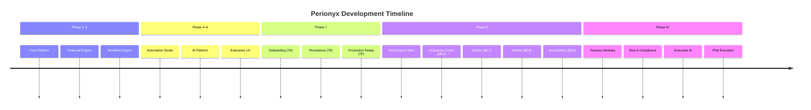

# Roadmaps

This MOC tracks all phase plans, milestones, and timelines for Perionyx. The roadmap is a living document — phases are planned, executed, and retrospectively updated as we learn.

---

## Current Phase

- [[current-phase-overview]] — What we're building right now
- [[phase-8b-enterprise-ux]] — Enterprise UX polish, forms, tables, analytics, motion, mobile
- [[phase-9-treasury-modules]] — Treasury, payments, investments, risk, compliance
- [[phase-10-pilot-readiness]] — Production deployment, onboarding, pilot execution

## Past Phases (Completed)

- [[phase-20-workflow-validation]] — Product validation: 14 workflows, 10 personas, 291 principles, 3.34/5 readiness
- [[phase-1-core-platform]] — Foundation: Next.js, Prisma, auth, multi-tenancy
- [[phase-2-financial-engine]] — Cash positioning, forecasting, basic reporting
- [[phase-3-workflow-engine]] — Workflow engine, step executors, state machine
- [[phase-4-automation-studio]] — Business rules, approval matrix, scheduler
- [[phase-5-ai-platform]] — AI providers, proxy, intelligence service
- [[phase-6-enterprise-ux]] — Design system, component library, forms, tables
- [[phase-7d-onboarding]] — Onboarding wizard, enterprise readiness
- [[phase-7e-persistence]] — Repository layer, cache, locks, queues, observability
- [[phase-7f-production-readiness]] — Security, HA, Docker, K8s, CI/CD
- [[phase-8a-performance]] — Performance audit, DB optimization, API optimization
- [[phase-8b-6-enterprise-forms]] — EnterpriseForm, SmartSelect, WorkflowCanvas
- [[phase-8b-7-motion]] — Motion tokens, animated components, reduced-motion
- [[phase-8b-8-mobile]] — Executive mobile experience, responsive design
- [[phase-8b-9-accessibility]] — WCAG 2.1 AA, skip nav, aria labels, keyboard nav
- [[phase-13-agent-framework]] — 14 models, 11 services, 8 API groups, 9 pages
- [[phase-16-security-audit]] — 23 specialists, 295 findings, OWASP assessment

## Future Phases

- [[phase-9c-investments]] — Investment tracking, portfolio management
- [[phase-9d-risk]] — Risk scoring, exposure analysis, hedging
- [[phase-9e-compliance]] — Automated compliance, regulatory reporting
- [[phase-9f-executive-ai]] — AI-powered executive insights and automation
- [[phase-10-pilot]] — First customer pilot execution
- [[phase-11-enterprise-installation]] — Installation wizard, deployment dashboard
- [[phase-11c-identity]] — IAM: SSO, SAML, OIDC, session management

## Milestones

- [[milestone-v1.0]] — Version 1.0: platform core complete
- [[milestone-v1.1]] — Version 1.1: enterprise UX polish
- [[milestone-v2.0]] — Version 2.0: pilot-ready
- [[milestone-first-customer]] — First paying customer
- [[milestone-ga]] — General availability launch

## Release Planning

- [[release-schedule]] — Planned release cadence and version numbering
- [[feature-gating]] — How features are gated by phase and customer tier
- [[breaking-changes]] — Policy for breaking changes and deprecation

---

---

## Cross-References

| MOC | Relationship |
|---|---|
| [[02-Product/index\|Product]] | Roadmap expresses product strategy |
| [[05-Engineering/index\|Engineering]] | Engineering executes roadmap phases |
| [[15-Pilot-Readiness/index\|Pilot Readiness]] | Pilot criteria and success metrics |
| [[01-Vision-Strategy/index\|Vision & Strategy]] | Roadmap serves the vision |
| [[11-ADR/index\|ADR]] | ADRs created during each phase |

## Roadmap Principles

1. **Phases are learning loops** — each phase ends with retrospective
2. **Ship frequently** — smaller phases > large monolithic releases
3. **Pilot-driven** — roadmap adjusts based on pilot feedback
4. **Technical debt tracked** — every phase creates and pays down debt
5. **Milestones are commitments** — public milestones don't slip without communication

---

*Last updated: 2026-07-20*
