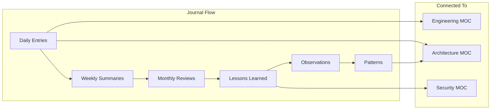

# Engineering Journal

This MOC captures daily engineering entries, lessons learned, weekly summaries, and monthly reviews. The journal is where raw observations become structured knowledge — connecting daily work to [[05-Engineering/index|Engineering practices]] and [[03-Architecture/index|Architecture decisions]].

---

## Recent Entries

- [[journal-2026-07-22]] — Phase 22.0A: Public Platform Architecture (25 documents, website design complete)
- [[journal-2026-07-22]] — Phase 21A.4: AP Workflow Execution (87 workflow + 52 API = 139 tests passing)
- [[journal-2026-07-21]] — Phase 20.0: Enterprise Workflow Validation
- [[journal-2026-07-21]] — Phase 19.0: Financial Core Consolidation inventory
- [[journal-2026-07-21]] — Phase 19.1: Financial Foundation Implementation
- [[journal-2026-07-21]] — Phase 18.1A+18.1B: Architecture consolidation, platform primitive consolidation
- [[journal-2026-07-20]] — MOC creation for Perionyx Brain vault
- [[journal-2026-07-19]] — Agent framework completion and security audit
- [[journal-2026-07-18]] — Security audit: 23 specialists, 295 findings
- [[journal-2026-07-17]] — Phase 13: Agent framework — 14 models, 11 services
- [[journal-2026-07-16]] — Phase 8B.9: Accessibility audit — 33 labels, 25 aria fixes

## Weekly Summaries

- [[week-2026-w29]] — Week 29: Security audit, agent framework, MOC brain
- [[week-2026-w28]] — Week 28: Mobile experience, accessibility, motion system
- [[week-2026-w27]] — Week 27: Enterprise forms, workflow canvas, documentation
- [[week-2026-w26]] — Week 26: Performance optimization, DB indexes, API cache

## Monthly Reviews

- [[month-2026-07]] — July 2026: Major milestones, key decisions, technical debt
- [[month-2026-06]] — June 2026: Platform maturity, enterprise features
- [[month-2026-05]] — May 2026: Foundation work, early architecture

## Lessons Learned

- [[lesson-in-memory-first]] — Prove logic in-memory before adding DB complexity
- [[lesson-custom-over-external]] — Custom SVG charts > Recharts for CFO pixel-perfection
- [[lesson-error-unification]] — Unified error format across 272 endpoints saves massive tech debt
- [[lesson-security-checklist]] — 10-question security checklist catches issues early
- [[lesson-parallelization]] — 9 parallel DB queries gave 3x speedup with zero risk
- [[lesson-motion-reduced]] — Always support prefers-reduced-motion from day one
- [[lesson-form-progressive]] — Progressive disclosure prevents form overwhelm
- [[lesson-agent-governance]] — AI agents need governance before autonomy
- [[lesson-evidence-over-assumptions]] — Implementation evidence always overrides architectural assumptions
- [[lesson-one-implementation-per-primitive]] — Platform primitives must have one authoritative implementation

## Observations

- [[observation-typescript-strict]] — Strict TypeScript catches bugs at compile time
- [[observation-prisma-migrations]] — Schema-first with Prisma migrations is reliable
- [[observation-pgboss-reliability]] — PgBoss is rock-solid for Postgres-native queuing
- [[observation-nextjs-app-router]] — App Router Server Components reduce client JS dramatically
- [[observation-framer-motion]] — Framer Motion is worth the bundle size for UX quality

## Patterns & Anti-Patterns

- [[pattern-ship-iterate]] — Ship the 80%, refactor to 100% later
- [[pattern-pragmatic-pure]] — Pragmatic solutions over architectural purity
- [[anti-pattern-gold-plating]] — Don't over-engineer before validating with users
- [[anti-pattern-everything-async]] — Not everything needs to be a background job
- [[anti-pattern-copy-paste-patterns]] — Extract shared logic early, not late

---

---

## Cross-References

| MOC | Relationship |
|---|---|
| [[05-Engineering/index\|Engineering]] | Journal feeds engineering practices |
| [[03-Architecture/index\|Architecture]] | Observations inform architecture decisions |
| [[04-Security/index\|Security]] | Security lessons and observations |
| [[11-ADR/index\|ADR]] | Journal entries may lead to new ADRs |
| [[12-Roadmaps/index\|Roadmaps]] | Journal tracks phase progress |

## Journal Principles

1. **Write daily** — even one sentence counts
2. **Be honest** — document failures, not just wins
3. **Connect the dots** — link entries to MOCs and ADRs
4. **Extract patterns** — recurring observations become patterns
5. **Review monthly** — monthly reviews surface insights

---

*Last updated: 2026-07-21*
