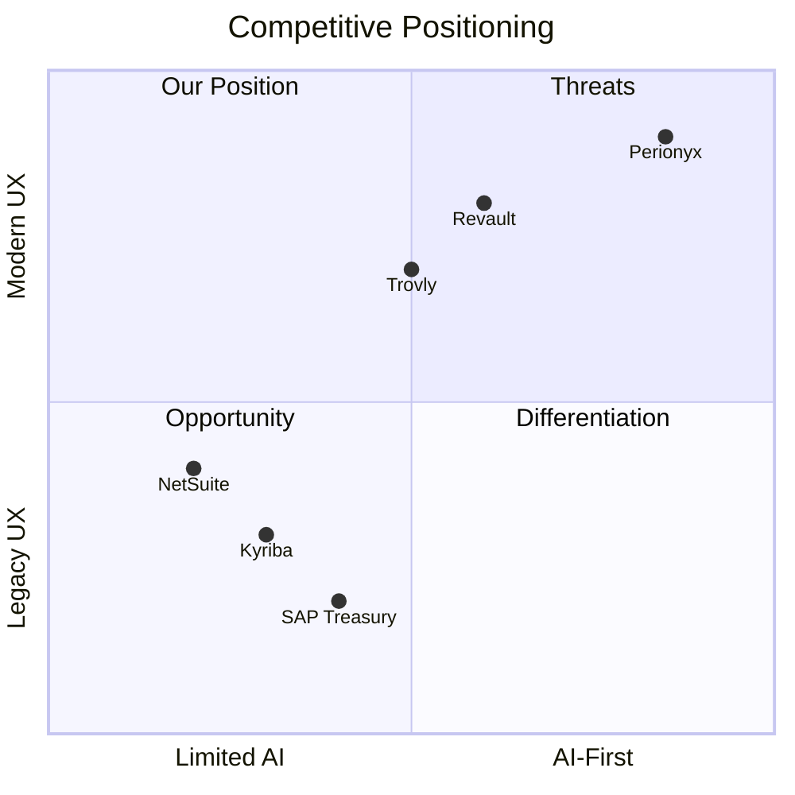

# Competitive Intelligence

This MOC tracks competitor analysis, market landscape mapping, and our positioning strategy. Competitive intelligence informs [[01-Vision-Strategy/index|Vision & Strategy]] and validates [[09-Customer-Discovery/index|Customer Discovery]] insights.

---

## Competitors

- [[competitor-treasury-direct]] — Direct treasury management competitors
- [[competitor-erp-finance]] — ERP-embedded finance modules (SAP, Oracle, NetSuite)
- [[competitor-neobank-corp]] — Corporate neobank and fintech competitors
- [[competitor-point-solutions]] — Point solutions for specific finance functions
- [[competitor-open-source]] — Open-source alternatives and DIY approaches

## Competitor Profiles

- [[competitor-profile-kyriba]] — Kyriba: market leader, enterprise focus, legacy UX
- [[competitor-profile-trovly]] — Trovly: mid-market, modern UX, limited AI
- [[competitor-profile-isoqualtrics]] — ISO Treasury: niche, compliance-heavy
- [[competitor-profile-sap-treasury]] — SAP Treasury: deep integration, complex deployment
- [[competitor-profile-revault]] — Revault: startup, modern, limited scale

## Market Landscape

- [[market-map]] — Visual map of competitors by segment and capability
- [[market-gaps]] — Underserved segments and capability gaps
- [[market-trends]] — Emerging trends: AI, real-time, embedded finance
- [[consolidation-landscape]] — M&A activity and market consolidation patterns

## Positioning

- [[positioning-statement]] — How we position against each competitor category
- [[differentiation-matrix]] — Feature-by-feature comparison with key competitors
- [[win-loss-analysis]] — Why we win, why we lose, patterns
- [[competitive-pricing]] — Pricing comparison and strategy

## SWOT Analysis

- [[swot-overview]] — Strengths, Weaknesses, Opportunities, Threats
- [[swot-strengths]] — AI-first, modern UX, enterprise security, multi-entity
- [[swot-weaknesses]] — New entrant, limited track record, smaller team
- [[swot-opportunities]] — Underserved mid-market, AI timing, compliance pressure
- [[swot-threats]] — ERP vendors adding AI, well-funded competitors, regulation

## Competitive Moats

- [[moat-analysis]] — What's defensible: data, network effects, switching costs
- [[moat-building]] — How we strengthen moats over time
- [[moat-threats]] — What could erode our advantages

---

---

## Cross-References

| MOC | Relationship |
|---|---|
| [[01-Vision-Strategy/index\|Vision & Strategy]] | Competitive intel validates positioning |
| [[02-Product/index\|Product]] | Competitor features inform product decisions |
| [[09-Customer-Discovery/index\|Customer Discovery]] | Win/loss analysis grounded in customer feedback |
| [[10-Research/index\|Research]] | Market research supports competitive analysis |
| [[15-Pilot-Readiness/index\|Pilot Readiness]] | Competitive positioning for pilot pitches |

## Intelligence Principles

1. **Gather continuously** — competitive landscape changes fast
2. **Source ethically** — public info, demos, customer conversations — no espionage
3. **Update regularly** — stale intel is worse than no intel
4. **Focus on customers** — competitor analysis serves customer understanding
5. **Act on insights** — intel that doesn't change decisions is trivia

---

*Last updated: 2026-07-20*
