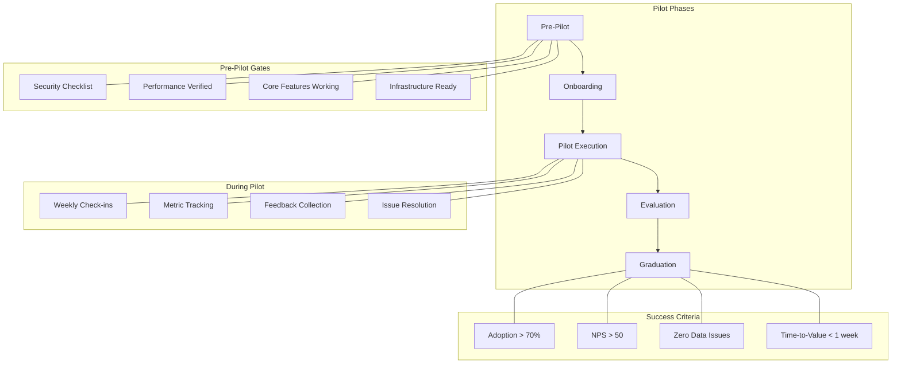

# Pilot Readiness

This MOC tracks everything needed to go from internal build to external pilot — deployment, onboarding, success criteria, risk mitigation, and the gates we must pass before a customer trusts us with their financial operations.

---

## Deployment

- [[deployment-checklist]] — Production deployment prerequisites
- [[infrastructure-readiness]] — Docker, K8s, monitoring, alerting verification
- [[environment-config]] — Production env vars, secrets, feature flags
- [[dns-ssl-setup]] — Domain, SSL certificates, CDN configuration
- [[backup-verification]] — Backup and restore tested and documented
- [[rollback-tested]] — Rollback procedure tested in staging

## Onboarding

- [[onboarding-flow]] — 10-step enterprise setup wizard
- [[company-setup]] — Company profile, entities, chart of accounts
- [[bank-connectivity]] — Bank connector setup and credential validation
- [[user-provisioning]] — Admin setup, role assignment, SSO configuration
- [[data-migration]] — Historical data import and validation
- [[training-materials]] — CFO/treasurer/controller training guides

## Pilot Criteria

- [[pilot-entry-criteria]] — Must-pass gates before pilot launch
- [[security-gates]] — Security checklist completion, penetration test
- [[performance-gates]] — Response times, uptime, load capacity verified
- [[feature-gates]] — Core features functional end-to-end
- [[compliance-gates]] — Audit logging, encryption, tenant isolation verified

## Success Metrics

- [[pilot-kpis]] — Key performance indicators for pilot success
- [[adoption-metrics]] — User engagement, session frequency, feature usage
- [[nps-tracking]] — Net Promoter Score collection and trending
- [[time-to-value]] — How quickly pilots reach first "aha moment"
- [[support-metrics]] — Ticket volume, resolution time, escalation rate

## Risks & Mitigation

- [[pilot-risks]] — Identified risks and mitigation strategies
- [[risk-data-loss]] — Financial data loss or corruption scenario
- [[risk-security-breach]] — Security incident during pilot
- [[risk-performance]] — Performance degradation under real load
- [[risk-adoption]] — Low user adoption or engagement
- [[risk-integration]] — Bank connector failures or data sync issues

## Pilot Management

- [[pilot-cohort-1]] — First pilot cohort: companies, timeline, outcomes
- [[pilot-feedback-loop]] — How pilot feedback enters product process
- [[pilot-reporting]] — Weekly pilot status reports and metrics
- [[pilot-exit-criteria]] — When a pilot graduates to paying customer

---

---

## Cross-References

| MOC | Relationship |
|---|---|
| [[02-Product/index\|Product]] | Product must be pilot-ready |
| [[05-Engineering/index\|Engineering]] | Engineering gates for production |
| [[04-Security/index\|Security]] | Security requirements for pilot |
| [[12-Roadmaps/index\|Roadmaps]] | Pilot timeline in roadmap |
| [[14-Competitive-Intelligence/index\|Competitive Intelligence]] | Pilot positioning vs. competitors |
| [[09-Customer-Discovery/index\|Customer Discovery]] | Pilot customer selection criteria |

## Pilot Principles

1. **Ship before you're ready** — perfect is the enemy of launched
2. **Measure everything** — you can't improve what you don't measure
3. **Over-communicate** — weekly updates to pilot customers, no surprises
4. **Fix fast** — critical issues get same-day patches
5. **Document failures** — every pilot issue becomes a product improvement

---

*Last updated: 2026-07-20*
