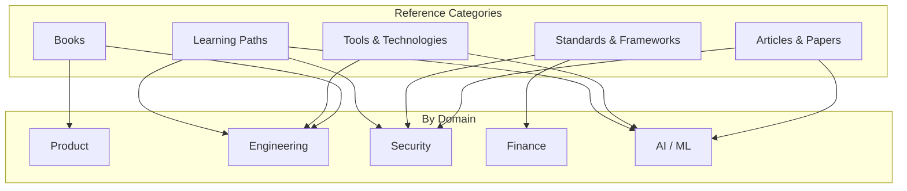

# References

This MOC is the learning library and external resource hub for Perionyx. It links to books, articles, tools, standards, and structured learning paths that inform [[10-Research/index|Research]] and [[05-Engineering/index|Engineering practices]].

---

## Books

- [[book-building-microservices]] — Sam Newman: microservice patterns and practices
- [[book-designing-data-intensive-applications]] — Martin Kleppmann: distributed systems bible
- [[book-the-lean-startup]] — Eric Ries: validated learning and build-measure-learn
- [[book-inspired]] — Marty Cagan: product management best practices
- [[book-clean-architecture]] — Robert Martin: architecture principles and boundaries
- [[book-domain-driven-design]] — Eric Evans: DDD patterns for complex domains
- [[book-fundamentals-of-software-architecture]] — Richards & Ford: architecture fundamentals
- [[book-the-pragmatic-programmer]] — Hunt & Thomas: timeless engineering practices
- [[book-thinking-in-systems]] — Donella Meadows: systems thinking for complex problems
- [[book-crossing-the-chasm]] — Geoffrey Moore: technology adoption lifecycle

## Articles & Papers

- [[article-owasp-top10]] — OWASP Top 10 (2021) web application security risks
- [[article-financial-data-encryption]] — Encryption best practices for financial data
- [[article-multi-tenancy-patterns]] — SaaS multi-tenancy architecture patterns
- [[article-ai-safety-alignment]] — AI safety and alignment considerations
- [[article-real-time-architecture]] — Real-time systems architecture patterns
- [[paper-vector-databases]] — Vector database evaluation for AI memory systems
- [[paper-event-sourcing]] — Event sourcing patterns for financial systems
- [[paper-cqrs-patterns]] — Command Query Responsibility Segregation in practice

## Tools & Technologies

- [[tool-nextjs]] — Next.js 16: App Router, Server Components, proxy
- [[tool-prisma]] — Prisma ORM: schema-first, migrations, type safety
- [[tool-pgboss]] — PgBoss: Postgres-native job queue
- [[tool-framer-motion]] — Framer Motion: React animation library
- [[tool-vitest]] — Vitest: fast unit testing with TypeScript
- [[tool-docker]] — Docker: multi-stage builds, compose
- [[tool-kubernetes]] — Kubernetes: deployment, scaling, networking
- [[tool-prometheus]] — Prometheus: metrics collection and alerting
- [[tool-opentelemetry]] — OpenTelemetry: distributed tracing

## Standards & Frameworks

- [[standard-owasp]] — OWASP Top 10 and ASVS
- [[standard-soc2]] — SOC 2 Type I/II compliance requirements
- [[standard-pci-dss]] — PCI DSS requirements for payment data
- [[standard-gdpr]] — GDPR data protection requirements
- [[standard-iso27001]] — ISO 27001 information security management
- [[standard-wcag]] — WCAG 2.1 AA accessibility guidelines
- [[standard-sox]] — Sarbanes-Oxley compliance for financial reporting

## Learning Paths

- [[learning-path-typescript]] — TypeScript mastery: strict mode, generics, utility types
- [[learning-path-react]] — React advanced: hooks, context, performance, Server Components
- [[learning-path-financial-systems]] — Financial systems: treasury, payments, reconciliation
- [[learning-path-ai-engineering]] — AI engineering: LLMs, agents, safety, evaluation
- [[learning-path-security]] — Security engineering: OWASP, encryption, auth, audit
- [[learning-path-distributed-systems]] — Distributed systems: consensus, replication, partitioning

---

---

## Cross-References

| MOC | Relationship |
|---|---|
| [[10-Research/index\|Research]] | References feed research efforts |
| [[05-Engineering/index\|Engineering]] | Tools and practices inform engineering |
| [[03-Architecture/index\|Architecture]] | Standards and patterns inform architecture |
| [[04-Security/index\|Security]] | Security standards guide compliance |
| [[08-AI-Workforce/index\|AI Workforce]] | AI papers inform agent framework design |

## Reference Principles

1. **Quality over quantity** — curated > comprehensive
2. **Annotate everything** — why is this reference worth reading?
3. **Link to insights** — connect references to decisions and observations
4. **Update regularly** — remove outdated, add new discoveries
5. **Share actively** — reference that sits unread helps no one

---

*Last updated: 2026-07-20*
