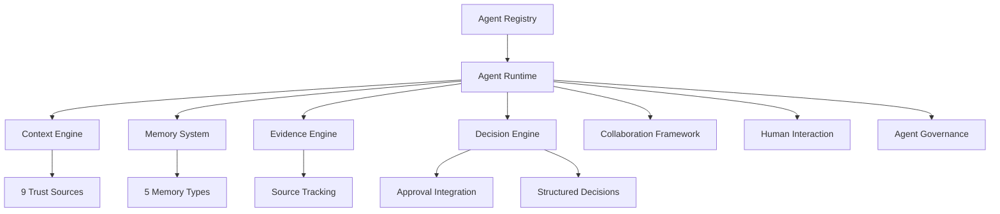

```mermaid
graph TB
    Registry["Agent Registry"] --> Runtime["Agent Runtime"]
    Runtime --> Context["Context Engine"]
    Runtime --> Memory["Memory System"]
    Runtime --> Evidence["Evidence Engine"]
    Runtime --> Decision["Decision Engine"]
    Decision --> Approval["Approval Integration"]
    Runtime --> Collaboration["Collaboration Framework"]
    Runtime --> Human["Human Interaction"]
    Runtime --> Governance["Agent Governance"]
    Context --> Sources["9 Trust Sources"]
    Memory --> Types["5 Memory Types"]
    Evidence --> Sources2["Source Tracking"]
    Decision --> Structured["Structured Decisions"]
```
