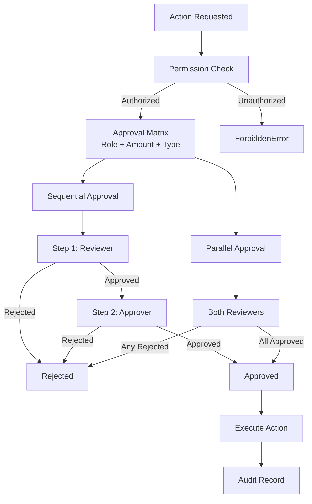

```mermaid
flowchart TB
    Start["Action Requested"] --> Check["Permission Check"]
    Check -->|"Authorized"| Matrix["Approval Matrix<br/>Role + Amount + Type"]
    Check -->|"Unauthorized"| Reject["ForbiddenError"]
    Matrix --> Sequential["Sequential Approval"]
    Matrix --> Parallel["Parallel Approval"]
    Sequential --> Step1["Step 1: Reviewer"]
    Step1 -->|"Approved"| Step2["Step 2: Approver"]
    Step1 -->|"Rejected"| Rejected["Rejected"]
    Step2 -->|"Approved"| Complete["Approved"]
    Step2 -->|"Rejected"| Rejected
    Parallel --> Both["Both Reviewers"]
    Both -->|"All Approved"| Complete
    Both -->|"Any Rejected"| Rejected
    Complete --> Execute["Execute Action"]
    Execute --> Audit["Audit Record"]
```
