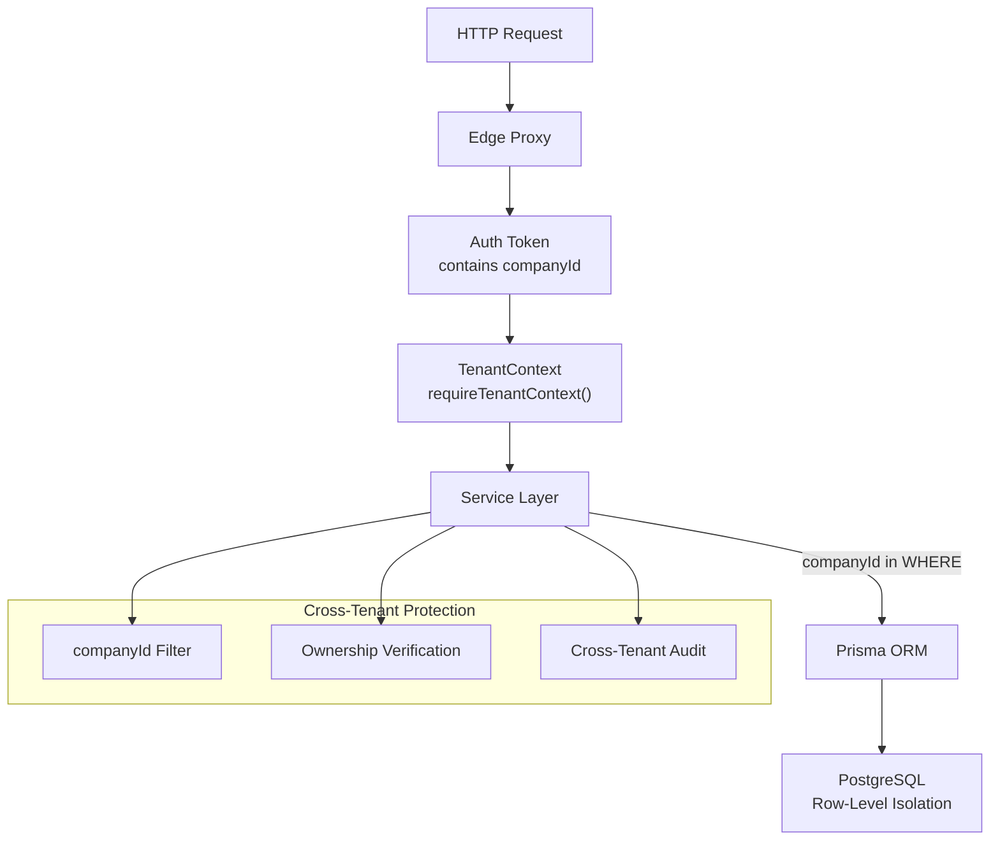

```mermaid
graph TB
    Request["HTTP Request"] --> Proxy["Edge Proxy"]
    Proxy --> Auth["Auth Token<br/>contains companyId"]
    Auth --> Context["TenantContext<br/>requireTenantContext()"]
    Context --> Service["Service Layer"]
    Service -->|"companyId in WHERE"| Prisma["Prisma ORM"]
    Prisma --> DB["PostgreSQL<br/>Row-Level Isolation"]
    subgraph "Cross-Tenant Protection"
        Filter["companyId Filter"]
        Verify["Ownership Verification"]
        Audit["Cross-Tenant Audit"]
    end
    Service --> Filter
    Service --> Verify
    Service --> Audit
```
