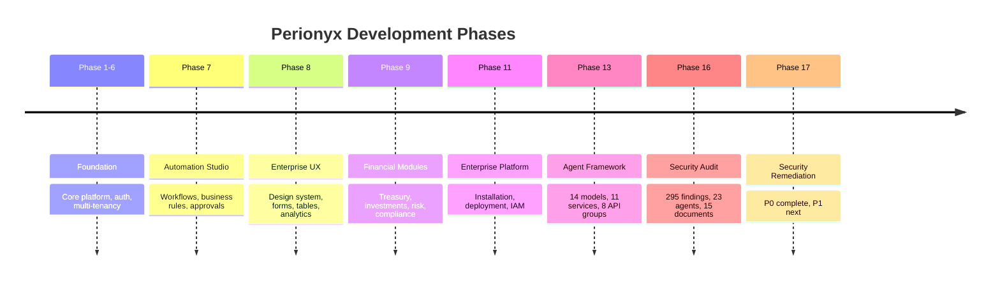

```mermaid
timeline
    title Perionyx Development Phases
    Phase 1-6 : Foundation : Core platform, auth, multi-tenancy
    Phase 7 : Automation Studio : Workflows, business rules, approvals
    Phase 8 : Enterprise UX : Design system, forms, tables, analytics
    Phase 9 : Financial Modules : Treasury, investments, risk, compliance
    Phase 11 : Enterprise Platform : Installation, deployment, IAM
    Phase 13 : Agent Framework : 14 models, 11 services, 8 API groups
    Phase 16 : Security Audit : 295 findings, 23 agents, 15 documents
    Phase 17 : Security Remediation : P0 complete, P1 next
```
