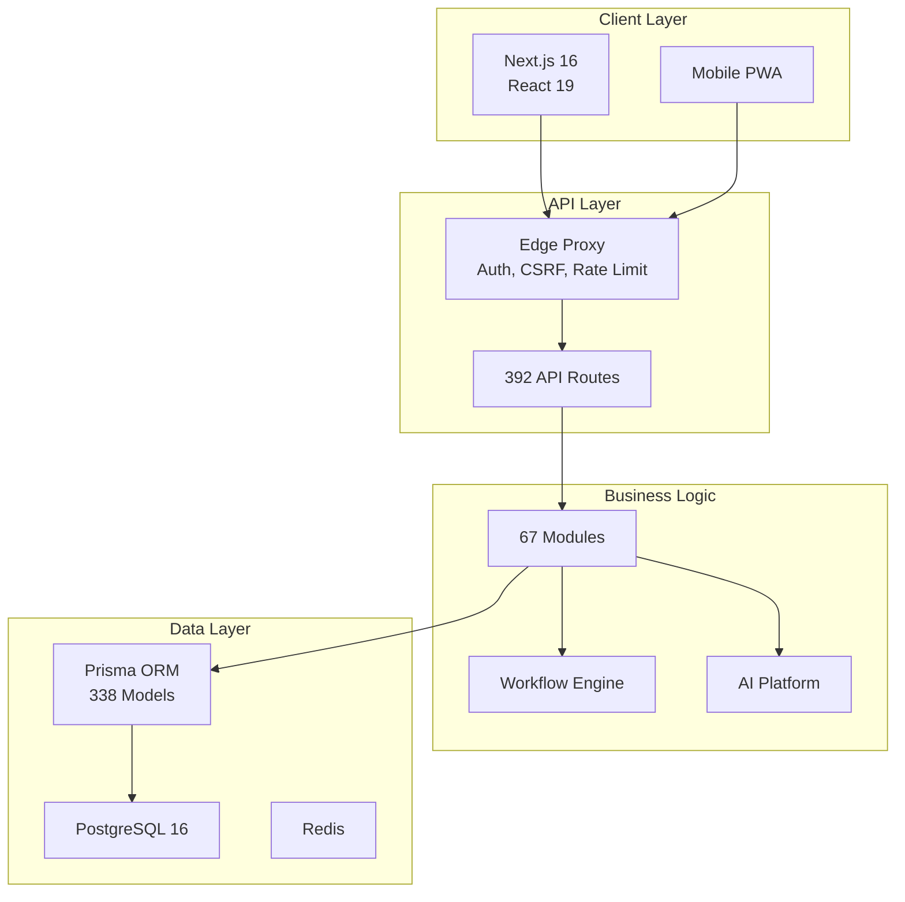

```mermaid
graph TB
    subgraph "Client Layer"
        Web["Next.js 16<br/>React 19"]
        Mobile["Mobile PWA"]
    end
    subgraph "API Layer"
        Proxy["Edge Proxy<br/>Auth, CSRF, Rate Limit"]
        Routes["392 API Routes"]
    end
    subgraph "Business Logic"
        Modules["67 Modules"]
        Workflow["Workflow Engine"]
        AI["AI Platform"]
    end
    subgraph "Data Layer"
        Prisma["Prisma ORM<br/>338 Models"]
        PG["PostgreSQL 16"]
        Redis["Redis"]
    end
    Web --> Proxy
    Mobile --> Proxy
    Proxy --> Routes
    Routes --> Modules
    Modules --> Workflow
    Modules --> AI
    Modules --> Prisma
    Prisma --> PG
```
