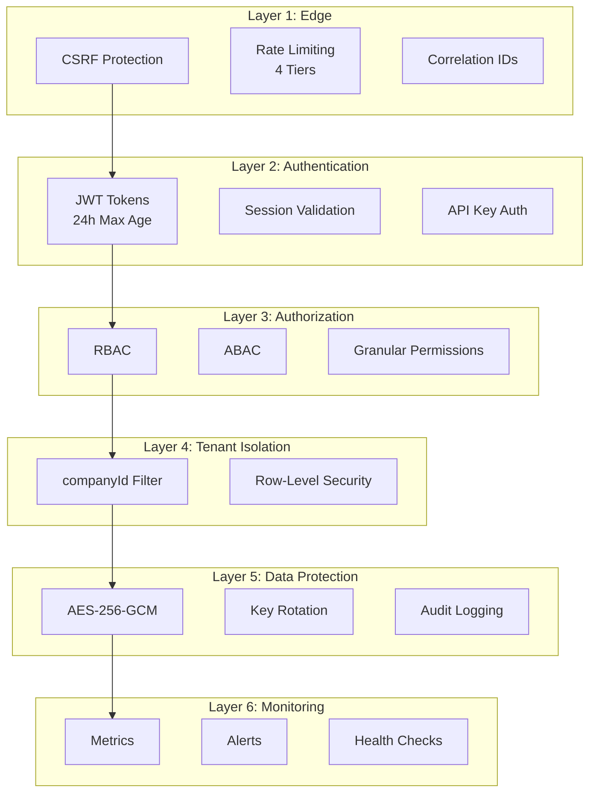

```mermaid
graph TB
    subgraph "Layer 1: Edge"
        CSRF["CSRF Protection"]
        RateLimit["Rate Limiting<br/>4 Tiers"]
        Correlation["Correlation IDs"]
    end
    subgraph "Layer 2: Authentication"
        JWT["JWT Tokens<br/>24h Max Age"]
        Session["Session Validation"]
        APIKey["API Key Auth"]
    end
    subgraph "Layer 3: Authorization"
        RBAC["RBAC"]
        ABAC["ABAC"]
        Permissions["Granular Permissions"]
    end
    subgraph "Layer 4: Tenant Isolation"
        CompanyID["companyId Filter"]
        RowLevel["Row-Level Security"]
    end
    subgraph "Layer 5: Data Protection"
        Encrypt["AES-256-GCM"]
        KeyRotation["Key Rotation"]
        Audit["Audit Logging"]
    end
    subgraph "Layer 6: Monitoring"
        Metrics["Metrics"]
        Alerts["Alerts"]
        Health["Health Checks"]
    end
    CSRF --> JWT
    JWT --> RBAC
    RBAC --> CompanyID
    CompanyID --> Encrypt
    Encrypt --> Metrics
```
