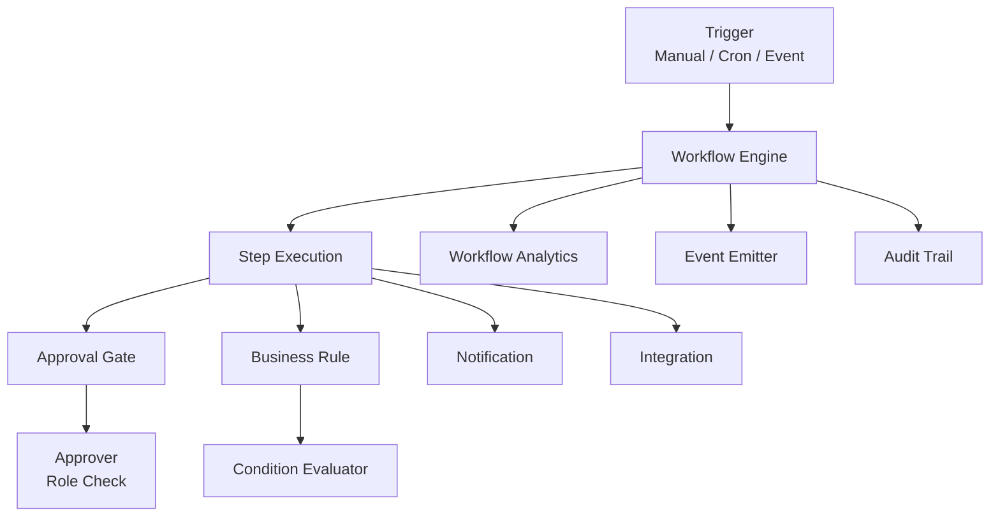

```mermaid
graph TB
    Trigger["Trigger<br/>Manual / Cron / Event"] --> Engine["Workflow Engine"]
    Engine --> Steps["Step Execution"]
    Steps --> Approval["Approval Gate"]
    Steps --> BusinessRule["Business Rule"]
    Steps --> Notification["Notification"]
    Steps --> Integration["Integration"]
    Approval --> Approver["Approver<br/>Role Check"]
    BusinessRule --> Condition["Condition Evaluator"]
    Engine --> Analytics["Workflow Analytics"]
    Engine --> Events["Event Emitter"]
    Engine --> Audit["Audit Trail"]
```
