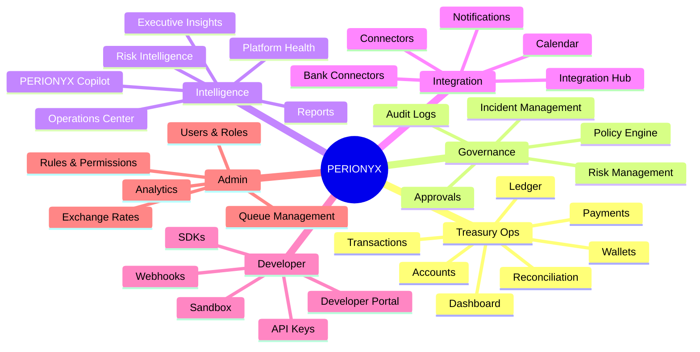
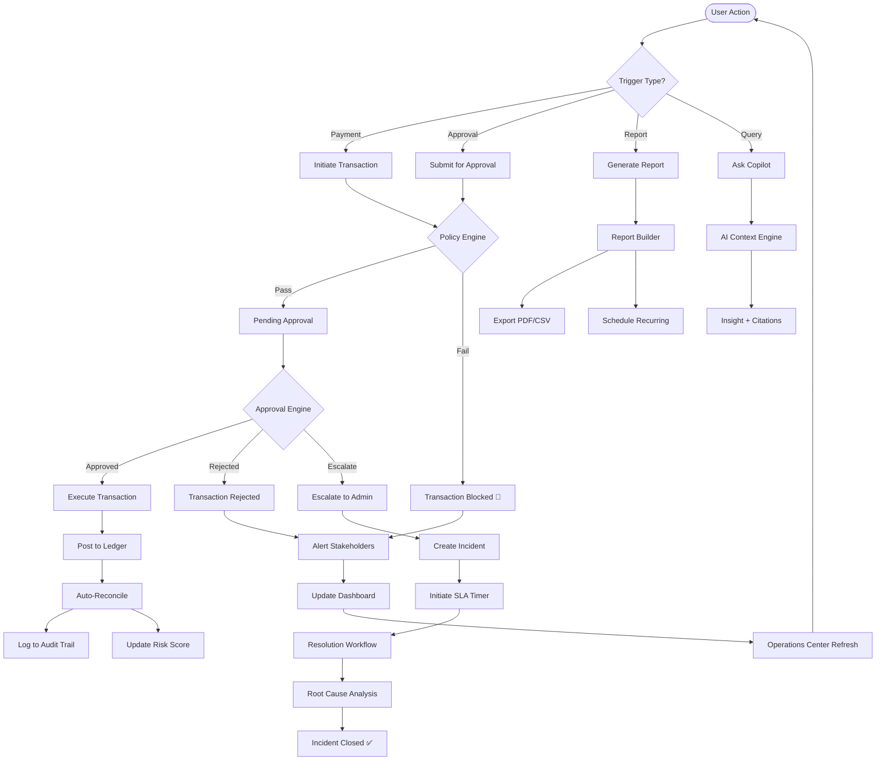

# PERIONYX — Architecture Flow

Paste this into https://mermaid.live or any Mermaid-compatible tool (Notion, GitHub, etc.)

---

## 1. Ecosystem Overview (Layered Architecture)

```mermaid
graph TB
    subgraph Access["🔐 ACCESS LAYER"]
        WEB["Web App<br/><i>Next.js Dashboard</i>"]
        API["REST API<br/><i>Programmatic</i>"]
        SDK["SDKs<br/><i>Python · TS · Go</i>"]
        WEBHOOK["Webhooks<br/><i>Event-Driven</i>"]
        SSO["SSO / SAML<br/><i>Auth & Identity</i>"]
    end

    subgraph Treasury["💰 TREASURY OPERATIONS"]
        WALLETS["Multi-Currency Wallets<br/><i>Fiat & Crypto</i>"]
        PAYMENTS["Payments & Transfers<br/><i>ACH · Wire · SEPA</i>"]
        RECON["Reconciliation<br/><i>Auto Bank-Cash Matching</i>"]
        APPROVALS["Approval Engine<br/><i>Multi-Step Workflows</i>"]
        LEDGER["Ledger<br/><i>Double-Entry Accounting</i>"]
    end

    subgraph Risk["🛡️ RISK & COMPLIANCE"]
        POLICY["Policy Engine<br/><i>Rules · Limits · Controls</i>"]
        RISK_INTEL["Risk Intelligence<br/><i>Heatmaps · Analytics</i>"]
        INCIDENTS["Incident Management<br/><i>SLA · Timeline · Resolution</i>"]
        AUDIT["Audit Logs<br/><i>Immutable · Cryptographic</i>"]
        COMPLIANCE["Compliance<br/><i>Regulatory Reporting</i>"]
    end

    subgraph Intel["🧠 INTELLIGENCE & AUTOMATION"]
        INSIGHTS["Executive Insights<br/><i>KPIs · Trends · Forecasting</i>"]
        REPORTS["Reports<br/><i>Builder · Scheduling · Export</i>"]
        OPS["Operations Center<br/><i>Real-Time Monitoring</i>"]
        HEALTH["Platform Health<br/><i>Service Status · Uptime</i>"]
        COPILOT["PERIONYX Copilot<br/><i>AI-Powered Assistant</i>"]
    end

    subgraph Infra["⚙️ INFRASTRUCTURE"]
        DB[("PostgreSQL<br/><i>Primary Database</i>")]
        ORM["Prisma ORM<br/><i>Type-Safe Data Layer</i>"]
        AUTH["NextAuth.js<br/><i>Auth & Authorization</i>"]
        CONNECTORS["Bank Connectors<br/><i>Plaid · Finicity · MX</i>"]
        JOBS["Background Jobs<br/><i>Queues · Scheduled Tasks</i>"]
    end

    Access --> Treasury
    Treasury --> Risk
    Risk --> Intel
    Intel --> Infra
```

---

## 2. Money Movement Pipeline (Horizontal Flow)

```mermaid
graph LR
    subgraph Connect["🔗 CONNECT"]
        BANK["🏦 Bank Accounts"]
        RAILS["💳 Payment Rails"]
        ERP["🔄 ERP Systems"]
        IDP["🔗 Identity Providers"]
    end

    subgraph Process["📋 PROCESS"]
        APPR["Approvals"]
        POLICY_ENG["Policy Engine"]
        RECONC["Reconciliation"]
        LEDGER_BOOK["Ledger"]
    end

    subgraph Monitor["👁️ MONITOR"]
        RISK["Risk Intelligence"]
        INC["Incidents"]
        AUDIT_TRAIL["Audit Trail"]
        OPS_CTR["Operations Center"]
    end

    subgraph Optimize["📈 OPTIMIZE"]
        EXEC["Executive Insights"]
        RPT["Reports"]
        COPILOT_AI["PERIONYX Copilot"]
        DEV["Developer APIs"]
    end

    Connect --> Process --> Monitor --> Optimize
```

---

## 3. Full Module Map (25 Workspaces)

---

## 4. User Journey (Process Flow)

