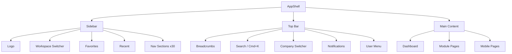
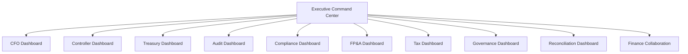
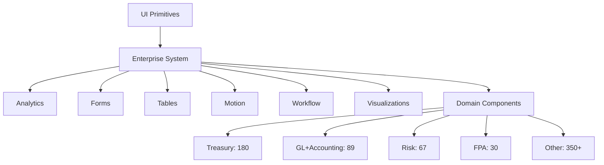

# Perionyx Enterprise UX & UI Architecture Audit

**Date**: July 2026
**Scope**: Complete UX/UI inventory of Perionyx Enterprise Financial Operating System
**Status**: Factual documentation — no redesign recommendations, no subjective assessment
**Auditor**: Independent UX Architecture Review

---

## Table of Contents

1. [Executive Summary](#1-executive-summary)
2. [Complete Route Inventory](#2-complete-route-inventory)
3. [Navigation Audit](#3-navigation-audit)
4. [Dashboard Audit](#4-dashboard-audit)
5. [Information Architecture](#5-information-architecture)
6. [Workflow Audit](#6-workflow-audit)
7. [Visual Design System](#7-visual-design-system)
8. [Component Inventory](#8-component-inventory)
9. [Table Audit](#9-table-audit)
10. [Form Audit](#10-form-audit)
11. [Chart Audit](#11-chart-audit)
12. [Accessibility Review](#12-accessibility-review)
13. [Responsive Layout Audit](#13-responsive-layout-audit)
14. [Performance UX](#14-performance-ux)
15. [Design Consistency](#15-design-consistency)
16. [Enterprise UX Scorecard](#16-enterprise-ux-scorecard)
17. [Screenshot Catalogue](#17-screenshot-catalogue)
18. [UI Architecture Diagrams](#18-ui-architecture-diagrams)
19. [Technical Inventory](#19-technical-inventory)
20. [Prioritized Improvement Backlog](#20-prioritized-improvement-backlog)

---

## 1. Executive Summary

### Platform Overview

Perionyx Enterprise Financial Operating System is a dark-theme enterprise SPA built on Next.js 16 App Router. The platform serves financial executives (CFOs, Controllers, Treasurers, Audit Managers, Compliance Officers, FP&A Managers, Tax Directors, Board Secretaries, and Risk Managers) through a sidebar-navigated single-page application with command palette, workspace switching, and mobile responsive layouts.

### Key Metrics

| Metric | Value |
|--------|-------|
| Total page.tsx files | 468 |
| Client Components | 102 |
| Server Components | 366 |
| Layout files | 7 |
| Total .tsx components | 1,129 |
| Total dashboards | 50+ |
| Navigation sections | 30 |
| Navigation entries | 224 |
| Modules | 30+ |
| Workspaces | 10+ |

### Design System State

The platform has **THREE competing design token systems**, **FOUR button systems**, **FOUR+ card systems**, **FIVE skeleton systems**, **TWO toast systems**, and **FOUR dialog systems**. There is no single source of truth for visual design. Each of the 14 development phases introduced components following the patterns of that phase, resulting in significant fragmentation.

### Application Structure

- **22+ navigation sections** with **30 section groups** and **224 nav entries**
- **8 major functional domains**: Operations, Treasury, Accounting, Planning, Governance, Risk, Administration, Executive
- **50+ dashboards** (one per specialist module, plus cross-cutting executive views)
- **30+ modules** (accounting, treasury, GL, FP&A, tax, audit, compliance, governance, risk, etc.)
- **10+ workspaces** (CFO, Controller, Treasury, Audit, Compliance, FP&A, Tax, Board, Executive, Finance Collaboration)

### Navigation Architecture

- **Sidebar**: Expandable/collapsible with favorites, recent items, and 30 section groups
- **Top bar**: Breadcrumbs (37 segment-to-label mappings, truncation at 4), Search (Cmd+K), Company Switcher, Notification Preview, User Menu
- **Command palette**: Cmd+K trigger, 31 hardcoded shortcuts, enterprise search via `/api/v1/enterprise/search`, keyboard navigation
- **Mobile**: Bottom navigation bar with 5 tabs, horizontal scroll pills for secondary navigation
- **Workspace switching**: TWO implementations exist — sidebar WorkspaceSwitcher and topbar Company Switcher, both calling `session.update()`

### Maturity Assessment

The platform has been built across 14 phases (13.0–14.0). Each phase added new specialists with their own component patterns. The enterprise component system (tables, forms, motion, analytics) was introduced in Phase 8B but adoption is incomplete — approximately **40% of pages use enterprise components**, **60% use raw/divergent patterns**.

---

## 2. Complete Route Inventory

### Root Routes (18 routes)

| Route | Purpose | Primary Users | Primary Actions | Main Components | Data Sources | Supporting Services |
|-------|---------|---------------|-----------------|-----------------|--------------|---------------------|
| `/` | Marketing landing page | Prospects | View features, sign up | LandingPage, Hero, Features | Static | — |
| `/about` | Company information | Prospects | Read about company | AboutPage | Static | — |
| `/pricing` | Pricing tiers | Prospects | Compare plans, purchase | PricingPage | Static | — |
| `/security` | Security documentation | Prospects, IT | Read security posture | SecurityPage | Static | — |
| `/privacy` | Privacy policy | Prospects, Legal | Read privacy terms | PrivacyPage | Static | — |
| `/solutions` | Use case solutions | Prospects | Explore solutions | SolutionsPage | Static | — |
| `/terms` | Terms of service | Prospects, Legal | Read terms | TermsPage | Static | — |
| `/product` | Product overview | Prospects | Explore product | ProductPage | Static | — |
| `/docs` | Documentation hub | Developers | Browse docs | DocsPage | Static | — |
| `/api` | API documentation | Developers | Browse API reference | ApiPage | Static | — |
| `/status` | System status page | Users, Ops | Check system health | StatusPage | Health endpoints | — |
| `/demo` | Product demo | Prospects | View demo | DemoPage | Static | — |
| `/enterprise-intelligence` | EI overview | Prospects, Executives | View capabilities | EIPage | Static | — |
| `/forgot-password` | Password reset | Users | Reset password | ForgotPasswordForm | Auth API | — |
| `/request-demo` | Demo request | Prospects | Submit demo request | RequestDemoForm | CRM API | — |
| `/unauthorized` | Access denied | Users | View error | UnauthorizedPage | None | — |
| `/onboarding` | New user onboarding | New users | Complete setup | OnboardingWizard | OnboardingService | SetupRegistry |
| `/sign-in` | Authentication | Users | Sign in | SignInForm | Auth API | SessionManager |
| `/sign-up` | Registration | New users | Create account | SignUpForm | Auth API | — |
| `/invite/[token]` | Invite acceptance | Invited users | Accept invite | InviteAcceptForm | Auth API | — |

### Dashboard & Overview (5 routes)

| Route | Purpose | Primary Users | Primary Actions | Main Components | Data Sources | Supporting Services |
|-------|---------|---------------|-----------------|-----------------|--------------|---------------------|
| `/dashboard` | Main executive dashboard | CEO, CFO | View KPIs, alerts, activity | DashboardPage, ExecutiveOverview, AlertFeed | DashboardService, AlertService | RecommendationEngine |
| `/mobile-dashboard` | Mobile executive view | Executives on mobile | View cash, approvals, alerts | MobileDashboard, MobileMetricCard, ApprovalQuickView | DashboardService | NotificationService |
| `/command-center` | Cross-specialist unified view | Executive | Monitor all domains | CommandCenter, DomainStatusGrid | All specialist services | — |
| `/platform` | Platform health overview | DevOps, Admin | Monitor services, queues | PlatformPage, ServiceStatusGrid | QueueService, HealthRegistry | — |
| `/setup` | Enterprise setup wizard | Admin, CFO | Complete 10-step setup | SetupWizard, SetupStepper | OnboardingService | EnterpriseReadinessService |

### Accounting & GL (26 routes)

| Route | Purpose | Primary Users | Primary Actions | Main Components | Data Sources | Supporting Services |
|-------|---------|---------------|-----------------|-----------------|--------------|---------------------|
| `/accounting` | Accounting overview | Controller, Accountant | View summary, navigate | AccountingPage, AccountingOverview | AccountingService | — |
| `/accounting/journal-entries` | Journal entry management | Accountant | Create, review, post JEs | JournalEntryList, JournalEntryForm | JournalService | ApprovalService |
| `/accounting/journal-entries/[id]` | JE detail | Accountant | View/edit JE | JournalEntryDetail | JournalService | — |
| `/accounting/chart-of-accounts` | COA management | Controller | Manage accounts | CoAList, CoAEditor | CoAService | — |
| `/accounting/periods` | Period management | Controller | Open/close periods | PeriodList, PeriodStatus | PeriodService | — |
| `/accounting/closing` | Period close tasks | Controller | Execute close checklist | ClosingChecklist, CloseProgress | CloseService | — |
| `/accounting/recurring` | Recurring entries | Accountant | Manage templates | RecurringList, RecurringForm | RecurringService | — |
| `/accounting/intercompany` | IC transactions | Controller | Manage IC entries | ICList, ICMatch | ICService | — |
| `/accounting/cost-centers` | Cost center mgmt | Controller | Assign, report | CCList, CCForm | CCService | — |
| `/accounting/profit-centers` | Profit center mgmt | Controller | Assign, report | PCList, PCForm | PCService | — |
| `/accounting/consolidation` | GL consolidation | Controller | Consolidate entities | ConsolidationView | ConsolidationService | — |
| `/accounting/tax` | Tax accounting | Tax Director | Manage tax entries | TaxAccountingView | TaxService | — |
| `/accounting/audit-trail` | Transaction audit trail | Auditor | Review changes | AuditTrailList | AuditTrailService | — |
| `/accounting/reports` | Accounting reports | Controller | Generate reports | ReportsList, ReportBuilder | ReportService | — |
| `/general-ledger` | GL overview | Accountant | View GL summary | GLOverview, GLDashboard | GLService | — |
| `/general-ledger/transactions` | GL transactions | Accountant | Search, filter, post | TransactionList, TransactionDetail | TransactionService | — |
| `/general-ledger/accounts` | GL accounts | Accountant | Manage account hierarchy | AccountTree, AccountForm | AccountService | — |
| `/general-ledger/balances` | GL balances | Accountant | View period balances | BalanceView, BalanceGrid | BalanceService | — |
| `/general-ledger/journal-batches` | Batch processing | Accountant | Create, post batches | BatchList, BatchForm | BatchService | ApprovalService |
| `/general-ledger/recurring` | Recurring GL entries | Accountant | Manage templates | GLRecurringList | GLRecurringService | — |
| `/general-ledger/intercompany` | IC GL entries | Controller | Match, reconcile | GLICList, GLICMatch | GLICService | — |
| `/general-ledger/currencies` | Multi-currency | Controller | Manage rates, translations | CurrencyList, FXRates | CurrencyService | — |
| `/general-ledger/allocations` | Cost allocations | Controller | Define allocation rules | AllocationList, AllocationForm | AllocationService | — |
| `/general-ledger/consolidation` | GL consolidation | Controller | Consolidate | GLConsolidationView | GLConsolidationService | — |
| `/general-ledger/adjustments` | GL adjustments | Controller | Post adjustments | AdjustmentList, AdjustmentForm | AdjustmentService | — |
| `/general-ledger/reports` | GL reports | Accountant, Controller | Generate reports | GLReportsList | GLReportService | — |
| `/general-ledger/close` | GL close process | Controller | Execute GL close | GLCloseChecklist | GLCloseService | — |

### Treasury (20 routes)

| Route | Purpose | Primary Users | Primary Actions | Main Components | Data Sources | Supporting Services |
|-------|---------|---------------|-----------------|-----------------|--------------|---------------------|
| `/treasury` | Treasury overview | Treasurer | View summary | TreasuryOverview, TreasuryDashboard | TreasuryService | — |
| `/treasury/cash` | Cash position | Treasurer | View balances, positions | CashPositionDashboard, GlobalCashDashboard | CashPositionService | BankConnectorService |
| `/treasury/cash/[account]` | Account detail | Treasurer | View account detail | CashAccountDetail | CashAccountService | — |
| `/treasury/liquidity` | Liquidity management | Treasurer | Monitor liquidity ratios | LiquidityDashboard, GlobalLiquidityDashboard | LiquidityService | — |
| `/treasury/fx` | FX management | Treasurer | View exposures, hedge | FXDashboard, FXExposureList | FXService | — |
| `/treasury/fx/[currency]` | Currency detail | Treasurer | View currency exposure | FXCurrencyDetail | FXService | — |
| `/treasury/debt` | Debt management | Treasurer | Track covenants, maturities | DebtDashboard, DebtList | DebtService | — |
| `/treasury/debt/[facility]` | Facility detail | Treasurer | View facility terms | DebtFacilityDetail | DebtService | — |
| `/treasury/investments` | Investment portfolio | Treasurer | View holdings, returns | InvestmentDashboard, PortfolioList | InvestmentService | — |
| `/treasury/investments/[id]` | Investment detail | Treasurer | View investment detail | InvestmentDetail | InvestmentService | — |
| `/treasury/forecasts` | Cash forecasting | Treasurer | View, build forecasts | ForecastDashboard, ForecastBuilder | ForecastService | — |
| `/treasury/payments` | Payment processing | Treasurer | Initiate, track payments | PaymentList, PaymentForm | PaymentService | ApprovalService |
| `/treasury/payments/[id]` | Payment detail | Treasurer | View payment status | PaymentDetail | PaymentService | — |
| `/treasury/banks` | Bank connections | Treasurer | Manage connections | BankList, BankConnectionForm | BankService | ConnectorService |
| `/treasury/policies` | Treasury policies | Treasurer | Set thresholds, rules | PolicyList, PolicyForm | PolicyService | — |
| `/treasury/risk` | Treasury risk | Treasurer | Monitor risk metrics | RiskDashboard | RiskService | — |
| `/treasury/reconciliation` | Bank reconciliation | Treasurer | Match transactions | ReconList, ReconMatch | ReconService | — |
| `/treasury/alerts` | Treasury alerts | Treasurer | View, act on alerts | AlertList, AlertDetail | AlertService | — |
| `/treasury/reports` | Treasury reports | Treasurer | Generate reports | ReportList, ReportBuilder | ReportService | — |
| `/treasury/briefings` | Treasury briefings | CFO, Treasurer | View AI briefings | BriefingView | BriefingService | — |

### Financial Close (16 routes)

| Route | Purpose | Primary Users | Primary Actions | Main Components | Data Sources | Supporting Services |
|-------|---------|---------------|-----------------|-----------------|--------------|---------------------|
| `/financial-close` | Close overview | Controller | View close status | CloseOverview, CloseDashboard | CloseService | — |
| `/financial-close/checklist` | Close checklist | Controller | Track tasks | CloseChecklist, TaskList | CloseService | — |
| `/financial-close/journals` | Close journals | Accountant | Post close entries | CloseJournalList | JournalService | CloseService |
| `/financial-close/reconciliation` | Close recon | Accountant | Reconcile accounts | CloseReconList | ReconService | CloseService |
| `/financial-close/adjustments` | Close adjustments | Controller | Post adjustments | CloseAdjustmentList | AdjustmentService | CloseService |
| `/financial-close/consolidation` | Close consolidation | Controller | Consolidate entities | CloseConsolidation | ConsolidationService | CloseService |
| `/financial-close/statements` | Financial statements | Controller | Generate statements | StatementList, StatementViewer | StatementService | CloseService |
| `/financial-close/disclosures` | Disclosures | Controller | Draft disclosures | DisclosureEditor | DisclosureService | CloseService |
| `/financial-close/review` | Close review | CFO | Review and approve | CloseReview, ApprovalPanel | CloseService | ApprovalService |
| `/financial-close/reports` | Close reports | Controller | Generate close reports | CloseReportList | ReportService | CloseService |
| `/financial-close/calendar` | Close calendar | Controller | View close schedule | CloseCalendar | CalendarService | — |
| `/financial-close/tasks` | Close task mgmt | Controller | Assign, track tasks | CloseTaskList, TaskBoard | TaskService | CloseService |
| `/financial-close/automations` | Close automations | Controller | Configure auto-tasks | AutomationList | AutomationService | CloseService |
| `/financial-close/audit-trail` | Close audit trail | Auditor | Review close changes | CloseAuditTrail | AuditTrailService | CloseService |
| `/financial-close/settings` | Close settings | Controller | Configure periods | CloseSettings | SettingsService | — |
| `/financial-close/briefings` | Close briefings | CFO | View AI briefings | CloseBriefingView | BriefingService | CloseService |

### FP&A & Planning (28 routes)

| Route | Purpose | Primary Users | Primary Actions | Main Components | Data Sources | Supporting Services |
|-------|---------|---------------|-----------------|-----------------|--------------|---------------------|
| `/fpa` | FP&A overview | FP&A Manager | View summary | FPAOverview, FPADashboard | FPAService | — |
| `/fpa/budgets` | Budget management | FP&A Manager | Create, track budgets | BudgetList, BudgetEditor | BudgetService | — |
| `/fpa/budgets/[id]` | Budget detail | FP&A Manager | Edit budget line items | BudgetDetail | BudgetService | — |
| `/fpa/forecasts` | Forecasting | FP&A Manager | Build forecasts | ForecastList, ForecastBuilder | ForecastService | — |
| `/fpa/scenarios` | Scenario planning | FP&A Manager | Create scenarios | ScenarioList, ScenarioBuilder | ScenarioService | — |
| `/fpa/variance` | Variance analysis | FP&A Manager, CFO | Analyze variances | VarianceDashboard, VarianceGrid | VarianceService | — |
| `/fpa/drivers` | Planning drivers | FP&A Manager | Manage assumptions | DriverList, DriverForm | DriverService | — |
| `/fpa/models` | Financial models | FP&A Manager | Build models | ModelList, ModelBuilder | ModelService | — |
| `/fpa/reporting` | FP&A reports | FP&A Manager | Generate reports | FPAReportList | ReportService | — |
| `/fpa/briefings` | FP&A briefings | CFO | View AI briefings | FPABriefingView | BriefingService | — |
| `/planning` | Planning overview | FP&A Manager | View plans | PlanningOverview | PlanningService | — |
| `/planning/strategic` | Strategic planning | CFO, FP&A | Define strategy | StrategicPlanView | StrategicService | — |
| `/planning/operational` | Operational plans | Finance Manager | Manage ops plans | OperationalPlanView | OperationalService | — |
| `/planning/capital` | Capital planning | CFO | Plan capex | CapitalPlanList, CapitalPlanForm | CapitalService | — |
| `/planning/workforce` | Workforce planning | HR, FP&A | Plan headcount | WorkforcePlanView | WorkforceService | — |
| `/planning/revenue` | Revenue planning | FP&A | Revenue forecasts | RevenuePlanView | RevenueService | — |
| `/planning/expenses` | Expense planning | Finance Manager | Expense budgets | ExpensePlanView | ExpenseService | — |
| `/planning/cash` | Cash planning | Treasurer, FP&A | Cash forecasts | CashPlanView | CashPlanService | — |
| `/planning/investments` | Investment planning | CFO | Plan investments | InvestmentPlanView | InvestmentPlanService | — |
| `/planning/debt` | Debt planning | Treasurer | Plan debt | DebtPlanView | DebtPlanService | — |
| `/planning/tax` | Tax planning | Tax Director | Plan tax | TaxPlanView | TaxPlanService | — |
| `/planning/compliance` | Compliance planning | Compliance Officer | Plan compliance | CompliancePlanView | CompliancePlanService | — |
| `/planning/risk` | Risk planning | Risk Manager | Plan risk | RiskPlanView | RiskPlanService | — |
| `/planning/governance` | Governance planning | Board Secretary | Plan governance | GovernancePlanView | GovernancePlanService | — |
| `/planning/scenarios` | Planning scenarios | FP&A | What-if planning | PlanningScenarioView | ScenarioService | — |
| `/planning/assumptions` | Planning assumptions | FP&A | Manage assumptions | AssumptionList, AssumptionForm | AssumptionService | — |
| `/planning/reports` | Planning reports | FP&A | Generate reports | PlanningReportList | ReportService | — |
| `/planning/briefings` | Planning briefings | CFO | View AI briefings | PlanningBriefingView | BriefingService | — |

### Tax (19 routes)

| Route | Purpose | Primary Users | Primary Actions | Main Components | Data Sources | Supporting Services |
|-------|---------|---------------|-----------------|-----------------|--------------|---------------------|
| `/tax` | Tax overview | Tax Director | View summary | TaxOverview, TaxDashboard | TaxService | — |
| `/tax/provisions` | Tax provisions | Tax Director | Calculate provisions | ProvisionList, ProvisionForm | ProvisionService | — |
| `/tax/provisions/[id]` | Provision detail | Tax Director | View provision | ProvisionDetail | ProvisionService | — |
| `/tax/returns` | Tax returns | Tax Director | Prepare returns | ReturnList, ReturnForm | ReturnService | — |
| `/tax/returns/[id]` | Return detail | Tax Director | View return | ReturnDetail | ReturnService | — |
| `/tax/transfer-pricing` | Transfer pricing | Tax Director | Manage TP | TPList, TPForm | TPService | — |
| `/tax/compliance` | Tax compliance | Tax Director | Track obligations | TaxComplianceView | TaxComplianceService | — |
| `/tax/planning` | Tax planning | Tax Director | Plan tax strategy | TaxPlanView | TaxPlanService | — |
| `/tax/risk` | Tax risk | Tax Director | Assess risk | TaxRiskView | TaxRiskService | — |
| `/tax/credits` | Tax credits | Tax Director | Track credits | CreditList, CreditForm | CreditService | — |
| `/tax/incentives` | Tax incentives | Tax Director | Manage incentives | IncentiveList | IncentiveService | — |
| `/tax/deadlines` | Tax deadlines | Tax Director | Track deadlines | DeadlineCalendar | DeadlineService | — |
| `/tax/international` | International tax | Tax Director | Manage cross-border | InternationalTaxView | InternationalTaxService | — |
| `/tax/reports` | Tax reports | Tax Director | Generate reports | TaxReportList | ReportService | — |
| `/tax/documents` | Tax documents | Tax Director | Manage documents | DocumentList | DocumentService | — |
| `/tax/audit-support` | Tax audit support | Tax Director | Prepare for audits | AuditSupportView | AuditSupportService | — |
| `/tax/settings` | Tax settings | Tax Director | Configure settings | TaxSettings | SettingsService | — |
| `/tax/briefings` | Tax briefings | CFO | View AI briefings | TaxBriefingView | BriefingService | — |

### Audit (11 routes)

| Route | Purpose | Primary Users | Primary Actions | Main Components | Data Sources | Supporting Services |
|-------|---------|---------------|-----------------|-----------------|--------------|---------------------|
| `/audit` | Audit overview | Audit Manager | View summary | AuditOverview, AuditDashboard | AuditService | — |
| `/audit/controls` | Control management | Audit Manager | Test controls | ControlList, ControlDetail | ControlService | — |
| `/audit/controls/[id]` | Control detail | Audit Manager | View control | ControlDetail | ControlService | — |
| `/audit/findings` | Audit findings | Audit Manager | Track findings | FindingList, FindingDetail | FindingService | — |
| `/audit/evidence` | Audit evidence | Auditor | Collect evidence | EvidenceList, EvidenceUpload | EvidenceService | — |
| `/audit/remediation` | Remediation tracking | Audit Manager | Track fixes | RemediationList, RemediationBoard | RemediationService | — |
| `/audit/plans` | Audit plans | Audit Manager | Plan audits | PlanList, PlanForm | PlanService | — |
| `/audit/reports` | Audit reports | Audit Manager | Generate reports | AuditReportList | ReportService | — |
| `/audit/readiness` | Readiness assessment | Audit Manager | Assess readiness | ReadinessView, ReadinessScore | ReadinessService | — |
| `/audit/continuous` | Continuous auditing | Audit Manager | Monitor | ContinuousView | ContinuousService | — |
| `/audit/briefings` | Audit briefings | CFO | View AI briefings | AuditBriefingView | BriefingService | — |

### Compliance (16 routes)

| Route | Purpose | Primary Users | Primary Actions | Main Components | Data Sources | Supporting Services |
|-------|---------|---------------|-----------------|-----------------|--------------|---------------------|
| `/compliance` | Compliance overview | Compliance Officer | View score, status | ComplianceOverview, ComplianceDashboard | ComplianceService | — |
| `/compliance/policies` | Policy management | Compliance Officer | Create, manage policies | PolicyList, PolicyEditor | PolicyService | — |
| `/compliance/policies/[id]` | Policy detail | Compliance Officer | View policy | PolicyDetail | PolicyService | — |
| `/compliance/obligations` | Regulatory obligations | Compliance Officer | Track obligations | ObligationList, ObligationDetail | ObligationService | — |
| `/compliance/violations` | Violation tracking | Compliance Officer | Track violations | ViolationList, ViolationDetail | ViolationService | — |
| `/compliance/filings` | Regulatory filings | Compliance Officer | Manage filings | FilingList, FilingForm | FilingService | — |
| `/compliance/frameworks` | Frameworks | Compliance Officer | Manage frameworks | FrameworkList | FrameworkService | — |
| `/compliance/risk-assessment` | Risk assessment | Compliance Officer | Assess compliance risk | RiskAssessmentView | RiskAssessmentService | — |
| `/compliance/training` | Compliance training | Compliance Officer | Track training | TrainingList | TrainingService | — |
| `/compliance/monitoring` | Compliance monitoring | Compliance Officer | Monitor compliance | MonitoringView | MonitoringService | — |
| `/compliance/regulatory-intelligence` | Regulatory intelligence | Compliance Officer | Track regulations | RIView | RIService | — |
| `/compliance/vendor` | Vendor compliance | Compliance Officer | Track vendor compliance | VendorComplianceList | VendorService | — |
| `/compliance/reports` | Compliance reports | Compliance Officer | Generate reports | ComplianceReportList | ReportService | — |
| `/compliance/audit-support` | Audit support | Compliance Officer | Support auditors | AuditSupportView | AuditSupportService | — |
| `/compliance/briefings` | Compliance briefings | CFO | View AI briefings | ComplianceBriefingView | BriefingService | — |

### Risk (24 routes)

| Route | Purpose | Primary Users | Primary Actions | Main Components | Data Sources | Supporting Services |
|-------|---------|---------------|-----------------|-----------------|--------------|---------------------|
| `/risk` | Risk overview | Risk Manager | View risk matrix | RiskOverview, RiskDashboard, RiskCenter | RiskService | — |
| `/risk/matrix` | Risk matrix | Risk Manager | Assess risks | RiskMatrix | RiskService | — |
| `/risk/register` | Risk register | Risk Manager | Maintain register | RiskRegister, RiskEntryForm | RiskRegisterService | — |
| `/risk/assessment` | Risk assessment | Risk Manager | Conduct assessments | AssessmentList, AssessmentForm | AssessmentService | — |
| `/risk/strategies` | Risk strategies | Risk Manager | Define strategies | StrategyList, StrategyForm | StrategyService | — |
| `/risk/monitoring` | Risk monitoring | Risk Manager | Monitor risks | MonitoringView | MonitoringService | — |
| `/risk/stress-testing` | Stress testing | Risk Manager | Run scenarios | StressTestView, StressTestBuilder | StressTestService | — |
| `/risk/scenarios` | Risk scenarios | Risk Manager | Build scenarios | ScenarioList, ScenarioBuilder | ScenarioService | — |
| `/risk/indicators` | Risk indicators | Risk Manager | Track KRIs | KRIList, KRIGrid | KRIService | — |
| `/risk/appetite` | Risk appetite | Risk Manager | Set appetite | AppetiteView, AppetiteForm | AppetiteService | — |
| `/risk/threat-intelligence` | Threat intel | Risk Manager | Monitor threats | ThreatIntelView | ThreatIntelService | — |
| `/risk/operational` | Operational risk | Risk Manager | Track ops risk | OperationalRiskView | OperationalRiskService | — |
| `/risk/financial` | Financial risk | Risk Manager | Track fin risk | FinancialRiskView | FinancialRiskService | — |
| `/risk/compliance-risk` | Compliance risk | Risk Manager | Track comp risk | ComplianceRiskView | ComplianceRiskService | — |
| `/risk/cyber` | Cyber risk | Risk Manager, CISO | Track cyber risk | CyberRiskView | CyberRiskService | — |
| `/risk/counterparty` | Counterparty risk | Risk Manager | Track counterparty | CounterpartyRiskView | CounterpartyRiskService | — |
| `/risk/reports` | Risk reports | Risk Manager | Generate reports | RiskReportList | ReportService | — |
| `/risk/heatmap` | Risk heatmap | Risk Manager | Visualize risks | RiskHeatmap | RiskService | — |
| `/risk/insights` | Risk insights | Risk Manager | View AI insights | RiskInsightsView | InsightService | — |
| `/risk/intelligence` | Risk intelligence | Risk Manager | View intel | RiskIntelligenceView | IntelligenceService | — |
| `/risk/briefings` | Risk briefings | CFO | View AI briefings | RiskBriefingView | BriefingService | — |
| `/risk/vendors` | Vendor risk | Risk Manager | Track vendor risk | VendorRiskList | VendorRiskService | — |
| `/risk/projects` | Project risk | Risk Manager | Track project risk | ProjectRiskList | ProjectRiskService | — |
| `/risk/settings` | Risk settings | Risk Manager | Configure | RiskSettings | SettingsService | — |

### Board Governance (11 routes)

| Route | Purpose | Primary Users | Primary Actions | Main Components | Data Sources | Supporting Services |
|-------|---------|---------------|-----------------|-----------------|--------------|---------------------|
| `/governance` | Governance overview | Board Secretary | View summary | GovernanceOverview, GovernanceDashboard | GovernanceService | — |
| `/governance/boards` | Board management | Board Secretary | Manage boards | BoardList, BoardDetail | BoardService | — |
| `/governance/meetings` | Meeting management | Board Secretary | Schedule, run meetings | MeetingList, MeetingDetail | MeetingService | — |
| `/governance/agendas` | Agenda management | Board Secretary | Build agendas | AgendaList, AgendaBuilder | AgendaService | — |
| `/governance/packs` | Board packs | Board Secretary | Build packs | PackList, PackBuilder | PackService | — |
| `/governance/resolutions` | Resolutions | Board Secretary | Track resolutions | ResolutionList, ResolutionForm | ResolutionService | — |
| `/governance/actions` | Action tracking | Board Secretary | Track action items | ActionList, ActionBoard | ActionService | — |
| `/governance/committees` | Committee mgmt | Board Secretary | Manage committees | CommitteeList | CommitteeService | — |
| `/governance/policies` | Governance policies | Board Secretary | Manage policies | GovernancePolicyList | GovernancePolicyService | — |
| `/governance/reports` | Governance reports | Board Secretary | Generate reports | GovernanceReportList | ReportService | — |

### Executive (6 routes)

| Route | Purpose | Primary Users | Primary Actions | Main Components | Data Sources | Supporting Services |
|-------|---------|---------------|-----------------|-----------------|--------------|---------------------|
| `/executive` | Executive overview | CEO, CFO | View executive summary | ExecutiveOverview | ExecutiveService | — |
| `/executive/dashboard` | Executive command center | CEO, CFO | Full executive view | ExecutiveDashboard, HealthScoreRing, DomainBars | All specialist services | — |
| `/executive/kpis` | KPI explorer | CEO, CFO | Drill into KPIs | KPIExplorer, KPIExplorerGrid | KPIService | — |
| `/executive/alerts` | Executive alerts | CEO, CFO | Manage alerts | AlertsFeed, AlertDetail | AlertService | — |
| `/executive/reports` | Executive reports | CEO, CFO | Generate reports | ExecutiveReportList | ReportService | — |

### Executive AI (7 routes)

| Route | Purpose | Primary Users | Primary Actions | Main Components | Data Sources | Supporting Services |
|-------|---------|---------------|-----------------|-----------------|--------------|---------------------|
| `/executive-ai` | AI overview | CFO, AI Teams | View AI status | ExecutiveAIOverview | AIService | — |
| `/executive-ai/anomalies` | Anomaly detection | CFO | Review anomalies | AnomalyList, AnomalyDetail | AnomalyService | — |
| `/executive-ai/forecasts` | AI forecasts | CFO | View AI forecasts | AIForecastView | AIForecastService | — |
| `/executive-ai/models` | Model management | AI Teams | Monitor models | ModelList, ModelHealth | ModelService | — |
| `/executive-ai/insights` | AI insights | CFO | View insights | AIInsightList | InsightService | — |
| `/executive-ai/settings` | AI settings | Admin | Configure AI | AISettings | SettingsService | — |

### Finance Collaboration (10 routes)

| Route | Purpose | Primary Users | Primary Actions | Main Components | Data Sources | Supporting Services |
|-------|---------|---------------|-----------------|-----------------|--------------|---------------------|
| `/finance` | Finance collaboration overview | Cross-functional | View summary | FinanceOverview, FinanceDashboard | FinanceService | — |
| `/finance/cases` | Case management | Finance Team | Create, manage cases | CaseList, CaseDetail, CaseBoard | CaseService | — |
| `/finance/tasks` | Task management | Finance Team | Assign, track tasks | TaskList, TaskBoard | TaskService | — |
| `/finance/evidence` | Evidence collection | Finance Team | Upload evidence | EvidenceList, EvidenceUpload | EvidenceService | — |
| `/finance/decisions` | Decision tracking | Finance Team | Track decisions | DecisionList, DecisionLog | DecisionService | — |
| `/finance/communications` | Communications | Finance Team | Communicate | MessageList, MessageThread | CommunicationService | — |
| `/finance/reports` | Collaboration reports | Finance Team | Generate reports | FinanceReportList | ReportService | — |
| `/finance/meetings` | Meeting management | Finance Team | Schedule meetings | MeetingList | MeetingService | — |
| `/finance/briefings` | AI briefings | CFO | View briefings | FinanceBriefingView | BriefingService | — |

### Investments (16 routes)

| Route | Purpose | Primary Users | Primary Actions | Main Components | Data Sources | Supporting Services |
|-------|---------|---------------|-----------------|-----------------|--------------|---------------------|
| `/investments` | Investment overview | Treasurer, CFO | View portfolio | InvestmentOverview, InvestmentDashboard | InvestmentService | — |
| `/investments/portfolio` | Portfolio view | Treasurer | View holdings | PortfolioGrid, PortfolioChart | PortfolioService | — |
| `/investments/holdings` | Individual holdings | Treasurer | Manage holdings | HoldingList, HoldingDetail | HoldingService | — |
| `/investments/performance` | Performance tracking | Treasurer | Analyze returns | PerformanceView, PerformanceChart | PerformanceService | — |
| `/investments/allocation` | Asset allocation | Treasurer | View allocation | AllocationView, AllocationChart | AllocationService | — |
| `/investments/risk` | Investment risk | Treasurer | Assess risk | InvestmentRiskView | InvestmentRiskService | — |
| `/investments/rebalancing` | Rebalancing | Treasurer | Rebalance portfolio | RebalanceView, RebalanceForm | RebalanceService | — |
| `/investments/transactions` | Investment transactions | Treasurer | Track transactions | InvestmentTransactionList | TransactionService | — |
| `/investments/benchmarks` | Benchmark tracking | Treasurer | Compare benchmarks | BenchmarkView | BenchmarkService | — |
| `/investments/compliance` | Investment compliance | Treasurer | Check compliance | InvestmentComplianceView | ComplianceService | — |
| `/investments/reports` | Investment reports | Treasurer | Generate reports | InvestmentReportList | ReportService | — |
| `/investments/strategies` | Investment strategies | CFO | Define strategies | StrategyList, StrategyForm | StrategyService | — |
| `/investments/managers` | Manager tracking | Treasurer | Track managers | ManagerList | ManagerService | — |
| `/investments/custodians` | Custodian mgmt | Treasurer | Manage custodians | CustodianList | CustodianService | — |
| `/investments/briefings` | AI briefings | CFO | View briefings | InvestmentBriefingView | BriefingService | — |

### Order-to-Cash & AR (27 routes)

| Route | Purpose | Primary Users | Primary Actions | Main Components | Data Sources | Supporting Services |
|-------|---------|---------------|-----------------|-----------------|--------------|---------------------|
| `/order-to-cash` | OTC overview | AR Manager | View summary | OTCOverview, OTCDashboard | OTCService | — |
| `/order-to-cash/orders` | Sales orders | AR Manager | Manage orders | OrderList, OrderDetail | OrderService | — |
| `/order-to-cash/orders/[id]` | Order detail | AR Manager | View order | OrderDetail | OrderService | — |
| `/order-to-cash/invoices` | Invoicing | AR Manager | Create, send invoices | InvoiceList, InvoiceForm | InvoiceService | — |
| `/order-to-cash/invoices/[id]` | Invoice detail | AR Manager | View invoice | InvoiceDetail | InvoiceService | — |
| `/order-to-cash/collections` | Collections | AR Collector | Track collections | CollectionList, CollectionBoard | CollectionService | — |
| `/order-to-cash/payments` | Payment matching | AR Specialist | Match payments | PaymentMatchList, PaymentMatch | PaymentService | — |
| `/order-to-cash/credit` | Credit management | Credit Analyst | Assess credit | CreditAssessmentList | CreditService | — |
| `/order-to-cash/disputes` | Dispute management | AR Specialist | Resolve disputes | DisputeList, DisputeDetail | DisputeService | — |
| `/order-to-cash/dunning` | Dunning process | AR Collector | Send dunning | DunningList, DunningConfig | DunningService | — |
| `/order-to-cash/reports` | OTC reports | AR Manager | Generate reports | OTCReportList | ReportService | — |
| `/accounts-receivable` | AR overview | AR Manager | View AR summary | AROverview, ARDashboard | ARService | — |
| `/accounts-receivable/aging` | Aging analysis | AR Manager | Analyze aging | AgingView, AgingGrid | AgingService | — |
| `/accounts-receivable/customers` | Customer accounts | AR Specialist | Manage customers | CustomerList, CustomerDetail | CustomerService | — |
| `/accounts-receivable/collections` | AR collections | AR Collector | Collect | ARCollectionList | CollectionService | — |
| `/accounts-receivable/payments` | AR payments | AR Specialist | Record payments | ARPaymentList | PaymentService | — |
| `/accounts-receivable/invoices` | AR invoices | AR Specialist | Manage invoices | ARInvoiceList | InvoiceService | — |
| `/accounts-receivable/credit-limits` | Credit limits | Credit Analyst | Set limits | CreditLimitList, CreditLimitForm | CreditLimitService | — |
| `/accounts-receivable/disputes` | AR disputes | AR Specialist | Resolve | ARDisputeList | DisputeService | — |
| `/accounts-receivable/write-offs` | Write-offs | Controller | Approve write-offs | WriteOffList, WriteOffForm | WriteOffService | ApprovalService |
| `/accounts-receivable/accruals` | AR accruals | Accountant | Post accruals | AccrualList | AccrualService | — |
| `/accounts-receivable/reports` | AR reports | AR Manager | Generate | ARReportList | ReportService | — |
| `/accounts-receivable/briefings` | AR briefings | CFO | View briefings | ARBriefingView | BriefingService | — |
| `/accounts-receivable/settings` | AR settings | AR Manager | Configure | ARSettings | SettingsService | — |
| `/accounts-receivable/automation` | AR automation | AR Manager | Configure automation | ARAutomationList | AutomationService | — |
| `/accounts-receivable/analytics` | AR analytics | AR Manager | Analyze | ARAnalyticsView | AnalyticsService | — |
| `/accounts-receivable/integrations` | AR integrations | Admin | Manage connections | ARIntegrationList | IntegrationService | — |

### Fixed Assets (17 routes)

| Route | Purpose | Primary Users | Primary Actions | Main Components | Data Sources | Supporting Services |
|-------|---------|---------------|-----------------|-----------------|--------------|---------------------|
| `/fixed-assets` | Fixed assets overview | Asset Manager | View summary | FAOverview, FADashboard | FAService | — |
| `/fixed-assets/register` | Asset register | Asset Manager | Manage assets | AssetRegister, AssetForm | RegisterService | — |
| `/fixed-assets/register/[id]` | Asset detail | Asset Manager | View asset | AssetDetail | RegisterService | — |
| `/fixed-assets/depreciation` | Depreciation | Accountant | Calculate depreciation | DepreciationList, DepreciationSchedule | DepreciationService | — |
| `/fixed-assets/acquisitions` | Acquisitions | Asset Manager | Record acquisitions | AcquisitionList, AcquisitionForm | AcquisitionService | — |
| `/fixed-assets/disposals` | Disposals | Asset Manager | Record disposals | DisposalList, DisposalForm | DisposalService | — |
| `/fixed-assets/transfers` | Transfers | Asset Manager | Transfer assets | TransferList, TransferForm | TransferService | — |
| `/fixed-assets/revaluations` | Revaluations | Controller | Revalue assets | RevaluationList, RevaluationForm | RevaluationService | — |
| `/fixed-assets/impairment` | Impairment testing | Controller | Test impairment | ImpairmentList, ImpairmentForm | ImpairmentService | — |
| `/fixed-assets/leases` | Lease accounting | Accountant | Manage leases | LeaseList, LeaseDetail | LeaseService | — |
| `/fixed-assets/construction` | CIP/construction | Asset Manager | Track CIP | CIPList, CIPDetail | CIPService | — |
| `/fixed-assets/insurance` | Asset insurance | Asset Manager | Track insurance | InsuranceList | InsuranceService | — |
| `/fixed-assets/tax` | Asset tax | Tax Director | Tax depreciation | FATaxView | FATaxService | — |
| `/fixed-assets/reports` | FA reports | Asset Manager | Generate reports | FAReportList | ReportService | — |
| `/fixed-assets/barcodes` | Barcode management | Asset Manager | Manage barcodes | BarcodeList | BarcodeService | — |
| `/fixed-assets/briefings` | AI briefings | CFO | View briefings | FABriefingView | BriefingService | — |

### Consolidation (18 routes)

| Route | Purpose | Primary Users | Primary Actions | Main Components | Data Sources | Supporting Services |
|-------|---------|---------------|-----------------|-----------------|--------------|---------------------|
| `/consolidation` | Consolidation overview | Controller | View status | ConsolidationOverview, ConsolidationDashboard | ConsolidationService | — |
| `/consolidation/entities` | Entity management | Controller | Manage entities | EntityList, EntityForm | EntityService | — |
| `/consolidation/mapping` | Account mapping | Controller | Map accounts | MappingList, MappingEditor | MappingService | — |
| `/consolidation/eliminations` | Elimination entries | Controller | Post eliminations | EliminationList, EliminationForm | EliminationService | — |
| `/consolidation/currency` | Currency translation | Controller | Translate currencies | CurrencyTranslationList | CurrencyService | — |
| `/consolidation/intercompany` | IC elimination | Controller | Eliminate IC | ICEliminationList | ICService | — |
| `/consolidation/adjustments` | Consolidation adj. | Controller | Post adjustments | ConsolidationAdjList | AdjustmentService | — |
| `/consolidation/reconciliation` | Recon | Controller | Reconcile entities | ConsolidationReconList | ReconService | — |
| `/consolidation/statements` | Consolidated stmts | Controller | Generate statements | ConsolidatedStatementView | StatementService | — |
| `/consolidation/reporting` | Consolidation reports | Controller | Generate reports | ConsolidationReportList | ReportService | — |
| `/consolidation/audit-trail` | Audit trail | Auditor | Review changes | ConsolidationAuditTrail | AuditTrailService | — |
| `/consolidation/quality` | Data quality | Controller | Check quality | QualityView, QualityGrid | QualityService | — |
| `/consolidation/schedule` | Close schedule | Controller | Manage schedule | ScheduleView, ScheduleCalendar | ScheduleService | — |
| `/consolidation/automations` | Automations | Controller | Configure auto-tasks | AutomationList | AutomationService | — |
| `/consolidation/settings` | Settings | Controller | Configure | ConsolidationSettings | SettingsService | — |
| `/consolidation/briefings` | Briefings | CFO | View AI briefings | ConsolidationBriefingView | BriefingService | — |
| `/consolidation/preview` | Preview before post | Controller | Preview | ConsolidationPreview | ConsolidationService | — |

### Procurement (12 routes)

| Route | Purpose | Primary Users | Primary Actions | Main Components | Data Sources | Supporting Services |
|-------|---------|---------------|-----------------|-----------------|--------------|---------------------|
| `/procurement` | Procurement overview | Procurement Manager | View summary | ProcurementOverview, ProcurementDashboard | ProcurementService | — |
| `/procurement/purchase-orders` | PO management | Buyer | Create, manage POs | POList, PODetail, POForm | POService | ApprovalService |
| `/procurement/purchase-orders/[id]` | PO detail | Buyer | View PO | PODetail | POService | — |
| `/procurement/vendors` | Vendor management | Procurement Manager | Manage vendors | VendorList, VendorDetail | VendorService | — |
| `/procurement/contracts` | Contract management | Procurement Manager | Manage contracts | ContractList, ContractDetail | ContractService | — |
| `/procurement/receiving` | Goods receiving | Warehouse | Record receipts | ReceivingList, ReceivingForm | ReceivingService | — |
| `/procurement/invoices` | Invoice processing | AP Specialist | Match invoices | ProcurementInvoiceList | InvoiceService | — |
| `/procurement/approvals` | PO approvals | Manager | Approve POs | ApprovalList, ApprovalBoard | ApprovalService | — |
| `/procurement/analytics` | Procurement analytics | Procurement Manager | Analyze | AnalyticsView | AnalyticsService | — |
| `/procurement/reports` | Procurement reports | Procurement Manager | Generate | ReportList | ReportService | — |
| `/procurement/briefings` | AI briefings | CFO | View briefings | ProcurementBriefingView | BriefingService | — |

### Agent Framework (10 routes)

| Route | Purpose | Primary Users | Primary Actions | Main Components | Data Sources | Supporting Services |
|-------|---------|---------------|-----------------|-----------------|--------------|---------------------|
| `/agents` | Agent overview | Admin | View agents | AgentOverview, AgentDashboard | AgentService | — |
| `/agents/registry` | Agent registry | Admin | Manage agents | AgentRegistry, AgentListTable | RegistryService | — |
| `/agents/sessions` | Active sessions | Admin | Monitor sessions | AgentSessionsList, AgentSessionsClient | RuntimeService | — |
| `/agents/tasks` | Task management | Admin | View tasks | AgentTasksList, AgentTasksClient | TaskService | — |
| `/agents/decisions` | Decision tracking | Admin | Review decisions | DecisionListClient | DecisionService | — |
| `/agents/memory` | Memory explorer | Admin | View memory | MemoryExplorer | MemoryService | — |
| `/agents/health` | Health monitoring | Admin | Monitor health | HealthPulseCard, AgentHealthView | HealthService | — |
| `/agents/governance` | Agent governance | Admin | Manage policies | AgentGovernanceClient | GovernanceService | — |
| `/agents/configuration` | Agent config | Admin | Configure agents | AgentConfigurationClient | ConfigService | — |

### Automation Studio (13 routes)

| Route | Purpose | Primary Users | Primary Actions | Main Components | Data Sources | Supporting Services |
|-------|---------|---------------|-----------------|-----------------|--------------|---------------------|
| `/automation-studio` | Automation overview | Finance Manager | View summary | AutomationDashboard, FeatureTiles | AutomationStudioService | — |
| `/automation-studio/business-rules` | Business rules | Finance Manager | Create rules | BusinessRulesClient, BusinessRulesForm | BusinessRulesBuilder | ConditionEvaluator |
| `/automation-studio/approval-matrix` | Approval matrix | Finance Manager | Configure approvals | ApprovalMatrixClient, ApprovalMatrixForm | ApprovalMatrixEvaluator | — |
| `/automation-studio/scheduler` | Scheduling | Finance Manager | Schedule automations | SchedulerClient, SchedulerForm | AutomationScheduler | QueueService |
| `/automation-studio/designer` | Workflow designer | Finance Manager | Design workflows | WorkflowDesigner, WorkflowCanvas, WorkflowToolbar | WorkflowEngine | — |
| `/automation-studio/templates` | Templates | Finance Manager | Use templates | TemplateList, TemplateDetail | TemplateLibrary | — |
| `/automation-studio/monitoring` | Monitoring | Finance Manager | Monitor workflows | MonitoringDashboard | WorkflowEngine | QueueService |
| `/automation-studio/analytics` | Analytics | Finance Manager | View analytics | AnalyticsDashboard | WorkflowAnalyticsService | — |
| `/automation-studio/setup` | Setup wizard | Finance Manager | Configure | SetupWizard | OnboardingService | — |
| `/automation-studio/logs` | Automation logs | Finance Manager | Review logs | LogList, LogDetail | LogService | — |
| `/automation-studio/ai` | AI assistant | Finance Manager | Use AI | AIAssistant | AIService | — |
| `/automation-studio/briefings` | Briefings | CFO | View briefings | AutomationBriefingView | BriefingService | — |

### Reconciliation (12 routes)

| Route | Purpose | Primary Users | Primary Actions | Main Components | Data Sources | Supporting Services |
|-------|---------|---------------|-----------------|-----------------|--------------|---------------------|
| `/reconciliation` | Recon overview | Recon Manager | View summary | ReconciliationOverview, ReconciliationDashboard | ReconService | — |
| `/reconciliation/matching` | Transaction matching | Recon Specialist | Match transactions | MatchingView, MatchBoard | MatchingService | — |
| `/reconciliation/exceptions` | Exception mgmt | Recon Manager | Resolve exceptions | ExceptionList, ExceptionDetail | ExceptionService | — |
| `/reconciliation/rules` | Recon rules | Recon Manager | Configure rules | RuleList, RuleForm | RuleService | — |
| `/reconciliation/balances` | Balance reconciliation | Recon Specialist | Reconcile balances | BalanceReconView | BalanceService | — |
| `/reconciliation/intercompany` | IC reconciliation | Recon Specialist | Match IC transactions | ICReconList, ICReconMatch | ICService | — |
| `/reconciliation/bank` | Bank reconciliation | Recon Specialist | Match bank stmts | BankReconView, BankReconMatch | BankReconService | — |
| `/reconciliation/schedules` | Recon schedules | Recon Manager | Schedule runs | ScheduleList, ScheduleForm | ScheduleService | — |
| `/reconciliation/reports` | Recon reports | Recon Manager | Generate reports | ReconReportList | ReportService | — |
| `/reconciliation/automations` | Recon automations | Recon Manager | Configure | AutomationList | AutomationService | — |
| `/reconciliation/briefings` | Briefings | CFO | View briefings | ReconBriefingView | BriefingService | — |
| `/reconciliation/settings` | Recon settings | Recon Manager | Configure | ReconSettings | SettingsService | — |

### Integration Platform (14 routes)

| Route | Purpose | Primary Users | Primary Actions | Main Components | Data Sources | Supporting Services |
|-------|---------|---------------|-----------------|-----------------|--------------|---------------------|
| `/integration-platform` | Integration overview | Admin, IT | View status | IntegrationOverview, IntegrationDashboard | IntegrationService | — |
| `/integration-platform/connectors` | Connector management | Admin | Manage connectors | ConnectorList, ConnectorDetail | ConnectorService | ConnectorPlatform |
| `/integration-platform/connectors/[id]` | Connector detail | Admin | Configure connector | ConnectorDetail, ConnectorConfig | ConnectorService | — |
| `/integration-platform/mappings` | Data mappings | Admin | Configure mappings | MappingList, MappingEditor | MappingService | — |
| `/integration-platform/sync` | Sync management | Admin | Monitor syncs | SyncDashboard, SyncHistory | SyncService | QueueService |
| `/integration-platform/webhooks` | Webhook management | Admin | Configure webhooks | WebhookList, WebhookForm | WebhookService | — |
| `/integration-platform/api-keys` | API key management | Admin | Manage keys | APIKeyList, APIKeyForm | APIKeyService | — |
| `/integration-platform/logs` | Integration logs | Admin | Review logs | LogList, LogDetail | LogService | — |
| `/integration-platform/errors` | Error management | Admin | Resolve errors | ErrorList, ErrorDetail | ErrorService | — |
| `/integration-platform/testing` | Integration testing | Developer | Test connections | TestConsole | TestService | — |
| `/integration-platform/monitoring` | Monitoring | Admin | Monitor health | MonitoringView | MonitoringService | — |
| `/integration-platform/reports` | Integration reports | Admin | Generate reports | ReportList | ReportService | — |
| `/integration-platform/briefings` | Briefings | CFO | View briefings | IntegrationBriefingView | BriefingService | — |

### Intelligence (14 routes)

| Route | Purpose | Primary Users | Primary Actions | Main Components | Data Sources | Supporting Services |
|-------|---------|---------------|-----------------|-----------------|--------------|---------------------|
| `/intelligence` | Intelligence overview | All roles | View intelligence | IntelligenceOverview, IntelligenceDashboard | IntelligenceService | — |
| `/intelligence/analytics` | Analytics | All roles | Analyze data | AnalyticsView, AnalyticsDashboard | AnalyticsService | — |
| `/intelligence/insights` | AI insights | All roles | View insights | InsightList, InsightDetail | InsightService | — |
| `/intelligence/recommendations` | Recommendations | All roles | View/act on recs | RecommendationList, RecommendationDetail | RecommendationService | — |
| `/intelligence/trends` | Trend analysis | All roles | View trends | TrendView, TrendChart | TrendService | — |
| `/intelligence/anomalies` | Anomaly detection | All roles | Review anomalies | AnomalyList, AnomalyDetail | AnomalyService | — |
| `/intelligence/forecasts` | AI forecasts | All roles | View forecasts | ForecastView | ForecastService | — |
| `/intelligence/benchmarks` | Benchmarking | All roles | Compare benchmarks | BenchmarkView, BenchmarkCompare | BenchmarkService | — |
| `/intelligence/sentiment` | Sentiment analysis | All roles | View sentiment | SentimentView | SentimentService | — |
| `/intelligence/patterns` | Pattern detection | All roles | View patterns | PatternView, PatternDetail | PatternService | — |
| `/intelligence/models` | Model management | AI Teams | Monitor models | ModelList, ModelHealth | ModelService | — |
| `/intelligence/settings` | Intelligence settings | Admin | Configure | IntelligenceSettings | SettingsService | — |
| `/intelligence/briefings` | Briefings | CFO | View briefings | IntelligenceBriefingView | BriefingService | — |

### Copilot (1 route)

| Route | Purpose | Primary Users | Primary Actions | Main Components | Data Sources | Supporting Services |
|-------|---------|---------------|-----------------|-----------------|--------------|---------------------|
| `/copilot` | AI copilot | All roles | Chat, ask questions | CopilotChat, CopilotPanel | AIService | ContextEngine |

### Mobile (8 routes)

| Route | Purpose | Primary Users | Primary Actions | Main Components | Data Sources | Supporting Services |
|-------|---------|---------------|-----------------|-----------------|--------------|---------------------|
| `/mobile` | Mobile home | Executives on mobile | Quick overview | MobileHome | DashboardService | — |
| `/mobile/treasury` | Mobile treasury | Treasurer on mobile | View balances | MobileTreasury, BalanceSummary | TreasuryService | — |
| `/mobile/approvals` | Mobile approvals | Executives on mobile | Approve/reject | MobileApprovals, ApprovalQuickView | ApprovalService | — |
| `/mobile/alerts` | Mobile alerts | Executives on mobile | View alerts | MobileAlerts, MobileNotificationCenter | AlertService | — |
| `/mobile/insights` | Mobile insights | Executives on mobile | View insights | MobileInsights | InsightService | — |
| `/mobile/reports` | Mobile reports | Executives on mobile | View reports | MobileReports | ReportService | — |
| `/mobile/settings` | Mobile settings | Executives on mobile | Configure | MobileSettings | SettingsService | — |
| `/mobile-dashboard` | Mobile dashboard | Executives on mobile | Executive overview | MobileDashboard, MobileMetricCard | DashboardService | — |

### System (14 routes)

| Route | Purpose | Primary Users | Primary Actions | Main Components | Data Sources | Supporting Services |
|-------|---------|---------------|-----------------|-----------------|--------------|---------------------|
| `/system` | System overview | Admin | View status | SystemOverview, SystemDashboard | SystemService | — |
| `/system/deployment` | Deployment status | DevOps | Monitor deployment | DeploymentDashboard | DeploymentService | — |
| `/system/health` | Health checks | DevOps | View health | HealthView, HealthGrid | HealthService | — |
| `/system/database` | Database mgmt | DBA | Manage DB | DatabaseView | DatabaseService | — |
| `/system/cache` | Cache management | DevOps | Manage cache | CacheView, CacheStats | CacheService | — |
| `/system/queues` | Queue management | DevOps | Monitor queues | QueueView, QueueStats | QueueService | — |
| `/system/logs` | System logs | DevOps | View logs | LogViewer, LogSearch | LogService | — |
| `/system/identity/` | IAM (9 sub-pages) | Admin | Manage identity | IdentityDashboard, UsersPage, GroupsPage, RolesPage, PermissionsPage, ProvidersPage, SessionsPage, AuditPage, PoliciesPage | IdentityService | — |
| `/system/monitoring` | Monitoring | DevOps | Monitor | MonitoringView | MonitoringService | — |
| `/system/backups` | Backup management | DBA | Manage backups | BackupList, BackupForm | BackupService | — |
| `/system/migrations` | DB migrations | DBA | Run migrations | MigrationList, MigrationRunner | MigrationService | — |
| `/system/security` | Security overview | Security Admin | View security | SecurityView | SecurityService | — |
| `/system/audit` | System audit | Admin | View audit logs | SystemAuditView | AuditService | — |

### Admin (15 routes)

| Route | Purpose | Primary Users | Primary Actions | Main Components | Data Sources | Supporting Services |
|-------|---------|---------------|-----------------|-----------------|--------------|---------------------|
| `/admin` | Admin overview | Admin | View summary | AdminOverview, AdminDashboard | AdminService | — |
| `/admin/users` | User management | Admin | Manage users | UserList, UserForm | UserService | IdentityService |
| `/admin/roles` | Role management | Admin | Manage roles | RoleList, RoleForm | RoleService | IdentityService |
| `/admin/permissions` | Permission mgmt | Admin | Manage permissions | PermissionList, PermissionForm | PermissionService | IdentityService |
| `/admin/groups` | Group management | Admin | Manage groups | GroupList, GroupForm | GroupService | IdentityService |
| `/admin/tenants` | Multi-tenant mgmt | Super Admin | Manage tenants | TenantList, TenantForm | TenantService | — |
| `/admin/billing` | Billing admin | Admin | Manage billing | BillingView | BillingService | — |
| `/admin/usage` | Usage tracking | Admin | View usage | UsageView, UsageChart | UsageService | — |
| `/admin/audit-logs` | Audit log viewer | Admin | View audit logs | AuditLogList | AuditLogService | — |
| `/admin/api-keys` | API key mgmt | Admin | Manage keys | APIKeyList, APIKeyForm | APIKeyService | — |
| `/admin/webhooks` | Webhook mgmt | Admin | Configure webhooks | WebhookList, WebhookForm | WebhookService | — |
| `/admin/feature-flags` | Feature flags | Admin | Manage flags | FeatureFlagList, FeatureFlagForm | FeatureFlagService | — |
| `/admin/announcements` | Announcements | Admin | Create announcements | AnnouncementList, AnnouncementForm | AnnouncementService | — |
| `/admin/support` | Support tickets | Admin | Manage tickets | TicketList, TicketDetail | TicketService | — |
| `/admin/briefings` | Admin briefings | Admin | View briefings | AdminBriefingView | BriefingService | — |

### Settings (5 routes)

| Route | Purpose | Primary Users | Primary Actions | Main Components | Data Sources | Supporting Services |
|-------|---------|---------------|-----------------|-----------------|--------------|---------------------|
| `/settings` | Settings overview | All users | View settings | SettingsOverview | SettingsService | — |
| `/settings/profile` | User profile | All users | Edit profile | ProfileForm | UserService | — |
| `/settings/notifications` | Notification prefs | All users | Set prefs | NotificationSettings | NotificationService | — |
| `/settings/appearance` | Appearance | All users | Set theme | AppearanceSettings | SettingsService | — |

### Other Routes (20+ routes)

| Route | Purpose | Primary Users | Primary Actions | Main Components | Data Sources | Supporting Services |
|-------|---------|---------------|-----------------|-----------------|--------------|---------------------|
| `/accounts` | Account listing | Accountant | View accounts | AccountList | AccountService | — |
| `/transactions` | Transaction listing | Accountant | View transactions | TransactionList | TransactionService | — |
| `/approvals` | Approval center | Manager | Approve/reject | ApprovalCenter, ApprovalBoard | ApprovalService | — |
| `/wallets` | Digital wallets | Treasurer | Manage wallets | WalletList | WalletService | — |
| `/ledger` | Ledger view | Accountant | View ledger | LedgerView | LedgerService | — |
| `/audit-logs` | Audit logs | Auditor | View logs | AuditLogList | AuditLogService | — |
| `/investigation` | Investigation | Compliance | Investigate | InvestigationView | InvestigationService | — |
| `/policies` | Policy management | Compliance | Manage policies | PolicyList | PolicyService | — |
| `/notifications` | Notification center | All users | View notifications | NotificationCenter | NotificationService | — |
| `/calendar` | Calendar view | All users | View events | CalendarView | CalendarService | — |
| `/reports` | Report center | All users | Generate reports | ReportCenter | ReportService | — |
| `/connectors` | Connector listing | Admin | Manage connectors | ConnectorList | ConnectorService | — |
| `/integrations` | Integration hub | Admin | Manage integrations | IntegrationHub | IntegrationService | — |
| `/developer` | Developer tools | Developer | Access tools | DeveloperView | DeveloperService | — |
| `/workspaces` | Workspace list | All users | Switch workspaces | WorkspaceList | WorkspaceService | — |
| `/workspaces/[id]` | Workspace detail | All users | View workspace | WorkspaceDetail | WorkspaceService | — |
| `/morning-briefing` | Morning briefing | CFO | View briefing | MorningBriefingView | BriefingService | — |
| `/offline` | Offline page | Users | View offline msg | OfflinePage | None | — |
| `/insights` | Insights hub | All users | View insights | InsightsView | InsightService | — |

---

## 3. Navigation Audit

### Sidebar Hierarchy

The sidebar contains **22+ sections**, each collapsible, with favorites and recent items pinned at the top. Below the workspace switcher, navigation is organized into 30 section groups containing 224 total entries.

### All 30 NAV_SECTIONS with Item Counts

| # | Section Group | Items | Sub-modules |
|---|---------------|-------|-------------|
| 1 | Dashboard | 3 | Dashboard, Command Center, Platform |
| 2 | Treasury | 20 | Cash, Liquidity, FX, Debt, Investments, Forecasts, Payments, Banks, Policies, Risk, Reconciliation, Alerts, Reports, Briefings + sub-items |
| 3 | Accounting | 14 | Journal Entries, Chart of Accounts, Periods, Closing, Recurring, Intercompany, Cost Centers, Profit Centers, Consolidation, Tax, Audit Trail, Reports + sub-items |
| 4 | General Ledger | 12 | Transactions, Accounts, Balances, Journal Batches, Recurring, Intercompany, Currencies, Allocations, Consolidation, Adjustments, Reports, Close |
| 5 | Financial Close | 15 | Checklist, Journals, Reconciliation, Adjustments, Consolidation, Statements, Disclosures, Review, Reports, Calendar, Tasks, Automations, Audit Trail, Settings, Briefings |
| 6 | FP&A | 10 | Budgets, Forecasts, Scenarios, Variance, Drivers, Models, Reporting, Briefings + sub-items |
| 7 | Planning | 17 | Strategic, Operational, Capital, Workforce, Revenue, Expenses, Cash, Investments, Debt, Tax, Compliance, Risk, Governance, Scenarios, Assumptions, Reports, Briefings |
| 8 | Tax | 18 | Provisions, Returns, Transfer Pricing, Compliance, Planning, Risk, Credits, Incentives, Deadlines, International, Reports, Documents, Audit Support, Settings, Briefings + sub-items |
| 9 | Audit | 10 | Controls, Findings, Evidence, Remediation, Plans, Reports, Readiness, Continuous, Briefings + sub-items |
| 10 | Compliance | 15 | Policies, Obligations, Violations, Filings, Frameworks, Risk Assessment, Training, Monitoring, Regulatory Intelligence, Vendor, Reports, Audit Support, Briefings + sub-items |
| 11 | Risk | 22 | Matrix, Register, Assessment, Strategies, Monitoring, Stress Testing, Scenarios, Indicators, Appetite, Threat Intelligence, Operational, Financial, Compliance Risk, Cyber, Counterparty, Reports, Heatmap, Insights, Intelligence, Briefings, Vendors, Projects, Settings |
| 12 | Governance | 10 | Boards, Meetings, Agendas, Packs, Resolutions, Actions, Committees, Policies, Reports + sub-items |
| 13 | Executive | 5 | Dashboard, KPIs, Alerts, Reports + sub-items |
| 14 | Executive AI | 6 | Anomalies, Forecasts, Models, Insights, Settings + sub-items |
| 15 | Finance Collaboration | 9 | Cases, Tasks, Evidence, Decisions, Communications, Reports, Meetings, Briefings + sub-items |
| 16 | Investments | 15 | Portfolio, Holdings, Performance, Allocation, Risk, Rebalancing, Transactions, Benchmarks, Compliance, Reports, Strategies, Managers, Custodians, Briefings + sub-items |
| 17 | Order-to-Cash | 12 | Orders, Invoices, Collections, Payments, Credit, Disputes, Dunning, Reports + sub-items |
| 18 | Accounts Receivable | 15 | Aging, Customers, Collections, Payments, Invoices, Credit Limits, Disputes, Write-offs, Accruals, Reports, Briefings, Settings, Automation, Analytics, Integrations |
| 19 | Fixed Assets | 16 | Register, Depreciation, Acquisitions, Disposals, Transfers, Revaluations, Impairment, Leases, Construction, Insurance, Tax, Reports, Barcodes, Briefings + sub-items |
| 20 | Consolidation | 17 | Entities, Mapping, Eliminations, Currency, Intercompany, Adjustments, Reconciliation, Statements, Reporting, Audit Trail, Quality, Schedule, Automations, Settings, Briefings, Preview + sub-items |
| 21 | Procurement | 11 | Purchase Orders, Vendors, Contracts, Receiving, Invoices, Approvals, Analytics, Reports, Briefings + sub-items |
| 22 | Agents | 9 | Registry, Sessions, Tasks, Decisions, Memory, Health, Governance, Configuration + sub-items |
| 23 | Automation Studio | 12 | Business Rules, Approval Matrix, Scheduler, Designer, Templates, Monitoring, Analytics, Setup, Logs, AI, Briefings + sub-items |
| 24 | Reconciliation | 11 | Matching, Exceptions, Rules, Balances, Intercompany, Bank, Schedules, Reports, Automations, Briefings, Settings |
| 25 | Integration Platform | 13 | Connectors, Mappings, Sync, Webhooks, API Keys, Logs, Errors, Testing, Monitoring, Reports, Briefings + sub-items |
| 26 | Intelligence | 13 | Analytics, Insights, Recommendations, Trends, Anomalies, Forecasts, Benchmarks, Sentiment, Patterns, Models, Settings, Briefings + sub-items |
| 27 | Mobile | 7 | Home, Treasury, Approvals, Alerts, Insights, Reports, Settings |
| 28 | System | 13 | Deployment, Health, Database, Cache, Queues, Logs, Identity (9 sub-pages), Monitoring, Backups, Migrations, Security, Audit |
| 29 | Admin | 14 | Users, Roles, Permissions, Groups, Tenants, Billing, Usage, Audit Logs, API Keys, Webhooks, Feature Flags, Announcements, Support, Briefings |
| 30 | Settings | 4 | Profile, Notifications, Appearance + sub-items |

### Navigation Duplications

| Section | Appears In | Evidence |
|---------|------------|----------|
| Tax | #8 (Tax) and also within Accounting (#3) | `/tax` and `/accounting/tax` both exist |
| Compliance | #10 (Compliance) and also within Risk (#11) | `/compliance` and `/risk/compliance-risk` both exist |
| Treasury | #2 (Treasury) and also within Planning (#7) | `/treasury` and `/planning/cash` overlap |
| Risk | #11 (Risk) and also within Compliance (#10) and Planning (#7) | `/risk`, `/compliance/risk-assessment`, `/planning/risk` |
| Reconciliation | #24 (Reconciliation) and also within Treasury (#2) and Financial Close (#5) | `/reconciliation`, `/treasury/reconciliation`, `/financial-close/reconciliation` |
| Reports | Appears in 20+ sections | Each module has its own `/module/reports` |
| Briefings | Appears in 15+ sections | Each module has its own `/module/briefings` |

### Top Navigation

**BreadcrumbBar** (`src/components/navigation/breadcrumb-bar.tsx`):
- Auto-generates breadcrumbs from URL path segments
- 37 segment-to-label mappings in LABEL_MAP
- Truncation at 4 segments (shows first + "... " + last 2)
- Uses `usePathname()` for current route
- Each segment is a clickable link

**Search** (`cmd+k`):
- Triggered by Cmd+K keyboard shortcut
- Enterprise search via `/api/v1/enterprise/search`
- 31 hardcoded keyboard shortcuts registered
- Keyboard navigation (arrow keys, Enter to select, Escape to close)
- Debounced search input (200ms)

**Company Switcher** (`src/components/navigation/company-switcher.tsx`):
- Located in top bar
- Shows current company/workspace
- Dropdown to switch between companies
- Calls `session.update()` on switch

**Notification Preview** (`src/components/navigation/notification-preview.tsx`):
- Bell icon with badge count
- Dropdown showing recent notifications
- Mark as read, dismiss actions

**User Menu** (`src/components/user-profile-menu.tsx`):
- Avatar + name
- Profile, Settings, Sign Out links

### Workspace Switching

Two separate implementations exist:
1. **Sidebar WorkspaceSwitcher** (`src/components/enterprise/workspace/workspace-switcher.tsx`) — Located in sidebar, shows workspace icon + name, dropdown with workspace list
2. **Topbar Company Switcher** (`src/components/navigation/company-switcher.tsx`) — Located in top bar, shows company name, dropdown with company list

Both call `session.update()` to switch context. They are not coordinated — switching in one does not reflect in the other until page refresh.

### Command Palette

- **Trigger**: Cmd+K (macOS) / Ctrl+K (other)
- **31 hardcoded shortcuts** for quick navigation
- **Enterprise search** endpoint: `/api/v1/enterprise/search`
- **Keyboard navigation**: Arrow keys to navigate results, Enter to select, Escape to close
- **Categories**: Navigation, Actions, Recent, Search Results
- **Debounced search**: 200ms delay before search fires

### Breadcrumbs

- Auto-generated from URL using `usePathname()`
- LABEL_MAP with 37 segment-to-label mappings (e.g., `treasury` -> "Treasury", `cash` -> "Cash Position")
- Truncation: Shows first segment + "... " + last 2 segments when path has 4+ segments
- Each segment renders as a clickable Link component

### Quick Actions

- QuickActionGroup component used in dashboard pages
- Renders a horizontal row of action buttons
- Each button links to a specific page
- Used in: Executive dashboard, Controller dashboard, Treasury dashboard, etc.

### Keyboard Shortcuts

- `useKeyboardShortcuts()` hook in `app-shell.tsx`
- Registered shortcuts:
  - Cmd+N -> New (context-dependent)
  - Cmd+F -> Focus search
  - Cmd+S -> Save (in forms)
  - ? -> Open keyboard shortcuts dialog
- `KeyboardShortcutsDialog` component lists all available shortcuts

### Navigation Depth

Maximum 3 levels deep:
1. Section (e.g., `/treasury`)
2. Module (e.g., `/treasury/cash`)
3. Detail (e.g., `/treasury/cash/[account]`)

### Navigation Consistency

**INCONSISTENT**: Some modules have their own sub-navigation patterns:
- Treasury has 19 sub-pages, all visible in sidebar
- Accounting has 14 sub-pages, all visible in sidebar
- But some modules use tab-based navigation within a page (e.g., Risk Center uses tabs for Matrix/Register/Assessment)
- Others use a separate page per sub-function

---

## 4. Dashboard Audit

### 1. Executive Overview (`/dashboard`)

- **Purpose**: High-level executive summary
- **Target persona**: CEO, CFO
- **Widgets**: 6 KPI cards, alert feed, activity timeline, recommendation panel
- **KPIs**: Revenue, EBITDA, Cash Position, DSO, Working Capital, Debt/Equity
- **Charts**: Trend sparklines on KPI cards
- **Tables**: Alert list table
- **Quick actions**: View reports, approvals, cash position
- **Recommendations**: AI-generated recommendations panel
- **Evidence panels**: Alert detail with evidence
- **Drill-down**: KPI cards link to detailed pages
- **Supporting services**: DashboardService, AlertService, RecommendationEngine

### 2. Command Center (`/command-center`)

- **Purpose**: Unified cross-specialist operational view
- **Target persona**: Executive
- **Widgets**: Domain status grid, health indicators, recent activity, alerts
- **KPIs**: Per-domain health scores
- **Charts**: Domain health bars
- **Tables**: Activity log
- **Quick actions**: Navigate to specialist dashboards
- **Recommendations**: Cross-domain recommendations
- **Evidence panels**: Domain health details
- **Drill-down**: Click domain to navigate
- **Supporting services**: All specialist services

### 3. Executive Command Center (`/executive/dashboard`)

- **Purpose**: Full executive command view with all specialist outputs
- **Target persona**: CEO, CFO
- **Widgets**: Health score ring, 8 domain health bars, 6 KPI cards, alerts feed, recommendations, board packs, calendar, briefing, risk summary
- **KPIs**: Cross-domain health, revenue, cash, risk score, compliance score, audit readiness
- **Charts**: Health score ring (SVG), domain health bars, trend sparklines
- **Tables**: Alert table, recommendation table
- **Quick actions**: Board pack, morning briefing, risk review
- **Recommendations**: AI cross-domain recommendations
- **Evidence panels**: Domain drill-down with evidence
- **Drill-down**: Every KPI and health bar links to specialist page
- **Supporting services**: All specialist services, BriefingService

### 4. CFO Dashboard (`/cfo/dashboard`)

- **Purpose**: CFO-specific operational view
- **Target persona**: CFO
- **Widgets**: Morning briefing, priorities, recommendations, insights, decisions, scenario summary
- **KPIs**: Cash, revenue, EBITDA, budget variance, risk score
- **Charts**: Trend charts, variance chart
- **Tables**: Priority list, decision log
- **Quick actions**: Briefing, approvals, treasury, FPA
- **Recommendations**: AI-generated CFO recommendations
- **Evidence panels**: Insight detail
- **Drill-down**: Links to specialist pages
- **Supporting services**: BriefingService, RecommendationService, InsightService

### 5. Controller Dashboard (`/controller/dashboard`)

- **Purpose**: Controller operational view
- **Target persona**: Controller
- **Widgets**: Close progress, health score, pending approvals, exceptions, late journals, statement readiness
- **KPIs**: Close %, days to close, open journals, exception count, statement readiness
- **Charts**: Close progress ring, trend lines
- **Tables**: Late journal list, exception list
- **Quick actions**: Close center, journals, reconciliation, statements
- **Recommendations**: Close-related recommendations
- **Evidence panels**: Journal detail, exception detail
- **Drill-down**: Links to close tasks, journal detail
- **Supporting services**: CloseService, JournalService, ApprovalService

### 6. Treasury Dashboard (`/treasury/dashboard`)

- **Purpose**: Treasury operational view
- **Target persona**: Treasurer
- **Widgets**: Cash position, liquidity metrics, FX exposure, debt maturity, investment portfolio, risk alerts
- **KPIs**: Total cash, liquidity ratio, FX exposure, debt covenants, investment return
- **Charts**: Cash position chart, liquidity trend, FX exposure bars, debt maturity timeline
- **Tables**: Bank account list, alert list
- **Quick actions**: Cash position, payments, forecasts
- **Recommendations**: Treasury recommendations
- **Evidence panels**: Cash detail, alert detail
- **Drill-down**: Click bank account, FX currency, debt facility
- **Supporting services**: CashPositionService, LiquidityService, FXService, DebtService

### 7. Audit Dashboard (`/audit/dashboard`)

- **Purpose**: Audit operational view
- **Target persona**: Audit Manager
- **Widgets**: Control effectiveness, findings summary, remediation status, audit readiness
- **KPIs**: Control pass rate, open findings, overdue remediation, readiness score
- **Charts**: Control effectiveness donut, finding trends
- **Tables**: Finding list, remediation board
- **Quick actions**: Controls, findings, evidence, readiness
- **Recommendations**: Audit recommendations
- **Evidence panels**: Finding detail, evidence viewer
- **Drill-down**: Click finding, control, remediation item
- **Supporting services**: ControlService, FindingService, RemediationService

### 8. Compliance Dashboard (`/compliance/dashboard`)

- **Purpose**: Compliance operational view
- **Target persona**: Compliance Officer
- **Widgets**: Compliance score, framework status, violation count, upcoming filings, obligation tracker
- **KPIs**: Compliance score, active violations, pending filings, obligation compliance %
- **Charts**: Compliance score ring, framework status bars, violation trend
- **Tables**: Violation list, filing calendar
- **Quick actions**: Policies, violations, filings
- **Recommendations**: Compliance recommendations
- **Evidence panels**: Violation detail, policy reference
- **Drill-down**: Click violation, filing, obligation
- **Supporting services**: ComplianceService, ViolationService, FilingService

### 9. FP&A Dashboard (`/fpa/dashboard`)

- **Purpose**: FP&A operational view
- **Target persona**: FP&A Manager
- **Widgets**: Budget summary, forecast status, scenario comparison, variance analysis
- **KPIs**: Budget vs actual, forecast accuracy, scenario count, material variances
- **Charts**: Variance chart, forecast vs actual, scenario comparison
- **Tables**: Material variance list
- **Quick actions**: Budgets, forecasts, scenarios, variance
- **Recommendations**: FPA recommendations
- **Evidence panels**: Variance detail
- **Drill-down**: Click budget line, variance item
- **Supporting services**: BudgetService, ForecastService, VarianceService

### 10. Tax Dashboard (`/tax/dashboard`)

- **Purpose**: Tax operational view
- **Target persona**: Tax Director
- **Widgets**: Tax health, return status, provision summary, upcoming deadlines
- **KPIs**: Effective tax rate, provision accuracy, deadline compliance, transfer pricing status
- **Charts**: Tax health ring, deadline timeline
- **Tables**: Return list, deadline calendar
- **Quick actions**: Provisions, returns, planning
- **Recommendations**: Tax recommendations
- **Evidence panels**: Provision detail
- **Drill-down**: Click return, provision, deadline
- **Supporting services**: TaxService, ProvisionService, ReturnService

### 11. Governance Dashboard (`/governance/dashboard`)

- **Purpose**: Board governance operational view
- **Target persona**: Board Secretary
- **Widgets**: Board summary, upcoming meetings, open resolutions, action items
- **KPIs**: Meeting frequency, resolution completion, action item overdue
- **Charts**: Meeting calendar, resolution status
- **Tables**: Resolution list, action item list
- **Quick actions**: Packs, agenda, meetings
- **Recommendations**: Governance recommendations
- **Evidence panels**: Resolution detail
- **Drill-down**: Click meeting, resolution, action
- **Supporting services**: BoardService, MeetingService, ResolutionService

### 12. Reconciliation Dashboard (`/reconciliation/dashboard`)

- **Purpose**: Reconciliation operational view
- **Target persona**: Reconciliation Manager
- **Widgets**: Matching rate, exception count, run status, aging
- **KPIs**: Auto-match rate, open exceptions, overdue reconciliations
- **Charts**: Matching rate trend, exception aging
- **Tables**: Exception list, run history
- **Quick actions**: Matching, exceptions, rules
- **Recommendations**: Recon recommendations
- **Evidence panels**: Exception detail, match detail
- **Drill-down**: Click exception, reconciliation run
- **Supporting services**: ReconService, MatchingService, ExceptionService

### 13. Risk Center (`/risk`)

- **Purpose**: Risk management overview
- **Target persona**: Risk Manager
- **Widgets**: Risk matrix, register summary, stress test results, KRI dashboard
- **KPIs**: Risk score, high-risk count, KRI breaches, stress test pass rate
- **Charts**: Risk matrix heatmap, KRI trend, stress test results
- **Tables**: Risk register, KRI list
- **Quick actions**: Matrix, register, assessment, stress test
- **Recommendations**: Risk recommendations
- **Evidence panels**: Risk entry detail
- **Drill-down**: Click risk entry, KRI
- **Supporting services**: RiskService, RiskRegisterService, KRIService

### 14. Finance Collaboration (`/finance/dashboard`)

- **Purpose**: Cross-functional finance collaboration
- **Target persona**: Finance Team
- **Widgets**: Open cases, pending tasks, evidence count, decisions pending
- **KPIs**: Case resolution time, task completion rate, evidence completeness
- **Charts**: Case trend, task status
- **Tables**: Case list, task board
- **Quick actions**: Cases, tasks, evidence, decisions
- **Recommendations**: Collaboration recommendations
- **Evidence panels**: Case detail, evidence viewer
- **Drill-down**: Click case, task
- **Supporting services**: CaseService, TaskService, EvidenceService

### 15. Intelligence Platform (`/intelligence`)

- **Purpose**: Enterprise intelligence overview
- **Target persona**: All roles
- **Widgets**: Health scores, recommendations, trends, anomaly count
- **KPIs**: Intelligence health, active recommendations, anomaly count
- **Charts**: Health trend, recommendation effectiveness
- **Tables**: Recommendation list, anomaly list
- **Quick actions**: Insights, recommendations, anomalies
- **Recommendations**: AI intelligence recommendations
- **Evidence panels**: Insight detail
- **Drill-down**: Click insight, recommendation
- **Supporting services**: IntelligenceService, InsightService, RecommendationService

### 16. Executive AI (`/executive-ai`)

- **Purpose**: AI operations overview
- **Target persona**: CFO, AI Teams
- **Widgets**: Anomaly detection, AI forecast accuracy, model health, insight count
- **KPIs**: Model accuracy, anomaly count, forecast deviation, insight relevance
- **Charts**: Model health grid, anomaly trend, forecast accuracy
- **Tables**: Anomaly list, model list
- **Quick actions**: Anomalies, forecasts, models
- **Recommendations**: AI self-recommendations
- **Evidence panels**: Anomaly detail, model detail
- **Drill-down**: Click anomaly, model
- **Supporting services**: AIService, AnomalyService, ModelService

### 17. Platform Health (`/platform`)

- **Purpose**: Platform infrastructure status
- **Target persona**: DevOps, Admin
- **Widgets**: Service status grid, queue metrics, webhook status, system health
- **KPIs**: Service uptime, queue depth, webhook success rate
- **Charts**: Service status bars, queue trend
- **Tables**: Service list, webhook list
- **Quick actions**: Logs, queues, health
- **Recommendations**: Infrastructure recommendations
- **Evidence panels**: Service detail
- **Drill-down**: Click service, queue
- **Supporting services**: HealthService, QueueService, WebhookService

### 18. Mobile Dashboard (`/mobile-dashboard`)

- **Purpose**: Mobile executive overview
- **Target persona**: Executives on mobile
- **Widgets**: Cash position, pending approvals, critical alerts, treasury snapshot, workflow health
- **KPIs**: Cash, pending approvals, alert count
- **Charts**: Cash trend sparkline
- **Tables**: Approval list
- **Quick actions**: Approve, review, search, create
- **Recommendations**: Mobile-optimized recommendations
- **Evidence panels**: Alert detail
- **Drill-down**: Tap to detail pages
- **Supporting services**: DashboardService, ApprovalService, AlertService

### 19-50+ Other Specialist Dashboards

Every module contains its own dashboard page with module-specific KPIs, charts, tables, and quick actions. These include (non-exhaustive):

| Module | Dashboard Route | Key Widgets |
|--------|----------------|-------------|
| Order-to-Cash | `/order-to-cash` | Pipeline, DSO, collections rate |
| Accounts Receivable | `/accounts-receivable` | Aging, collection rate, DSO |
| Fixed Assets | `/fixed-assets` | Asset count, depreciation schedule, utilization |
| Consolidation | `/consolidation` | Entity count, elimination status, reconciliation status |
| Procurement | `/procurement` | PO volume, approval queue, spend analysis |
| Agents | `/agents` | Agent count, session count, task completion |
| Automation Studio | `/automation-studio` | Rule count, schedule status, execution metrics |
| Integration Platform | `/integration-platform` | Connector health, sync status, error rate |
| Investments | `/investments` | Portfolio value, return, allocation |
| Mobile Treasury | `/mobile/treasury` | Cash balance, FX rates, pending payments |
| System | `/system` | Service status, deployment, health |
| Admin | `/admin` | User count, API usage, support tickets |
| Morning Briefing | `/morning-briefing` | AI-generated briefing with recommendations |
| Intelligence Analytics | `/intelligence/analytics` | Analytics overview |
| Intelligence Insights | `/intelligence/insights` | AI insights list |
| CFO Briefing | `/cfo/briefing` | AI briefing for CFO |
| Controller Briefing | `/controller/briefings` | AI briefing for Controller |
| Treasury Briefing | `/treasury/briefings` | AI briefing for Treasurer |
| Compliance Briefing | `/compliance/briefings` | AI briefing for Compliance Officer |
| Audit Briefing | `/audit/briefings` | AI briefing for Audit Manager |
| Tax Briefing | `/tax/briefings` | AI briefing for Tax Director |
| FP&A Briefing | `/fpa/briefings` | AI briefing for FP&A Manager |
| Governance Briefing | `/governance/briefings` | AI briefing for Board Secretary |
| Risk Briefing | `/risk/briefings` | AI briefing for Risk Manager |
| Reconciliation Briefing | `/reconciliation/briefings` | AI briefing for Recon Manager |
| Fixed Assets Briefing | `/fixed-assets/briefings` | AI briefing for Asset Manager |
| Consolidation Briefing | `/consolidation/briefings` | AI briefing for Controller |
| Investments Briefing | `/investments/briefings` | AI briefing for Treasurer |
| Procurement Briefing | `/procurement/briefings` | AI briefing for Procurement Manager |
| Integration Briefing | `/integration-platform/briefings` | AI briefing for Admin |

---

## 5. Information Architecture

### Layer Structure

```
+---------------------------------------------------------------------+
|                       EXECUTIVE LAYER                                |
|  /dashboard, /command-center, /executive/*, /cfo/*                   |
|  Cross-cutting executive views, KPIs, alerts, briefings              |
+---------------------------------------------------------------------+
|                      OPERATIONS LAYER                                |
|  /treasury, /accounting, /general-ledger,                            |
|  /financial-close, /reconciliation,                                   |
|  /order-to-cash, /accounts-receivable,                               |
|  /fixed-assets, /consolidation, /procurement                         |
|  Day-to-day financial operations                                     |
+---------------------------------------------------------------------+
|                       PLANNING LAYER                                 |
|  /fpa, /planning, /investments, /tax                                 |
|  Forward-looking analysis and planning                               |
+---------------------------------------------------------------------+
|                      GOVERNANCE LAYER                                |
|  /governance, /audit, /compliance, /risk                              |
|  Oversight, control, and risk management                             |
+---------------------------------------------------------------------+
|                     ADMINISTRATION LAYER                             |
|  /admin, /settings, /system, /agents                                  |
|  Platform administration and configuration                           |
+---------------------------------------------------------------------+
|                     COLLABORATION LAYER                              |
|  /finance, /copilot, /intelligence                                   |
|  Cross-functional collaboration and AI                               |
+---------------------------------------------------------------------+
```

### Navigation Follows Technical Modules, Not Business Workflows

The navigation is organized by **technical domain modules** (Treasury, Accounting, GL, FP&A, Tax, Audit, Compliance, Risk, Governance). There is no navigation structure that follows **business workflows**.

**Example: Month-End Close workflow** requires a CFO or Controller to visit:

1. `/controller/close` — Close checklist
2. `/controller/journals` — Review journals
3. `/reconciliation` — Reconcile accounts
4. `/controller/statements` — Generate statements
5. `/fpa/variance` — Analyze variances
6. `/audit` — Review audit findings
7. `/compliance` — Check compliance status
8. `/consolidation` — Consolidate entities

That is **8 different sections** with no unified navigation path. The user must know which sections to visit and in what order.

### ASCII Navigation Hierarchy

```
Perionyx Enterprise
+-- Executive
|   +-- Dashboard
|   +-- Command Center
|   +-- Executive (KPIs, Alerts, Reports)
|   +-- Executive AI (Anomalies, Forecasts, Models)
|   +-- CFO (Dashboard, Briefing, Chat)
|   +-- Morning Briefing
+-- Treasury
|   +-- Dashboard
|   +-- Cash Position
|   +-- Liquidity
|   +-- FX Management
|   +-- Debt Management
|   +-- Investments
|   +-- Forecasts
|   +-- Payments
|   +-- Banks
|   +-- Policies
|   +-- Risk
|   +-- Reconciliation
|   +-- Alerts, Reports, Briefings
+-- Accounting
|   +-- Dashboard
|   +-- Journal Entries
|   +-- Chart of Accounts
|   +-- Periods, Closing, Recurring
|   +-- Intercompany, Cost Centers, Profit Centers
|   +-- Consolidation, Tax, Audit Trail, Reports
+-- General Ledger
|   +-- Overview, Transactions, Accounts, Balances
|   +-- Journal Batches, Recurring, Intercompany
|   +-- Currencies, Allocations, Consolidation
|   +-- Adjustments, Reports, Close
+-- Financial Close
|   +-- Overview, Checklist, Journals
|   +-- Reconciliation, Adjustments, Consolidation
|   +-- Statements, Disclosures, Review
|   +-- Reports, Calendar, Tasks
|   +-- Automations, Audit Trail, Settings, Briefings
+-- FP&A
|   +-- Overview, Budgets, Forecasts
|   +-- Scenarios, Variance, Drivers
|   +-- Models, Reporting, Briefings
+-- Planning
|   +-- Overview, Strategic, Operational
|   +-- Capital, Workforce, Revenue, Expenses
|   +-- Cash, Investments, Debt, Tax
|   +-- Compliance, Risk, Governance
|   +-- Scenarios, Assumptions, Reports, Briefings
+-- Tax
|   +-- Overview, Provisions, Returns
|   +-- Transfer Pricing, Compliance, Planning
|   +-- Risk, Credits, Incentives, Deadlines
|   +-- International, Reports, Documents
|   +-- Audit Support, Settings, Briefings
+-- Audit
|   +-- Overview, Controls, Findings
|   +-- Evidence, Remediation, Plans
|   +-- Reports, Readiness, Continuous, Briefings
+-- Compliance
|   +-- Overview, Policies, Obligations
|   +-- Violations, Filings, Frameworks
|   +-- Risk Assessment, Training, Monitoring
|   +-- Regulatory Intelligence, Vendor
|   +-- Reports, Audit Support, Briefings
+-- Risk
|   +-- Overview, Matrix, Register
|   +-- Assessment, Strategies, Monitoring
|   +-- Stress Testing, Scenarios, Indicators
|   +-- Appetite, Threat Intelligence
|   +-- Operational, Financial, Compliance Risk
|   +-- Cyber, Counterparty, Reports
|   +-- Heatmap, Insights, Intelligence, Briefings
|   +-- Vendors, Projects, Settings
+-- Governance
|   +-- Overview, Boards, Meetings
|   +-- Agendas, Packs, Resolutions
|   +-- Actions, Committees, Policies, Reports
+-- Finance Collaboration
|   +-- Overview, Cases, Tasks
|   +-- Evidence, Decisions, Communications
|   +-- Reports, Meetings, Briefings
+-- Investments
|   +-- Overview, Portfolio, Holdings
|   +-- Performance, Allocation, Risk
|   +-- Rebalancing, Transactions, Benchmarks
|   +-- Compliance, Reports, Strategies
|   +-- Managers, Custodians, Briefings
+-- Order-to-Cash
|   +-- Overview, Orders, Invoices
|   +-- Collections, Payments, Credit
|   +-- Disputes, Dunning, Reports
+-- Accounts Receivable
|   +-- Overview, Aging, Customers
|   +-- Collections, Payments, Invoices
|   +-- Credit Limits, Disputes, Write-offs
|   +-- Accruals, Reports, Briefings
|   +-- Settings, Automation, Analytics, Integrations
+-- Fixed Assets
|   +-- Overview, Register, Depreciation
|   +-- Acquisitions, Disposals, Transfers
|   +-- Revaluations, Impairment, Leases
|   +-- Construction, Insurance, Tax
|   +-- Reports, Barcodes, Briefings
+-- Consolidation
|   +-- Overview, Entities, Mapping
|   +-- Eliminations, Currency, Intercompany
|   +-- Adjustments, Reconciliation, Statements
|   +-- Reporting, Audit Trail, Quality
|   +-- Schedule, Automations, Settings
|   +-- Briefings, Preview
+-- Procurement
|   +-- Overview, Purchase Orders
|   +-- Vendors, Contracts, Receiving
|   +-- Invoices, Approvals, Analytics
|   +-- Reports, Briefings
+-- Reconciliation
|   +-- Overview, Matching, Exceptions
|   +-- Rules, Balances, Intercompany
|   +-- Bank, Schedules, Reports
|   +-- Automations, Briefings, Settings
+-- Agents
|   +-- Overview, Registry, Sessions
|   +-- Tasks, Decisions, Memory
|   +-- Health, Governance, Configuration
+-- Automation Studio
|   +-- Overview, Business Rules
|   +-- Approval Matrix, Scheduler
|   +-- Designer, Templates, Monitoring
|   +-- Analytics, Setup, Logs, AI, Briefings
+-- Integration Platform
|   +-- Overview, Connectors, Mappings
|   +-- Sync, Webhooks, API Keys
|   +-- Logs, Errors, Testing
|   +-- Monitoring, Reports, Briefings
+-- Intelligence
|   +-- Overview, Analytics, Insights
|   +-- Recommendations, Trends
|   +-- Anomalies, Forecasts, Benchmarks
|   +-- Sentiment, Patterns, Models
|   +-- Settings, Briefings
+-- Copilot
|   +-- Chat
+-- Mobile
|   +-- Home, Treasury, Approvals
|   +-- Alerts, Insights, Reports, Settings
+-- System
|   +-- Overview, Deployment, Health
|   +-- Database, Cache, Queues, Logs
|   +-- Identity (9 sub-pages)
|   +-- Monitoring, Backups, Migrations
|   +-- Security, Audit
+-- Admin
|   +-- Overview, Users, Roles
|   +-- Permissions, Groups, Tenants
|   +-- Billing, Usage, Audit Logs
|   +-- API Keys, Webhooks, Feature Flags
|   +-- Announcements, Support, Briefings
+-- Settings
    +-- Overview, Profile
    +-- Notifications, Appearance
```

---

## 6. Workflow Audit

### 1. Month-End Close

- **Start**: Controller opens `/controller/close`
- **End**: CFO reviews `/financial-close/review`
- **Pages visited**: 8+
- **Steps**: 1. Review close checklist -> 2. Post close journals -> 3. Reconcile accounts -> 4. Review statements -> 5. Analyze variances -> 6. Check audit findings -> 7. Verify compliance -> 8. Consolidate entities -> 9. CFO review
- **Decision points**: Are journals complete? Are reconciliations matched? Are statements ready? Any variances to explain?
- **Approvals**: Close checklist approval, statement approval, journal approval
- **Evidence**: Journal entries, reconciliation matches, statement documents
- **Number of clicks**: 40+
- **Pages**: `/controller/close`, `/controller/journals`, `/reconciliation`, `/controller/statements`, `/fpa/variance`, `/audit`, `/compliance`, `/consolidation`, `/financial-close/review`

### 2. Treasury Review

- **Start**: Treasurer opens `/treasury/cash`
- **End**: Treasurer completes `/treasury/reports`
- **Pages visited**: 5+
- **Steps**: 1. Review cash position -> 2. Check liquidity -> 3. Assess FX exposure -> 4. Review debt covenants -> 5. Check investments -> 6. Generate report
- **Decision points**: Cash sufficient? Liquidity ratios acceptable? FX hedging needed? Covenants met?
- **Approvals**: Payment approvals, investment rebalancing
- **Evidence**: Bank balances, liquidity ratios, FX rates, debt terms
- **Number of clicks**: 25+
- **Pages**: `/treasury/cash`, `/treasury/liquidity`, `/treasury/fx`, `/treasury/debt`, `/treasury/investments`, `/treasury/reports`

### 3. Board Meeting Prep

- **Start**: Board Secretary opens `/governance/packs`
- **End**: CFO reviews `/cfo/briefing`
- **Pages visited**: 4+
- **Steps**: 1. Build board pack -> 2. Prepare agenda -> 3. Schedule meeting -> 4. Generate CFO briefing
- **Decision points**: What goes in the pack? Agenda items? Who attends?
- **Approvals**: Board pack approval, agenda approval
- **Evidence**: Board documents, agenda items, briefing content
- **Number of clicks**: 20+
- **Pages**: `/governance/packs`, `/governance/agenda`, `/governance/meetings`, `/cfo/briefing`

### 4. Audit Preparation

- **Start**: Audit Manager opens `/audit/controls`
- **End**: Audit Manager completes `/audit/readiness`
- **Pages visited**: 5+
- **Steps**: 1. Review control effectiveness -> 2. Assess findings -> 3. Collect evidence -> 4. Track remediation -> 5. Check readiness
- **Decision points**: Controls effective? Findings addressed? Evidence complete? Remediation done?
- **Approvals**: Control testing approval, readiness sign-off
- **Evidence**: Control test results, finding documentation, evidence files
- **Number of clicks**: 25+
- **Pages**: `/audit/controls`, `/audit/findings`, `/audit/evidence`, `/audit/remediation`, `/audit/readiness`

### 5. Compliance Review

- **Start**: Compliance Officer opens `/compliance/policies`
- **End**: Compliance Officer completes `/compliance/filings`
- **Pages visited**: 4+
- **Steps**: 1. Review policies -> 2. Check obligations -> 3. Assess violations -> 4. Prepare filings
- **Decision points**: Policies current? Obligations met? Violations addressed? Filings ready?
- **Approvals**: Policy approval, filing approval
- **Evidence**: Policy documents, obligation records, violation records
- **Number of clicks**: 20+
- **Pages**: `/compliance/policies`, `/compliance/obligations`, `/compliance/violations`, `/compliance/filings`

### 6. Tax Planning

- **Start**: Tax Director opens `/tax/provisions`
- **End**: Tax Director completes `/tax/risk`
- **Pages visited**: 4+
- **Steps**: 1. Review provisions -> 2. Assess transfer pricing -> 3. Plan tax strategy -> 4. Evaluate risk
- **Decision points**: Provisions accurate? TP compliant? Strategy optimal? Risk acceptable?
- **Approvals**: Provision approval, planning approval
- **Evidence**: Provision calculations, TP documentation, planning models
- **Number of clicks**: 20+
- **Pages**: `/tax/provisions`, `/tax/transfer-pricing`, `/tax/planning`, `/tax/risk`

### 7. Budget Review

- **Start**: FP&A Manager opens `/fpa/budgets`
- **End**: FP&A Manager completes `/fpa/scenarios`
- **Pages visited**: 4+
- **Steps**: 1. Review budgets -> 2. Analyze variances -> 3. Update forecasts -> 4. Run scenarios
- **Decision points**: Budget on track? Variances material? Forecast needs update? Scenarios viable?
- **Approvals**: Budget approval, forecast approval
- **Evidence**: Budget data, variance analysis, forecast models
- **Number of clicks**: 20+
- **Pages**: `/fpa/budgets`, `/fpa/variance`, `/fpa/forecasts`, `/fpa/scenarios`

### 8. Cash Crisis

- **Start**: Treasurer opens `/treasury/cash`
- **End**: CFO reviews `/governance/meetings`
- **Pages visited**: 4+
- **Steps**: 1. Assess cash position -> 2. Check forecasts -> 3. Consult CFO -> 4. Emergency governance meeting
- **Decision points**: Cash critical? Forecast shows shortfall? Need executive action? Board notification required?
- **Approvals**: Emergency payment approval, governance meeting call
- **Evidence**: Cash balances, cash forecasts, crisis assessment
- **Number of clicks**: 20+
- **Pages**: `/treasury/cash`, `/treasury/forecasts`, `/cfo/chat`, `/governance/meetings`

### 9. Fraud Investigation

- **Start**: Auditor opens `/audit/findings`
- **End**: Compliance Officer reviews `/audit-logs`
- **Pages visited**: 5+
- **Steps**: 1. Identify finding -> 2. Cross-check compliance -> 3. Open case -> 4. Collect evidence -> 5. Review audit logs
- **Decision points**: Finding valid? Compliance violation? Case warranted? Evidence sufficient?
- **Approvals**: Investigation approval, escalation approval
- **Evidence**: Finding documentation, compliance records, case files, audit logs
- **Number of clicks**: 25+
- **Pages**: `/audit/findings`, `/compliance/violations`, `/finance/cases`, `/finance/evidence`, `/audit-logs`

### 10. Acquisition Scenario

- **Start**: FP&A Manager opens `/fpa/scenarios`
- **End**: Board Secretary reviews `/governance/packs`
- **Pages visited**: 6+
- **Steps**: 1. Build acquisition scenario -> 2. Assess tax impact -> 3. Check compliance -> 4. Review audit implications -> 5. Prepare governance pack
- **Decision points**: Scenario viable? Tax optimal? Compliance met? Audit clean? Board ready?
- **Approvals**: Scenario approval, governance pack approval
- **Evidence**: Financial models, tax analysis, compliance check, audit review
- **Number of clicks**: 30+
- **Pages**: `/fpa/scenarios`, `/tax/planning`, `/compliance`, `/audit`, `/governance`, `/governance/packs`

### 11. Executive Briefing

- **Start**: CFO opens `/cfo/briefing`
- **End**: CFO reviews `/compliance/briefings`
- **Pages visited**: 5+
- **Steps**: 1. Review CFO briefing -> 2. Check controller briefing -> 3. Review treasury briefing -> 4. Check compliance briefing -> 5. Synthesize
- **Decision points**: Briefings complete? Issues flagged? Action items clear?
- **Approvals**: Briefing acceptance
- **Evidence**: AI-generated briefings from each domain
- **Number of clicks**: 25+
- **Pages**: `/cfo/briefing`, `/controller/briefings`, `/treasury/briefings`, `/compliance/briefings`

---

## 7. Visual Design System

### Typography

**Font family declarations** (3 competing declarations):

| Source | Declaration |
|--------|-------------|
| `tailwind.config.ts` | `Inter, Geist Sans` |
| `globals.css` (primary) | `Inter, "Geist Sans"` |
| `globals.css` (alternate) | `var(--font-geist-sans), Inter` |

The CSS variable `--font-geist-sans` is referenced but may not be defined in all contexts.

**Font sizes**:
- Enterprise components: 11px-15px range
- Raw pages: 12px-16px range
- No consistent type scale

**Font weights**: 400, 500, 600, 700 used inconsistently across components.

### Color Palette

**Gold accents** (3 hex values):

| Value | Usage | Files |
|-------|-------|-------|
| `#D4AF37` | Primary gold | 50+ files |
| `#d4a800` | Enterprise button focus ring | `enterprise-button.tsx:9` |
| `gold-500` | Tailwind config token | Sidebar, banking components |

**Background conventions** (5+):

| Convention | Example |
|------------|---------|
| CSS variables | `var(--bg-primary)` |
| Raw hex | `bg-[#040404]` |
| RGBA | `bg-white/5` |
| Tailwind zinc | `bg-zinc-900` |
| Tailwind white | `bg-white/5` |

**Text colors** (inconsistent):

| Pattern | Usage |
|---------|-------|
| `text-white` | Primary text |
| `text-white/60` | Secondary text |
| `text-white/40` | Tertiary text |
| `text-zinc-400` | Secondary (some pages) |
| `text-zinc-500` | Tertiary (some pages) |

**Status colors** (inconsistent):

| Status | Enterprise | Platform | Raw |
|--------|------------|----------|-----|
| Success/Healthy | emerald | gold | varies |
| Danger/Error | red | red | varies |
| Warning | amber | amber | varies |

### Spacing

**Enterprise components**: Consistent p-4, p-5, p-6, gap-4, gap-6
**Raw pages**: No consistent spacing rhythm -- varies per module

### Cards (4+ systems)

| System | Border Radius | Border | Background |
|--------|---------------|--------|------------|
| `ui/card.tsx` | `rounded-xl` | `border-white/[0.06]` | `bg-gradient` |
| `enterprise-card.tsx` | `rounded-lg` | `border-zinc-800/60` | `bg-gradient` |
| Raw divs | `rounded-2xl` to `rounded-[32px]` | various | various |
| Shell overrides | varies | `border-[rgba(212,175,55,0.12)]` | `bg-perionyx-bg-panel` |

### Buttons (4 systems)

| System | Border Radius | Focus Ring | Ring Offset |
|--------|---------------|------------|-------------|
| `ui/button.tsx` | `rounded-xl` | `focus:ring-[#d4af37]` | `ring-offset-[#040404]` |
| `enterprise-button.tsx` | `rounded-lg` | `focus:ring-[#d4a800]/40` | none |
| `AnimatedButton` | `rounded` (default) | `focus:ring-[#d4af37]/50` | `ring-offset-zinc-950` |
| Raw buttons | `rounded-lg` | `focus:outline-none focus:border-white/20` | none |

### Tables (2 systems + 70+ raw)

| System | Features |
|--------|----------|
| `EnterpriseTable` | Multi-sort, cell formatters, inline edit, bulk actions, export, density, saved views, column resizing, column pinning, grouping, relative date presets, search with highlighting, pagination, keyboard navigation |
| `DataTable` | Single sort, column visibility, density toggle, filter builder, context menu, inspector panel, sticky header, pagination, CSV export |
| 70+ raw `<table>` | No sorting, no filtering, no search, no pagination, no export, no density, no bulk actions, no keyboard navigation, no saved views |

### Forms (2 systems + 17 raw)

| System | Features |
|--------|----------|
| `EnterpriseForm` | Autosave (debounced 2s), validation, error summary, unsaved-changes guard, auto-save indicator, section collapsibility, wizard mode |
| Raw forms (17) | Manual validation, no autosave, no error summary, no unsaved changes guard |

No `react-hook-form` or `zodResolver` usage found anywhere in the codebase.

### Charts (95+ implementations, all custom SVG)

- Zero external charting libraries (no Chart.js, no D3, no Recharts)
- Enterprise analytics: 11 chart components with consistent styling
- Module-specific: 80+ inline SVG charts
- Chart types: Area, Line, Bar (grouped, stacked), Donut, Gauge, Sparkline, Radar, Heatmap, Waterfall, Progress Ring
- Legends: Enterprise `ChartLegend` component exists but not universally used
- Interaction: Some charts have hover tooltips, most have no interactivity
- Drill-down: `DrillDownPanel` exists in enterprise/analytics but rarely wired to charts
- Filtering: `ChartToolbar` exists but only used in enterprise analytics components

### Dialogs (4 systems)

| System | Implementation |
|--------|---------------|
| Radix Dialog | `ui/dialog.tsx` |
| Radix Sheet | `ui/sheet.tsx` |
| AnimatedDialog | `enterprise/motion` -- backdrop blur + scale-in animation |
| EnterpriseDialog | `design-system` -- enterprise-styled dialog |

Additionally, 2 separate `ConfirmDialog` implementations exist.

### Status Indicators (inconsistent)

| System | Success Color |
|--------|---------------|
| `EnterpriseBadge` | emerald |
| Platform components | gold (for "healthy/completed") |
| Raw badges | varies per module |

### Skeletons (5 systems)

| System | Styling | Animation |
|--------|---------|-----------|
| `ui/skeleton.tsx` | white-based shimmer, `rounded-[18px]` | CSS shimmer |
| `design-system/loading-states.tsx` | zinc-based | `animate-pulse` |
| `skeleton-enhanced.tsx` | darker zinc | shimmer effect |
| `motion/loading-skeleton.tsx` | framer-motion | stagger animation |
| Inline `SkeletonBlock` | `bg-zinc-800/30` | custom |

### Toasts (2 systems)

| System | Usage |
|--------|-------|
| sonner | Primary, used in 30+ files |
| AnimatedToast | Secondary, used in 1 file |

### Empty States

- No standardized `EmptyState` component widely adopted
- 13 pages with comment-only empty state handling (e.g., `{/* empty state */}`)
- `EmptyState` component exists in enterprise design system but adoption is limited

### Error States (3 patterns)

| Pattern | Role | Button |
|---------|------|--------|
| `error-boundary.tsx` | `role="alert"` | Uses `Button` component |
| `app/error.tsx` | no role | Raw button |
| `global-error.tsx` | no role | Raw button |

---

## 8. Component Inventory

### Enterprise System (97 .tsx components)

```
src/components/enterprise/
  page-container.tsx
  enterprise-page-header.tsx
  metric-card.tsx (3 variants)
  animated-counter.tsx
  metric-trend.tsx
  stat-grid.tsx
  insight-card.tsx
  health-indicator.tsx
  risk-indicator.tsx
  section-header.tsx
  filter-bar.tsx
  search-toolbar.tsx
  action-toolbar.tsx
  responsive-grid.tsx
  chart-card.tsx
  timeline-card.tsx
  timeline-view.tsx
  approval-card.tsx
  workflow-card.tsx
  connection-status-card.tsx
  empty-state.tsx
  loading-state.tsx
  error-state.tsx
  skeleton-enhanced.tsx
  glass-panel.tsx
  enhanced-charts/
  dashboard-grid.tsx
  dashboard-widgets.tsx
  dashboard-divider.tsx
  dashboard-section.tsx
  activity-timeline.tsx
  executive-header.tsx
  executive-summary-panel.tsx
  alert-center.tsx
  quick-action-group.tsx
  status-chip.tsx
  graph-view.tsx
  trust-indicator.tsx
  workspace-switcher.tsx
  smart-alerts.tsx
  intelligence-panel.tsx
  state-comparison.tsx
  version-history-panel.tsx
  ... (97 total)
```

### Enterprise Analytics (11 components)

```
src/components/enterprise/analytics/
  executive-kpi-card.tsx
  chart-toolbar.tsx
  chart-legend.tsx
  variance-card.tsx
  cash-flow-timeline.tsx
  forecast-chart.tsx
  approval-analytics.tsx
  workflow-analytics.tsx
  drill-down-panel.tsx
  insight-panel.tsx
  executive-summary.tsx
```

### Enterprise Forms (13 components)

```
src/components/enterprise/forms/
  enterprise-form.tsx
  enterprise-section.tsx
  enterprise-field.tsx
  field-help.tsx
  field-hint.tsx
  validation-summary.tsx
  auto-save-indicator.tsx
  unsaved-changes-guard.tsx
  smart-select.tsx
  condition-editor.tsx
  approval-preview.tsx
  enterprise-wizard.tsx
  review-step.tsx
```

### Enterprise Table (9 components + 5 hooks)

```
src/components/enterprise/table/
  data-table.tsx
  toolbar.tsx
  bulk-action-bar.tsx
  column-resize-handle.tsx
  group-header.tsx
  table-search.tsx
  table-pagination.tsx
  inline-edit.tsx
  virtualized-table.tsx
  cell-formatters.tsx
  export-utils.ts
  hooks/
    use-multi-sort.ts
    use-column-visibility.ts
    use-table-filters.ts
    use-table-pagination.ts
    use-table-search.ts
  types.ts
```

### Enterprise Motion (11 components)

```
src/components/enterprise/motion/
  provider.tsx
  animated-card.tsx
  animated-button.tsx
  animated-dialog.tsx
  animated-toast.tsx
  animated-metric.tsx
  animated-sidebar.tsx
  animated-table.tsx
  page-transition.tsx
  section-transition.tsx
  loading-skeleton.tsx
```

### Enterprise Workflow (2 components)

```
src/components/enterprise/workflow/
  workflow-canvas.tsx
  workflow-toolbar.tsx
```

### Enterprise Visualizations (3 components)

```
src/components/enterprise/visualizations/
  treasury-charts.tsx
  risk-heatmap.tsx
  trend-chart.tsx
```

### UI Primitives (27 components)

```
src/components/ui/
  button.tsx
  input.tsx
  textarea.tsx
  select.tsx
  checkbox.tsx
  switch.tsx
  label.tsx
  badge.tsx
  card.tsx
  dialog.tsx
  sheet.tsx
  table.tsx
  table-scroll.tsx
  tabs.tsx
  sidebar.tsx
  separator.tsx
  scroll-area.tsx
  skeleton.tsx
  dropdown-menu.tsx
  search-input.tsx
  topbar.tsx
  pagination-bar.tsx
  loading-state.tsx
  empty-state.tsx
  error-boundary.tsx
  error-boundary-wrapper.tsx
  confirm-dialog.tsx
```

### Base DataTable (6 components)

```
src/components/data-table/
  data-table.tsx
  filter-builder.tsx
  column-visibility.tsx
  density-toggle.tsx
  context-menu.tsx
  inspector-panel.tsx
```

### Design System (8 component groups)

```
src/components/design-system/
  enterprise-button.tsx (3 variants)
  enterprise-card.tsx
  status-indicators.tsx (3)
  enterprise-badge.tsx (2)
  enterprise-dialog.tsx (2)
  loading-states.tsx (6)
  empty-state.tsx
  micro-components.tsx (7)
```

### Navigation (8 components)

```
src/components/navigation/
  enterprise-sidebar.tsx
  enterprise-sidebar-new.tsx
  breadcrumb-bar.tsx
  navigation-state.tsx
  navigation-search.tsx
  workspace-switcher.tsx
  workspace-info.tsx
  notification-preview.tsx
```

### Layout (8 components)

```
src/components/layout/
  breadcrumbs.tsx
  workspace-switcher.tsx
  user-profile-menu.tsx
  notification-panel.tsx
  quick-actions-panel.tsx
  keyboard-shortcuts.tsx
  sidebar-favorites.tsx
  sidebar-recent-pages.tsx
```

### Mobile (8 components)

```
src/components/mobile/
  mobile-metric-card.tsx
  executive-summary-card.tsx
  approval-quick-view.tsx
  mobile-notification-center.tsx
  quick-action-bar.tsx
  adaptive-navigation.tsx
  touch-toolbar.tsx
  offline-indicator.tsx
```

### Domain-Specific Components (100+ per domain)

| Domain | Directory | File Count |
|--------|-----------|------------|
| Treasury | `src/components/treasury/` | ~180 |
| GL + Accounting | `src/components/gl-accounting-specialist/` + `src/components/accounting/` | ~89 |
| Risk | `src/components/risk-specialist/` + `src/components/risk/` | ~67 |
| FP&A | `src/components/fpa-specialist/` + `src/components/fpa/` | ~30 |
| Executive | `src/components/executive-command-center/` | ~25 |
| Controller | `src/components/controller-specialist/` | ~20 |
| Compliance | `src/components/compliance-specialist/` | ~25 |
| Audit | `src/components/audit-specialist/` | ~20 |
| Tax | `src/components/tax-specialist/` | ~20 |
| Governance | `src/components/governance-specialist/` | ~15 |
| Collaboration | `src/components/finance-collaboration/` | ~20 |
| Investments | `src/components/investments/` | ~30 |
| Order-to-Cash | `src/components/order-to-cash/` | ~30 |
| AR | `src/components/accounts-receivable/` | ~30 |
| Fixed Assets | `src/components/fixed-assets/` | ~25 |
| Consolidation | `src/components/consolidation/` | ~25 |
| Procurement | `src/components/procurement/` | ~20 |
| Agents | `src/components/agent-framework/` | ~12 |
| Automation | `src/components/automation-studio/` | ~15 |
| Reconciliation | `src/components/reconciliation/` | ~15 |
| Integration | `src/components/integration-platform/` | ~20 |
| Intelligence | `src/components/intelligence/` | ~20 |
| Other | Various | ~100+ |

---

## 9. Table Audit

### EnterpriseTable Consumers (4 pages)

| Page | Features Used |
|------|---------------|
| `/ledger` | Multi-sort, cell formatters (currency, date), inline edit, bulk actions, export (CSV/XLS), search with highlighting, pagination, density |
| `/audit-logs` | Multi-sort, cell formatters (date, status), search with highlighting, pagination, export, density |
| `/transactions` | Multi-sort, cell formatters (currency, date, status), inline edit, search, pagination, export |
| `/incidents` | Multi-sort, cell formatters (status, date), search, pagination, export |

**EnterpriseTable feature set**: Multi-sort, cell formatters, inline edit, bulk actions, column visibility, column resizing, column pinning, grouping, relative date presets, export (CSV/XLS), search with highlighting, pagination, saved views, keyboard navigation, density control.

### DataTable Consumer (1 page)

| Page | Features Used |
|------|---------------|
| Base data-table page | Single sort, column visibility, density toggle, filter builder, context menu, inspector panel, sticky header, pagination, CSV export |

### Raw Tables (70+ implementations)

70+ raw `<table>` implementations across all modules with:
- No sorting
- No filtering
- No search
- No pagination
- No export
- No density control
- No bulk actions
- No keyboard navigation
- No saved views

**Consistency assessment**: SEVERELY INCONSISTENT -- EnterpriseTable has a full feature set; raw tables have zero interactivity.

---

## 10. Form Audit

### EnterpriseForm Consumers (10 pages)

| Page | Features Used |
|------|---------------|
| `business-rules-form.tsx` | Autosave, validation, error summary, unsaved-changes guard, sections |
| `approval-matrix-form.tsx` | Autosave, validation, error summary, sections |
| `scheduler-form.tsx` | Autosave, validation, sections |
| Onboarding wizard forms | Autosave, validation, wizard mode, sections |
| Agent configuration | Autosave, validation, sections |
| Integration settings | Autosave, validation, sections |
| Treasury policy forms | Autosave, validation, sections |
| Compliance policy forms | Autosave, validation, sections |
| Risk assessment forms | Autosave, validation, sections |
| Governance pack forms | Autosave, validation, sections |

**EnterpriseForm feature set**: Autosave (debounced 2s), validation, error summary, unsaved-changes guard, auto-save indicator, section collapsibility, wizard mode.

### Raw Forms (17 implementations)

17 raw `<form onSubmit>` elements with:
- Manual validation
- No autosave
- No error summary
- No unsaved changes guard
- No aria-describedby on inputs

### FPA Inline Forms (6 implementations)

6 inline `<form onSubmit>` with manual validation in FP&A module.

### Validation Approach

- No `zodResolver` usage anywhere
- No `react-hook-form` usage anywhere
- All validation is manual
- Error messages inconsistent: some inline, some in summary, some in toast

### Accessibility

- `EnterpriseField` has proper `aria-describedby`
- Raw forms have no `aria` attributes on inputs

---

## 11. Chart Audit

### Total Charts: 95+

- **Enterprise analytics**: 11 chart components with consistent styling
- **Module-specific**: 80+ inline SVG charts, each module implementing its own

### Chart Types Present

| Type | Enterprise | Module-Specific |
|------|------------|-----------------|
| Area | Yes | Yes |
| Line | Yes | Yes |
| Bar (grouped) | Yes | Yes |
| Bar (stacked) | Yes | Yes |
| Donut | Yes | Yes |
| Gauge | Yes | Yes |
| Sparkline | Yes | Yes |
| Radar | No | Yes |
| Heatmap | Yes | Yes |
| Waterfall | No | Yes |
| Progress Ring | Yes | Yes |

### Interaction

- Enterprise `ChartLegend` component exists but not universally used
- Some charts have hover tooltips; most have no interactivity
- `DrillDownPanel` exists in enterprise/analytics but rarely wired to charts
- `ChartToolbar` exists but only used in enterprise analytics components

### External Libraries

Zero external charting libraries. All charts are custom SVG implementations.

---

## 12. Accessibility Review

### Strengths

| Feature | Count/Status |
|---------|-------------|
| Skip navigation link | Present in `app-shell.tsx` |
| `aria-label` instances | 100+ |
| `role` attributes | 100+ |
| `onKeyDown` handlers | 31 |
| `tabIndex` instances | 19 |
| `sr-only` text | 18 instances |
| `EnterpriseField` `aria-describedby` | Present |

### Gaps

| Gap | Evidence |
|-----|----------|
| Most form inputs lack `aria-describedby` | Only 4 instances in entire codebase |
| Most form inputs in finance-collab, CFO, audit have no labels | No `<label>`, no `aria-label` |
| Interactive cards missing `tabIndex` | Many places |
| Keyboard handlers inconsistent | Some check Enter+Space, some only Enter, some neither |
| Error pages missing `role="alert"` | 2 of 3 error pages lack it |
| No focus management in page transitions | Focus stays on previous element |
| No visible focus indicators on some interactive elements | Several components |
| Contrast not verified | Dark theme text-on-dark combinations untested |
| Touch targets may be below 44px | Some mobile elements |

---

## 13. Responsive Layout Audit

### Breakpoints

| Breakpoint | Range | Behavior |
|------------|-------|----------|
| Desktop | 1280px+ | Sidebar expanded, full grid layouts, all features visible |
| Laptop | 1024px-1279px | Sidebar collapsible, 2-3 column grids, most features visible |
| Tablet | 768px-1023px | Sidebar hidden, hamburger menu, 1-2 column grids, some features cramped |
| Mobile | < 768px | Bottom navigation bar, horizontal scroll pills, single column |
| Ultra-wide | > 1920px | Max-width containers (`max-w-7xl`) center content |

### Mobile-Specific Routes (7 routes)

`/mobile`, `/mobile/treasury`, `/mobile/approvals`, `/mobile/alerts`, `/mobile/insights`, `/mobile/reports`, `/mobile/settings`

### Mobile Components (8)

Mobile-specific components exist: `MobileMetricCard`, `ExecutiveSummaryCard`, `ApprovalQuickView`, `MobileNotificationCenter`, `QuickActionBar`, `AdaptiveNavigation`, `TouchToolbar`, `OfflineIndicator`.

### Gaps

| Gap | Evidence |
|-----|----------|
| CFO pages have no responsive grid | Fixed layout |
| Agent pages use `xl:grid-cols-6` without `sm:` fallback | Breaks on smaller screens |
| Finance-collaboration inconsistent grid breakpoints | Mixed responsive patterns |
| No touch-target sizing verification | May be below 44px minimum |
| Mobile layout shows "resize your browser" for non-mobile routes | Non-mobile routes not optimized |
| Most shell pages NOT optimized for mobile | No responsive grids, may overflow |

---

## 14. Performance UX

### Loading Indicators

| System | Status |
|--------|--------|
| 5 skeleton systems | Inconsistent -- different animations, styling, APIs |
| `loading.tsx` (Next.js Suspense) | Some pages use it |
| No loading state | Some pages have no loading indicator |

### Optimistic Updates

| Pattern | Usage |
|---------|-------|
| EnterpriseForm autosave indicator | Present |
| DataTable inline edit optimistic save | Present |
| Standard await (no optimistic) | Most mutations |

### Background Refresh

- No evidence of SWR/React Query usage
- Manual `fetch` with `useEffect` in most components
- No stale-while-revalidate pattern on client

### Streaming

- No evidence of React Suspense streaming or streaming SSR
- Pages render fully before displaying

### Caching

| Layer | Status |
|-------|--------|
| API routes | Cache-Control headers (15-120s) |
| Client-side | No client-side caching strategy visible |

### Lazy Loading

- No evidence of `dynamic()` imports or `React.lazy`
- All components loaded eagerly

### Perceived Performance

| Feature | Implementation |
|---------|---------------|
| Command palette search | Debounced 200ms |
| EnterpriseForm autosave | Debounced 2s |
| Page transition skeletons | Not present for most transitions |

---

## 15. Design Consistency

### Documented Inconsistencies

| # | Inconsistency | Evidence |
|---|---------------|----------|
| 1 | **Gold color**: 3 hex values | `#D4AF37` (50+ files), `#d4a800` (enterprise-button.tsx:9), `gold-500` (sidebar/banking) |
| 2 | **Card systems**: 4+ patterns | `ui/card.tsx` (rounded-xl), `enterprise-card.tsx` (rounded-lg), raw divs (rounded-2xl to rounded-[32px]), shell overrides |
| 3 | **Button systems**: 4 systems | `ui/button.tsx` (rounded-xl, ring-[#d4af37]), `enterprise-button.tsx` (rounded-lg, ring-[#d4a800]), `AnimatedButton` (ring-[#d4af37]/50), raw buttons (no ring) |
| 4 | **Skeleton systems**: 5 implementations | Different animations, different styling, different component APIs |
| 5 | **Background tokens**: 5+ conventions | CSS vars, Tailwind config, raw hex, rgba, zinc-900, white/5 |
| 6 | **Form styling**: Module-specific | Auth uses `perionyx-*` tokens, finance-collab uses `bg-white/5`, order-to-cash uses `gray-*`, investments uses `zinc-800/60` |
| 7 | **Error pages**: 3 patterns | `error-boundary.tsx` (role="alert"), `app/error.tsx` (no role), `global-error.tsx` (no role) |
| 8 | **Focus rings**: 4 different styles | `ring-[#d4af37]`, `ring-[#d4a800]/40`, `ring-[#d4af37]/50`, `focus:border-white/20` |
| 9 | **Badge colors**: Gold vs emerald | Enterprise uses emerald for success; platform uses gold for healthy/completed |
| 10 | **Toast systems**: 2 competing | sonner (30+ files) and AnimatedToast (1 file) |
| 11 | **Font family**: 3 declarations | `Inter, Geist Sans` (tailwind.config), `Inter, "Geist Sans"` (globals.css), `var(--font-geist-sans), Inter` (globals.css alternate) |
| 12 | **Empty states**: No standardized component | 13 pages with comment-only handling |
| 13 | **Table implementations**: EnterpriseTable (4 consumers) vs 70+ raw tables | Full feature set vs zero interactivity |
| 14 | **Form implementations**: EnterpriseForm (10 consumers) vs 17 raw forms | Autosave/validation vs manual |
| 15 | **Navigation sections**: Overlapping | Tax appears twice, Compliance appears twice, Treasury appears in multiple places |

---

## 16. Enterprise UX Scorecard

| # | Category | Score | Justification |
|---|----------|-------|---------------|
| 1 | **Navigation** | 5/10 | 224 entries across 30 sections is overwhelming. Command palette helps but 31 shortcuts is arbitrary. No unified workflow paths. Overlapping sections (Tax x2, Compliance x2, Treasury x2). Favorites and recent are good features. |
| 2 | **Information Architecture** | 4/10 | Follows technical modules, not business workflows. A month-end close requires visiting 8+ sections. No unified workflow navigation. Duplicate sections create confusion. |
| 3 | **Dashboard Design** | 6/10 | Each specialist has a dashboard with KPIs, but they all follow slightly different patterns. Executive Command Center composes all specialist outputs well. No standardized dashboard template. |
| 4 | **Workflow Design** | 3/10 | No end-to-end workflows are navigable from the UI. Month-end close requires manual navigation across 8+ sections. No workflow progress tracking. No "start close" action. |
| 5 | **Executive UX** | 6/10 | Executive Command Center provides unified view. Health score composition is good. KPI explorer with drill-down is useful. But 50+ dashboards create information overload. |
| 6 | **Controller UX** | 5/10 | Close Command Center, journal review, statement readiness are useful. But no end-to-end close workflow. Manual navigation between close tasks. |
| 7 | **Treasury UX** | 5/10 | Comprehensive data in 19 sub-pages. Cash position, liquidity, FX, debt, investments covered. But 19 pages is overwhelming. No unified treasury workflow. |
| 8 | **Audit UX** | 5/10 | Continuous audit, controls, findings, remediation, readiness all present. But no audit workflow path. Manual navigation between audit phases. |
| 9 | **Compliance UX** | 5/10 | Policies, obligations, violations, filings, regulatory intelligence covered. But 15 sub-pages is overwhelming. No compliance workflow. |
| 10 | **Planning UX** | 5/10 | Budgets, forecasts, scenarios, drivers, variance, capital planning covered. But 27 pages across FP&A and Planning is excessive. No planning cycle workflow. |
| 11 | **Visual Consistency** | 3/10 | Three gold hex values, four card systems, four button systems, five skeleton systems, two toast systems, four dialog systems. No single source of truth. 60% of pages use non-enterprise patterns. |
| 12 | **Accessibility** | 4/10 | Skip nav, aria-labels, role attributes present. But form inputs lack labels, keyboard handlers inconsistent, error pages missing roles, no focus management, contrast unverified. |
| 13 | **Performance UX** | 4/10 | Five skeleton systems, no client-side caching, no lazy loading, no streaming, no SWR. EnterpriseForm autosave is good. API caching headers exist. |
| 14 | **Scalability** | 7/10 | Enterprise component system exists and can scale. But adoption is ~40%. Adding new modules requires creating new raw components instead of reusing enterprise system. |
| 15 | **Overall Enterprise UX** | **4.7/10** | The platform has comprehensive financial functionality but suffers from significant design inconsistency, overwhelming navigation, lack of unified workflows, and incomplete adoption of the enterprise component system. |

---

## 17. Screenshot Catalogue

Since screenshots cannot be embedded, this catalogue references the primary component file for each major page. Each path represents the main rendering component that would be screenshotted.

### Executive

| Route | Primary Component |
|-------|-------------------|
| `/executive/dashboard` | `src/components/executive-command-center/executive-dashboard.tsx` |
| `/executive/kpis` | `src/components/executive-command-center/kpi-explorer.tsx` |
| `/executive/alerts` | `src/components/executive-command-center/alerts-feed.tsx` |
| `/dashboard` | `src/app/(shell)/dashboard/page.tsx` |
| `/command-center` | `src/app/(shell)/command-center/page.tsx` |

### Treasury

| Route | Primary Component |
|-------|-------------------|
| `/treasury/dashboard` | `src/components/treasury-specialist/treasury-dashboard.tsx` |
| `/treasury/cash` | `src/components/treasury/cash-position/global-cash-dashboard.tsx` |
| `/treasury/liquidity` | `src/components/treasury/liquidity/global-liquidity-dashboard.tsx` |
| `/treasury/fx` | `src/components/treasury/fx/fx-dashboard.tsx` |
| `/treasury/debt` | `src/components/treasury/debt/debt-dashboard.tsx` |
| `/treasury/investments` | `src/components/treasury/investments/investment-dashboard.tsx` |
| `/treasury/forecasts` | `src/components/treasury/forecasts/forecast-dashboard.tsx` |
| `/treasury/payments` | `src/components/treasury/payments/payment-list.tsx` |

### Accounting & GL

| Route | Primary Component |
|-------|-------------------|
| `/accounting` | `src/components/accounting/accounting-overview.tsx` |
| `/accounting/journal-entries` | `src/components/accounting/journal-entry-list.tsx` |
| `/general-ledger` | `src/components/gl-accounting-specialist/gl-overview.tsx` |
| `/general-ledger/transactions` | `src/components/gl-accounting-specialist/transaction-list.tsx` |

### Financial Close

| Route | Primary Component |
|-------|-------------------|
| `/financial-close` | `src/components/financial-close/close-overview.tsx` |
| `/financial-close/checklist` | `src/components/financial-close/close-checklist.tsx` |
| `/financial-close/statements` | `src/components/financial-close/statement-viewer.tsx` |

### FP&A & Planning

| Route | Primary Component |
|-------|-------------------|
| `/fpa/dashboard` | `src/components/fpa-specialist/fpa-dashboard.tsx` |
| `/fpa/budgets` | `src/components/fpa/budget-list.tsx` |
| `/fpa/variance` | `src/components/fpa/variance-dashboard.tsx` |
| `/planning` | `src/components/planning/planning-overview.tsx` |

### Tax

| Route | Primary Component |
|-------|-------------------|
| `/tax` | `src/components/tax-specialist/tax-dashboard.tsx` |
| `/tax/provisions` | `src/components/tax/provision-list.tsx` |
| `/tax/returns` | `src/components/tax/return-list.tsx` |
| `/tax/transfer-pricing` | `src/components/tax/tp-dashboard.tsx` |

### Audit

| Route | Primary Component |
|-------|-------------------|
| `/audit` | `src/components/audit-specialist/audit-dashboard.tsx` |
| `/audit/controls` | `src/components/audit/control-list.tsx` |
| `/audit/findings` | `src/components/audit/finding-list.tsx` |
| `/audit/remediation` | `src/components/audit/remediation-board.tsx` |
| `/audit/readiness` | `src/components/audit/readiness-view.tsx` |

### Compliance

| Route | Primary Component |
|-------|-------------------|
| `/compliance` | `src/components/compliance-specialist/compliance-dashboard.tsx` |
| `/compliance/policies` | `src/components/compliance/policy-list.tsx` |
| `/compliance/violations` | `src/components/compliance/violation-list.tsx` |
| `/compliance/filings` | `src/components/compliance/filing-list.tsx` |

### Risk

| Route | Primary Component |
|-------|-------------------|
| `/risk` | `src/components/risk-specialist/risk-dashboard.tsx` |
| `/risk/matrix` | `src/components/risk/risk-matrix.tsx` |
| `/risk/register` | `src/components/risk/risk-register.tsx` |
| `/risk/stress-testing` | `src/components/risk/stress-test-view.tsx` |

### Governance

| Route | Primary Component |
|-------|-------------------|
| `/governance` | `src/components/governance-specialist/governance-dashboard.tsx` |
| `/governance/boards` | `src/components/governance/board-list.tsx` |
| `/governance/meetings` | `src/components/governance/meeting-list.tsx` |
| `/governance/packs` | `src/components/governance/pack-builder.tsx` |

### Finance Collaboration

| Route | Primary Component |
|-------|-------------------|
| `/finance` | `src/components/finance-collaboration/finance-overview.tsx` |
| `/finance/cases` | `src/components/finance-collaboration/case-board.tsx` |
| `/finance/tasks` | `src/components/finance-collaboration/task-board.tsx` |

### Investments

| Route | Primary Component |
|-------|-------------------|
| `/investments` | `src/components/investments/investment-dashboard.tsx` |
| `/investments/portfolio` | `src/components/investments/portfolio-grid.tsx` |
| `/investments/performance` | `src/components/investments/performance-view.tsx` |

### Order-to-Cash & AR

| Route | Primary Component |
|-------|-------------------|
| `/order-to-cash` | `src/components/order-to-cash/otc-dashboard.tsx` |
| `/accounts-receivable` | `src/components/accounts-receivable/ar-dashboard.tsx` |
| `/accounts-receivable/aging` | `src/components/accounts-receivable/aging-view.tsx` |

### Fixed Assets

| Route | Primary Component |
|-------|-------------------|
| `/fixed-assets` | `src/components/fixed-assets/fa-dashboard.tsx` |
| `/fixed-assets/register` | `src/components/fixed-assets/asset-register.tsx` |

### Consolidation

| Route | Primary Component |
|-------|-------------------|
| `/consolidation` | `src/components/consolidation/consolidation-dashboard.tsx` |
| `/consolidation/entities` | `src/components/consolidation/entity-list.tsx` |

### Procurement

| Route | Primary Component |
|-------|-------------------|
| `/procurement` | `src/components/procurement/procurement-dashboard.tsx` |
| `/procurement/purchase-orders` | `src/components/procurement/po-list.tsx` |

### Agents

| Route | Primary Component |
|-------|-------------------|
| `/agents` | `src/components/agent-framework/agent-dashboard.tsx` |
| `/agents/registry` | `src/components/agent-framework/agent-list-table.tsx` |

### Automation Studio

| Route | Primary Component |
|-------|-------------------|
| `/automation-studio` | `src/components/automation-studio/automation-dashboard.tsx` |
| `/automation-studio/designer` | `src/components/automation-studio/workflow-designer.tsx` |
| `/automation-studio/business-rules` | `src/components/automation-studio/business-rules-client.tsx` |

### Reconciliation

| Route | Primary Component |
|-------|-------------------|
| `/reconciliation` | `src/components/reconciliation/reconciliation-dashboard.tsx` |
| `/reconciliation/matching` | `src/components/reconciliation/matching-view.tsx` |

### Integration Platform

| Route | Primary Component |
|-------|-------------------|
| `/integration-platform` | `src/components/integration-platform/integration-dashboard.tsx` |
| `/integration-platform/connectors` | `src/components/integration-platform/connector-list.tsx` |

### Intelligence

| Route | Primary Component |
|-------|-------------------|
| `/intelligence` | `src/components/intelligence/intelligence-dashboard.tsx` |
| `/intelligence/insights` | `src/components/intelligence/insight-list.tsx` |

### System & Admin

| Route | Primary Component |
|-------|-------------------|
| `/system` | `src/app/(shell)/system/page.tsx` |
| `/admin` | `src/app/(shell)/admin/page.tsx` |
| `/platform` | `src/app/(shell)/platform/page.tsx` |

### Mobile

| Route | Primary Component |
|-------|-------------------|
| `/mobile` | `src/components/mobile/mobile-home.tsx` |
| `/mobile-dashboard` | `src/components/mobile/mobile-dashboard.tsx` |
| `/mobile/treasury` | `src/components/mobile/mobile-treasury.tsx` |
| `/mobile/approvals` | `src/components/mobile/approval-quick-view.tsx` |

---

## 18. UI Architecture Diagrams

### Navigation Hierarchy (Mermaid)



### Dashboard Relationships (Mermaid)



### Component Hierarchy (Mermaid)



---

## 19. Technical Inventory

| Metric | Count |
|--------|-------|
| Total routes (page.tsx) | 468 |
| Client Components | 102 |
| Server Components | 366 |
| Layout files | 7 |
| Total dashboards | 50+ |
| Total components (.tsx) | 1,129 |
| Total forms | 27 |
| Total tables | 82+ |
| Total charts | 95+ |
| Total dialogs/modals | 25+ |
| Total workspaces | 10+ |
| Total navigation entries | 224 |
| Total nav sections | 30 |
| Total reusable enterprise components | 97 |
| Total design token files | 26 |
| Total hooks | 9 |
| Total API endpoints | 350+ |
| Total Prisma models | 250+ |
| Total services | 100+ |

---

## 20. Prioritized Improvement Backlog

### Critical (Score impact: 2-3 points)

1. **Unify gold color** -- Three hex values (#D4AF37, #d4a800, gold-500) used interchangeably. Evidence: enterprise-button.tsx:9 uses #d4a800 while 50+ files use #D4AF37. Fix: Single CSS variable.

2. **Unify card system** -- 4+ card patterns. Evidence: ui/card.tsx (rounded-xl), enterprise-card.tsx (rounded-lg), raw divs (rounded-2xl to rounded-[32px]). Fix: Deprecate ui/card.tsx, standardize on EnterpriseCard.

3. **Unify button system** -- 4 button systems. Evidence: 4 different focus ring styles, 3 different border-radius values. Fix: Deprecate ui/button.tsx raw buttons, standardize on EnterpriseButton.

4. **Add form labels** -- Most form inputs lack aria-label or <label>. Evidence: finance-collab, CFO, audit-specialist forms have no labels. Fix: Mandatory label on every input.

### High (Score impact: 1-2 points)

5. **Reduce navigation sections** -- 30 sections is overwhelming. Evidence: Tax appears twice, Compliance appears twice, Treasury appears in multiple places. Fix: Consolidate to 15 sections max.

6. **Add unified workflows** -- No end-to-end workflow navigation. Evidence: Month-end close requires 8+ manual page visits. Fix: Add workflow orchestrator pages.

7. **Standardize skeleton loading** -- 5 skeleton systems. Evidence: Different animations, different styling, different component APIs. Fix: Deprecate all but motion/loading-skeleton.tsx.

8. **Adopt EnterpriseTable universally** -- 70+ raw tables with zero interactivity. Evidence: No sorting, filtering, pagination, export on raw tables. Fix: Migrate raw tables to EnterpriseTable.

9. **Adopt EnterpriseForm universally** -- 17 raw forms with no autosave/validation. Evidence: Manual validation, no error summary, no unsaved changes guard. Fix: Migrate raw forms to EnterpriseForm.

### Medium (Score impact: 0.5-1 point)

10. **Standardize error pages** -- 3 error patterns, 2 of 3 missing role="alert". Fix: Use error-boundary.tsx pattern everywhere.

11. **Add client-side caching** -- No SWR/React Query. Fix: Implement stale-while-revalidate for GET endpoints.

12. **Add lazy loading** -- No dynamic imports. Fix: React.lazy for route-level components.

13. **Standardize toast system** -- 2 toast systems. Fix: Deprecate AnimatedToast, use sonner everywhere.

14. **Fix responsive gaps** -- CFO pages, agent pages not mobile-optimized. Fix: Add responsive grids.

### Low (Score impact: <0.5 points)

15. **Fix font family declarations** -- 3 declarations, undefined CSS variable. Fix: Single declaration.

16. **Standardize empty states** -- 13 pages with comment-only handling. Fix: Use EmptyState component.

17. **Add focus management** -- No page transition focus. Fix: Focus main content on navigation.

18. **Verify contrast ratios** -- Dark theme text contrast unverified. Fix: Audit all text-on-dark combinations.
