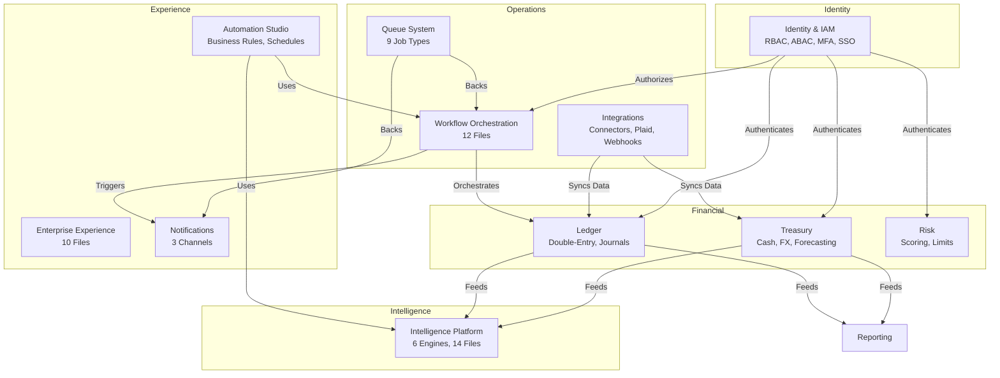
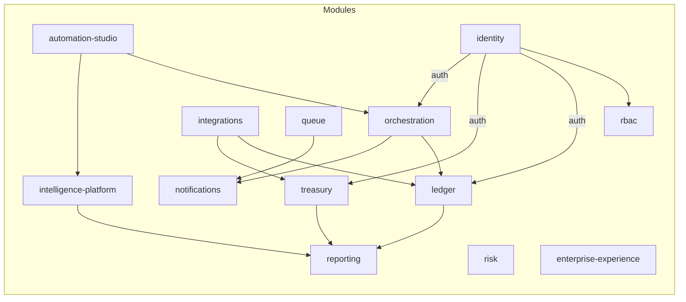

# System Architecture

## Seven-Layer Architecture

Perionyx is organized into seven logical layers. Each layer has a distinct responsibility and communicates with adjacent layers through well-defined interfaces.

```mermaid
block-beta
  columns 1
  block["Edge / Security Layer"]
    columns 3
    p["Proxy (src/proxy.ts)"] rl["Rate Limiting"] csrf["CSRF Protection"]
    auth["Auth Extraction"] locale["Locale Detection"] cors["CORS"]
  end
  block["Application Layer"]
    columns 3
    rsc["React Server Components"] cc["Client Components"] appr["App Router"]
    pages["Pages (96+)"] layouts["Layouts"] loading["Loading / Error UI"]
  end
  block["API Layer"]
    columns 3
    rest["REST Endpoints (272+)"] handle["handleRouteError()"] valid["zod Validation"]
    cache["Cache-Control"] etag["ETag Support"] streaming["Response Streaming"]
  end
  block["Business Logic Layer"]
    columns 3
    modules["56 Business Modules"] services["Domain Services"] facade["Facades"]
    rules["Business Rules"] matrix["Approval Matrix"] eval["Condition Evaluator"]
  end
  block["Integration Layer"]
    columns 3
    connectors["Connector Framework"] plaid["Plaid"] webhooks["Webhooks"]
    ach["ACH"] http["HTTP"] mock["Mock Connectors"]
  end
  block["Intelligence Layer"]
    columns 3
    anom["Anomaly Detection"] forecast["Cash Forecasting"] recs["Recommendations"]
    nlp["NLP Commentary"] riskScoring["Risk Scoring"] compliance["Compliance Checks"]
  end
  block["Infrastructure Layer"]
    columns 3
    cache["CacheManager (LRU+Redis)"] queue["QueueManager (PgBoss)"] locks["LockManager"]
    metrics["MetricsRegistry (Prom)"] logging["Pino Logger"] otel["OpenTelemetry"]
  end
```

## Multi-Tenancy Architecture

Tenant isolation is enforced at the database and application layers.

**Database layer:** Every table includes a `companyId` column. Queries are scoped by default. The Prisma schema enforces foreign key relationships through the `Company` model.

**Application layer:** The `requireTenantContext()` guard extracts the tenant from the JWT session and injects it into every service call. API routes receive tenant context via the edge proxy, which decodes the session token before the request reaches the handler.

**Key enforcement points:**

| Mechanism | Location |
|---|---|
| Tenant context extraction | `src/proxy.ts` |
| Guard function | `requireTenantContext()` in shared middleware |
| Per-table scoping | `companyId` on every model |
| Cross-tenant blocking | All repository queries include tenant filter |

## Domain Boundaries

Eleven domains partition the platform's functionality:



## Module Interaction Diagram

The following diagram shows how the 56 business modules in `src/modules/` interact at runtime:



## Key Architectural Decisions

| Decision | Rationale |
|---|---|
| Proxy replaces Middleware | Next.js 16 uses `src/proxy.ts` instead of `src/middleware.ts` for edge processing |
| Unified error format | All 272+ API endpoints use `handleRouteError()` / `zodErrorResponse()` |
| Cache headers on 18 endpoints | Tiered TTLs (15-120s) designed for CDN adoption |
| Stale-while-revalidate | Allows background refresh of cached financial data |
| Parallel DB queries | 9 independent queries converted from sequential to `Promise.all` |
| In-memory stores (ephemeral) | Rules/schedules/matrix stored in `Map` objects — DB persistence planned |
