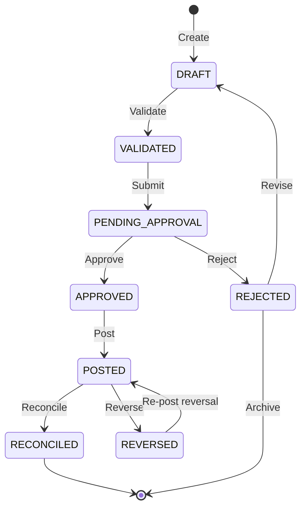

# Financial Engine — Ledger & Accounting

## Double-Entry Accounting

Perionyx implements full double-entry accounting through the `LedgerEntry` model. Every financial transaction creates at least two entries (debit and credit) that must balance to zero. The ledger is append-only — entries are never mutated after posting.

## Journal Lifecycle

A journal entry progresses through six stages. Each stage is a separate module in `src/modules/ledger/`:



### Stage 1 — Validation (`transaction-validator.ts`)

Before any journal enters the system, the validator checks:

- **Balance integrity:** Total debits must equal total credits (within currency precision tolerance)
- **Account validity:** All accounts must exist and be active
- **Tenant scope:** Transaction must belong to the requesting company
- **Currency consistency:** All entries in a journal must share the same currency
- **Date constraints:** Transaction date cannot be in the future (configurable tolerance)
- **Reference uniqueness:** External reference IDs are checked for idempotency

### Stage 2 — State Machine (`transaction-state-machine.ts`)

The state machine enforces valid state transitions. Illegal transitions (e.g., approving a draft without validation) are rejected at the application layer. Valid states: `DRAFT`, `VALIDATED`, `PENDING_APPROVAL`, `APPROVED`, `POSTED`, `RECONCILED`, `REVERSED`, `REJECTED`.

### Stage 3 — Posting Engine (`posting-engine.ts`)

The posting engine commits validated and approved journals to the ledger. It:

- Creates `LedgerEntry` records for each debit and credit line
- Updates account balances atomically within a database transaction
- Records a unique transaction ID for audit trail integrity
- Fails the entire batch if any individual entry fails (all-or-nothing)

### Stage 4 — Approval Workflow (`approval-workflow.ts`)

Journals requiring approval enter the approval workflow. The workflow:

- Routes to approvers based on approval matrix rules in Automation Studio
- Supports sequential and parallel approval paths
- Records each approval decision with timestamp and actor
- Escalates on timeout based on configurable thresholds
- Delegates to alternate approvers when primary is unavailable

### Stage 5 — Reconciliation (`reconciliation-engine.ts`)

Posted entries are reconciled against external statements (bank statements, payment processor reports). The reconciliation engine:

- Matches ledger entries to external transactions by reference ID, amount, and date
- Flags unmatched entries for investigation
- Supports partial reconciliation (multi-match)
- Produces reconciliation reports for audit

### Stage 6 — Reversal (`reversal-engine.ts`)

When a posted entry must be reversed (error correction, dispute resolution), the reversal engine:

- Creates a new set of offsetting entries (never mutates original)
- Cross-references the reversal to the original transaction ID
- Requires explicit approval for reversals above configurable thresholds
- Records the reason and authorization in the audit trail

## Idempotency (`idempotency.service.ts`)

The idempotency service prevents duplicate processing of the same external transaction. It:

- Uses `idempotencyKey` (typically the external reference ID) as a unique constraint
- Returns the existing result for duplicate keys (no re-processing)
- Automatically expires keys after a configurable TTL
- Logs duplicate attempts for audit review

## Audit Trail

Every journal lifecycle transition calls `recordAudit()` with:

| Field | Source |
|---|---|
| `actorId` | JWT session (edge proxy) |
| `companyId` | Tenant context |
| `transactionId` | Journal reference |
| `action` | State transition (submit, approve, post, reverse) |
| `before` | Previous state |
| `after` | New state |
| `timestamp` | Server time |
| `correlationId` | Proxy-generated request ID |
| `ipAddress` | Request origin |

## Ledger Module Files

| File | Purpose |
|---|---|
| `posting-engine.ts` | Commits validated journals to ledger, updates balances |
| `transaction-validator.ts` | Validates journal integrity before processing |
| `transaction-state-machine.ts` | Enforces valid state transitions |
| `approval-workflow.ts` | Routes journals through approval chains |
| `reconciliation-engine.ts` | Matches ledger entries to external statements |
| `reversal-engine.ts` | Creates offsetting entries for reversals |
| `idempotency.service.ts` | Prevents duplicate external transaction processing |
| (3 additional internal files) | Type definitions, utilities, barrel exports |

## Balance Integrity Guarantee

```
Sum(debits) - Sum(credits) = 0  (within currency precision tolerance)
```

This invariant is enforced at validation time, at posting time, and during reconciliation. If the invariant is violated at any point, the entire batch fails and the system reverts to the previous consistent state.
