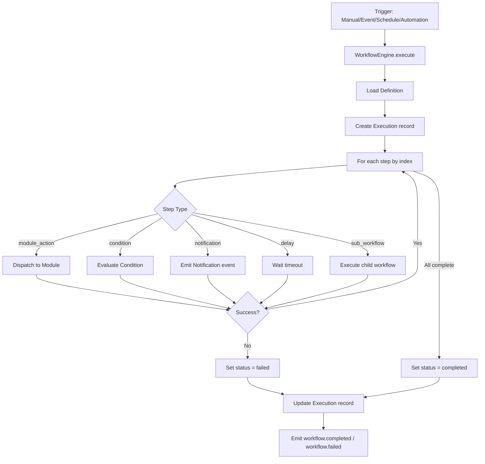

# 10 — Workflow Orchestration

**Location**: `src/modules/orchestration/` (13 source files)

The orchestration layer manages workflow definitions, execution, scheduling, automation rules, event-driven publishing, monitoring, and audit trails.

---

## Components

| Component | File | Responsibility |
|---|---|---|
| `WorkflowEngine` | `workflow-engine.ts` | Execute workflows with sequential step dispatch |
| `WorkflowBuilder` | `workflow-builder.ts` | CRUD for workflow definitions |
| `AutomationEngine` | `automation-engine.ts` | IF/THEN rules evaluated on events |
| `SchedulerService` | `scheduler.service.ts` | Cron-based scheduling with timezone support |
| `TemplateLibrary` | `template-library.ts` | 10 built-in workflow templates |
| `MonitorService` | `monitor.service.ts` | Execution monitoring, cancel, retry |
| `InternalEventBus` | `internal-event-bus.ts` | Publish/subscribe with emit/on/off |
| `WorkflowAuditService` | `workflow-audit.service.ts` | Audit trail recording |
| `WorkflowNotificationService` | `workflow-notification.service.ts` | Notification dispatch via event bus |
| `OrchestrationService` | `orchestration.service.ts` | Facade over all orchestration subsystems |

## Workflow Engine

`WorkflowEngine.execute(ctx, workflowId, trigger, input?)`:

1. Loads the `WorkflowDefinition` from Prisma (must be ACTIVE and same company)
2. Creates a `WorkflowExecution` record with status `running`
3. Iterates steps sequentially by `index`, executing each via `executeStep()`
4. Returns `ExecutionResult` with execution ID, status, step records, and metrics

### Step Types

| Type | Behavior |
|---|---|
| `module_action` | Dispatches to a named module (treasury, ledger, reporting, integration, intelligence, approval, notification) |
| `condition` | Evaluates a configurable condition; can halt on failure |
| `notification` | Sends notifications via the event bus on completion/failure |
| `delay` | Waits for a configurable timeout |
| `sub_workflow` | Executes a child workflow |

Error handling: if any step fails, the execution status is set to `failed` and remaining steps are skipped.

## Automation Engine

`AutomationEngine.evaluate(ctx, eventType, payload?)`:

1. Fetches all active rules matching the event type, ordered by priority descending
2. For each rule, checks cooldown (if configured, skips if recently fired)
3. Evaluates rule conditions against the payload
4. Executes each action in sequence

### Action Types

| Action | Effect |
|---|---|
| `start_workflow` | Triggers a workflow execution |
| `send_notification` | Emits a notification event |
| `update_status` | Updates a resource status |
| `escalate` | Escalates an approval or alert |
| `log_audit` | Records an audit log entry |

## Scheduler

`SchedulerService` manages cron-based scheduling:
- `create(ctx, data)` — creates a schedule with cron expression and timezone (default UTC)
- `update(ctx, id, data)` — updates cron/timezone/active status
- `delete(ctx, id)` — removes schedule
- `executeDue(ctx)` — queries for due schedules and executes their workflows

## Internal Event Bus

A lightweight publish/subscribe pattern:

```typescript
on(eventType, handler)  // register handler
off(eventType, handler) // unregister handler
emit(ctx, eventType, source, payload?, correlationId?) // publish event
```

Events carry: `id`, `companyId`, `eventType`, `source`, `payload`, `correlationId`, `timestamp`. Handlers run via `Promise.allSettled` for isolation.

## Workflow Templates

`TemplateLibrary` provides 10 built-in templates:

| Template | Slug | Steps |
|---|---|---|
| Month-End Close | `month-end-close` | 6 steps: trial balance → reconciliation → condition → statements → approval → notification |
| Daily Treasury Review | `daily-treasury-review` | 4 steps: cash position → FX rates → liquidity → notification |
| Weekly Executive Brief | `weekly-executive-brief` | 4 steps: KPIs → variance report → recommendations → notification |
| Bank Reconciliation | `bank-reconciliation` | 4 steps: sync bank → match → condition → notification |
| Cash Forecast Refresh | `cash-forecast-refresh` | 5 steps: cash → receivables → payables → forecast → notification |
| Budget Review | `budget-review` | 5 steps: actuals → budget comparison → variance → report → notification |
| Board Pack Generation | `board-pack-generation` | 4 steps: financials → board pack → commentary → distribution |
| Quarter-End Close | `quarter-end-close` | 7 steps: extended month-end with additional reporting |
| Year-End Close | `year-end-close` | 8 steps: full close with audit preparation |
| Audit Preparation | `audit-preparation` | 6 steps: evidence collection → trail export → compliance report |

## Execution Flow



## Monitoring

`MonitorService` provides:
- `getRunningExecutions(ctx)` — currently running executions
- `getFailedExecutions(ctx, limit?)` — recent failures
- `cancelExecution(ctx, id)` — cancel a running execution
- `retryExecution(ctx, id)` — retry a failed execution (up to `maxRetries`)
- `recordMetric(ctx, data)` — store workflow metrics (duration, p95, counts)

## Analytics

`OrchestrationService.getAnalytics(ctx, periodStart?, periodEnd?)` returns:
- Execution counts by trigger type (manual, event, schedule, automation)
- Execution counts by status (completed, failed, cancelled)
- Average and p95 duration
- Daily execution distribution over the period

## Data Models

All orchestration data is scoped to `companyId`:
- `WorkflowDefinition` — step definitions, status, version
- `WorkflowExecution` — per-run state, status, trigger, retry count
- `WorkflowStepExecution` — per-step results, duration, retries
- `AutomationRule` — event type, condition, actions, cooldown, priority
- `WorkflowSchedule` — cron expression, timezone, next/last run
- `WorkflowLog` — audit trail entries
- `WorkflowMetric` — aggregated performance data
- `WorkflowTemplate` — built-in and custom templates
