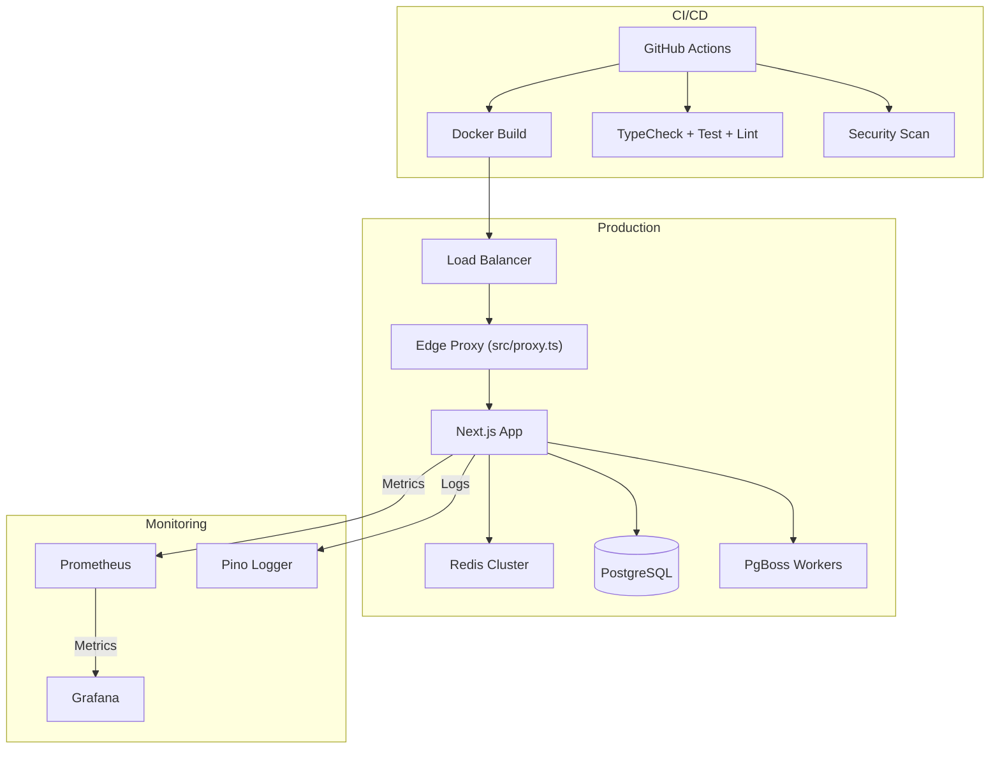

# Deployment Architecture

## Overview

Perionyx deploys as a Next.js 16 production build inside a Docker multi-stage container, orchestrated via docker-compose for local development and Kubernetes for production. The deployment pipeline runs through GitHub Actions CI/CD with automated typecheck, build, test, security scan, and deploy steps.

## Docker Multi-Stage Build

The `Dockerfile` defines three stages:

| Stage | Base Image | Purpose |
|-------|-----------|---------|
| `deps` | `node:22-alpine` | Install dependencies with `pnpm install --frozen-lockfile` |
| `builder` | `node:22-alpine` | Run `pnpm build` in production mode |
| `runner` | `node:22-alpine` | Run the compiled Next.js standalone server |

The runner stage:
- Uses a non-root `nextjs` user (UID 1001)
- Exposes port 3000
- Health check: `curl -f http://localhost:3000/api/v1/enterprise/health`
- Entrypoint: `docker-entrypoint.sh` (handles env validation, migration, seeding)
- Includes `postgresql-client` and `redis` CLI tools for debugging

## Docker Compose

### Development (`docker-compose.yml` with hot reload)
- Single `docker-compose.yml` file
- Services: `postgres` (16-alpine), `redis` (7-alpine), `app`
- Health condition dependencies: app waits for postgres and redis to be healthy
- Volume mounts for persistent data (`pgdata`, `redis-data`)
- Environment via `.env.production` file
- JSON-file logging driver with 10m max-size rotation

### Production
- Same `docker-compose.yml` structure but with `NODE_ENV=production`
- Build context uses Dockerfile multi-stage
- Database URL constructed from `POSTGRES_PASSWORD` env var

## Kubernetes Deployment

### Manifests

| Resource | File | Purpose |
|----------|------|---------|
| Deployment | `k8s/deployments/app.yaml` | Main app deployment with replica configuration |
| HorizontalPodAutoscaler | `k8s/hpa/app-hpa.yaml` | Auto-scaling based on CPU/memory metrics |
| PodDisruptionBudget | `k8s/pdb/app-pdb.yaml` | Minimum availability during voluntary disruptions |
| NetworkPolicy | `k8s/network-policies/default.yaml` | Ingress/egress traffic restrictions |
| ConfigMaps | `k8s/configmaps/` | Non-sensitive configuration |
| Secrets | `k8s/secrets/` | Encrypted secret manifests |
| Ingress | `k8s/ingress/` | External traffic routing with TLS |
| Services | `k8s/services/` | Internal service discovery |
| PersistentVolumes | `k8s/pv/` | Persistent storage claims |
| Namespaces | `k8s/namespaces/` | Environment namespace isolation |
| Jobs | `k8s/jobs/` | Migration and seed jobs |

### HPA Configuration

- Metric: CPU utilization
- Target: Configurable threshold (default 70%)
- Min/Max replicas: Configurable (default 2/10)
- Behavior: Scale up fast, scale down slowly

### PDB Configuration

- Min available: 1 (ensures at least one replica during disruptions)
- Applies to voluntary disruptions only (node maintenance, etc.)

## Environment Configuration

All configuration is via environment variables:

| Variable | Required | Description |
|----------|----------|-------------|
| `DATABASE_URL` | Yes | PostgreSQL connection string |
| `REDIS_HOST` | Yes | Redis host for cache and queues |
| `AUTH_SECRET` | Yes | JWT signing secret |
| `AI_API_KEY` | No | AI provider API key (platform works without it) |
| `NODE_ENV` | Yes | `production` or `development` |
| `NEXT_PUBLIC_APP_VERSION` | No | Version string for health endpoint |

## Health Endpoints

Three endpoints at `/api/v1/enterprise/`:

### Health (`/health`)
- Returns overall status: `healthy`, `degraded`, or `unhealthy`
- Runs 5 standard checks:
  - **Cache**: LRU + Redis connectivity and latency
  - **Memory**: Heap usage ratio (<90% healthy, <95% degraded, >95% unhealthy)
  - **Uptime**: Process uptime in hours/minutes
  - **Queues**: PgBoss backlog, failure, and dead-letter counts
  - **Persistence**: Database connection and migration status
- Response includes per-check latency, status, and metadata

### Readiness (`/readiness`)
- Binary ready/not-ready check
- Returns ready when the app can accept traffic

### Liveness (`/liveness`)
- Basic process alive check
- Returns PID, uptime, memory stats

## Graceful Shutdown

The `src/server/ha/graceful.ts` module handles:

- **SIGTERM/SIGINT** interception
- Connection draining (database pool, Redis, PgBoss)
- In-flight request completion (configurable timeout, default 30s)
- Queue worker graceful stop
- Cache flush on shutdown
- Health endpoint returns unhealthy during drain

Component implementation in `src/server/ha/`:
- `circuit-breaker.ts` — Prevents cascading failures
- `graceful.ts` — Startup/shutdown orchestration
- `health.ts` — Health/readiness/liveness endpoint logic

## Backup & Recovery

The `src/server/recovery/` module provides:

| Module | File | Purpose |
|--------|------|---------|
| Backup Manager | `backup-manager.ts` | Scheduled and on-demand database backups |
| Restore Manager | `restore-manager.ts` | Point-in-time and full restore operations |
| Snapshot Manager | `snapshot-manager.ts` | Application state snapshots |
| Recovery Validator | `recovery-validator.ts` | Post-restore integrity validation |
| Recovery Metrics | `recovery-metrics.ts` | Backup success/failure metrics |

## Monitoring

### Prometheus
- Metrics exported at `/api/v1/enterprise/metrics`
- 8 metric domains: cache, queues, locks, database, HTTP requests, AI operations, notifications, workflow
- Counter, Gauge, and Histogram metric types from `MetricsRegistry`

### Grafana
- Pre-configured dashboards for:
  - Application health and performance
  - Queue backlog and processing rates
  - Cache hit/miss ratios and latency
  - Database connection pool and query performance
  - Business metrics (transactions, approvals, risk alerts)

### Logging
- Structured JSON logging via Pino
- Fields: timestamp, level, correlation ID, module, duration, error
- Correlation IDs injected at the edge proxy for request tracing

## CI/CD Pipeline

### Continuous Integration (`.github/workflows/ci.yml`)

| Step | Command |
|------|---------|
| TypeScript check | `pnpm typecheck` |
| Lint | `pnpm lint` |
| Unit/Integration tests | `pnpm test` |
| Production build | `pnpm build` |
| Security scan | Dependency audit + SAST |
| Migration verification | Prisma migrate validate |

### Continuous Deployment (`.github/workflows/deploy.yml`)

| Step | Description |
|------|-------------|
| Build | Docker build + push to registry |
| Migrate | Run Prisma migrations |
| Deploy | Apply k8s manifests |
| Health check | Verify /health returns healthy |
| Rollback | Automated rollback on failure |

## Architecture Diagram

