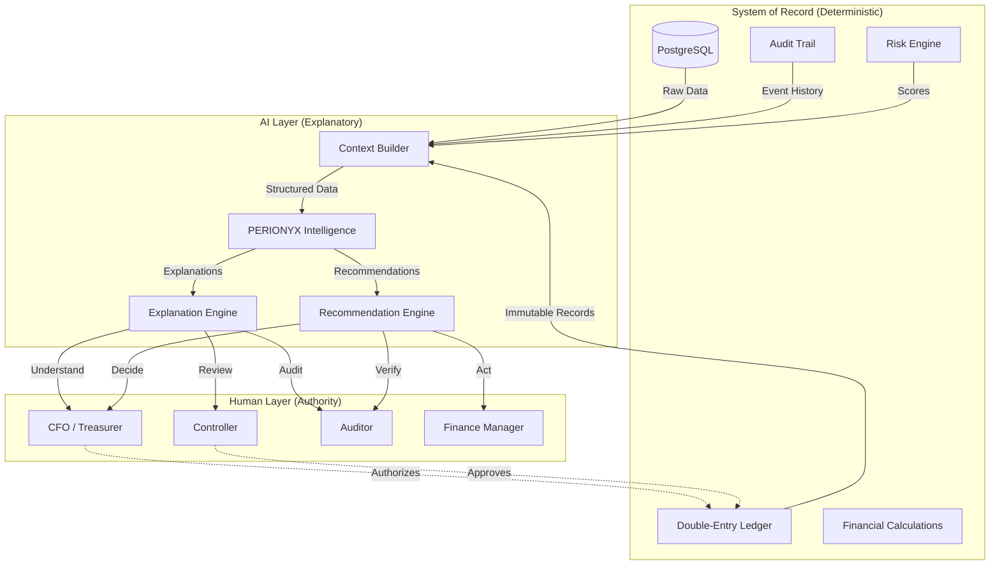

# AI Governance

## Critical: Financial Facts Are Always Produced by Deterministic Systems

> **AI may explain, summarize, recommend, or investigate those facts, but it must never become the system of financial record.**

This principle is the foundation of Perionyx AI governance. It is non-negotiable and applies to every component, every API, every recommendation, and every user-facing feature.

## AI Philosophy

PERIONYX Intelligence is not a chatbot. It is an enterprise financial intelligence layer that provides explainable, actionable, and transparent insights grounded in platform data. Every AI interaction must produce responses that an auditor could review.

The platform occupies the intersection of human expertise and machine efficiency:

- **Human expertise** owns every financial decision, approval, and record
- **Machine efficiency** provides context, anomaly detection, trend analysis, and recommendations
- **Audit integrity** is preserved because AI never mutates the financial system of record

## AI Principles

### Principle 1: Deterministic Financial Calculations

All six intelligence engines compute scores exclusively from Prisma database queries. No AI model is involved in producing financial metrics, risk scores, or compliance checks.

| Engine | Input | Output | Deterministic |
|--------|-------|--------|---------------|
| Anomaly Detection | Transaction patterns + thresholds | Anomaly score | Yes — Prisma query + threshold comparison |
| Cash Forecasting | Historical cash flows + seasonality | Forecast projections | Yes — Prisma query + statistical model |
| Recommendation | All platform metrics + rules | Action recommendations | Yes — rule-based evaluation |
| Trend Analysis | Historical metric snapshots | Trend direction + magnitude | Yes — Prisma query + computation |
| Compliance Checks | Policy rules + transaction data | Compliance status | Yes — rule engine evaluation |
| NLP Commentary | Structured data + templates | Natural language explanation | Yes — template-based generation |

### Principle 2: Explainable AI

Every AI recommendation includes:
- **Evidence chain**: The specific data points and rules that produced the recommendation
- **Source references**: Module name, record ID, field name for every data point cited
- **Confidence level**: High (live query), Medium (cached), Low (general knowledge), Simulated (demo)

### Principle 3: Human-in-the-Loop

All financial actions require explicit human approval. The AI may:
- Recommend actions (with evidence)
- Pre-fill forms (with data from known sources)
- Flag anomalies (with explanation)

The AI may never:
- Execute journal entries
- Approve transactions
- Modify financial records
- Generate financial statements as records of truth

## What AI May Do

| Capability | Description | Governance |
|------------|-------------|------------|
| **Explain** | Provide natural language explanations of financial data | Must cite data sources |
| **Summarize** | Condense trends, metrics, and reports | Must indicate data freshness |
| **Recommend** | Suggest actions based on platform data | Must include evidence and confidence |
| **Investigate** | Trace transaction flows and anomalies | Must show audit trail references |
| **Generate commentary** | Produce contextual analysis for reports | Must distinguish AI text from deterministic output |

## What AI May Never Do

| Activity | Reason | Enforcement |
|----------|--------|-------------|
| Produce journal entries | AI cannot create financial records | No write access to ledger system |
| Approve transactions | Only humans authorize financial actions | Approval engine requires human actor |
| Modify financial records | Immutability of financial history | Append-only ledger, no mutation APIs |
| Generate financial statements as records of truth | Statements must be deterministic | Statement generation is template-based from ledger data |
| Make predictions without confidence labels | Financial decisions need uncertainty communication | Every forecast/score includes confidence level |

## Evidence Requirements

### Recommendation Format

Every AI recommendation must include:

```typescript
interface AIRecommendation {
  summary: string;
  details: string;
  confidence: "high" | "medium" | "low";
  evidence: Array<{
    sourceModule: string;
    sourceId: string;
    sourceField?: string;
    sourceLabel: string;
    sourceTimestamp: string;
    sourceScoreType: string;
  }>;
  recommendedActions?: Array<{
    label: string;
    description: string;
    href?: string;
  }>;
}
```

### Source Score Types

Each evidence item includes a `sourceScoreType` that identifies the origin of the data:

| Source Score Type | Origin | Example |
|-------------------|--------|---------|
| `database_query` | Live Prisma query | Current wallet balance |
| `cached_query` | CacheManager result | Dashboard metric |
| `calculated_metric` | Deterministic computation | 30-day trend percentage |
| `rule_evaluation` | Business rule engine | Compliance check result |
| `engine_score` | Intelligence engine | Anomaly detection score |
| `historical_snapshot` | Time-series data store | Cash position history |
| `audit_trail` | Audit log entries | Transaction approval chain |

### No-Citation Rule

If the AI cannot cite a source for a claim, it must not make the claim. The response should indicate what data is available rather than fabricating specifics.

## Confidence Levels

| Level | Criteria | UI Treatment |
|-------|----------|--------------|
| **high** | Data from live database query, current within seconds | Green trust indicator |
| **medium** | Data from cached query or historical snapshot | Amber trust indicator |
| **low** | Data from AI training (general knowledge), not platform-specific | Red trust indicator with warning |
| **simulated** | Data from sandbox/demo environment | Gold trust indicator |

Low-confidence responses must include:
> *"I'm not able to verify this information from your platform data. Please check directly in the relevant module for accurate information."*

## Enterprise Trust Model



Financial facts are always produced by deterministic systems. AI adds context, explanation, and investigation — it never replaces the system of record.

## Related Documents

- `docs/AI_GUIDELINES.md` — Full AI product guidelines (grounding, response structure, personas, prompt principles)
- `docs/adr/010-ai-copilot.md` — Architecture Decision Record for AI Copilot
- `docs/architecture/02-system-architecture.md` — Intelligence Platform architecture
- `src/modules/intelligence-platform/` — Intelligence engine implementations
