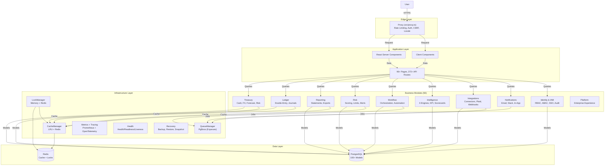
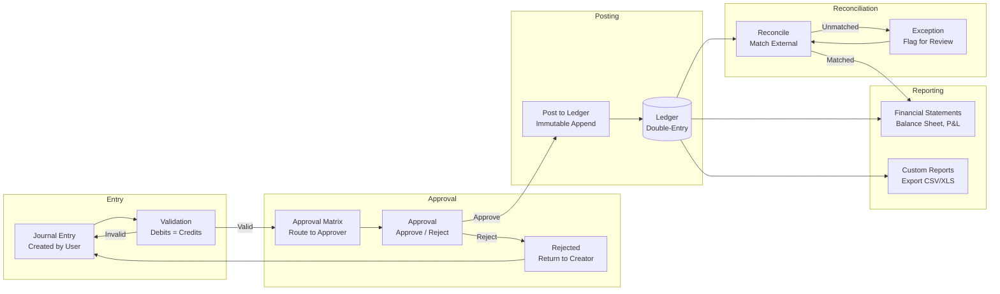
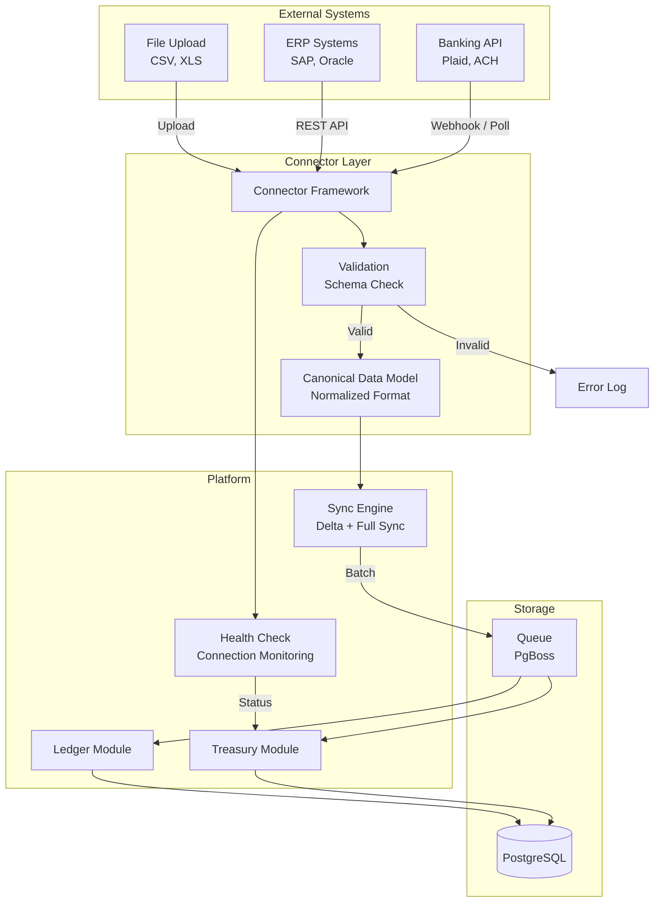
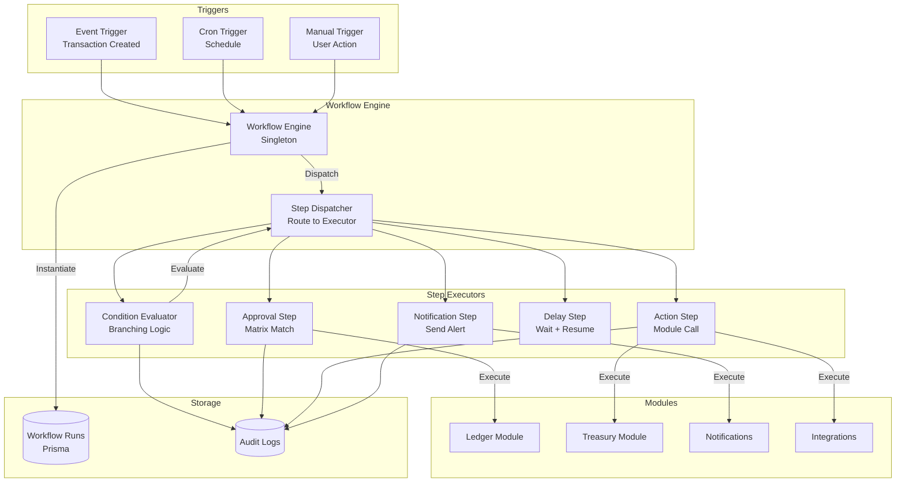
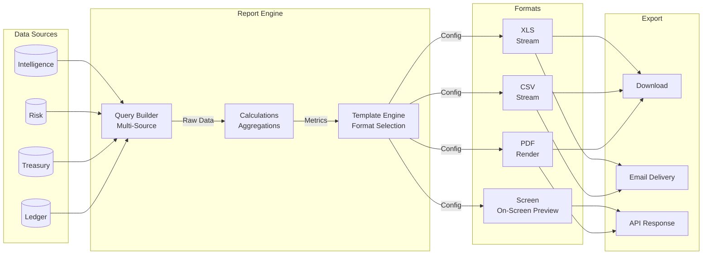
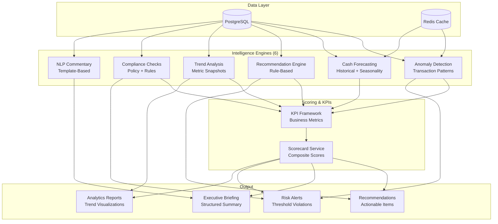
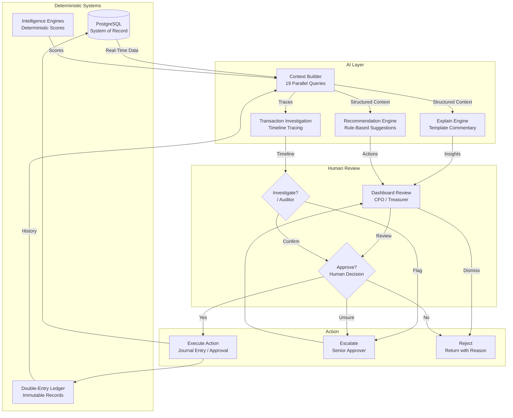

# Architecture Diagrams

## 1. Overall Platform Architecture

Seven-layer architecture with all 56 business modules grouped by domain.



## 2. Financial Transaction Flow

The complete lifecycle of a journal entry from creation to reporting.



## 3. Integration Data Flow

How connectors bring external data into the platform.



## 4. Workflow Engine Architecture

How the workflow engine processes events through steps.



## 5. Reporting Data Flow

How data flows from sources to formatted reports.



## 6. Intelligence Platform Architecture

How the 6 deterministic engines produce scores and recommendations.



## 7. AI Decision Flow

The interaction between deterministic systems, AI, and human decision-makers.



## 8. Deployment Architecture

Full infrastructure topology from user to database.

```mermaid
graph TD
    subgraph "User"
        Browser[Browser]
        Mobile[Mobile App]
    end

    subgraph "CDN"
        CDN["CDN Edge<br/>Cache-Control + SWR"]
    end

    subgraph "Kubernetes"
        subgraph "Ingress"
            LB[Load Balancer]
            Ingress[Ingress<br/>TLS Termination]
        end

        subgraph "App Pods"
            Proxy["Edge Proxy<br/>(src/proxy.ts)"]
            App[Next.js App<br/>Server Components]
            API[API Routes<br/>272+ Endpoints]
        end

        subgraph "Workers"
            Queue[Queue Workers<br/>PgBoss]
            Sync[Sync Workers<br/>Connector Jobs]
        end

        subgraph "Monitoring"
            MetricsPod[Prometheus<br/>Metrics Export]
            HealthPod[Health<br/>/health /readiness /liveness]
        end
    end

    subgraph "Data Services"
        Redis[(Redis<br/>Cache + Locks)]
        DB[(PostgreSQL<br/>Primary)]
        Replica[(PostgreSQL<br/>Read Replica<br/>Future)]
    end

    subgraph "CI/CD"
        GH[GitHub Actions]
        DockerReg[Docker Registry]
    end

    Browser --> CDN
    Mobile --> CDN
    CDN --> LB
    
    LB --> Ingress
    Ingress --> Proxy
    Proxy --> App
    Proxy --> API
    
    App -->|Cache| Redis
    App -->|Read/Write| DB
    API -->|Cache| Redis
    API -->|Read/Write| DB
    
    Queue --> Redis
    Queue -->|Async Jobs| DB
    Sync -->|Connector Data| DB
    
    App -->|Metrics| MetricsPod
    API -->|Metrics| MetricsPod
    Queue -->|Metrics| MetricsPod
    MetricsPod -->|Scrape| Prometheus[Prometheus Server]
    
    HealthPod -->|Checks| Redis
    HealthPod -->|Checks| DB
    HealthPod -->|Checks| App
    
    GH -->|Build + Push| DockerReg
    GH -->|Deploy| K8s[Kubernetes API]
    K8s -->|Rolling Update| LB
```
