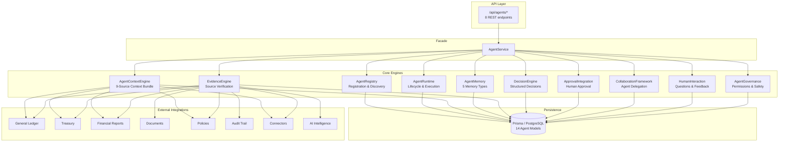
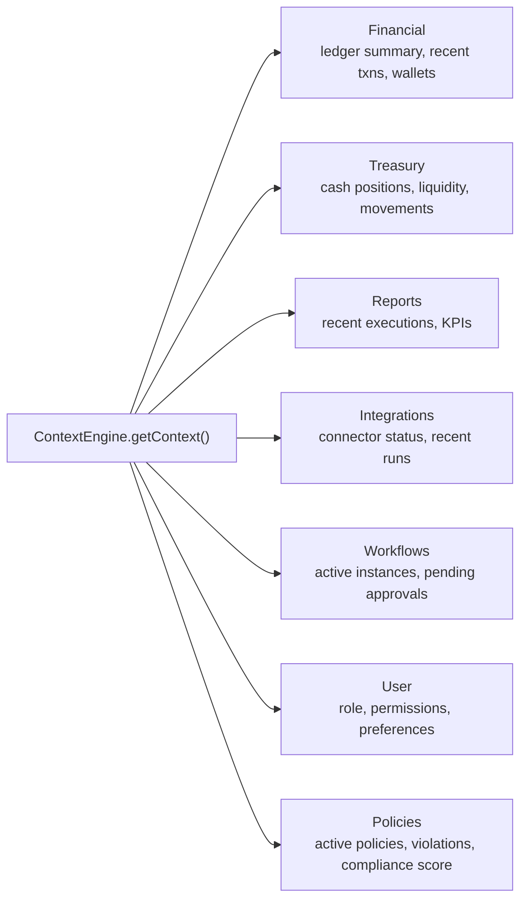
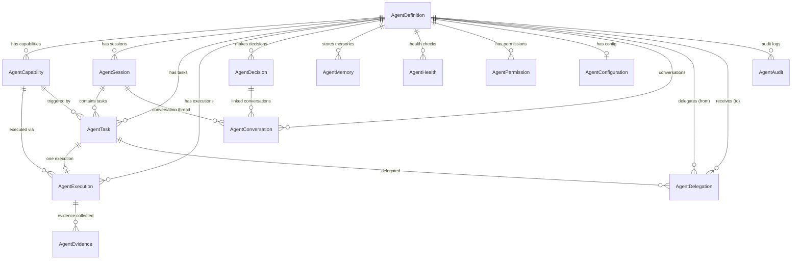

# Phase 13 — Agent Framework Architecture

## 1. Executive Summary

The Agent Framework is Perionyx's multi-agent AI orchestration layer for autonomous financial operations. It enables CFOs, Treasurers, Controllers, and Finance Managers to deploy specialized AI agents that analyze financial data, make structured decisions, collaborate with each other, and interact with humans — all within a governed, auditable, and tenant-isolated environment.

**Why it exists:** Finance teams need AI that operates within guardrails, not outside them. Every agent action must be traceable, every decision must carry evidence, and every high-risk operation must require human approval. This framework provides the infrastructure to make that possible at enterprise scale.

**Core capabilities:**
- Register, start, stop, and manage specialized finance agents
- Collect structured evidence from 8 source systems (ledger, treasury, reports, documents, policies, audits, integrations, intelligence)
- Make decisions with alternatives, confidence scores, and risk/impact ratings
- Delegate work between agents with full traceability
- Interact with humans through questions, clarifications, reasoning explanations, and feedback
- Govern agents via permissions, rate limits, allowed/forbidden actions, and safety policies

---

## 2. Core Principles

| # | Principle | Implementation |
|---|---|---|
| 1 | **Evidence-Based** | Every decision links to `AgentEvidence` with source system, confidence, relevance, and verification status |
| 2 | **Human-in-the-Loop** | HIGH/CRITICAL risk decisions require approval; agents ask questions and present reasoning before acting |
| 3 | **Tenant Isolation** | Every query filters by `companyId`; no cross-tenant data leakage possible |
| 4 | **Full Auditability** | 15 audit action types tracked via `AgentAudit` — every registration, task, decision, permission change, memory access |
| 5 | **Least Privilege** | Agents receive explicit `ALLOW`/`DENY` permissions with optional expiry; context is filtered by permission set |
| 6 | **Graceful Degradation** | Non-critical failures (decision creation, health checks) are caught and logged, not thrown |
| 7 | **Composability** | Agents delegate to other agents via `full_delegation`, `partial_delegation`, `consultation`, or `escalation` |

---

## 3. Architecture Overview



---

## 4. Component Details

### 4.1 Agent Registry (`agent-registry.ts`)

The central catalog for all agent definitions. Manages registration, discovery, metadata, and status lifecycle.

**Key methods:**
| Method | Purpose |
|---|---|
| `register(ctx, input)` | Create agent with unique name per tenant; records audit |
| `get(ctx, agentId)` | Fetch agent with capabilities, configuration, health checks |
| `list(ctx, query)` | Paginated listing with status/role/enabled/search filters |
| `update(ctx, agentId, input)` | Update name, description, role, version, owner, config |
| `enable(ctx, agentId)` | Transition DRAFT→ACTIVE or DISABLED→ACTIVE |
| `disable(ctx, agentId)` | Transition any→DISABLED; records audit |
| `getByRole(ctx, role)` | Find all agents with a specific role |
| `getByCapability(ctx, type)` | Find agents that have a specific capability type |
| `getStats(ctx)` | Dashboard stats: agent counts, task counts, health summary |

**Status lifecycle:**
```
DRAFT → ACTIVE → PAUSED → ACTIVE
       → DISABLED
       → ERROR → ACTIVE
              → DISABLED
PAUSED → DISABLED
DISABLED → ACTIVE (re-enable only)
```

### 4.2 Agent Runtime (`agent-runtime.ts`)

Manages agent lifecycle (start/stop/pause/resume), sessions, task execution, and execution recording.

**Key methods:**
| Method | Purpose |
|---|---|
| `startAgent(ctx, agentId, config?)` | Activate agent + create session in a transaction |
| `stopAgent(ctx, agentId)` | Terminate all active sessions + disable agent |
| `pauseAgent(ctx, agentId)` | Pause agent + pause all active sessions |
| `resumeAgent(ctx, agentId)` | Resume paused agent + sessions |
| `createSession(ctx, agentId)` | Create a new session for an agent |
| `endSession(ctx, sessionId)` | Complete a session with duration calculation |
| `executeTask(ctx, agentId, capabilityId, input)` | Create a PENDING task linked to a capability |
| `recordExecution(ctx, taskId, status, output?, error?, metrics?)` | Upsert execution record + update task status |
| `getExecutionHistory(ctx, agentId)` | Fetch recent executions for an agent |

**Task priority assignment:**
- CRITICAL risk → priority 100
- HIGH risk → priority 75
- Other → priority 50

### 4.3 Agent Capability Framework

Capabilities are the units of work an agent can perform. Each capability declares:

| Field | Purpose |
|---|---|
| `capabilityType` | `analysis`, `recommendation`, `execution`, `monitoring`, `reporting`, `investigation` |
| `inputSchema` | JSON Schema defining expected input structure |
| `outputSchema` | JSON Schema defining output structure |
| `requiredPermissions` | Permission strings the agent must have to use this capability |
| `requiredEvidence` | Evidence source types that must be collected before execution |
| `confidence` | 0–1 confidence score (Decimal 5,4) |
| `riskLevel` | LOW, MEDIUM, HIGH, or CRITICAL |
| `requiresApproval` | Whether this capability triggers the approval flow |

### 4.4 Agent Context Engine (`agent-context.ts`)

Builds a comprehensive `AgentContextBundle` from 9 data sources, all fetched in parallel via `Promise.all`:



**Permission-based filtering:** `filterContextByPermissions()` removes data domains the agent doesn't have `*.read` permission for. For example, without `financial.read`, the financial context returns empty arrays and zeroed summaries.

**Permission validation:** `validateContextAccess()` checks whether a specific permission exists, is `ALLOW` (not `DENY`), and hasn't expired.

### 4.5 Agent Memory (`agent-memory.ts`)

Persistent, typed memory store with 5 memory types:

| Type | Purpose | TTL |
|---|---|---|
| `short_term` | Transient context from current operations | Expires; cleaned up if stale 30 days + importance < 0.3 |
| `long_term` | Persistent learnings and facts | No expiry |
| `user_preference` | Per-user settings and preferences | No expiry |
| `conversation` | Conversation history summaries | No expiry |
| `recommendation` | Past recommendations for pattern learning | No expiry |

**Key operations:**
- `store()` — Upsert by (companyId, agentId, memoryType, key) composite key
- `retrieve()` — Fetch by composite key; returns null if expired; increments `accessCount`
- `search()` — Filter by category, importance range, text, memoryType
- `updateImportance()` — Adjust importance (0–1 scale)
- `cleanup()` — Remove expired memories + stale low-importance short-term memories
- `getStats()` — Total count, by-type breakdown, average importance, expired count

### 4.6 Evidence Engine (`evidence-engine.ts`)

Collects and verifies evidence from 8 source systems:

| Source Type | Examples |
|---|---|
| `ledger` | GL entries, journal postings |
| `treasury` | Cash positions, liquidity data |
| `report` | Financial report executions |
| `document` | Uploaded documents, attachments |
| `policy` | Policy definitions, compliance rules |
| `audit` | Audit log entries |
| `integration` | Connector sync results |
| `intelligence` | AI-generated insights |

**Verification workflow:**
1. `collect()` — Attach evidence to an execution with source metadata, confidence (0–1), relevance (0–1)
2. `verify()` — Mark evidence as verified with timestamp
3. `validateEvidenceRequirements()` — Check that a capability's `requiredEvidence` list is satisfied by provided evidence IDs

**Evidence summary:** Aggregates total/verified/unverified counts, by-source-type/system breakdowns, and average confidence/relevance scores.

### 4.7 Decision Engine (`decision-engine.ts`)

Structured decision objects with a state machine for the approval lifecycle.

**Decision status transitions:**
```
PENDING → APPROVED → EXECUTED
        → REJECTED (terminal)
        → EXPIRED (terminal)
        → CANCELLED (terminal)
APPROVED → EXECUTED
         → EXPIRED
         → CANCELLED
```

**Decision fields:**
| Field | Purpose |
|---|---|
| `title` | Human-readable decision title |
| `recommendation` | What the agent recommends |
| `reason` | Why this recommendation |
| `confidence` | 0–1 confidence score |
| `impact` | LOW, MEDIUM, HIGH, CRITICAL |
| `risk` | LOW, MEDIUM, HIGH, CRITICAL |
| `alternatives[]` | Other options considered |
| `requiredApprovals[]` | Who must approve |
| `evidence[]` | References to `AgentEvidence` records |
| `status` | Current state in the lifecycle |

**Key methods:**
- `create()` — Create decision linked to agent, session, and task
- `approve()` / `reject()` — Human approval with audit trail
- `execute()` — Mark as executed after approval
- `expire()` — Time-based expiry
- `addAlternative()` — Append alternatives to an existing decision
- `getDecisionStats()` — Aggregated counts by status, impact, risk

### 4.8 Approval Integration (`approval-integration.ts`)

Connects agent decisions to the human approval flow.

**Approval rules:**
- Only HIGH or CRITICAL risk decisions can request approval
- Approval request adds metadata: `approvalRequested`, `approvalRequestedAt`, `escalationLevel`
- Three actions: `APPROVE`, `REJECT`, `ESCALATE`
- Escalation increments `escalationLevel` (tracked in metadata)
- Delegation transfers approval responsibility to another user

**Metrics:**
- Pending/approved/rejected/escalated counts
- Average time to decision (milliseconds)
- Total decision count

### 4.9 Collaboration Framework (`collaboration-framework.ts`)

Enables agent-to-agent delegation with full traceability.

**Delegation types:**
| Type | Description |
|---|---|
| `full_delegation` | Target agent takes complete ownership |
| `partial_delegation` | Target agent handles a subset of the task |
| `consultation` | Target agent provides input, source retains ownership |
| `escalation` | Task escalated to a higher-authority agent |

**Delegation lifecycle:**
```
PENDING → ACCEPTED → COMPLETED
        → REJECTED (terminal)
        → EXPIRED (terminal)
ACCEPTED → EXPIRED
```

**Traceability:** The `traceId` field links delegation chains across multiple agents, enabling full audit trail reconstruction.

**Key methods:**
- `delegate()` — Create delegation between two agents (self-delegation forbidden)
- `accept()` / `reject()` — Target agent responds
- `complete()` — Mark done with result payload and duration
- `cancel()` — Expire a pending/accepted delegation
- `getDelegationChain(traceId)` — Reconstruct full delegation history by trace ID
- `getDelegationStats()` — Aggregated stats by type, status, average completion time

### 4.10 Human Interaction Layer (`human-interaction.ts`)

Structured conversation between agents and humans within a session.

**Content types:**
| Type | Role | Purpose |
|---|---|---|
| `question` | agent | Agent asks the human a question |
| `clarification` | agent | Agent clarifies ambiguous input |
| `evidence` | agent | Agent presents supporting evidence |
| `text` | agent/user | General text (reasoning, feedback) |
| `decision` | agent | Agent presents a decision for review |

**Key methods:**
- `askQuestion()` — Agent posts a question to the session
- `clarifyRequest()` — Agent requests clarification
- `presentEvidence()` — Agent presents evidence with optional refs to `AgentEvidence` records
- `explainReasoning()` — Agent explains its reasoning chain
- `acceptFeedback()` — Human provides feedback with optional 1–5 rating
- `getConversation()` — Full conversation history for a session
- `getConversationThread()` — Filter by decision ID
- `getInteractionStats()` — Total conversations, questions asked, feedback received, average rating

### 4.11 Agent Governance (`agent-governance.ts`)

Controls what agents can do, how fast they can do it, and what happens when they violate rules.

**Permission model:**
- Dot-notation permissions: `ledger.read`, `treasury.execute`, `report.generate`
- Wildcard support: `financial.*` matches `financial.read`, `financial.write`, etc.
- Two effects: `ALLOW` or `DENY`
- Optional expiry: permissions can have an `expiresAt` timestamp
- Conditions: arbitrary JSON for conditional grants (threshold, time-of-day, etc.)

**Action validation:**
1. Check `forbiddenActions` first (pattern match with dot-prefix)
2. Check `allowedActions` (must match or wildcard `*` present)
3. Default: allow if no configuration exists

**Rate limiting:**
- Configurable per agent: `rateLimitPerMinute` (default: 60)
- Measured by counting audit entries in the last 60 seconds
- Returns `allowed`, `remaining`, `limit`, `resetAt`

**Safety report:**
- Permission counts (total/allowed/denied/expired)
- Configuration summary (concurrent tasks, timeout, rate limit, allowed/forbidden counts)
- Violation counts (total and recent)
- Rate limit status (hits in last minute, isLimited, limit)
- Overall status: HEALTHY, WARNING, or CRITICAL

**Governance dashboard:**
- Total agents, agents with permissions, agents with configs
- Permission counts by effect (ALLOW/DENY)
- Recent violations (24h)
- Per-agent permission count and config status

---

## 5. Data Model

14 Prisma models backed by PostgreSQL, all tenant-isolated via `companyId`.



### Model Summary

| Model | Table | Records | Purpose |
|---|---|---|---|
| `AgentDefinition` | `agent_definitions` | Core | Agent identity, status, config, metadata |
| `AgentCapability` | `agent_capabilities` | Core | What an agent can do |
| `AgentSession` | `agent_sessions` | Runtime | Execution session lifecycle |
| `AgentTask` | `agent_tasks` | Runtime | Units of work with priority and retry |
| `AgentExecution` | `agent_executions` | Runtime | Execution records with metrics |
| `AgentDecision` | `agent_decisions` | Decision | Structured decisions with alternatives |
| `AgentEvidence` | `agent_evidence` | Evidence | Source-linked evidence with verification |
| `AgentMemory` | `agent_memory` | Memory | Persistent typed memory store |
| `AgentHealth` | `agent_health` | Health | Periodic health check results |
| `AgentPermission` | `agent_permissions` | Governance | ALLOW/DENY permissions with expiry |
| `AgentConfiguration` | `agent_configurations` | Governance | Rate limits, timeouts, action policies |
| `AgentConversation` | `agent_conversations` | Interaction | Human-agent conversation threads |
| `AgentDelegation` | `agent_delegations` | Collaboration | Agent-to-agent delegation chain |
| `AgentAudit` | `agent_audit` | Audit | 15 action types, full traceability |

### Key Indexes

| Model | Indexes |
|---|---|
| `AgentDefinition` | `(companyId, name)` unique; `(companyId, status)`; `(companyId, role)` |
| `AgentCapability` | `(agentId, name)` unique; `(companyId, agentId)`; `(companyId, capabilityType)` |
| `AgentTask` | `(companyId, agentId, status)`; `(companyId, status, priority)`; `(companyId, sessionId)` |
| `AgentExecution` | `(companyId, agentId)`; `(companyId, status)`; `(companyId, startedAt)` |
| `AgentDecision` | `(companyId, agentId, status)`; `(companyId, status, createdAt)`; `(companyId, impact)` |
| `AgentMemory` | `(companyId, agentId, memoryType, key)` unique; `(companyId, agentId, importance)`; `(companyId, userId)` |
| `AgentPermission` | `(companyId, agentId, permission)` unique; `(companyId, permission)` |
| `AgentDelegation` | `(companyId, fromAgentId)`; `(companyId, toAgentId)`; `(companyId, traceId)` |
| `AgentAudit` | `(companyId, agentId, action)`; `(companyId, action, createdAt)`; `(companyId, correlationId)` |

---

## 6. API Design

8 REST endpoints under `/api/agents/`:

| Endpoint | Method | Purpose | Auth |
|---|---|---|---|
| `/api/agents` | `GET` | List agents (paginated, filtered) | Session |
| `/api/agents` | `POST` | Create agent with capabilities + start | `agents.manage` |
| `/api/agents/[id]` | `GET` | Get agent with relations | Session |
| `/api/agents/[id]` | `PUT` | Update agent definition | `agents.manage` |
| `/api/agents/[id]` | `DELETE` | Disable agent | `agents.manage` |
| `/api/agents/[id]/start` | `POST` | Start agent (create session) | `agents.manage` |
| `/api/agents/[id]/stop` | `POST` | Stop agent (terminate sessions) | `agents.manage` |
| `/api/agents/[id]/tasks` | `GET` | List tasks for agent | Session |
| `/api/agents/[id]/tasks` | `POST` | Create task for agent | `agents.manage` |
| `/api/agents/[id]/decisions` | `GET` | List decisions for agent | Session |
| `/api/agents/[id]/decisions` | `POST` | Create decision for agent | `agents.manage` |
| `/api/agents/[id]/memory` | `GET` | Search agent memories | Session |
| `/api/agents/[id]/memory` | `POST` | Store agent memory | `agents.manage` |
| `/api/agents/[id]/health` | `GET` | Safety report + agent stats | Session |

**Request validation:** All inputs validated via Zod schemas (`src/lib/validations/agent-framework.ts`).

**Caching:** GET endpoints use `cacheHeaders()` with tiered TTLs (15–30s).

**Error handling:** All routes use the shared `handleRouteError()` / `zodErrorResponse()` pattern.

---

## 7. Security Model

### Tenant Isolation
Every database query filters by `companyId` from `TenantContext`. No cross-tenant access is possible.

### RBAC
- Write operations require `agents.manage` permission via `rbacService.ensurePermission()`
- Read operations require valid session authentication
- Context data is filtered by the agent's permission set

### Audit Trail
Every state mutation records an `AgentAudit` entry with:
- `companyId`, `agentId`, `sessionId`
- `action` (15 types: `agent.registered`, `task.created`, `decision.approved`, etc.)
- `resourceType`, `resourceId`
- `actorUserId` (who triggered it)
- `before` / `after` snapshots (where applicable)
- `metadata` with operation-specific details
- `ipAddress`, `correlationId`

### Agent Permissions
- Explicit `ALLOW`/`DENY` per permission string
- Wildcard matching: `financial.*` matches `financial.read`
- Time-bounded expiry: `expiresAt` on each permission
- Condition-based: arbitrary JSON conditions for contextual grants

### Rate Limiting
- Per-agent `rateLimitPerMinute` (default: 60)
- Measured against audit entry count in last 60 seconds
- Block agent when limit exceeded

### Safety Policies
- Allowed/forbidden action lists per agent
- Pattern matching with dot-prefix for hierarchical actions
- Escalation rules for high-risk operations
- Configurable task timeouts (default: 5 minutes)

---

## 8. Integration Points

| Integration | How |
|---|---|
| Audit Module | `recordAudit()` for every agent action |
| RBAC Service | `rbacService.ensurePermission()` for write endpoints |
| Prisma ORM | Direct queries across 14 agent models + existing financial models |
| Tenant Context | `requireTenantContext()` for every request |
| Zod Validation | Input schemas in `src/lib/validations/agent-framework.ts` |
| Shared Error Handling | `handleRouteError()` / `zodErrorResponse()` |
| Cache Headers | `cacheHeaders(ttl)` on GET endpoints |

---

## 9. Extension Points

1. **New agent roles** — Add to `AgentRole` union type and register in `AgentRegistry`
2. **New capability types** — Add to `CapabilityType` union type
3. **New evidence sources** — Add to `EvidenceSourceType` union type
4. **New delegation types** — Add to `DelegationType` union type
5. **New conversation content types** — Add to `ConversationContentType` union type
6. **New audit actions** — Add to `AuditAction` union type
7. **New memory types** — Add to `MemoryType` union type
8. **Custom governance rules** — Extend `AgentConfiguration` escalation rules and safety policies
