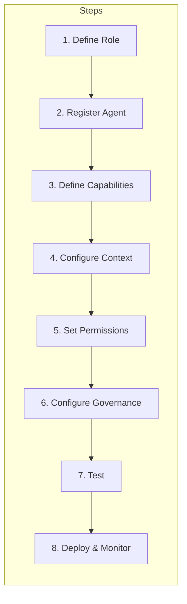
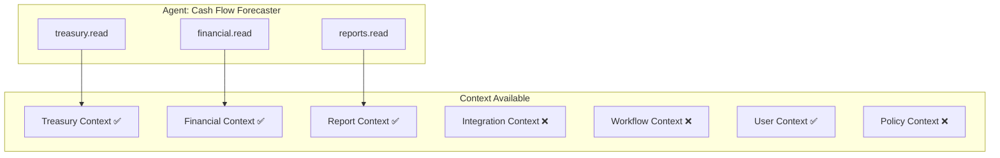
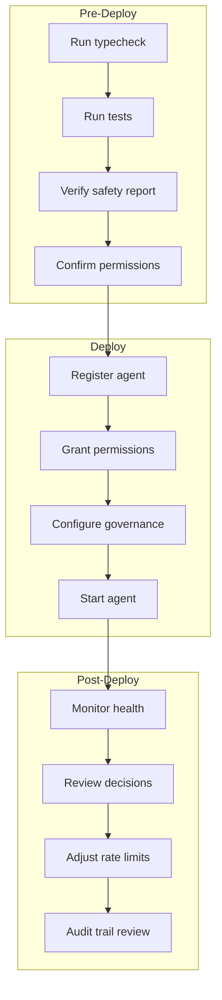
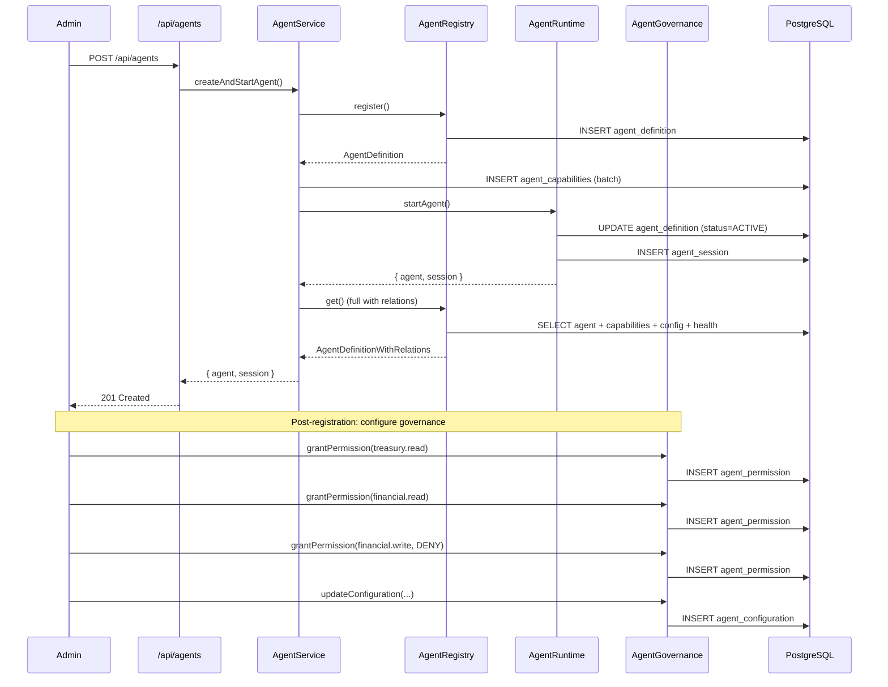

# Agent Framework Extension Guide

Step-by-step guide for implementing a new finance specialist agent in the Perionyx Agent Framework.

## Overview

This guide walks through creating a **Cash Flow Forecaster** agent — a treasury specialist that analyzes cash positions, predicts short-term liquidity, and recommends funding actions. The pattern applies to any new agent role.



---

## Prerequisites

- Access to the Perionyx codebase
- Understanding of the Agent Framework types (`src/modules/agent-framework/types.ts`)
- Prisma schema with the 14 agent models (already in `prisma/schema.prisma`)
- `TenantContext` available for all operations
- RBAC permission `agents.manage` for write operations

---

## Step 1: Define the Agent Role

Add the new role to the `AgentRole` type union in `src/modules/agent-framework/types.ts`:

```typescript
export type AgentRole =
  | "cfo_advisor"
  | "treasury_specialist"
  | "controller"
  | "audit"
  | "compliance"
  | "fp_and_a"
  | "cash_flow_forecaster"  // ← new role
  | "custom";
```

**Decision matrix for role selection:**

| Role | Primary Focus | Risk Tolerance | Typical Capabilities |
|---|---|---|---|
| `cfo_advisor` | Strategic financial guidance | MEDIUM | analysis, recommendation |
| `treasury_specialist` | Cash and liquidity management | HIGH | analysis, execution, monitoring |
| `controller` | Financial reporting and compliance | LOW | analysis, reporting |
| `audit` | Internal controls and risk assessment | LOW | investigation, monitoring, reporting |
| `compliance` | Regulatory and policy adherence | LOW | monitoring, reporting |
| `fp_and_a` | Financial planning and analysis | MEDIUM | analysis, recommendation, reporting |
| `cash_flow_forecaster` | Short-term liquidity prediction | MEDIUM | analysis, recommendation, monitoring |
| `custom` | Any specialized role | Varies | Any |

---

## Step 2: Register the Agent

Use the `AgentService.createAndStartAgent()` method or the `POST /api/agents` endpoint.

### Via API

```bash
curl -X POST /api/agents \
  -H "Content-Type: application/json" \
  -d '{
    "name": "Cash Flow Forecaster",
    "description": "Analyzes cash positions and predicts 7-day liquidity",
    "role": "cash_flow_forecaster",
    "version": "1.0.0",
    "capabilities": [
      {
        "name": "cash_flow_analysis",
        "description": "Analyze current cash positions across all institutions",
        "capabilityType": "analysis",
        "inputSchema": {
          "type": "object",
          "properties": {
            "horizonDays": { "type": "integer", "default": 7 },
            "includeForecast": { "type": "boolean", "default": true }
          }
        },
        "outputSchema": {
          "type": "object",
          "properties": {
            "currentCash": { "type": "number" },
            "projectedCash": { "type": "number" },
            "gap": { "type": "number" },
            "recommendation": { "type": "string" }
          }
        },
        "requiredPermissions": ["treasury.read", "financial.read"],
        "requiredEvidence": ["treasury", "ledger"],
        "confidence": 0.85,
        "riskLevel": "MEDIUM",
        "requiresApproval": false
      },
      {
        "name": "funding_recommendation",
        "description": "Recommend funding actions when liquidity gap detected",
        "capabilityType": "recommendation",
        "requiredPermissions": ["treasury.read", "treasury.execute"],
        "requiredEvidence": ["treasury", "ledger", "report"],
        "confidence": 0.8,
        "riskLevel": "HIGH",
        "requiresApproval": true
      },
      {
        "name": "liquidity_monitoring",
        "description": "Continuously monitor liquidity thresholds and alert",
        "capabilityType": "monitoring",
        "requiredPermissions": ["treasury.read"],
        "requiredEvidence": ["treasury"],
        "confidence": 0.95,
        "riskLevel": "LOW",
        "requiresApproval": false
      }
    ],
    "config": {
      "monitoringIntervalMs": 300000,
      "alertThresholdPct": 0.2,
      "forecastHorizonDays": 7
    }
  }'
```

### Via Module Code

```typescript
import { AgentService } from "@/modules/agent-framework";

const { agent, session } = await AgentService.createAndStartAgent(ctx, {
  name: "Cash Flow Forecaster",
  description: "Analyzes cash positions and predicts 7-day liquidity",
  role: "cash_flow_forecaster",
  capabilities: [
    {
      name: "cash_flow_analysis",
      capabilityType: "analysis",
      requiredPermissions: ["treasury.read", "financial.read"],
      requiredEvidence: ["treasury", "ledger"],
      confidence: 0.85,
      riskLevel: "MEDIUM",
      requiresApproval: false,
    },
  ],
});
```

---

## Step 3: Define Capabilities

Each capability needs clear input/output schemas, permissions, evidence requirements, and risk classification.

### Capability Design Principles

1. **Single responsibility** — One capability does one thing well
2. **Explicit evidence** — List every source system the capability needs
3. **Honest confidence** — Set confidence based on data quality and model accuracy
4. **Risk-appropriate approval** — LOW/MEDIUM can run autonomously; HIGH/CRITICAL need approval

### Evidence Requirements by Capability Type

| Capability Type | Typical Evidence Sources | Typical Risk |
|---|---|---|
| `analysis` | ledger, treasury, report | LOW–MEDIUM |
| `recommendation` | ledger, treasury, report, policy | MEDIUM–HIGH |
| `execution` | ledger, treasury, integration | HIGH–CRITICAL |
| `monitoring` | treasury, integration | LOW |
| `reporting` | ledger, treasury, report | LOW–MEDIUM |
| `investigation` | ledger, audit, document, integration | MEDIUM |

---

## Step 4: Configure Context Requirements

The `AgentContextEngine` builds a context bundle from 9 sources. Configure which sources your agent needs via permissions.

### Permission-Based Context Access



The context engine automatically filters out domains where the agent lacks `*.read` permission:

```typescript
// Without treasury.read permission, context.treasury = { cashPositions: [], ... }
// With treasury.read permission, context.treasury = { cashPositions: [...], ... }
```

### Context Source Details

| Source | Data Included | Filtered By |
|---|---|---|
| Financial | Ledger summary, recent transactions, wallets | `financial.read` |
| Treasury | Cash positions, liquidity positions, recent movements | `treasury.read` |
| Reports | Recent report executions, KPIs | `reports.read` |
| Integrations | Connector status, recent sync runs | `integrations.read` |
| Workflows | Active workflow instances, pending approvals | `workflows.read` |
| User | Membership role, permissions, preferences | Always available |
| Policies | Active policies, recent violations, compliance score | `policies.read` |

---

## Step 5: Set Permissions

Grant the agent explicit permissions via `AgentGovernance.grantPermission()` or the governance module.

### Permission Design

```typescript
import { AgentGovernance } from "@/modules/agent-framework";

// Grant read access to treasury and financial data
await AgentGovernance.grantPermission(ctx, agentId, {
  permission: "treasury.read",
  effect: "ALLOW",
  reason: "Agent needs treasury data for cash flow analysis",
  grantedBy: ctx.userId,
});

await AgentGovernance.grantPermission(ctx, agentId, {
  permission: "financial.read",
  effect: "ALLOW",
  reason: "Agent needs ledger data for cash flow analysis",
  grantedBy: ctx.userId,
});

// Grant read access to reports (with expiry — review in 90 days)
await AgentGovernance.grantPermission(ctx, agentId, {
  permission: "reports.read",
  effect: "ALLOW",
  reason: "Agent needs KPI data for trend analysis",
  grantedBy: ctx.userId,
  expiresAt: new Date(Date.now() + 90 * 24 * 60 * 60 * 1000),
});

// Explicitly deny write access to ledger (safety)
await AgentGovernance.grantPermission(ctx, agentId, {
  permission: "financial.write",
  effect: "DENY",
  reason: "Analysis agent must not modify ledger entries",
  grantedBy: ctx.userId,
});
```

### Permission Patterns

| Pattern | Matches | Example |
|---|---|---|
| `treasury.read` | Exact match | Only `treasury.read` |
| `treasury.*` | All treasury actions | `treasury.read`, `treasury.write`, `treasury.execute` |
| `*.read` | All read actions | Any `*.read` permission |

---

## Step 6: Configure Governance

Set operational constraints via `AgentGovernance.updateConfiguration()`.

```typescript
await AgentGovernance.updateConfiguration(ctx, agentId, {
  // Execution limits
  maxConcurrentTasks: 3,
  taskTimeout: 180_000, // 3 minutes
  maxRetries: 2,
  rateLimitPerMinute: 30,

  // Action policies
  allowedActions: [
    "treasury.read",
    "financial.read",
    "reports.read",
    "treasury.analyze",
    "treasury.forecast",
  ],
  forbiddenActions: [
    "financial.write",
    "treasury.execute",
    "ledger.post",
    "approval.auto_approve",
  ],

  // Escalation rules
  escalationRules: {
    liquidityGapThresholdPct: 0.15,
    escalateToRole: "treasury_specialist",
    maxAutoEscalations: 2,
  },

  // Safety policies
  safetyPolicies: {
    requireHumanApprovalAbove: 1_000_000,
    maxConsecutiveFailures: 3,
    cooldownAfterFailureMs: 300_000,
  },

  // Notifications
  notificationPrefs: {
    onDecisionCreated: true,
    onApprovalRequired: true,
    onFailure: true,
    channels: ["email", "slack"],
  },
});
```

### Configuration Reference

| Field | Default | Purpose |
|---|---|---|
| `maxConcurrentTasks` | 5 | Max parallel task executions |
| `taskTimeout` | 300,000ms (5 min) | Per-task timeout |
| `maxRetries` | 3 | Retry count on failure |
| `rateLimitPerMinute` | 60 | Max operations per minute |
| `allowedActions` | [] (allow all) | Whitelist of allowed action patterns |
| `forbiddenActions` | [] (forbid none) | Blacklist of forbidden action patterns |
| `escalationRules` | {} | When/how to escalate to humans or other agents |
| `safetyPolicies` | {} | Safety constraints and thresholds |
| `notificationPrefs` | {} | Notification channels and triggers |

---

## Step 7: Test the Agent

### 7a. Health Check

```bash
curl GET /api/agents/{id}/health
```

Response:
```json
{
  "agentId": "clx...",
  "safetyReport": {
    "agentId": "clx...",
    "agentName": "Cash Flow Forecaster",
    "permissions": { "total": 3, "allowed": 2, "denied": 1, "expired": 0 },
    "configuration": {
      "maxConcurrentTasks": 3,
      "taskTimeout": 180000,
      "rateLimitPerMinute": 30,
      "allowedActionsCount": 5,
      "forbiddenActionsCount": 4
    },
    "violations": { "totalViolations": 0, "recentViolations": 0 },
    "rateLimits": { "hitsInLastMinute": 0, "isLimited": false, "limit": 30 },
    "overallStatus": "HEALTHY"
  },
  "stats": {
    "tasks": { "totalAgents": 3, "activeAgents": 2, "tasksPending": 0, "tasksRunning": 1, "tasksCompleted": 5, "tasksFailed": 0, "decisionsPending": 0 },
    "decisions": { "total": 2, "approved": 1, "rejected": 0, "pending": 1, "executed": 0, "expired": 0 },
    "memory": { "total": 8, "byType": { "long_term": 3, "short_term": 5 }, "averageImportance": 0.62, "expiredCount": 0 },
    "evidence": { "totalEvidence": 12, "verifiedCount": 10, "unverifiedCount": 2, "bySourceType": { "treasury": 7, "ledger": 5 }, "avgConfidence": 0.87, "avgRelevance": 0.91 }
  }
}
```

### 7b. Execute a Capability

```bash
curl -X POST /api/agents/{id}/tasks \
  -H "Content-Type: application/json" \
  -d '{
    "name": "Q3 cash flow analysis",
    "taskType": "analysis",
    "priority": 75,
    "input": { "horizonDays": 7, "includeForecast": true }
  }'
```

### 7c. Verify Context Access

```typescript
import { AgentContextEngine } from "@/modules/agent-framework";

const context = await AgentContextEngine.getContext(ctx, agentId);

// Verify treasury data is available
console.log(context.treasury.cashPositions.length); // Should be > 0

// Verify financial data is available
console.log(context.financial.ledgerSummary.entryCount); // Should be > 0

// Verify permission-filtered context
const filtered = await AgentContextEngine.filterContextByPermissions(ctx, agentId, context);
```

### 7d. Verify Permission Checks

```typescript
import { AgentGovernance } from "@/modules/agent-framework";

const result = await AgentGovernance.checkPermission(ctx, agentId, "treasury.read");
console.log(result); // { allowed: true, effect: "ALLOW" }

const denied = await AgentGovernance.checkPermission(ctx, agentId, "financial.write");
console.log(denied); // { allowed: false, effect: "DENY" }

const actionCheck = await AgentGovernance.validateAction(ctx, agentId, "treasury.analyze");
console.log(actionCheck); // { allowed: true, reason: "Action is permitted" }

const forbidden = await AgentGovernance.validateAction(ctx, agentId, "ledger.post");
console.log(forbidden); // { allowed: false, reason: "Action "ledger.post" matches forbidden pattern "ledger.post"" }
```

### 7e. Rate Limit Check

```typescript
const rateLimit = await AgentGovernance.checkRateLimit(ctx, agentId);
console.log(rateLimit);
// { allowed: true, remaining: 29, limit: 30, resetAt: Date }
```

---

## Step 8: Deploy and Monitor

### Deployment Checklist



### Monitoring Commands

```bash
# Check agent health
curl GET /api/agents/{id}/health

# List recent tasks
curl GET /api/agents/{id}/tasks?status=RUNNING

# Review pending decisions
curl GET /api/agents/{id}/decisions?status=PENDING

# Check memory usage
curl GET /api/agents/{id}/memory?memoryType=long_term
```

### Key Metrics to Watch

| Metric | Healthy Range | Action if Outside |
|---|---|---|
| Safety report status | HEALTHY | Investigate if WARNING; halt if CRITICAL |
| Rate limit remaining | > 10 | Increase limit or reduce task frequency |
| Violation count (24h) | 0 | Review permissions and forbidden actions |
| Decision approval rate | > 80% | Review confidence thresholds |
| Task failure rate | < 5% | Check capability input validation |
| Memory expired count | < 100 | Run cleanup or extend TTLs |
| Evidence verification rate | > 90% | Investigate source system reliability |

---

## Complete Agent Registration Flow



---

## Quick Reference: Agent Lifecycle

| Action | API | Module Method | Required Permission |
|---|---|---|---|
| Create agent | `POST /api/agents` | `AgentService.createAndStartAgent()` | `agents.manage` |
| List agents | `GET /api/agents` | `AgentRegistry.list()` | Session auth |
| Get agent | `GET /api/agents/[id]` | `AgentRegistry.get()` | Session auth |
| Update agent | `PUT /api/agents/[id]` | `AgentRegistry.update()` | `agents.manage` |
| Disable agent | `DELETE /api/agents/[id]` | `AgentRegistry.disable()` | `agents.manage` |
| Start agent | `POST /api/agents/[id]/start` | `AgentRuntime.startAgent()` | `agents.manage` |
| Stop agent | `POST /api/agents/[id]/stop` | `AgentRuntime.stopAgent()` | `agents.manage` |
| Create task | `POST /api/agents/[id]/tasks` | `AgentRuntime.executeTask()` | `agents.manage` |
| List tasks | `GET /api/agents/[id]/tasks` | Prisma query | Session auth |
| Create decision | `POST /api/agents/[id]/decisions` | `DecisionEngine.create()` | `agents.manage` |
| List decisions | `GET /api/agents/[id]/decisions` | `DecisionEngine.list()` | Session auth |
| Store memory | `POST /api/agents/[id]/memory` | `AgentMemory.store()` | `agents.manage` |
| Search memory | `GET /api/agents/[id]/memory` | `AgentMemory.search()` | Session auth |
| Health check | `GET /api/agents/[id]/health` | `AgentGovernance.getSafetyReport()` | Session auth |

---

## File Locations

| What | Where |
|---|---|
| Type definitions | `src/modules/agent-framework/types.ts` |
| Agent registry | `src/modules/agent-framework/agent-registry.ts` |
| Agent runtime | `src/modules/agent-framework/agent-runtime.ts` |
| Context engine | `src/modules/agent-framework/agent-context.ts` |
| Memory store | `src/modules/agent-framework/agent-memory.ts` |
| Evidence engine | `src/modules/agent-framework/evidence-engine.ts` |
| Decision engine | `src/modules/agent-framework/decision-engine.ts` |
| Approval integration | `src/modules/agent-framework/approval-integration.ts` |
| Collaboration framework | `src/modules/agent-framework/collaboration-framework.ts` |
| Human interaction | `src/modules/agent-framework/human-interaction.ts` |
| Agent governance | `src/modules/agent-framework/agent-governance.ts` |
| Facade service | `src/modules/agent-framework/agent-service.ts` |
| Barrel export | `src/modules/agent-framework/index.ts` |
| Zod validations | `src/lib/validations/agent-framework.ts` |
| API routes | `src/app/api/agents/` (8 route files) |
| Prisma schema | `prisma/schema.prisma` (lines 4557–4943) |
