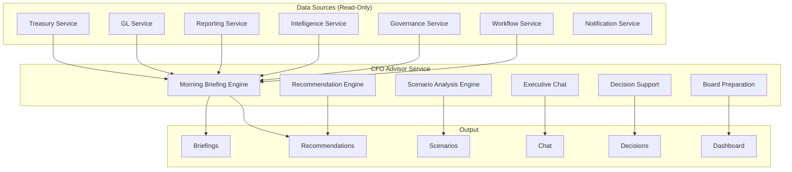

# CFO Advisor — Architecture

## Executive Summary

The CFO Advisor is the first production autonomous finance specialist built on the Enterprise Autonomous Finance Framework (Phase 13.0). It consumes deterministic financial information and provides executive-level analysis, recommendations, planning support, and decision assistance.

The CFO Advisor does **not** perform accounting. It never posts journals, approves payments, modifies the ledger, or overrides policies. All high-risk actions go through the existing approval engine.

## Core Principles

1. Financial facts always originate from deterministic systems
2. AI may explain, summarize, recommend, investigate, orchestrate, and assist
3. AI must never become the system of financial record
4. Every recommendation must reference supporting evidence
5. Every action must be fully auditable
6. High-risk financial actions require human approval
7. Agents operate within role-specific permissions

## Architecture Overview

## Components

### Morning Briefing Engine

Generates daily executive briefings with 14 sections:

| Section | Data Source | Description |
|---------|------------|-------------|
| Cash Position | Treasury | Current balances across all accounts |
| Liquidity | Treasury | Liquidity ratios and coverage |
| Working Capital | GL + Treasury | Current assets vs liabilities |
| Revenue Trends | GL | Revenue vs prior periods |
| Expense Trends | GL | Expense analysis and variance |
| Treasury Health | Treasury | Overall treasury metrics |
| Financial Integrity | GL + Governance | Ledger balance, unreconciled items |
| Close Readiness | GL | Period close status and blockers |
| Compliance Health | Governance | Policy compliance score |
| Operational Risks | Intelligence | Active risk alerts |
| Significant Anomalies | Intelligence | Anomaly detection results |
| Critical Alerts | Intelligence | High-severity alerts |
| Open Approvals | Workflow | Pending executive approvals |
| Recommended Actions | Service | AI-generated recommendations |

### Recommendation Engine

Generates structured recommendations with:

- **Title** — Clear, actionable title
- **Executive Summary** — 2-3 sentence summary
- **Business Reason** — Why this matters
- **Financial Impact** — Quantified impact where possible
- **Supporting Evidence** — References to source data
- **Confidence** — 0-1 confidence score
- **Risk Level** — LOW / MEDIUM / HIGH / CRITICAL
- **Required Approvals** — What approvals are needed
- **Suggested Next Steps** — Actionable follow-up

### Scenario Analysis Engine

Supports deterministic scenario planning:

| Scenario Type | Parameters |
|---------------|-----------|
| Revenue Decline | percentage, period |
| Revenue Growth | percentage, period |
| Payroll Increase | percentage, affected departments |
| Hiring Freeze | duration, affected departments |
| Customer Default | customer, amount |
| FX Movement | currency, percentage |
| Interest Rate | rate change, duration |
| Tax Increase | tax type, percentage |
| Acquisition | target, valuation |
| CapEx | category, amount |

### Executive Chat

Context-aware conversation interface supporting:
- Follow-up questions with context retention
- Historical comparisons
- Drill-down into supporting reports
- Recommendation explanations
- Evidence references
- Workflow history references
- Audit trail references

### Decision Support

Structured decision objects containing:
- Recommendation and reasoning
- Evidence references
- Alternatives considered
- Financial impact assessment
- Risk evaluation
- Required approvals
- Approval status tracking

### Board Preparation

Assists with quarterly board materials:
- Financial highlights generation
- Executive commentary
- Strategic risk identification
- Growth opportunity analysis
- Capital allocation recommendations
- Cash strategy summaries

## Data Model

11 Prisma models:

| Model | Purpose | Key Indexes |
|-------|---------|-------------|
| ExecutiveBriefing | Morning briefings | companyId+date+period (unique) |
| ExecutiveRecommendation | AI recommendations | companyId+category, status, priority |
| ScenarioAnalysis | Scenario definitions | companyId+scenarioType, status |
| ScenarioExecution | Scenario runs | companyId+scenarioId, status |
| ExecutiveConversation | Chat conversations | companyId+userId, status |
| ExecutiveMessage | Chat messages | companyId+conversationId, role |
| ExecutiveInsight | System insights | companyId+insightType, severity |
| ExecutivePriority | Executive priorities | companyId+urgency, status |
| ExecutiveDecision | Decision tracking | companyId+decisionType, status |
| ExecutiveWorkspacePreference | User prefs | companyId (unique), userId (unique) |
| ExecutiveBoardPack | Board materials | companyId+period+year (unique) |

## API Design

13 endpoints across 8 route groups:

| Endpoint | Methods | Description |
|----------|---------|-------------|
| `/api/cfo/briefing` | GET, POST | Briefing list and generation |
| `/api/cfo/briefing/[id]` | GET | Briefing detail |
| `/api/cfo/recommendations` | GET, POST | Recommendations |
| `/api/cfo/recommendations/[id]` | PUT | Update recommendation status |
| `/api/cfo/scenarios` | GET, POST | Scenarios |
| `/api/cfo/scenarios/[id]` | GET | Scenario detail |
| `/api/cfo/chat` | GET, POST | Conversations |
| `/api/cfo/chat/[id]` | GET, POST | Messages |
| `/api/cfo/dashboard` | GET | Aggregated dashboard |
| `/api/cfo/decisions` | GET, POST | Decisions |
| `/api/cfo/decisions/[id]` | PUT | Approve/reject decision |
| `/api/cfo/workspace` | GET, PUT | Workspace preferences |

## Security Model

- **Tenant isolation** — Every query scoped by companyId
- **RBAC** — `cfo_advisor.read` and `cfo_advisor.manage` permissions
- **Audit trail** — Every action recorded via `recordAudit()`
- **No financial mutations** — Read-only consumption of financial data
- **Approval integration** — High-risk actions routed through existing approval engine

## Integration Points

| Integration | How Used |
|-------------|----------|
| Treasury Service | Cash positions, liquidity data |
| GL Service | Revenue, expenses, account balances |
| Reporting Service | Financial statements, KPIs |
| Intelligence Service | Anomalies, trends, scores |
| Governance Service | Compliance, policies, violations |
| Workflow Service | Approvals, active workflows |
| Notification Service | Briefing delivery, alerts |
| Agent Framework | Runtime, memory, evidence, decisions |
