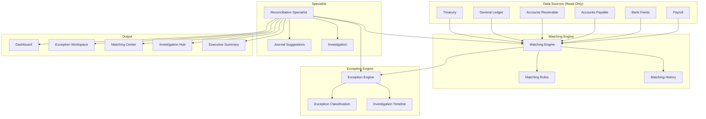

# Enterprise Reconciliation Platform — Architecture

## Executive Summary

The Enterprise Reconciliation Platform provides deterministic reconciliation across 12 reconciliation types with a configurable matching engine, exception classification, investigation tracking, and autonomous specialist capabilities.

The platform consumes financial data from existing deterministic systems (Treasury, GL, Subledger, AR, AP, etc.) and provides matching, exception management, and workflow assistance. All financial mutations remain under human control through the existing approval engine.

## Core Principles

1. Financial facts always originate from deterministic systems
2. Matching is deterministic and auditable
3. Every exception classification includes evidence
4. Every recommendation references supporting data
5. High-risk actions require human approval
6. The specialist never posts accounting entries
7. All operations are tenant-isolated

## Architecture Overview

## Components

### Matching Engine

Deterministic matching with configurable rules:

| Match Type | Description |
|------------|-------------|
| Exact Match | Same amount, same reference |
| Amount Match | Same amount, different reference |
| Reference Match | Same reference, different amount |
| Date Tolerance | Match within configurable days |
| Currency Tolerance | Match with FX variance |
| Percentage Tolerance | Match within percentage threshold |
| Many-to-One | Multiple source → one target |
| One-to-Many | One source → multiple targets |
| Many-to-Many | Group matching |
| Split Transactions | Transaction split across entries |
| Merged Transactions | Multiple entries merged |

### Exception Engine

Automatic classification of unmatched items:

| Exception Type | Detection Logic |
|----------------|-----------------|
| Timing Difference | Same amount, different dates (≤3 days) |
| FX Difference | Small variance (0.1-5%) |
| Bank Charges | Small amount with charge/fee reference |
| Interest | Interest/dividend reference |
| Duplicate Payment | Same reference, same day, zero variance |
| Missing Journal | Bank exists, no GL entry |
| Missing Bank Entry | GL exists, no bank transaction |
| Wrong Account | Same amount/date, different reference |
| Manual Adjustment | Adjustment reference |
| Data Import Error | Both amounts zero |
| Unknown | Default fallback |

### Investigation Engine

Complete investigation context including:
- Timeline of all actions
- Source and target transactions
- Journal entries
- Similar historical exceptions
- Supporting evidence
- Classification history

### Autonomous Specialist

Non-destructive recommendations:
- Journal drafts (adjustment, reclassification, accrual, write-off)
- Write-off recommendations
- Accrual recommendations
- Reclassification recommendations
- Escalation recommendations
- **Never posts entries automatically**

## Data Model

13 Prisma models:

| Model | Purpose | Key Indexes |
|-------|---------|-------------|
| ReconciliationCase | Case management | companyId+type, status, period |
| ReconException | Exception tracking | companyId+caseId, type, severity |
| MatchingRule | Rule configuration | companyId+name (unique), type |
| MatchingExecution | Execution history | companyId+caseId, status |
| MatchingSuggestion | Match suggestions | companyId+confidence, status |
| ReconciliationEvidence | Evidence storage | companyId+caseId, type |
| InvestigationTimeline | Action timeline | companyId+caseId, action |
| JournalSuggestion | Journal drafts | companyId+type, status |
| ReconciliationAssignment | Assignments | companyId+caseId, assignedTo |
| ReconciliationEscalation | Escalations | companyId+type, severity |
| ExceptionClassification | Classification history | companyId+exceptionId |
| MatchingHistory | Historical transactions | companyId+normalized* |
| RuleVersion | Rule versioning | ruleId+version (unique) |

## API Design

10 endpoint groups:

| Endpoint | Methods | Description |
|----------|---------|-------------|
| `/api/reconciliation/dashboard` | GET | Dashboard metrics |
| `/api/reconciliation/cases` | GET, POST | Case CRUD |
| `/api/reconciliation/cases/[id]` | GET | Case detail |
| `/api/reconciliation/exceptions` | GET, POST | Exception CRUD |
| `/api/reconciliation/exceptions/[id]` | GET, PUT | Exception detail/update |
| `/api/reconciliation/matching/run` | POST | Run matching engine |
| `/api/reconciliation/suggestions` | GET, POST | Suggestions |
| `/api/reconciliation/suggestions/[id]` | PUT | Accept/reject |
| `/api/reconciliation/assignments` | GET, POST | Assignments |
| `/api/reconciliation/escalations` | GET, POST | Escalations |
| `/api/reconciliation/rules` | GET, POST | Rule management |
| `/api/reconciliation/rules/[id]` | GET, PUT | Rule detail |
| `/api/reconciliation/history` | GET | Matching history |
| `/api/reconciliation/analytics` | GET | Analytics |

## Security Model

- **Tenant isolation** — Every query scoped by companyId
- **RBAC** — `reconciliation.run` and `reconciliation.manage` permissions
- **Audit trail** — Every action recorded via `recordAudit()`
- **No financial mutations** — Read-only consumption of financial data
- **Approval integration** — Journal suggestions routed through approval engine

## Integration Points

| Integration | How Used |
|-------------|----------|
| Treasury Service | Cash positions, bank transactions |
| GL Service | Journal entries, account balances |
| AR Service | Receivable transactions |
| AP Service | Payable transactions |
| Bank Feeds | Bank transactions, statements |
| Payroll Service | Payroll transactions |
| Workflow Service | Approvals, task assignment |
| Notification Service | Alerts, assignments |
| Agent Framework | Specialist runtime |
