# Enterprise Controller Specialist — Architecture

## Executive Summary

The Enterprise Controller Specialist is the second production autonomous finance specialist built on the Enterprise Autonomous Finance Framework (Phase 13.3). It provides Controllers and Finance Managers with close management, journal review, statement readiness tracking, accounting health monitoring, and actionable recommendations.

The Controller Specialist does **not** post journals, approve transactions, modify the ledger, or override policies. It reads from deterministic financial systems, evaluates accounting health, detects exceptions, and generates recommendations that route through the existing approval engine.

## Core Principles

1. **Never post journals** — The specialist reads GL data but never creates, modifies, or posts journal entries directly
2. **Never bypass approvals** — All financial actions route through the existing approval matrix
3. **Never fabricate facts** — Every data point originates from Prisma models populated by deterministic systems
4. **Always reference deterministic data** — Every recommendation and health score traces back to specific records
5. **Always auditable** — Every operation is tenant-isolated, logged, and traceable

## Architecture Overview

```mermaid
graph TB
    subgraph "Data Sources (Read-Only)"
        GL[General Ledger]
        TR[Treasury]
        AR[Accounts Receivable]
        AP[Accounts Payable]
        RC[Reconciliation Platform]
        GV[Governance Service]
    end

    subgraph "Controller Specialist Services"
        CM[Close Management]
        JR[Journal Review]
        SR[Statement Readiness]
        AH[Accounting Health]
        RE[Recommendations]
        FA[Facade — ControllerSpecialistService]
    end

    subgraph "Output"
        DB[Dashboard]
        BF[Briefings]
        CC[Close Command Center]
        SRD[Statement Readiness Dashboard]
        AHD[Accounting Health Dashboard]
        RCN[Recommendation Center]
        AX[Analytics]
    end

    GL --> CM
    GL --> JR
    GL --> SR
    GL --> AH
    RC --> SR
    GV --> AH

    FA --> CM
    FA --> JR
    FA --> SR
    FA --> AH
    FA --> RE

    FA --> DB
    FA --> BF
    FA --> CC
    FA --> SRD
    FA --> AHD
    FA --> RCN
    FA --> AX
```



## Components

### Close Management

Manages period-close lifecycle with task tracking, dependency resolution, forecasting, and milestone management.

| Capability | Description |
|------------|-------------|
| Close Period CRUD | Create, list, and query close periods (monthly/quarterly/yearly) |
| Task Management | Create, update, and track close tasks with dependency chains |
| Progress Calculation | Real-time progress with entity-level and department-level breakdowns |
| Close Calendar | Year-over-year close calendar with status and task statistics |
| Close Forecast | Three-scenario forecast (optimistic/expected/pessimistic) with confidence scores |
| Milestones | Named checkpoints with required-task gates and achievement tracking |

**Close Period States:** `OPEN` → `IN_PROGRESS` → `REVIEW` → `CLOSED` → `LOCKED`

**Close Task Categories:** `journal`, `reconciliation`, `approval`, `review`, `reporting`, `closing`, `document`

**Close Task States:** `PENDING` → `IN_PROGRESS` → `COMPLETED` | `BLOCKED` | `OVERDUE` | `SKIPPED`

### Journal Review

Evaluates journal entries for risk, flags anomalies, and tracks review status through its lifecycle.

| Capability | Description |
|------------|-------------|
| Review Lifecycle | Create, update, approve, reject, and flag journal reviews |
| Risk Assessment | Automated detection of 8 risk types across amount, timing, and pattern dimensions |
| Risk Summary | Aggregate risk distribution and average risk level across journal populations |
| Unusual Journals | Statistical outlier detection using mean + 2σ threshold |
| Duplicate Detection | Matching on amount, account code, and posting date |

**Journal Review States:** `PENDING` → `REVIEWED` → `APPROVED` | `REJECTED` | `FLAGGED`

**8 Journal Risk Types:**

| Risk Type | Detection Logic | Default Severity |
|-----------|----------------|-----------------|
| `unusual_amount` | Amount exceeds statistical threshold | HIGH |
| `duplicate` | Matching amount + account + date | HIGH |
| `late` | Posted >7 days after period | MEDIUM–HIGH |
| `large` | Absolute amount >100,000 | HIGH |
| `policy_violation` | Violates accounting policy | HIGH |
| `missing_support` | No supporting documents | MEDIUM |
| `unusual_timing` | Posted outside business hours | LOW |
| `round_amount` | Exact multiple of 1,000 | LOW |

### Statement Readiness

Evaluates whether financial statements are ready for generation by checking journal approval status, reconciliation completion, adjustment coverage, and risk exposure.

| Capability | Description |
|------------|-------------|
| Readiness Evaluation | Weighted composite score across 4 dimensions |
| Blocking Issue Detection | Identifies specific blockers preventing statement generation |
| Readiness Summary | Aggregate status across all statement types for a period |
| Readiness Trend | Historical readiness scores by period |
| Status Update | Mark statements as READY/GENERATED when blockers resolve |

**Readiness Score Formula:**

```
score = (reconciledAccounts / totalAccounts × 0.35)
      + (approvedJournals / totalJournals × 0.25)
      + (adjustmentScore × 0.20)
      + (reconciliationOutstandingScore × 0.20)
```

**Statement Readiness States:** `NOT_READY` → `PARTIAL` → `READY` → `GENERATED`

### Accounting Health

Monitors overall accounting health through integrity, journal quality, policy compliance, and exception tracking. Captures periodic snapshots for trend analysis.

| Capability | Description |
|------------|-------------|
| Health Snapshot | Composite health score from 4 weighted dimensions |
| Integrity Evaluation | Ledger consistency and posting completeness |
| Journal Quality | Flagged rate, high-risk rate, reconciliation completion |
| Policy Compliance | Policy violations, late journals, large journals |
| Exception Management | Create and query accounting exceptions |
| Health Trend | Historical health and risk scores over configurable periods |

**Health Score Formula:**

```
healthScore = (ledgerConsistency × 0.30)
            + (journalQuality × 0.25)
            + (policyCompliance × 0.25)
            + (postingCompleteness × 0.20)
```

**10 Accounting Exception Types:**

| Exception Type | Description |
|----------------|-------------|
| `journal_anomaly` | Statistical outlier in journal amount or pattern |
| `duplicate_posting` | Identical or near-identical journal entries |
| `late_journal` | Journal posted after period deadline |
| `large_journal` | Journal exceeding materiality threshold |
| `policy_violation` | Entry violates accounting policy |
| `missing_support` | Journal lacks supporting documentation |
| `suspense_account` | Balance remaining in suspense account |
| `unbalanced_entry` | Debit/credit imbalance detected |
| `missing_approval` | Journal posted without required approval |
| `reconciliation_gap` | Reconciliation not completed for account |

**Exception Severity Levels:** `LOW` | `MEDIUM` | `HIGH` | `CRITICAL`

**Exception Statuses:** `OPEN` → `INVESTIGATING` → `RESOLVED` | `ESCALATED` | `DISMISSED`

### Recommendations

Generates structured, prioritized recommendations across 7 categories with evidence, confidence scoring, and risk classification.

| Capability | Description |
|------------|-------------|
| Create Recommendations | Generate with category, evidence, confidence, risk level |
| Priority Scoring | Calculated from risk level × confidence × constant |
| Recommendation Summary | Aggregate by category, status, and risk level |
| Top Recommendations | Ranked by priority and confidence for executive consumption |
| Status Lifecycle | Track from open through acceptance/implementation |

**7 Recommendation Categories:** `close`, `journal`, `reconciliation`, `statement`, `governance`, `risk`, `efficiency`

**Recommendation Statuses:** `OPEN` → `ACCEPTED` → `IMPLEMENTED` | `REJECTED` | `EXPIRED`

### Investigation

Accounting exceptions are investigated through the `AccountingException` model, which tracks:

- Source system and reference linkage
- Amount and currency
- Explanation and evidence collections
- Assignment and resolution tracking
- Status progression through investigation lifecycle

## Reconciliation Types Supported

The Controller Specialist evaluates statement readiness accounting for all 12 reconciliation types managed by the Enterprise Reconciliation Platform:

| # | Reconciliation Type | Description |
|---|---------------------|-------------|
| 1 | `bank` | Bank statement vs GL cash accounts |
| 2 | `gl` | GL control account vs subledger |
| 3 | `subledger` | Subledger detail vs control account |
| 4 | `intercompany` | Intercompany balances across entities |
| 5 | `ar` | Accounts receivable aging vs GL |
| 6 | `ap` | Accounts payable aging vs GL |
| 7 | `fixed_asset` | Fixed asset register vs GL |
| 8 | `treasury` | Treasury positions vs GL |
| 9 | `payroll` | Payroll clearing vs GL |
| 10 | `tax` | Tax accounts vs tax filings |
| 11 | `multi_company` | Consolidation eliminations |
| 12 | `multi_currency` | FX revaluation across currencies |

## Statement Types Evaluated

10 financial statement types are evaluated for readiness before period close:

| # | Statement Type | Readiness Weight | Description |
|---|---------------|-----------------|-------------|
| 1 | `balance_sheet` | Full | Assets, liabilities, equity position |
| 2 | `income_statement` | Full | Revenue and expense performance |
| 3 | `cash_flow` | Full | Operating, investing, financing flows |
| 4 | `trial_balance` | Full | Debit/credit balance verification |
| 5 | `general_ledger` | Full | Complete account activity |
| 6 | `aged_receivables` | Standard | AR aging by bucket |
| 7 | `aged_payables` | Standard | AP aging by bucket |
| 8 | `equity_statement` | Full | Equity movements and reconciliation |
| 9 | `budget_vs_actual` | Standard | Variance analysis |
| 10 | `department_reports` | Standard | Departmental P&L and cost centers |

## Data Model

13 Prisma models:

| Model | Purpose | Key Indexes |
|-------|---------|-------------|
| `ControllerBriefing` | Daily/weekly controller briefings with 8 section types | companyId+briefingDate (unique), companyId+period, companyId+briefingType, companyId+status |
| `ClosePeriod` | Period-close lifecycle (monthly/quarterly/yearly) | companyId+period+closeType (unique), companyId+status, companyId+period |
| `CloseTask` | Individual close tasks with dependencies and assignments | companyId+closePeriodId, companyId+status, companyId+assignedTo, companyId+category |
| `CloseDependency` | Task dependency chains | companyId+closePeriodId, companyId+taskId |
| `CloseMilestone` | Named checkpoints with required-task gates | companyId+closePeriodId, companyId+status |
| `CloseForecast` | Three-scenario completion forecasts | companyId+closePeriodId |
| `JournalReview` | Journal entry review lifecycle | companyId+journalType, companyId+status, companyId+riskLevel, companyId+reviewerId, companyId+postingDate |
| `JournalRisk` | Individual risk flags per journal | companyId+journalReviewId, companyId+riskType, companyId+severity |
| `StatementReadiness` | Per-statement readiness evaluation | companyId+period+statementType (unique), companyId+period, companyId+status, companyId+readinessScore |
| `AccountingHealthSnapshot` | Periodic health score snapshots | companyId+snapshotDate (unique), companyId+period, companyId+healthScore |
| `AccountingRecommendation` | Actionable recommendations with priority | companyId+category, companyId+status, companyId+riskLevel, companyId+priority |
| `AccountingException` | Accounting exceptions and investigations | companyId+exceptionType, companyId+severity, companyId+status, companyId+assignedTo, companyId+referenceId |
| `ControllerWorkspacePreference` | User workspace layout preferences | companyId (unique), userId (unique) |

## API Design

18 endpoints:

| Endpoint | Methods | Description |
|----------|---------|-------------|
| `/api/controller/dashboard` | GET | Controller dashboard with health, close progress, risks, briefings |
| `/api/controller/briefings` | GET, POST | List briefings / Generate daily briefing |
| `/api/controller/briefings/[id]` | GET | Briefing detail |
| `/api/controller/close` | GET, POST | List close periods / Create close period with tasks |
| `/api/controller/close/[id]` | GET | Close period detail with tasks, dependencies, milestones, forecasts |
| `/api/controller/close/[id]/tasks/[taskId]` | PUT | Update close task status, assignment, blocked reason |
| `/api/controller/close/calendar` | GET | Close calendar for a year |
| `/api/controller/journals` | GET, POST | List journal reviews / Create journal review |
| `/api/controller/journals/[id]` | GET, PUT | Journal review detail / Update status, reviewer, risk level |
| `/api/controller/journals/[id]/flag` | POST | Flag journal with specific risk type |
| `/api/controller/statements` | GET | Statement readiness summary for period |
| `/api/controller/statements/[type]` | GET, PUT | Evaluate / Update statement readiness |
| `/api/controller/health` | GET | Latest accounting health snapshot |
| `/api/controller/health/snapshot` | POST | Capture new health snapshot for period |
| `/api/controller/exceptions` | GET, POST | List accounting exceptions / Create exception |
| `/api/controller/recommendations` | GET, POST | List recommendations / Create recommendation |
| `/api/controller/recommendations/[id]` | PUT | Update recommendation status, assignment |
| `/api/controller/analytics` | GET | Analytics with journal summary, health trend, readiness trend, exceptions |

## Security Model

| Control | Implementation |
|---------|---------------|
| **Tenant isolation** | Every query scoped by `companyId` via `requireTenantContext()` |
| **RBAC** | Controller endpoints require authenticated session with active company |
| **Audit trail** | All mutations logged via Prisma timestamps (createdAt, updatedAt) |
| **No financial mutations** | Specialist reads GL/reconciliation data but never posts entries or modifies financial records |
| **Approval integration** | Recommendations requiring financial action route through existing approval matrix |
| **Input validation** | All endpoints validate request body via `parseJsonBody()` and query params via URL parsing |
| **Cache control** | GET endpoints use `cacheHeaders()` with 15–60 second TTLs based on data volatility |
| **Error handling** | All routes wrapped in `handleRouteError()` for consistent error responses |

## Integration Points

| Integration | How Used |
|-------------|----------|
| **General Ledger** | Journal entries, account balances, posting status for readiness evaluation |
| **Treasury** | Cash positions and treasury reconciliation data for health scoring |
| **Reconciliation Platform** | Reconciliation case status and completion rates for statement readiness weights |
| **Governance Service** | Policy compliance data for health evaluation and violation detection |
| **Workflow Engine** | Task assignment and approval routing for close tasks and recommendations |
| **Reporting Service** | Statement generation targets and template configuration |
| **Intelligence Service** | Anomaly detection signals feeding journal risk assessment |
| **Agent Framework** | Specialist runtime, context engine, and collaboration with other specialists |

## Collaboration with Other Specialists

### CFO Advisor

- Controller Specialist provides close progress, health scores, and exception summaries to the CFO Advisor's morning briefing
- CFO Advisor elevates critical controller recommendations to executive briefings
- Shared health score vocabulary ensures consistent reporting across specialist outputs

### Reconciliation Specialist

- Statement Readiness reads reconciliation completion rates to calculate readiness scores
- Reconciliation exceptions feed into accounting exception tracking
- Close tasks referencing reconciliation categories are updated by reconciliation specialist progress

### Treasury Specialist

- Treasury reconciliation status affects `treasury` reconciliation type readiness
- Cash position data contributes to balance sheet readiness evaluation
- FX revaluation status affects `multi_currency` reconciliation readiness

### Audit Specialist

- Controller briefings provide audit-ready documentation of close progress
- Exception investigation timelines feed into audit evidence collections
- Journal risk assessments provide audit sampling inputs

### Compliance Specialist

- Policy compliance scores from `AccountingHealthService` feed into compliance dashboards
- Policy violations detected in journal reviews flow to compliance violation tracking
- Exception severity and status tracking supports regulatory reporting requirements

## File Structure

```
src/modules/controller-specialist/
  types.ts                    — 308 lines, 17 type unions, 10 input types, 7 interfaces
  close-management.ts         — 590 lines, 8 methods (periods, tasks, progress, calendar, forecast, milestones)
  journal-review.ts           — 519 lines, 6 methods (CRUD, risk assessment, summary, unusual detection)
  statement-readiness.ts      — 414 lines, 6 methods (evaluate, summary, blocking issues, update, trend)
  accounting-health.ts        — 414 lines, 7 methods (snapshot, latest, trend, integrity, quality, compliance, exceptions)
  recommendations.ts          — 212 lines, 5 methods (CRUD, summary, top)
  controller-specialist.ts    — 659 lines, facade with 8 public methods (dashboard, briefing, command center, health dashboard, recommendation center, analytics)
  index.ts                    — barrel export

src/app/api/controller/
  dashboard/route.ts          — GET
  briefings/route.ts          — GET, POST
  briefings/[id]/route.ts     — GET
  close/route.ts              — GET, POST
  close/[id]/route.ts         — GET
  close/[id]/tasks/[taskId]/route.ts — PUT
  close/calendar/route.ts     — GET
  journals/route.ts           — GET, POST
  journals/[id]/route.ts      — GET, PUT
  journals/[id]/flag/route.ts — POST
  statements/route.ts         — GET
  statements/[type]/route.ts  — GET, PUT
  health/route.ts             — GET
  health/snapshot/route.ts    — POST
  exceptions/route.ts         — GET, POST
  recommendations/route.ts    — GET, POST
  recommendations/[id]/route.ts — PUT
  analytics/route.ts          — GET
```
