# Enterprise Treasury Specialist — Architecture

## Executive Summary

The Enterprise Treasury Specialist is the third production autonomous finance specialist built on the Enterprise Autonomous Finance Framework (Phase 13.4). It provides Treasurers, Finance Managers, and Cash Managers with comprehensive treasury intelligence across cash position management, liquidity forecasting, FX exposure analysis, bank relationship management, debt oversight, investment portfolio monitoring, and treasury risk management.

The Treasury Specialist does **not** execute payments, transfer funds, book trades, modify bank connections, or override treasury policies. It reads from deterministic financial systems, evaluates treasury health, detects risks, and generates recommendations that route through the existing approval engine.

## Core Principles

1. **Deterministic accounting** — All financial facts originate from Prisma models populated by deterministic systems; the specialist never fabricates balances, positions, or valuations
2. **Never fabricate financial facts** — Every data point traces back to specific records in `TreasuryCashPosition`, `TreasuryFXExposure`, `DebtInstrument`, `InvestmentHolding`, and related models
3. **Evidence-backed recommendations** — Every recommendation includes `supportingEvidence` referencing specific records, analyses, and risk assessments
4. **Human oversight** — High-risk treasury actions (fund transfers, FX trades, debt refinancing) route through the existing approval engine
5. **Auditability** — Every operation is tenant-isolated, logged via Prisma timestamps, and traceable through alert and briefing history

## Architecture Overview

```mermaid
graph TB
    subgraph "Data Sources (Read-Only)"
        CP[Treasury Cash Positions]
        LP[Treasury Liquidity Positions]
        FX[Treasury FX Exposures]
        BK[Bank Relationships]
        DI[Debt Instruments]
        IH[Investment Holdings]
        TR[Treasury Risks]
        GL[General Ledger]
        WF[Workflow Service]
        NF[Notification Service]
    end

    subgraph "Treasury Specialist Services"
        CSH[Cash Position Management]
        LQD[Liquidity Management]
        FXC[FX Exposure Management]
        BNK[Bank Relationship Management]
        DBT[Debt Management]
        INV[Investment Management]
        RSK[Treasury Risk Management]
        INS[Treasury Insights & Briefings]
        REC[Recommendations]
        FA[Facade — TreasurySpecialistService]
    end

    subgraph "Output"
        DB[Dashboard]
        CCC[Cash Command Center]
        LC[Liquidity Center]
        FC[Forecast Center]
        FXC2[FX Center]
        BO[Bank Operations]
        DM[Debt Management]
        IP[Investment Portfolio]
        RC[Risk Center]
        BF[Briefings]
        AN[Analytics]
        AL[Alerts]
    end

    CP --> CSH
    LP --> LQD
    FX --> FXC
    BK --> BNK
    DI --> DBT
    IH --> INV
    TR --> RSK
    GL --> LQD
    GL --> DBT

    FA --> CSH
    FA --> LQD
    FA --> FXC
    FA --> BNK
    FA --> DBT
    FA --> INV
    FA --> RSK
    FA --> INS
    FA --> REC

    FA --> DB
    FA --> CCC
    FA --> LC
    FA --> FC
    FA --> FXC2
    FA --> BO
    FA --> DM
    FA --> IP
    FA --> RC
    FA --> BF
    FA --> AN
    FA --> AL
```



## Components

### Cash Position Management

Global cash visibility across all legal entities, banks, currencies, and regions with concentration analysis and health scoring.

| Capability | Description |
|------------|-------------|
| Global Cash Position | Aggregate total, available, restricted, and in-transit funds across all accounts |
| Cash by Company | Breakdown by legal entity |
| Cash by Bank | Breakdown by financial institution |
| Cash by Currency | Breakdown by currency |
| Cash by Region | Breakdown by geographic region |
| Concentration Analysis | Herfindahl-Hirschman Index (HHI) for regional concentration |
| Restricted Cash | Unreleased restricted cash with release tracking |
| In-Transit Funds | Active cash movements with `in_transit` status |
| Cash Snapshots | Point-in-time snapshots for historical tracking |

**Cash Classifications:** `operating` | `restricted` | `in_transit` | `sweep` | `reserve`

**Cash Regions:** `north_america` | `europe` | `asia_pacific` | `latin_america` | `middle_east` | `africa`

**Health Score Formula:**

```
healthScore = availableRatio - (restrictionRatio × 0.3) - (transitRatio × 0.1)
```

Where `availableRatio = availableCash / totalCash`, clamped to [0, 1].

### Liquidity Management

Liquidity position tracking, burn rate calculation, runway forecasting, and multi-scenario liquidity analysis.

| Capability | Description |
|------------|-------------|
| Liquidity Position | Current liquidity from `TreasuryLiquidityPosition` + `TreasuryWorkingCapital` |
| Burn Rate | Average daily outflows over configurable window (default 30 days) |
| Days of Runway | `currentLiquidity / burnRate` |
| Working Capital | Net working capital from latest calculation |
| Liquidity Forecast | Multi-horizon forecasts with scenario support |
| Liquidity Score | Composite score from 4 signals: working capital ratio, runway, burn rate ratio, forecast score |
| Risk Score | Inverse liquidity health blended with existing risk signal |

**Liquidity Horizons:** `daily` | `weekly` | `monthly` | `quarterly` | `annual`

**Scenario Types:** `best` | `expected` | `worst` | `custom`

**Liquidity Score Signals:**

| Signal | High Score (0.8–0.9) | Medium Score (0.4–0.7) | Low Score (0.1–0.3) |
|--------|---------------------|----------------------|---------------------|
| Working capital | Positive | Zero | Negative |
| Days of runway | >90 | 30–90 | <30 |
| Burn/liquidity ratio | >60 | 7–60 | <7 |
| Forecast score | Latest forecast score | — | — |

### Cash Forecasting

Multi-horizon liquidity forecasts derived from `TreasuryCashForecast` data with scenario modeling and confidence scoring.

| Capability | Description |
|------------|-------------|
| Forecast Generation | Creates forecasts from recent `TreasuryCashForecast` records |
| Scenario Modeling | Best (+15%), Expected, Worst (-15%) scenarios |
| Confidence Scoring | 0.5 base + 0.05 per historical forecast (max ~0.75) |
| Forecast Comparison | Latest forecast vs historical averages |

### Bank Relationship Management

Bank relationship oversight with health monitoring, connection status tracking, and balance aggregation.

| Capability | Description |
|------------|-------------|
| Relationship Listing | All bank relationships with health checks |
| Total Balance | Aggregate balance across all bank relationships |
| Average Health Score | Mean health score across relationships |
| Connection Status | Active, inactive, error, pending tracking |
| Health Checks | Latest health assessment per relationship |

**Bank Relationship Types:** `primary` | `secondary` | `cash_management` | `payroll` | `trade_finance`

**Connection Statuses:** `active` | `inactive` | `error` | `pending`

### FX Management

Foreign exchange exposure analysis, hedging opportunity identification, net position calculation, and FX recommendations.

| Capability | Description |
|------------|-------------|
| FX Exposure Summary | Total exposure, hedged vs unhedged, net open position |
| Exposure by Currency | Breakdown by source currency |
| Exposure by Region | Breakdown by legal entity |
| Net Open Position | Long vs short balance across all exposures |
| Hedging Opportunities | Unhedged and partially hedged exposures |
| FX Recommendations | Confidence-scored hedging recommendations from latest analysis |
| Exposure Analysis | Snapshot analysis with volatility scoring |

**Hedge Instruments:** `forward` | `option` | `swap` | `cross_currency_swap` | `natural`

**FX Recommendation Types:** `hedge` | `increase_hedge` | `reduce_hedge` | `hold` | `no_action`

**FX Risk Score Formula:**

```
fxRiskScore = (unhedgedRatio × 0.6) + (netPositionRatio × 0.4)
```

Where `unhedgedRatio = unhedgedExposure / totalExposure` and `netPositionRatio = |netOpenPosition| / totalExposure`.

### Debt Management

Debt instrument oversight, covenant compliance monitoring, maturity scheduling, refinancing opportunity detection, and debt health scoring.

| Capability | Description |
|------------|-------------|
| Debt Instruments | All instruments with type, rate, maturity, utilization, health |
| Debt Covenants | Compliance status with warning and breach tracking |
| Debt Alerts | Active alerts per instrument |
| Debt Health Score | Average instrument health minus covenant penalties |
| Maturity Schedule | Upcoming maturities within configurable horizon |
| Refinancing Opportunities | Above-average rate instruments maturing within 6 months |

**Debt Instrument Types:** `term_loan` | `revolver` | `credit_facility` | `bond` | `commercial_paper` | `supplier_credit`

**Rate Types:** `fixed` | `variable` | `hybrid`

**Covenant Statuses:** `compliant` | `warning` | `breach`

**Debt Health Score Formula:**

```
debtHealthScore = averageInstrumentHealth - (breachCount × 0.15) - (warningCount × 0.05)
```

Clamped to [0, 1].

### Investment Management

Investment portfolio monitoring with allocation analysis, liquidity classification, counterparty exposure, maturity scheduling, and investment recommendations.

| Capability | Description |
|------------|-------------|
| Investment Holdings | All holdings with instrument type, issuer, value, maturity, health |
| Portfolio Allocation | Value breakdown by instrument type |
| Liquidity Classification | Value breakdown by liquidity bucket |
| Counterparty Exposure | Exposure per counterparty |
| Maturity Schedule | Upcoming investment maturities |
| Investment Recommendations | Confidence-scored recommendations per holding |
| Portfolio Summary | Total value, allocated, available, average health |

**Investment Types:** `treasury_bill` | `certificate_of_deposit` | `commercial_paper` | `money_market` | `bond` | `repo`

**Liquidity Classifications:** `immediate` | `1_7_days` | `8_30_days` | `31_90_days` | `90_plus_days`

### Treasury Risk Management

Risk identification, scoring, heatmap generation, trend analysis, mitigation action tracking, and aggregate risk scoring.

| Capability | Description |
|------------|-------------|
| Risk Listing | All risks with type, level, score, trend, status |
| Risks by Type | Count breakdown by risk type |
| Risk Heatmap | riskType × riskLevel matrix |
| Risk Trends | Time series of daily average risk scores |
| Risk Score | Weighted average across active risks |
| Risk Summary | Aggregate dashboard with trend determination |
| Mitigation Actions | Per-risk action plans with owners |

**7 Treasury Risk Types:** `liquidity` | `fx` | `counterparty` | `interest_rate` | `settlement` | `operational` | `concentration`

**Risk Levels:** `low` | `medium` | `high` | `critical`

**Risk Trends:** `improving` | `stable` | `deteriorating`

**Risk Score Weights:** CRITICAL=4, HIGH=3, MEDIUM=2, LOW=1

### Treasury Insights

Briefing generation, alert management, recommendation lifecycle, analytics aggregation, and workspace preferences.

| Capability | Description |
|------------|-------------|
| Briefing Generation | Morning, daily, weekly, ad-hoc briefings with highlights and action items |
| Alert Management | Active alerts with severity, type, and escalation tracking |
| Recommendation CRUD | Create, update, filter treasury recommendations |
| Analytics | Cross-domain analytics: cash concentration, liquidity score, risk score, trends |
| Workspace Preferences | User-specific dashboard layout preferences |

**Briefing Types:** `morning` | `daily` | `weekly` | `ad-hoc`

**Alert Types:** `cash` | `liquidity` | `fx` | `debt` | `investment` | `risk` | `bank` | `policy`

**Alert Severities:** `info` | `warning` | `critical`

**Alert Statuses:** `active` | `acknowledged` | `resolved` | `escalated`

**Recommendation Categories:** `cash` | `liquidity` | `fx` | `debt` | `investment` | `risk` | `policy` | `operations`

**Recommendation Statuses:** `pending` | `accepted` | `rejected` | `implementing` | `completed`

**Recommendation Priorities:** `low` | `medium` | `high` | `urgent`

## Treasury Intelligence Types

18 distinct types of treasury intelligence are generated and managed by the specialist:

| # | Intelligence Type | Source | Description |
|---|-------------------|--------|-------------|
| 1 | Cash Snapshots | `CashPositionService.createSnapshot()` | Point-in-time cash position records for historical tracking |
| 2 | Liquidity Forecasts | `LiquidityService.createForecast()` | Multi-horizon forecasts with scenario modeling |
| 3 | Liquidity Scenarios | `LiquidityService.getScenarios()` | Best/expected/worst/custom scenario projections |
| 4 | FX Exposure Analyses | `FXExposureService.createExposureAnalysis()` | Periodic FX exposure snapshots with volatility scoring |
| 5 | FX Recommendations | `FXExposureService.getFXRecommendations()` | Confidence-scored hedging recommendations |
| 6 | Bank Relationships | `TreasurySpecialistService.getBankOperations()` | Bank health, balance, and connection status |
| 7 | Bank Health Assessments | `BankRelationship.healthChecks` | Per-relationship health evaluations |
| 8 | Treasury Risks | `TreasuryRiskService.getTreasuryRisks()` | Identified risks across 7 risk types |
| 9 | Risk Heatmaps | `TreasuryRiskService.getRiskHeatmap()` | riskType × riskLevel matrix |
| 10 | Treasury Recommendations | `TreasurySpecialistService.createRecommendation()` | Actionable recommendations with evidence |
| 11 | Debt Instruments | `DebtService.getDebtInstruments()` | All debt with covenants and alerts |
| 12 | Debt Covenants | `DebtService.getDebtCovenants()` | Compliance monitoring with breach tracking |
| 13 | Debt Alerts | `DebtService.getDebtAlerts()` | Active debt-related alerts |
| 14 | Investment Holdings | `InvestmentService.getInvestmentHoldings()` | Portfolio positions with recommendations |
| 15 | Investment Recommendations | `InvestmentService.getInvestmentRecommendations()` | Portfolio rebalancing suggestions |
| 16 | Workspace Preferences | `TreasuryWorkspacePreference` | User-specific layout and widget preferences |
| 17 | Health Snapshots | `TreasuryHealthSnapshot` | Periodic composite treasury health scores |
| 18 | Specialist Alerts | `TreasurySpecialistAlert` | Cross-domain alerts with severity escalation |

## Statement Types Evaluated

The Treasury Specialist evaluates 10 financial statement types that impact treasury operations:

| # | Statement Type | Treasury Relevance | Description |
|---|---------------|-------------------|-------------|
| 1 | `balance_sheet` | Cash and debt positions | Assets, liabilities, equity position |
| 2 | `income_statement` | Interest expense, FX gains/losses | Revenue and expense performance |
| 3 | `cash_flow` | Direct treasury relevance | Operating, investing, financing flows |
| 4 | `trial_balance` | Cash account verification | Debit/credit balance verification |
| 5 | `general_ledger` | Cash and treasury accounts | Complete account activity |
| 6 | `aged_receivables` | Cash inflow forecasting | AR aging by bucket |
| 7 | `aged_payables` | Cash outflow forecasting | AP aging by bucket |
| 8 | `equity_statement` | Treasury equity movements | Equity movements and reconciliation |
| 9 | `budget_vs_actual` | Treasury budget variance | Variance analysis |
| 10 | `department_reports` | Treasury cost allocation | Departmental P&L and cost centers |

## Data Model

35 Prisma models supporting the treasury specialist, organized by domain:

### Core Treasury Models (16)

| Model | Purpose | Key Indexes |
|-------|---------|-------------|
| `TreasuryAccount` | Treasury account configuration | companyId, accountType |
| `TreasuryCashPosition` | Cash balances per institution/entity | companyId+legalEntityId, companyId+currency, companyId+region |
| `TreasuryLiquidityPosition` | Liquidity amounts per type | companyId+liquidityType |
| `TreasuryCashPool` | Cash pooling configurations | companyId+poolType |
| `TreasuryCashMovement` | Cash transfer and movement tracking | companyId+status, companyId+fundingType, companyId+requestedAt |
| `TreasuryCashForecast` | Cash balance forecasts by horizon | companyId+horizon, companyId+generatedAt |
| `TreasuryFundingRequest` | Funding request lifecycle | companyId+status, companyId+urgency |
| `TreasuryInvestmentBucket` | Investment allocation buckets | companyId+bucketType |
| `TreasuryRestrictedCash` | Restricted cash with release tracking | companyId+isReleased, companyId+legalEntityId |
| `TreasuryWorkingCapital` | Working capital calculations | companyId+calculatedAt |
| `TreasuryFXExposure` | FX exposure records | companyId+sourceCurrency, companyId+hedgeStatus, companyId+legalEntityId |
| `TreasuryCounterpartyRisk` | Counterparty risk assessments | companyId+riskLevel, companyId+counterparty |
| `TreasuryCashPolicy` | Cash management policies | companyId |
| `TreasuryPolicy` | Treasury policy configuration | companyId+policyType |
| `TreasuryAlert` | Treasury alerts and notifications | companyId+alertType, companyId+severity |
| `TreasurySnapshot` | Periodic treasury snapshots | companyId+snapshotDate |

### Specialist-Derived Models (19)

| Model | Purpose | Key Indexes |
|-------|---------|-------------|
| `BankRelationship` | Bank relationship management | companyId+relationshipType, companyId+connectionStatus, companyId+healthScore |
| `BankHealth` | Bank health assessments | companyId+bankRelationshipId, companyId+assessmentDate |
| `TreasuryRisk` | Treasury risk records | companyId+riskType, companyId+riskLevel, companyId+status, companyId+riskDate |
| `TreasuryRecommendation` | Treasury recommendations | companyId+category, companyId+status, companyId+priority, companyId+riskLevel |
| `DebtInstrument` | Debt instrument tracking | companyId+instrumentType, companyId+rateType, companyId+maturityDate, companyId+healthScore |
| `DebtCovenant` | Debt covenant compliance | companyId+status, companyId+nextTestDate, companyId+debtInstrumentId |
| `DebtAlert` | Debt-related alerts | companyId+alertType, companyId+severity, companyId+status, companyId+debtInstrumentId |
| `InvestmentHolding` | Investment portfolio positions | companyId+instrumentType, companyId+liquidityClassification, companyId+counterparty, companyId+maturityDate |
| `InvestmentRecommendation` | Investment recommendations | companyId+holdingId, companyId+status, companyId+confidence |
| `TreasuryWorkspacePreference` | User workspace preferences | companyId (unique), userId (unique) |
| `TreasuryHealthSnapshot` | Composite treasury health scores | companyId+snapshotDate, companyId+overallScore |
| `TreasuryBriefing` | Treasury briefings | companyId+briefingDate, companyId+briefingType |
| `CashPositionSnapshot` | Cash position historical snapshots | companyId+snapshotDate |
| `LiquidityForecast` | Liquidity forecasts by horizon | companyId+horizon, companyId+createdAt |
| `LiquidityScenario` | Liquidity scenario projections | companyId+forecastId, companyId+scenarioType |
| `FXExposureAnalysis` | FX exposure analysis snapshots | companyId+analysisDate |
| `FXRecommendation` | FX hedging recommendations | companyId+exposureId, companyId+confidence |
| `TreasurySpecialistAlert` | Cross-domain specialist alerts | companyId+alertType, companyId+severity, companyId+status |

## API Design

15 endpoints across 15 route groups:

| Endpoint | Methods | Description |
|----------|---------|-------------|
| `/api/treasury/dashboard` | GET | Aggregated treasury dashboard with all domains |
| `/api/treasury/cash` | GET | Cash positions with filters (classification, region, currency) |
| `/api/treasury/cash/command-center` | GET | Full cash command center — positions, by-company, by-bank, by-currency, by-region, concentration |
| `/api/treasury/liquidity` | GET | Liquidity position, burn rate, score |
| `/api/treasury/forecasts` | GET | Liquidity forecasts by horizon with scenarios |
| `/api/treasury/fx` | GET | FX exposure, by-currency, by-region, net position, hedging opportunities, recommendations |
| `/api/treasury/banking` | GET | Bank relationships with health checks and status |
| `/api/treasury/debt` | GET | Debt instruments, covenants, alerts, health, maturity, refinancing |
| `/api/treasury/investments` | GET | Investment holdings, allocation, liquidity classification, counterparty exposure, recommendations |
| `/api/treasury/risks` | GET | Treasury risks with filters (type, level, status, trend) |
| `/api/treasury/recommendations` | GET, POST | List / Create treasury recommendations |
| `/api/treasury/recommendations/[id]` | PUT | Update recommendation status, priority |
| `/api/treasury/briefings` | GET, POST | List briefings / Generate new briefing |
| `/api/treasury/alerts` | GET | Active alerts with severity, type, and status filters |
| `/api/treasury/analytics` | GET | Cross-domain analytics — concentration, liquidity score, risk score, trends |

## Security Model

| Control | Implementation |
|---------|---------------|
| **Tenant isolation** | Every query scoped by `companyId` via `requireTenantContext()` |
| **RBAC** | Treasury endpoints require authenticated session with active company |
| **Audit trail** | All mutations logged via Prisma timestamps (createdAt, updatedAt) |
| **No financial mutations** | Specialist reads treasury data but never executes payments, transfers, or trades |
| **Approval integration** | Recommendations requiring financial action route through existing approval matrix |
| **Input validation** | All endpoints validate request body via `parseJsonBody()` and query params via URL parsing |
| **Cache control** | GET endpoints use `cacheHeaders()` with 15–60 second TTLs based on data volatility |
| **Error handling** | All routes wrapped in `handleRouteError()` for consistent error responses |

## Integration Points

| Integration | How Used |
|-------------|----------|
| **Financial Engine** | Journal entries, account balances, GL data for liquidity and debt evaluation |
| **Treasury Platform** | Cash positions, liquidity positions, FX exposures, cash forecasts, working capital, restricted cash |
| **Reconciliation Platform** | Treasury reconciliation status for cash accuracy verification |
| **Intelligence Platform** | Anomaly detection signals feeding treasury risk assessment and alert generation |
| **Workflow Engine** | Recommendation routing and approval workflows for treasury actions |
| **Approval Engine** | High-risk treasury actions (fund transfers, FX trades, debt operations) routed through approval matrix |
| **Integration Platform** | Bank feed connectivity for real-time balance and transaction data |
| **Notification Service** | Briefing delivery, critical alert notifications, recommendation alerts |
| **Agent Framework** | Specialist runtime, context engine, memory, evidence tracking, and collaboration with other specialists |

## Platform Services Reused

The Treasury Specialist consumes deterministic services without duplicating their logic:

| Service | Consumption Point |
|---------|-------------------|
| `TreasuryCashPosition` (Prisma) | Cash balance queries |
| `TreasuryLiquidityPosition` (Prisma) | Liquidity position queries |
| `TreasuryCashForecast` (Prisma) | Forecast data for liquidity forecasting |
| `TreasuryCashMovement` (Prisma) | Movement status for burn rate and in-transit |
| `TreasuryFXExposure` (Prisma) | FX exposure records |
| `TreasuryWorkingCapital` (Prisma) | Working capital calculations |
| `TreasuryRestrictedCash` (Prisma) | Restricted cash tracking |
| `BankRelationship` (Prisma) | Bank relationship and health data |
| `DebtInstrument` (Prisma) | Debt instrument data |
| `DebtCovenant` (Prisma) | Covenant compliance data |
| `InvestmentHolding` (Prisma) | Investment portfolio data |
| `TreasuryRisk` (Prisma) | Risk record data |
| `requireTenantContext()` | Tenant isolation |
| `handleRouteError()` | Consistent error handling |
| `cacheHeaders()` | Response caching |
| `parseJsonBody()` | Request validation |

## Collaboration with Other Specialists

### CFO Advisor

- Treasury Specialist provides cash position, liquidity runway, and risk summaries to the CFO Advisor's morning briefing
- CFO Advisor elevates critical treasury recommendations (liquidity shortfalls, covenant breaches) to executive briefings
- Shared health score vocabulary ensures consistent reporting across specialist outputs

### Controller Specialist

- Treasury reconciliation status affects `treasury` reconciliation type readiness
- Cash position data contributes to balance sheet readiness evaluation
- FX revaluation status affects `multi_currency` reconciliation readiness
- Debt instrument valuations feed into GL account balance verification

### Reconciliation Specialist

- Cash position accuracy is validated through bank reconciliation matching
- FX exposure reconciliation ensures hedge positions match GL entries
- Investment holding reconciliation verifies position accuracy against custodian data

### Audit Specialist

- Treasury briefings provide audit-ready documentation of cash positions, debt, and investments
- Risk assessment timelines feed into audit evidence collections
- Recommendation history provides decision audit trail for treasury actions

### Compliance Specialist

- Treasury policy compliance scores feed into compliance dashboards
- Covenant breach alerts flow to compliance violation tracking
- FX exposure limits and concentration thresholds support regulatory reporting requirements

## File Structure

```
src/modules/treasury-specialist/
  types.ts                    — 371 lines, 16 type unions, 10 input types, 14 interfaces
  cash-position.ts            — 309 lines, 10 methods (global, by-company, by-bank, by-currency, by-region, concentration, restricted, in-transit, snapshot, health)
  liquidity.ts                — 323 lines, 6 methods (position, forecast, scenarios, create, burn-rate, score)
  fx-exposure.ts              — 294 lines, 8 methods (exposure, by-currency, by-region, net-position, hedging-opps, recommendations, analysis, risk-score)
  debt.ts                     — 244 lines, 6 methods (instruments, covenants, alerts, health-score, maturity, refinancing)
  investments.ts              — 255 lines, 7 methods (holdings, allocation, liquidity-classification, counterparty, maturity, recommendations, summary)
  treasury-risk.ts            — 265 lines, 7 methods (risks, by-type, heatmap, trends, score, mitigation, summary)
  treasury-specialist.ts      — 707 lines, facade with 14 public methods (dashboard, cash command center, liquidity center, forecast center, FX center, bank operations, debt management, investment portfolio, risk center, recommendations, briefing, analytics, create-recommendation, update-recommendation)
  index.ts                    — barrel export

src/app/api/treasury/
  dashboard/route.ts          — GET
  cash/route.ts               — GET
  cash/command-center/route.ts — GET
  liquidity/route.ts          — GET
  forecasts/route.ts          — GET
  fx/route.ts                 — GET
  banking/route.ts            — GET
  debt/route.ts               — GET
  investments/route.ts        — GET
  risks/route.ts              — GET
  recommendations/route.ts    — GET, POST
  recommendations/[id]/route.ts — PUT
  briefings/route.ts          — GET, POST
  alerts/route.ts             — GET
  analytics/route.ts          — GET
```
