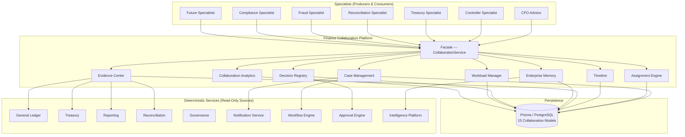
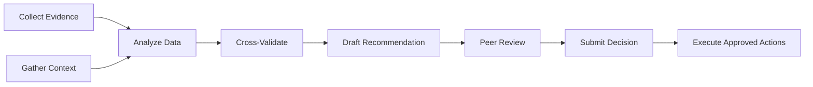

# Enterprise Finance Collaboration Platform — Architecture

## Executive Summary

The Enterprise Finance Collaboration Platform is the coordination layer for the entire Autonomous Finance Workforce. Where individual specialists (CFO Advisor, Controller Specialist, Treasury Specialist, Reconciliation Specialist) operate within their domain silos, the Collaboration Platform provides the shared infrastructure for cross-specialist coordination, case management, shared evidence, enterprise memory, and governed decision workflows.

**Why it exists:** Real financial operations rarely stay within a single domain. A month-end close involves treasury position verification, reconciliation checks, controller journal review, and CFO sign-off. An exception investigation may require treasury analysis, compliance review, controller reconciliation, and CFO escalation. Without a coordination layer, specialists work in isolation, duplicate evidence collection, lose context across handoffs, and create audit gaps in cross-functional decisions.

**Core capabilities:**
- Open, assign, escalate, and close cross-functional financial cases
- Route tasks between specialists with dependency tracking and ownership chains
- Maintain shared evidence collections with deduplication and lineage tracking
- Preserve enterprise memory across cases, specialists, and time periods
- Govern multi-specialist decisions through structured approval workflows
- Provide workload visibility and collaboration analytics across the workforce
- Ensure every cross-functional action is tenant-isolated, auditable, and evidence-backed

**What it does NOT do:**
- Does not execute financial transactions (specialists and deterministic systems do that)
- Does not replace specialist domain logic (each specialist owns its analytical depth)
- Does not bypass approval governance (all approvals route through the existing approval engine)
- Does not store financial records (Prisma models populated by deterministic systems remain the source of truth)

---

## Core Principles

| # | Principle | Implementation |
|---|---|---|
| 1 | **No Direct Specialist Coupling** | Specialists communicate through the platform's case/task/evidence APIs, never by calling each other directly. This prevents circular dependencies and enables independent specialist lifecycle management. |
| 2 | **Shared Evidence** | Evidence collected by one specialist is available to all authorized specialists on the case. Deduplication by content hash prevents redundant collection. Evidence lineage tracks which specialist collected what, when, and why. |
| 3 | **Enterprise Memory** | Insights, patterns, resolutions, and learnings persist across case boundaries. A fraud pattern discovered in one case informs future fraud investigations. Memory is typed, scored by relevance, and decay-aware. |
| 4 | **Auditable Decisions** | Every cross-specialist decision records who proposed it, who approved it, what evidence supported it, what alternatives were considered, and what the outcome was. No silent decisions. |
| 5 | **Governed Workflows** | Case progression follows defined state machines. Transitions require proper authorization. Escalation paths are pre-defined, not ad-hoc. Approval chains are configured per case type and risk level. |
| 6 | **Tenant Isolation** | Every query, every case, every piece of evidence, every memory entry is scoped to a single tenant. No cross-tenant data leakage is architecturally possible. |
| 7 | **Graceful Degradation** | If one specialist is unavailable, the platform continues operating with remaining specialists. Cases are reassigned, not blocked. Non-critical failures (analytics, memory scoring) are caught and logged. |

---

## Architecture Overview



---

## Components

### Case Management

The central coordination unit. A case represents a cross-functional financial event that requires attention from one or more specialists.

| Capability | Description |
|------------|-------------|
| Case Lifecycle | Create → Open → In Progress → Pending Review → Resolved → Closed (with escalation and reassignment at any stage) |
| Case Types | 11 predefined types covering the full spectrum of cross-functional financial events |
| Priority Management | LOW → MEDIUM → HIGH → CRITICAL with auto-escalation on SLA breach |
| SLA Tracking | Per-type SLA definitions with countdown, warning thresholds, and breach escalation |
| Case Relationships | Link related cases (parent/child, blocked-by, related-to) for complex investigations |
| Templates | Pre-configured case templates for common scenarios with default task chains, evidence requirements, and assignment rules |
| Bulk Operations | Mass case creation for batch events (e.g., month-end reconciliation across 50 entities) |

**Case State Machine:**

```
DRAFT → OPEN → IN_PROGRESS → PENDING_REVIEW → RESOLVED → CLOSED
  │        │         │              │              │
  │        ├──→ ESCALATED ◄────────┤              │
  │        ├──→ ON_HOLD ◄──────────┤              │
  │        │         │              │              │
  │        └──→ REOPENED ◄─────────────────────────┘
  └──→ CANCELLED (from any non-closed state)
```

### Assignment Engine

Determines the optimal specialist(s) for each case and task based on workload, expertise, availability, and history.

| Capability | Description |
|------------|-------------|
| Rule-Based Assignment | Configurable rules per case type: expertise match, workload balance, rotation, manual override |
| Workload Balancing | Distributes tasks evenly across available specialists, preventing burnout |
| Expertise Matching | Maps case types and required capabilities to specialist roles and permissions |
| History-Aware | Considers past performance, resolution quality, and domain familiarity |
| Escalation Chains | Automatic escalation when primary assignee is unavailable or SLA is breached |
| Delegation Support | Specialists can delegate tasks to peers with full audit trail |

**Assignment Flow:**

```
Case Created → Assignment Engine evaluates rules → Primary + Secondary assigned → 
Notification sent → Specialist acknowledges → Work begins → 
(if needed) Reassignment → (if needed) Escalation → Resolution
```

### Collaboration Timeline

Chronological record of every event in a case's lifecycle, providing complete visibility into what happened, when, who did it, and why.

| Event Type | Description |
|------------|-------------|
| `case_opened` | Case created with initial details, type, priority, and context |
| `case_assigned` | Specialist assigned (primary, secondary, or escalated) |
| `case_reassigned` | Task moved from one specialist to another with reason |
| `case_escalated` | Priority or authority level increased |
| `case_hold` | Case placed on hold with reason and expected resume date |
| `case_resolved` | Resolution recorded with evidence references |
| `case_closed` | Final closure with outcome summary |
| `case_reopened` | Previously closed case reopened with new information |
| `task_created` | Sub-task added to case with dependencies and ownership |
| `task_completed` | Task marked done with result summary and time tracked |
| `evidence_attached` | New evidence linked to case with collection context |
| `decision_recorded` | Cross-specialist decision made with approval chain |
| `comment_added` | Free-text or structured commentary from any participant |

**Timeline Guarantees:**
- Immutable — events are append-only, never modified or deleted
- Ordered — sequential event IDs within a case ensure chronological integrity
- Filterable — by specialist, event type, date range, and priority
- Exportable — full timeline export for audit or external review

### Shared Evidence Center

Centralized evidence management that prevents duplication, tracks lineage, and makes evidence discoverable across cases.

| Evidence Type | Source | Description |
|--------------|--------|-------------|
| `financial_data` | GL, Treasury, AP/AR | Specific balances, positions, transactions, or valuations |
| `document` | Document Service | Uploaded or referenced documents (invoices, contracts, statements) |
| `analysis` | Specialist Output | Analytical results with methodology and assumptions documented |
| `policy_reference` | Governance | Specific policy clauses, thresholds, or rules that apply |
| `system_record` | Prisma Models | Direct references to specific database records |
| `external_data` | Connectors | Market data, exchange rates, regulatory filings, news |
| `audit_trail` | Audit Service | Historical actions and their authorization chains |
| `conversation` | HumanInteraction | Questions asked, answers received, clarifications documented |
| `ai_insight` | Intelligence Platform | AI-generated observations with confidence scores and source attribution |
| `visual_evidence` | Charts, Screenshots | Visual representations with data source annotations |

**Deduplication Strategy:**
- Content hash (SHA-256 of normalized payload) prevents exact duplicates
- Semantic similarity scoring (via Intelligence Platform) flags near-duplicates
- When duplicate detected: existing evidence is linked, new collection is skipped, dedup event recorded in timeline

### Enterprise Memory

Persistent knowledge base that accumulates insights, patterns, and learnings across the specialist workforce over time.

| Memory Type | Scope | Decay | Description |
|------------|-------|-------|-------------|
| `case_resolution` | Case-specific | Slow (180d) | How a specific case was resolved, what worked, what didn't |
| `pattern` | Cross-case | None | Recurring patterns detected across multiple cases (e.g., "Q4 always has FX reconciliation exceptions") |
| `specialist_preference` | Per-specialist | Medium (90d) | How a specialist prefers to handle certain case types |
| `organizational` | Tenant-wide | Slow (365d) | Institutional knowledge (e.g., "Entity X requires 48h notice for large transfers") |
| `risk_signal` | Cross-case | Medium (90d) | Early warning signals that preceded past incidents |
| `resolution_template` | Cross-case | None | Proven resolution templates for recurring scenarios |

**Memory Lifecycle:**
1. **Ingestion** — Specialists and the platform record memories with context
2. **Scoring** — Relevance scored by recency, access frequency, and outcome quality
3. **Retrieval** — When a new case opens, relevant memories surface automatically
4. **Decay** — Stale memories score lower but are never deleted (audit requirement)
5. **Promotion** — High-value memories can be promoted to organizational knowledge

### Workload Manager

Real-time visibility into specialist capacity, current assignments, and utilization across the workforce.

| Capability | Description |
|------------|-------------|
| Capacity Tracking | Active cases, pending tasks, estimated hours vs available hours |
| Utilization Scoring | Percentage of capacity utilized per specialist per period |
| Burnout Detection | Flags specialists consistently above 85% capacity for 5+ days |
| Forecasting | Predicts future workload based on open cases, SLAs, and historical patterns |
| Rebalancing Recommendations | Suggests task reassignments when workload is unevenly distributed |
| Holiday/Absence Handling | Automatically reassigns tasks when specialist is unavailable |

### Collaboration Analytics

Metrics and insights into how effectively the specialist workforce collaborates.

| Metric | Description |
|--------|-------------|
| Case Cycle Time | Average time from case creation to resolution (by type, specialist, priority) |
| SLA Compliance | Percentage of cases resolved within SLA thresholds |
| Evidence Reuse Rate | How often evidence collected for one case is used in another |
| Cross-Specialist Activity | Frequency and quality of multi-specialist case participation |
| Resolution Quality | Outcome tracking (resolved vs reopened vs escalated) |
| Memory Hit Rate | How often enterprise memory improves case resolution speed |
| Workload Distribution | Gini coefficient across specialist workforce |
| Escalation Rate | Percentage of cases requiring escalation (indicator of assignment quality) |

### Decision Registry

Structured record of every cross-specialist decision, including the full approval chain, alternatives considered, and evidence referenced.

| Capability | Description |
|------------|-------------|
| Decision Recording | Who proposed, what was decided, what alternatives were considered |
| Approval Chain | Configurable multi-step approval based on risk level and decision type |
| Evidence Linking | Every decision must reference specific evidence items |
| Outcome Tracking | Post-decision monitoring to validate decision quality |
| Pattern Analysis | Aggregate decision data to improve future recommendations |
| Audit Export | Complete decision history exportable for regulatory review |

---

## Case Types

| # | Case Type | Typical Specialists | SLA (Hours) | Description |
|---|-----------|-------------------|-------------|-------------|
| 1 | `month_end_close` | Controller, Treasury, Reconciliation | 72 | Cross-functional month-end close coordination |
| 2 | `bank_reconciliation` | Reconciliation, Treasury, Controller | 48 | Bank statement reconciliation exceptions |
| 3 | `liquidity_risk` | Treasury, CFO Advisor, Controller | 24 | Liquidity threshold breaches or forecast gaps |
| 4 | `journal_investigation` | Controller, Reconciliation, Audit | 48 | Unusual or unbalanced journal entries |
| 5 | `fraud_investigation` | Fraud, Compliance, Controller, CFO | 12 | Suspected fraudulent activity requiring multi-specialist investigation |
| 6 | `treasury_exception` | Treasury, Controller, CFO Advisor | 24 | Treasury policy exceptions or limit breaches |
| 7 | `audit_finding` | Audit, Compliance, Controller | 96 | Internal or external audit findings requiring remediation |
| 8 | `compliance_issue` | Compliance, Controller, Audit | 48 | Regulatory compliance concerns or violations |
| 9 | `cash_forecast` | Treasury, CFO Advisor, FP&A | 72 | Cash forecast variance investigation |
| 10 | `policy_violation` | Compliance, Audit, Controller | 24 | Detected policy violations requiring investigation |
| 11 | `general` | Any | 168 | General cross-functional financial investigation |

---

## Shared Task Graph

Each case contains a directed acyclic graph (DAG) of tasks with dependencies, ownership, and status tracking.



| Field | Type | Description |
|-------|------|-------------|
| `taskId` | UUID | Unique task identifier |
| `caseId` | FK | Parent case |
| `title` | String | Human-readable task description |
| `description` | Text | Detailed task requirements |
| `ownedBy` | FK→Specialist | Current owner |
| `assignedBy` | FK→Specialist | Who assigned (may differ from case owner) |
| `status` | Enum | pending → in_progress → completed → blocked → escalated → cancelled |
| `priority` | Enum | LOW → MEDIUM → HIGH → CRITICAL |
| `dependencies` | UUID[] | Task IDs that must complete before this task starts |
| `dependsOnMe` | UUID[] | Task IDs blocked by this task (computed) |
| `estimatedHours` | Decimal | Estimated effort |
| `actualHours` | Decimal | Actual time tracked |
| `dueAt` | DateTime | SLA-driven deadline |
| `escalatedAt` | DateTime | When escalation occurred |
| `escalatedTo` | FK→Specialist | Escalation target |
| `approvalRequired` | Boolean | Whether completion requires approval |
| `approvedBy` | FK→Specialist | Who approved completion |
| `evidenceIds` | UUID[] | Evidence items attached to this task |
| `result` | Text | Task outcome summary |
| `completedAt` | DateTime | Completion timestamp |

---

## Specialist Assignment Model

```
┌─────────────┐    ┌──────────────────┐    ┌─────────────────┐
│  Case Created│───▶│ Assignment Engine │───▶│ Primary Assigned │
└─────────────┘    │                  │    └────────┬────────┘
                   │  - Rule engine   │             │
                   │  - Workload bal. │    ┌────────▼────────┐
                   │  - Expertise     │    │ Task Delegation  │
                   │  - History       │    │ (if needed)      │
                   └──────────────────┘    └────────┬────────┘
                                                    │
                   ┌──────────────────┐    ┌────────▼────────┐
                   │  Work Complete    │◀───│ Specialist Works │
                   └────────┬────────┘    └─────────────────┘
                            │
                   ┌────────▼────────┐
                   │  Audit Trail     │
                   │  recorded        │
                   └─────────────────┘
```

**Assignment Rule Structure:**

```typescript
interface AssignmentRule {
  caseType: CaseType;
  primaryRole: SpecialistRole[];
  secondaryRole: SpecialistRole[];
  escalationChain: SpecialistRole[];
  maxWorkloadPerSpecialist: number;
  requiresApprovalAbove: DecisionRiskLevel;
  slaHours: number;
  businessHoursOnly: boolean;
}
```

**Assignment Audit Trail:**

Every assignment action records:
- Who was assigned (specialist ID and role)
- Who made the assignment (engine, manual, or escalation)
- When the assignment occurred
- Why (rule match, workload balance, manual override)
- Whether the specialist acknowledged
- Time to acknowledgment

---

## Shared Evidence

### Collection Lifecycle

```
Specialist Collects → Content Hash Generated → Dedup Check → 
├── No Match → Store Evidence → Link to Case → Record in Timeline
└── Match Found → Link Existing Evidence → Record Dedup Event → Skip Storage
```

### Evidence Access Model

| Role | Read Own Case | Read All Cases | Collect | Modify | Delete |
|------|:---:|:---:|:---:|:---:|:---:|
| Assigned Specialist | ✓ | — | ✓ | ✓ (own) | — |
| Case Owner | ✓ | — | ✓ | ✓ | — |
| Escalated Specialist | ✓ | — | ✓ | ✓ | — |
| Auditor | ✓ | ✓ | — | — | — |
| Administrator | ✓ | ✓ | ✓ | ✓ | ✓ (soft) |

Evidence is **never** physically deleted. Soft-delete marks evidence as `RETRACTED` with reason and timestamp, preserving audit integrity.

---

## Enterprise Memory

### Memory Scoring Algorithm

```
relevance_score = (recency_weight × recency) + (access_weight × access_count) + (outcome_weight × outcome_quality)

Where:
  recency = 1.0 / (1 + days_since_last_access / decay_halflife)
  access_count = log(1 + total_accesses) / log(1 + max_accesses)
  outcome_quality = success_rate_of_related_cases (0.0 - 1.0)
  weights: recency=0.3, access=0.4, outcome=0.3
```

### Memory Retrieval Flow

1. Case opens with type + context keywords
2. Platform queries Enterprise Memory with type filter + keyword similarity
3. Top 10 memories scored and ranked
4. Memories older than decay threshold scored down but never excluded
5. Specialist receives memory suggestions as case context
6. Specialist can accept, dismiss, or annotate memory suggestions
7. Accepted memories contribute to resolution — tracked for outcome quality feedback loop

---

## Collaborative Recommendations

The platform supports multi-specialist recommendation chains where one specialist's output becomes another's input.

**Chain Example — Month-End Close Exception:**

```
1. Reconciliation Specialist detects bank statement discrepancy
   → Creates case, attaches evidence, completes reconciliation task
   
2. Assignment Engine routes to Controller Specialist
   → Controller reviews journal entries, identifies missing accrual
   → Completes journal investigation task with evidence
   
3. Assignment Engine routes to Treasury Specialist
   → Treasury verifies cash position impact
   → Completes treasury validation task
   
4. Case Owner (CFO Advisor) reviews combined specialist outputs
   → Synthesizes cross-domain analysis
   → Drafts final recommendation with full evidence chain
   
5. Decision Registry records recommendation
   → Routes through approval engine if risk > threshold
   → Approval/rejection recorded in timeline
   → Resolution applied and case closed
```

**Chain Guarantees:**
- Every handoff is recorded in the timeline
- Evidence is accumulated, not replaced, at each stage
- Each specialist can see the full history before they begin
- Any specialist can escalate at any point
- The chain is not linear — parallel tasks execute simultaneously when dependencies allow

---

## Enterprise Decision Center

Structured decision-making for cross-specialist resolutions that require governance.

### Decision Types

| Decision Type | Risk Level | Approval Required | Typical Approvers |
|--------------|-----------|-------------------|-------------------|
| `resolution` | LOW | No | Case Owner |
| `resolution` | MEDIUM | Yes (1) | Case Owner + 1 Senior |
| `resolution` | HIGH | Yes (2) | Case Owner + 2 Senior + CFO |
| `resolution` | CRITICAL | Yes (3) | Case Owner + 2 Senior + CFO + Audit |
| `policy_exception` | Any | Yes (risk-based) | Compliance + CFO |
| `financial_adjustment` | MEDIUM+ | Yes (risk-based) | Controller + CFO |
| `escalation` | Any | No (auto-approved) | Escalation chain |

### Decision Workflow

```
Decision Proposed → Evidence Validation → Risk Assessment →
├── LOW Risk → Auto-approve → Record in Timeline
├── MEDIUM Risk → 1-level approval → Approve/Reject → Record
├── HIGH Risk → Multi-level approval → Approve/Reject/Modify → Record
└── CRITICAL Risk → Full chain + audit review → Approve/Reject → Record
```

### Decision Record Structure

```typescript
interface DecisionRecord {
  id: UUID;
  caseId: UUID;
  proposedBy: SpecialistId;
  proposedAt: DateTime;
  decisionType: DecisionType;
  riskLevel: RiskLevel;
  description: string;
  alternatives: string[];
  evidenceIds: UUID[];
  approvalChain: ApprovalStep[];
  outcome: "approved" | "rejected" | "modified" | "pending";
  executedAt?: DateTime;
  executedBy?: SpecialistId;
  outcomeNotes?: string;
}
```

---

## Data Model

| # | Model | Purpose | Key Indexes |
|---|-------|---------|-------------|
| 1 | `FinanceCase` | Case lifecycle and metadata | `(companyId, status)`, `(companyId, type)`, `(assignedTo, status)` |
| 2 | `CaseTask` | Task graph within cases | `(caseId, status)`, `(ownedBy, status)`, `(dueAt)` |
| 3 | `CaseAssignment` | Assignment history and audit | `(caseId)`, `(specialistId, assignedAt)` |
| 4 | `CaseTimeline` | Immutable event log | `(caseId, eventOrder)`, `(caseId, eventType)`, `(specialistId, occurredAt)` |
| 5 | `CaseEvidence` | Shared evidence items | `(companyId, contentHash)` (unique), `(caseId)`, `(collectedBy)` |
| 6 | `CaseEvidenceLink` | Evidence-to-case association | `(caseId, evidenceId)` (unique), `(evidenceId)` |
| 7 | `CaseDecision` | Cross-specialist decisions | `(caseId)`, `(proposedBy)`, `(outcome)`, `(riskLevel)` |
| 8 | `CaseDecisionApproval` | Approval chain steps | `(decisionId, stepOrder)`, `(approverId, status)` |
| 9 | `EnterpriseMemory` | Persistent knowledge base | `(companyId, memoryType)`, `(companyId, keywords)` (GIN), `(lastAccessedAt)` |
| 10 | `MemoryAssociation` | Memory-to-case linkage | `(memoryId, caseId)`, `(caseId)` |
| 11 | `SpecialistWorkload` | Real-time capacity tracking | `(specialistId, periodStart)` (unique per period) |
| 12 | `CollaborationMetric` | Analytics time-series | `(companyId, metricType, periodStart)` |
| 13 | `CaseTemplate` | Pre-configured case templates | `(companyId, caseType)`, `(isActive)` |
| 14 | `AssignmentRule` | Assignment configuration | `(companyId, caseType)` (unique) |
| 15 | `EscalationPolicy` | Escalation chain definitions | `(companyId, caseType, triggerLevel)` |

---

## API Design

| # | Endpoint | Method | Description |
|---|----------|--------|-------------|
| 1 | `/api/collaboration/cases` | GET | List cases with filters (type, status, specialist, priority, date range) |
| 2 | `/api/collaboration/cases` | POST | Create case with type, priority, context, initial tasks, and template |
| 3 | `/api/collaboration/cases/[id]` | GET | Case detail with tasks, timeline, evidence, decisions |
| 4 | `/api/collaboration/cases/[id]` | PUT | Update case metadata (priority, status, tags) |
| 5 | `/api/collaboration/cases/[id]/assign` | POST | Assign or reassign specialist with reason |
| 6 | `/api/collaboration/cases/[id]/escalate` | POST | Escalate case with escalation reason and target |
| 7 | `/api/collaboration/cases/[id]/tasks` | POST | Add task to case with dependencies |
| 8 | `/api/collaboration/cases/[id]/tasks/[taskId]` | PUT | Update task status, result, or ownership |
| 9 | `/api/collaboration/cases/[id]/evidence` | POST | Attach evidence to case (with dedup check) |
| 10 | `/api/collaboration/cases/[id]/decisions` | POST | Propose decision with evidence references |
| 11 | `/api/collaboration/cases/[id]/decisions/[decisionId]/approve` | POST | Approve or reject decision |
| 12 | `/api/collaboration/cases/[id]/timeline` | GET | Get chronological event log (filterable) |
| 13 | `/api/collaboration/analytics` | GET | Collaboration metrics and workforce insights |
| 14 | `/api/collaboration/memory` | GET | Query enterprise memory with type, keyword, and relevance filters |

---

## Security Model

### Tenant Isolation

Every collaboration query includes `companyId` filter at the Prisma level. No API endpoint exposes cross-tenant data. Case IDs, evidence IDs, and memory IDs are globally unique (UUIDv7) but always scoped to tenant context.

### RBAC Permissions

| Permission | Create Case | Assign | Escalate | Collect Evidence | Decide | Approve | View Analytics | Manage Memory |
|-----------|:---:|:---:|:---:|:---:|:---:|:---:|:---:|:---:|
| `collaboration.view` | — | — | — | — | — | — | Read | Read |
| `collaboration.cases.manage` | ✓ | ✓ | — | ✓ | — | — | — | — |
| `collaboration.cases.escalate` | ✓ | ✓ | ✓ | ✓ | — | — | — | — |
| `collaboration.decisions.propose` | ✓ | ✓ | ✓ | ✓ | ✓ | — | — | — |
| `collaboration.decisions.approve` | ✓ | ✓ | ✓ | ✓ | ✓ | ✓ | — | — |
| `collaboration.analytics.view` | — | — | — | — | — | — | ✓ | — |
| `collaboration.admin` | ✓ | ✓ | ✓ | ✓ | ✓ | ✓ | ✓ | ✓ |

### Audit Trail

Every collaboration action is logged via `recordAudit()`:
- Case creation, assignment, escalation, status changes
- Task creation, assignment, completion, escalation
- Evidence collection, attachment, deduplication
- Decision proposal, approval, rejection, execution
- Memory creation, access, association
- All log entries include: `actorId`, `companyId`, `action`, `entityType`, `entityId`, `timestamp`, `metadata`

---

## Integration Points

| Integration | Direction | Protocol | Description |
|------------|-----------|----------|-------------|
| Agent Framework | Bidirectional | In-process | Specialists register as agents; collaboration platform orchestrates cross-agent tasks |
| Workflow Engine | Outbound | In-process | Case progression triggers workflow steps; workflow events can open cases |
| Approval Engine | Outbound | In-process | Decision approvals route through existing approval matrix |
| Notification Service | Outbound | In-process | Case assignments, escalations, SLA warnings, and decisions trigger notifications |
| Intelligence Platform | Bidirectional | In-process | Evidence analysis, memory scoring, pattern detection, and recommendation synthesis |
| General Ledger | Read-only | In-process | Financial data evidence collection |
| Treasury Service | Read-only | In-process | Treasury position and risk evidence collection |
| Reporting Service | Read-only | In-process | Report data and variance evidence collection |
| Reconciliation Service | Read-only | In-process | Reconciliation status and exception evidence collection |
| Governance Service | Read-only | In-process | Policy compliance and violation evidence collection |
| Audit Service | Read-only | In-process | Audit finding and remediation evidence collection |

---

## Platform Services Reused

| Service | Reused From | Purpose in Collaboration Platform |
|---------|------------|-----------------------------------|
| `Prisma` | Database Layer | All 15 collaboration models |
| `TenantContext` | Multi-Tenancy | Every query scoped to company |
| `recordAudit()` | Security Layer | Complete audit trail |
| `handleRouteError()` | API Layer | Standardized error responses |
| `cacheHeaders()` | API Layer | Cache-Control on read endpoints |
| `NotificationService` | Notifications | Assignment and escalation alerts |
| `ApprovalEngine` | Approval Matrix | Decision approval workflows |
| `ConditionEvaluator` | Workflow Engine | Assignment rule evaluation |
| `IntelligencePlatform` | Intelligence | Memory scoring and pattern detection |
| `WorkflowEngine` | Workflow Orchestration | Case progression triggers |
| `QueueService` | Queue System | Async notification delivery, analytics computation |
| `ValidationSchemas` | Validation Layer | Input validation via Zod |
| `rateLimit()` | Security Layer | API rate limiting |

---

*Document version: 1.0.0 — Phase 13.5 — Enterprise Finance Collaboration Platform*
