# Enterprise Audit Specialist — Architecture

## Executive Summary

The Enterprise Audit Specialist is the independent assurance layer for the Autonomous Finance Workforce. While other specialists operate within their domain silos — treasury, reconciliation, controller, collaboration — the Audit Specialist provides the organization-wide, evidence-backed, governance-first view of internal control effectiveness, finding lifecycle, risk posture, and audit readiness.

**Why it exists:** Every financial system eventually faces an audit — internal, regulatory, SOX, ISO certification, board assessment, or due diligence. Without a dedicated audit specialist, control testing is ad-hoc, findings are tracked in spreadsheets, evidence is scattered across email and shared drives, and remediation tracking is manual. The Audit Specialist automates continuous control monitoring, provides structured finding management with full CIFE (Condition, Inherent Risk, Effect, Recommendation) documentation, maintains immutable evidence chains, and delivers readiness assessments against any audit type.

**Core capabilities:**
- Continuous audit scanning across controls, approvals, reconciliations, and behavioral anomalies
- Full control lifecycle management — design, testing, effectiveness scoring, SoD conflict detection
- Structured findings management with severity classification and repeat-finding detection
- Immutable evidence management with verification workflow and package assembly
- Remediation tracking with velocity metrics, escalation, and task-level granularity
- Audit readiness assessments across 5 domains with gap identification and trend tracking
- Risk assessment engine with category-based scoring, high-risk area identification, and trend analysis
- Audit planning — plans, engagements, and calendar management
- Executive reporting for audit committee and board presentations

**What it does NOT do:**
- Does not modify financial records (read-only access to GL, transactions, reconciliations)
- Does not execute transactions or approvals (the Approval Engine does that)
- Does not perform reconciliations (the Reconciliation Platform does that)
- Does not bypass governance (all audit actions are themselves audited)
- Does not fabricate evidence (evidence must reference real records with immutable flags)

---

## Core Principles

| # | Principle | Implementation |
|---|---|---|
| 1 | **Never Fabricate Evidence** | Every `FindingEvidence` record must reference a real entity (`referenceId` + `referenceType`). Evidence is collected from actual system outputs — ledger entries, transaction records, approval logs, workflow states. No synthetic or simulated evidence. |
| 2 | **Never Modify Records** | The Audit Specialist has read-only access to all financial data (GL, transactions, treasury, reconciliations). It creates its own audit-specific records (controls, findings, evidence) but never mutates source records. |
| 3 | **Never Bypass Governance** | Audit actions require proper RBAC permissions (`audit.view`, `audit.admin`, `audit.findings`, `audit.evidence`). Critical findings trigger escalation workflows through the existing Approval Engine. No silent overrides. |
| 4 | **Evidence-Backed Findings** | Every finding must have at least one evidence item. Findings without evidence are flagged as incomplete. Evidence items carry verification status (`unverified` → `verified` → `disputed`) and confidence scores. |
| 5 | **Full Drill-Down** | Dashboard metrics drill down to individual controls, findings, evidence items, and remediation tasks. No summary number exists without a traceable path to its constituent records. |
| 6 | **Tenant Isolation** | Every query is scoped to `ctx.companyId`. No cross-tenant data access is architecturally possible — every service method receives `TenantContext` and every Prisma query includes `companyId` in its `where` clause. |
| 7 | **Immutability by Default** | Evidence items are created with `immutable: true`. Once collected, evidence cannot be deleted — only verified, disputed, or marked expired. Audit trail entries are append-only. |
| 8 | **Continuous, Not Periodic** | The Continuous Audit engine runs against live data, not batch snapshots. Control failures, missing approvals, late reconciliations, high-risk events, and unusual behavior are detected in real time. |

---

## Architecture Overview

```mermaid
graph TB
    subgraph "Deterministic Services (Read-Only Sources)"
        GL[General Ledger]
        TXN[Transactions]
        TRS[Treasury Platform]
        RCL[Reconciliation Platform]
        WF[Workflow Engine]
        APR[Approval Engine]
        GOV[Governance Service]
        OPS[Operations Service]
        INT[Intelligence Platform]
        AGT[Agent Framework]
        MEM[Enterprise Memory]
        DR[Decision Registry]
    end

    subgraph "Finance Collaboration Platform"
        COLLAB[Collaboration Platform]
    end

    subgraph "Enterprise Audit Specialist"
        FA[AuditSpecialistService — Facade]

        subgraph "Core Engines"
            CA[Continuous Audit Engine]
            CM[Control Monitoring]
        end

        subgraph "Lifecycle Management"
            FM[Findings Management]
            EM[Evidence Management]
            RM[Remediation Tracking]
        end

        subgraph "Planning & Assessment"
            AR[Audit Readiness]
            RA[Risk Assessment]
            AP[Audit Planning]
        end

        subgraph "Output"
            RP[Audit Reporting]
        end
    end

    subgraph "Persistence"
        DB[(Prisma / PostgreSQL<br/>14 Audit Models)]
    end

    subgraph "Consumers"
        UI[Audit Dashboard UI]
        API[Audit API Routes]
        RPT[Executive Reports]
        AGT2[Agent Framework]
    end

    GL --> CA
    TXN --> CA
    TRS --> CA
    RCL --> CA
    WF --> CA
    APR --> CA
    GOV --> CM
    OPS --> CM
    INT --> RA
    AGT --> CA
    MEM --> FM
    DR --> RA

    FA --> CA
    FA --> CM
    FA --> FM
    FA --> EM
    FA --> RM
    FA --> AR
    FA --> RA
    FA --> AP
    FA --> RP

    CA --> DB
    CM --> DB
    FM --> DB
    EM --> DB
    RM --> DB
    AR --> DB
    RA --> DB
    AP --> DB
    RP --> DB

    UI --> FA
    API --> FA
    RPT --> FA
    AGT2 --> FA
```



---

## Components

### 1. Continuous Audit Engine (`continuous-audit.ts`)

The real-time scanning engine that detects control failures, approval gaps, reconciliation delays, high-risk events, and behavioral anomalies across the organization.

| Scan Type | Source | Detection Logic |
|---|---|---|
| Control Failures | `ControlTest` where `result = "ineffective"` in last 30 days | Grouped by `controlId`, severity derived from failure count (≥5 = critical, ≥3 = high, else medium) |
| Missing Approvals | `TransactionApproval` where `status = "pending"` | Calculates `daysOverdue` from creation date |
| Late Reconciliations | `ReconciliationCase` where `status ∈ [OPEN, IN_PROGRESS, EXCEPTION]` and `dueDate < now()` | Calculates `daysLate` from due date |
| High-Risk Events | `Transaction` in last 7 days, amount > 5× median | Risk score = amount / (threshold × 2), clamped to [0, 1] |
| Unusual Behavior | `AuditLog` in last 7 days | Flags: high-volume activity (>50 actions), after-hours activity (midnight-6AM ≥3 actions) |

**Overall Score Calculation:** `1 - (issueCount × 0.02)`, clamped to ≥ 0.

### 2. Control Monitoring (`control-monitoring.ts`)

Manages the full control lifecycle — definition, testing, effectiveness measurement, and SoD conflict detection.

- **Control CRUD** — create/update controls with type, category, frequency, owner, risk rating
- **Control Testing** — create tests with type, method, sample size; track results
- **Effectiveness Scoring** — computed from `AuditControl.status` (active/inactive/under_review)
- **Failure Heatmap** — control category × failure count matrix
- **SoD Conflicts** — detects when a single owner manages controls across multiple categories

### 3. Findings Management (`findings.ts`)

Structured finding lifecycle from creation through resolution with full CIFE documentation.

- **Finding CRUD** — create/update with type, severity, status, CIFE fields
- **Severity Grouping** — dashboard-ready `Record<FindingSeverity, number>`
- **Status Grouping** — dashboard-ready `Record<FindingStatus, number>`
- **Finding Trends** — opened vs closed over time
- **Repeat Finding Detection** — groups findings by normalized title to identify recurring issues
- **Finding Closure** — explicit close workflow (status → `resolved`)

### 4. Evidence Management (`evidence-management.ts`)

Immutable evidence collection, verification, and package assembly.

- **Evidence Collection** — add evidence to findings with type, source, confidence, `immutable: true`
- **Evidence Packages** — assemble evidence into typed packages (workpapers, regulatory filing, management letter, etc.)
- **Package Lifecycle** — `assembling` → `complete` → `approved` → `submitted`
- **Verification Workflow** — evidence items carry `verificationStatus` (unverified/verified/rejected/expired/pending_review)
- **Finding Evidence Lookup** — retrieve all evidence for a given finding

### 5. Remediation Tracking (`remediation.ts`)

Finding-to-resolution tracking with task-level granularity and velocity metrics.

- **Plan Lifecycle** — `proposed` → `approved` → `in_progress` → `completed` / `overdue` / `cancelled`
- **Task Management** — individual tasks within plans, with assignee, due date, priority, status
- **Velocity Metrics** — total plans, on track, behind schedule, completed, average days to remediate
- **Escalation** — mark plans as overdue with escalation metadata (who escalated, when)
- **Plan Summary** — dashboard-ready metrics with overdue count and completion rate

### 6. Audit Readiness (`audit-readiness.ts`)

Readiness assessment engine that evaluates organizational preparedness across 5 domains.

| Domain | Score Field | What It Measures |
|---|---|---|
| Financial Statements | `financialStatementsScore` | Completeness and accuracy of financial statement preparation |
| Documents | `documentsScore` | Policy documentation, procedure manuals, org charts |
| Evidence | `evidenceCompletenessScore` | Evidence packages assembled and verified |
| Policy Compliance | `policyComplianceScore` | Adherence to internal policies and external regulations |
| Workflow Completion | `workflowCompletionScore` | Approval chains, review processes, sign-offs complete |

**Gap Identification** — automatically detects:
- No controls defined (critical gap)
- < 80% controls active (high gap)
- Critical findings still open (critical gap)
- > 5 open findings (high gap)
- Evidence packages still assembling (medium gap)
- Overdue remediation plans (high gap)

**Trend Analysis** — tracks readiness score over configurable time periods (default 90 days).

### 7. Risk Assessment (`audit-risk.ts`)

Risk scoring engine that evaluates organizational risk posture across categories.

| Risk Type | Description |
|---|---|
| `enterprise` | Organization-wide risk posture |
| `financial` | Financial reporting and transaction risk |
| `operational` | Process and operational risk |
| `compliance` | Regulatory and policy compliance risk |
| `it` | Technology and information security risk |
| `fraud` | Fraud detection and prevention risk |
| `strategic` | Business strategy and market risk |
| `vendor` | Third-party and vendor risk |

**High-Risk Area Detection** — identifies areas with elevated finding counts and control gaps:
- Score = (findings × 2) + (control gaps × 1.5)
- Results sorted by score descending, top 10 returned

**Risk Trend** — compares recent risk score to prior score:
- `improving` — score decreased
- `stable` — score unchanged
- `deteriorating` — score increased

**Overall Risk Score** — composite of latest assessment score + finding penalty (0.05 per high/critical finding) + control penalty (0.03 per inactive/under_review control), clamped to [0, 1].

### 8. Audit Planning (`audit-planning.ts`)

Manages the planning, engagement, and calendar lifecycle for audit operations.

- **Audit Plans** — annual, quarterly, ad-hoc, regulatory, internal, external, follow-up plans with scope, risk assessment, resource allocation
- **Engagements** — individual audit engagements linked to plans, with type (financial, operational, compliance, IT, fraud, combined, forensic), team members, status lifecycle
- **Calendar** — event scheduling with types (audit start/end, fieldwork, review, reporting, deadline, meeting, training, follow-up, regulatory filing)

### 9. Audit Reporting (`audit-specialist.ts`)

Generates executive-level and operational audit reports.

- **Executive Summary** — overall audit score, total/effective controls, finding counts, remediation progress, upcoming deadlines, risk assessment, readiness status
- **Report Types** — audit_report, executive_summary, control_assessment, finding_report, remediation_status, compliance_status, risk_report, readiness_report, calendar_report
- **Report Lifecycle** — `draft` → `generating` → `review` → `final` → `distributed` → `archived`

---

## Control Categories Monitored

| # | Category | Description |
|---|---|---|
| 1 | `authorization` | Transaction and data modification authorization controls |
| 2 | `segregation_of_duties` | SoD enforcement — same person cannot initiate and approve |
| 3 | `reconciliation` | Account and data reconciliation controls |
| 4 | `review` | Management review and oversight controls |
| 5 | `physical` | Physical access and asset safeguarding controls |
| 6 | `it_general` | IT general controls — access, change management, operations |
| 7 | `it_application` | Application-specific controls — input validation, processing integrity |
| 8 | `disclosure` | Financial disclosure and reporting controls |
| 9 | `reporting` | Internal and external reporting accuracy controls |
| 10 | `compliance` | Regulatory and policy compliance controls |

---

## Finding Severity Levels

| Severity | Trigger | Response SLA | Escalation |
|---|---|---|---|
| `critical` | Material weakness, significant financial impact, regulatory exposure | Immediate — 24 hours | Board / Audit Committee notification |
| `high` | Significant deficiency, control gap with financial impact | 48 hours | CFO / Controller notification |
| `medium` | Control deficiency, process gap, operational impact | 5 business days | Manager-level review |
| `low` | Observation, best practice recommendation | 30 business days | Scheduled review cycle |
| `informational` | Note for management, no immediate action required | Next audit cycle | Logged for awareness |

---

## Control Testing Methodology

| Method | Description | When Used |
|---|---|---|
| `sampling` | Test a representative subset of transactions | High-volume controls with many transactions |
| `full_population` | Test every transaction in the population | High-risk controls, small populations, regulatory requirements |
| `automated` | System-executed test with programmatic assertions | Controls with clear pass/fail criteria, real-time monitoring |
| `hybrid` | Combination of automated screening + manual investigation | Controls requiring judgment after initial automated filter |
| `manual` | Human-executed walkthrough or inspection | Complex judgment controls, new or redesigned processes |

**Test Types:**
| Type | Purpose |
|---|---|
| `design_effectiveness` | Evaluates whether the control is properly designed to prevent/detect the risk |
| `operating_effectiveness` | Evaluates whether the control operates as designed over a period |
| `walkthrough` | Traces a transaction through the entire process to understand control flow |
| `substantive` | Direct testing of balances, transactions, or disclosures |
| `reperformance` | Independent execution of the control procedure to verify results |

---

## Data Model

| # | Model | Purpose | Key Indexes |
|---|---|---|---|
| 1 | `AuditPlan` | Annual/quarterly audit plans with scope, risk assessment, resource allocation | `(companyId, planType)`, `(companyId, status)`, `(companyId, fiscalYear)` |
| 2 | `AuditEngagement` | Individual audit engagements with type, team, status lifecycle | `(companyId, planId)`, `(companyId, status)`, `(companyId, engagementType)` |
| 3 | `AuditControl` | Control definitions with type, category, frequency, owner, risk level | `(companyId, controlType)`, `(companyId, category)`, `(companyId, status)`, `(companyId, riskLevel)` |
| 4 | `ControlTest` | Individual control test executions with method, sample size, result | `(companyId, controlId)`, `(companyId, testType)`, `(companyId, result)` |
| 5 | `ControlResult` | Aggregated control effectiveness per assessment period | `(companyId, controlId)`, `(companyId, overallEffectiveness)`, `(companyId, riskLevel)` |
| 6 | `AuditFinding` | Audit findings with type, severity, status, CIFE fields | `(companyId, severity)`, `(companyId, status)`, `(companyId, findingType)`, `(companyId, engagementId)`, `(companyId, controlId)` |
| 7 | `FindingEvidence` | Immutable evidence items linked to findings | `(companyId, findingId)`, `(companyId, evidenceType)`, `(companyId, referenceId)` |
| 8 | `RemediationPlan` | Remediation plans with type, status, target date, cost | `(companyId, findingId)`, `(companyId, status)`, `(companyId, owner)`, `(companyId, targetDate)` |
| 9 | `RemediationTask` | Individual tasks within remediation plans | `(companyId, planId)`, `(companyId, assignedTo)`, `(companyId, status)` |
| 10 | `AuditEvidencePackage` | Assembled evidence packages for audit deliverables | `(companyId, engagementId)`, `(companyId, packageType)`, `(companyId, status)` |
| 11 | `AuditReadinessSnapshot` | Point-in-time readiness assessment scores | `(companyId, assessmentType)`, `(companyId, snapshotDate)` |
| 12 | `AuditRiskAssessment` | Risk assessment with category scoring and high-risk areas | `(companyId, assessmentType)`, `(companyId, overallRiskScore)` |
| 13 | `AuditCalendar` | Audit events — engagements, deadlines, reviews, filings | `(companyId, eventType)`, `(companyId, startDate)`, `(companyId, status)` |
| 14 | `AuditReport` | Generated audit reports with content, findings, recommendations | `(companyId, reportType)`, `(companyId, status)`, `(companyId, engagementId)` |
| 15 | `AuditWorkspacePreference` | User workspace preferences — default view, alert thresholds, layout | `(companyId, userId)` |

**Total:** 14 models + 1 preference model, 38 indexes (4 composite unique), all scoped by `companyId`.

---

## API Design

| # | Endpoint | Methods | Purpose | Cache TTL |
|---|---|---|---|---|
| 1 | `/api/audit/dashboard` | GET | Aggregate dashboard data across all audit domains | 30s |
| 2 | `/api/audit/continuous-audit` | GET | Run continuous audit scan and return results | 30s |
| 3 | `/api/audit/controls` | GET, POST | List/create controls with filters | 15s |
| 4 | `/api/audit/controls/heatmap` | GET | Control failure heatmap by category × severity | 60s |
| 5 | `/api/audit/controls/tests` | GET, POST | List/create control tests | 15s |
| 6 | `/api/audit/findings` | GET, POST | List/create findings with filters | 15s |
| 7 | `/api/audit/findings/[id]` | GET, PUT | Get/update individual finding | 15s |
| 8 | `/api/audit/evidence-packages` | GET, POST | List/create evidence packages | 30s |
| 9 | `/api/audit/remediation` | GET, POST | List/create remediation plans | 30s |
| 10 | `/api/audit/readiness` | GET | Get audit readiness summary and gaps | 60s |
| 11 | `/api/audit/risk-assessments` | GET, POST | List/create risk assessments | 60s |
| 12 | `/api/audit/plans` | GET, POST | List/create audit plans | 60s |
| 13 | `/api/audit/engagements` | GET, POST | List/create audit engagements | 30s |
| 14 | `/api/audit/calendar` | GET, POST | List/create calendar events | 30s |
| 15 | `/api/audit/reports` | GET, POST | List/create audit reports | 60s |
| 16 | `/api/audit/analytics` | GET | Aggregate analytics across all audit domains | 60s |

**All endpoints:**
- Use `auth()` + `requireTenantContext()` for session validation
- Parse request bodies via `parseJsonBody<T>()` + Zod validation schemas (`src/lib/validations/audit-specialist.ts`)
- Return errors via `handleRouteError()` / `zodErrorResponse()`
- Apply `cacheHeaders(ttl)` for read endpoints

---

## Security Model

### Tenant Isolation
Every service method receives `TenantContext` and every Prisma query includes `companyId` in its `where` clause. No cross-tenant data access is architecturally possible.

### RBAC Permissions
| Permission | Scope |
|---|---|
| `audit.view` | Read-only access to dashboard, controls, findings, evidence |
| `audit.admin` | Create/update controls, plans, engagements, reports |
| `audit.findings` | Create/update findings, evidence items |
| `audit.evidence` | Create/update evidence packages, verify evidence |
| `audit.remediation` | Create/update remediation plans and tasks |
| `audit.risk` | Create/update risk assessments |

### Audit Trail
Every mutation to audit records is captured in the system `AuditLog` with `actorUserId`, `companyId`, `action`, `entityType`, `entityId`, and timestamp. Continuous audit scan results are logged as `continuous_audit_run` actions.

### Evidence Immutability
Evidence items are created with `immutable: true` in the database. Once collected:
- Cannot be deleted
- Can only change `verificationStatus` (unverified → verified → disputed)
- `collectedAt` and `collectedBy` are set at creation and never modified
- `confidence` score is set at collection time

---

## Integration Points

| Platform | How It Integrates |
|---|---|
| **General Ledger** | Read-only — continuous audit reads GL entries for control failure detection and high-risk event identification |
| **Transactions** | Read-only — scans transactions for high-value events (>5× median), missing approvals, unusual patterns |
| **Workflow Engine** | Read-only — monitors workflow completion for readiness scoring and control effectiveness |
| **Approval Engine** | Read-only — detects missing/late approvals as control failures |
| **Reconciliation Platform** | Read-only — detects late reconciliation cases for control failure and readiness assessment |
| **Treasury Platform** | Read-only — monitors treasury operations for control effectiveness |
| **Governance Service** | Read-only — reuses governance metrics for control monitoring and risk assessment |
| **Operations Service** | Read-only — reads connector health and operational metrics for readiness scoring |
| **Intelligence Platform** | Read-only — risk assessment uses intelligence platform findings for risk scoring |
| **Agent Framework** | Read-only — monitors agent decisions and task completion for behavioral anomaly detection |
| **Enterprise Memory** | Read-only — references memory entries for finding context and historical patterns |
| **Decision Registry** | Read-only — reads decision history for risk assessment and control validation |
| **Finance Collaboration Platform** | Read-only — cross-references cases and evidence with audit findings |

---

## Platform Services Reused

| Service | Usage |
|---|---|
| `prisma` (Prisma Client) | All persistence — 14 audit models + read-only access to GL, transactions, approvals, reconciliations, workflows, governance, operations |
| `TenantContext` | Tenant isolation — every method receives and scopes queries to `ctx.companyId` |
| `auth()` | Session validation — all API routes require authenticated sessions |
| `requireTenantContext()` | Context extraction — maps session to `TenantContext` with `companyId` and `userId` |
| `handleRouteError()` | Error handling — unified error response format across all API routes |
| `zodErrorResponse()` | Validation errors — structured Zod validation error responses |
| `parseJsonBody()` | Request parsing — type-safe JSON body parsing |
| `cacheHeaders()` | HTTP caching — tiered Cache-Control headers (15s–60s) |
| `Prisma.Decimal` | Precision arithmetic — all scores and calculations use `Prisma.Decimal` for financial-grade precision |
| `AuditLog` (system) | Audit trail — continuous audit runs and critical mutations logged |

---

## File Structure

```
src/modules/audit-specialist/
├── types.ts                  # 724 lines — 17 type unions, 30+ interfaces, 30+ input types
├── audit-specialist.ts       # 419 lines — Facade: dashboard, executive summary, reports
├── continuous-audit.ts       # 284 lines — Continuous audit scanning engine
├── control-monitoring.ts     # 345 lines — Control lifecycle, testing, SoD detection
├── findings.ts               # 341 lines — Finding lifecycle, trends, repeat detection
├── evidence-management.ts    # 292 lines — Evidence collection, packages, verification
├── remediation.ts            # 324 lines — Remediation plans, tasks, velocity, escalation
├── audit-readiness.ts        # 258 lines — Readiness scoring, gap identification, trends
├── audit-risk.ts             # 287 lines — Risk assessment, high-risk areas, trends
├── audit-planning.ts         # 292 lines — Plans, engagements, calendar
└── index.ts                  # 14 lines — Barrel export

src/app/api/audit/
├── dashboard/route.ts
├── continuous-audit/route.ts
├── controls/route.ts
├── controls/heatmap/route.ts
├── controls/tests/route.ts
├── findings/route.ts
├── findings/[id]/route.ts
├── evidence-packages/route.ts
├── remediation/route.ts
├── readiness/route.ts
├── risk-assessments/route.ts
├── plans/route.ts
├── engagements/route.ts
├── calendar/route.ts
├── reports/route.ts
└── analytics/route.ts

src/lib/validations/
└── audit-specialist.ts       # Zod schemas for all API endpoints

prisma/schema.prisma
├── AuditPlan (lines 7068–7092)
├── AuditEngagement (lines 7094–7126)
├── AuditControl (lines 7128–7156)
├── ControlTest (lines 7158–7184)
├── ControlResult (lines 7186–7211)
├── AuditFinding (lines 7213–7248)
├── FindingEvidence (lines 7250–7276)
├── RemediationPlan (lines 7278–7309)
├── RemediationTask (lines 7311–7336)
├── AuditEvidencePackage (lines 7338–7364)
├── AuditReadinessSnapshot (lines 7366–7393)
├── AuditRiskAssessment (lines 7395–7416)
├── AuditCalendar (lines 7418–7443)
├── AuditReport (lines 7445–7471)
└── AuditWorkspacePreference (lines 7473–7491)
```

---

## Performance Considerations

| Concern | Mitigation |
|---|---|
| Continuous audit scan latency | 5 parallel `Promise.all` queries — control failures, missing approvals, late reconciliations, high-risk events, unusual behavior run concurrently |
| Dashboard data aggregation | 7 parallel `Promise.all` queries in `getDashboard()` — control effectiveness, finding severity, finding status, remediation velocity, readiness, deadlines, recent findings |
| Finding trends computation | Separate queries for opened and closed findings, grouped by date — runs only on analytics request |
| Control effectiveness scoring | Full table scan of `AuditControl.status` — acceptable for control volumes (< 10K typically) |
| High-risk area detection | Two-pass: group findings by control → lookup control category, group controls by category |
| Repeat finding detection | Full table scan with in-memory grouping by normalized title — O(n) with hash map |

---

## Scoring Algorithms

### Continuous Audit Overall Score
```
score = 1 - (issueCount × 0.02)
clamped to [0, 1]
```

### Control Effectiveness Rate
```
effectivenessRate = activeControls / totalControls
```

### Dashboard Overall Score
```
overallScore = (controlEffectivenessRate + readinessScore) / 2
```

### Risk Score
```
riskScore = latestAssessmentScore + (highCriticalFindings × 0.05) + (inactiveUnderReviewControls × 0.03)
clamped to [0, 1]
```

### High-Risk Area Score
```
areaScore = (findingCount × 2) + (controlGapCount × 1.5)
```
