# Enterprise Compliance Specialist — Architecture

## Executive Summary

The Enterprise Compliance Specialist is the regulatory authority layer for the Autonomous Finance Workforce. While other specialists focus on financial operations — treasury, reconciliation, controller, audit, collaboration — the Compliance Specialist provides the organization-wide, framework-agnostic, evidence-backed view of regulatory adherence, policy enforcement, obligation tracking, violation management, and filing readiness.

**Why it exists:** Every financial enterprise operates under multiple overlapping regulatory frameworks — IFRS, GAAP, SOX, GDPR, AML/KYC, PCI DSS, SOC 2, and jurisdiction-specific regulations. Without a dedicated compliance specialist, framework requirements are tracked in spreadsheets, policy violations are discovered during audits rather than in real time, filing deadlines are managed via calendar reminders, and regulatory changes are assessed ad-hoc. The Compliance Specialist automates continuous compliance monitoring, provides structured violation management with full impact assessment, tracks obligations with deadline escalation, manages the filing lifecycle from preparation through submission, and delivers executive briefings with actionable recommendations.

**Core capabilities:**
- Framework-agnostic regulatory framework management — IFRS, GAAP, SOX, Basel III, MiFID II, GDPR, CCPA, AML/KYC, PCI DSS, ISO 27001, SOC 2, COSO, NIST, HIPAA, FedRAMP, DORA, and custom frameworks
- Policy engine with 16 categories, version control, and compliance rate tracking
- Obligation tracking with deadline management, escalation, and dependency resolution
- Violation management with 10 violation types, 5 severity levels, and repeated-violation detection
- Filing management with 12 filing types, 8 frequencies, and late-filing detection
- Regulatory intelligence with 9 update types, impact assessment, and jurisdiction tracking
- Compliance monitoring with health snapshots, risk assessments, and score computation
- Remediation tracking with escalation, progress, and effectiveness measurement
- Executive briefings with daily, weekly, monthly, quarterly, and ad-hoc modes

**What it does NOT do:**
- Does not modify financial records (read-only access to GL, transactions, treasury)
- Does not execute transactions or approvals (the Approval Engine does that)
- Does not perform internal audits (the Audit Specialist does that)
- Does not fabricate compliance evidence (evidence must reference real records with immutable flags)
- Does not bypass governance (all compliance actions are themselves audited)
- Does not make legal determinations (it provides assessment data for human counsel)

---

## Core Principles

| # | Principle | Implementation |
|---|---|---|
| 1 | **Framework-Agnostic** | The Compliance Specialist supports any regulatory framework — financial (IFRS, GAAP, SOX), data protection (GDPR, CCPA, HIPAA), security (PCI DSS, ISO 27001, SOC 2, NIST, FedRAMP), operational (Basel III, MiFID II, COSO, DORA), and custom internal policies. Framework types are extensible via `FrameworkType` union. |
| 2 | **Never Fabricate Evidence** | Every compliance record must reference real data — obligations are linked to framework requirements, violations reference actual policies and controls, filings track real submission dates, and health snapshots compute scores from live violation/obligation/policy counts. No synthetic compliance scores. |
| 3 | **Evidence-Backed Assessments** | Every compliance assessment, risk assessment, and health snapshot is computed from actual system data. Scores are derived from real violation counts, policy adherence rates, and obligation completion status — not manually entered. |
| 4 | **Never Bypass Governance** | Compliance actions require proper RBAC permissions (`compliance.view`, `compliance.manage`). Critical violations trigger escalation through the existing Approval Engine. No silent overrides of policy status or violation severity. |
| 5 | **Full Drill-Down** | Dashboard metrics drill down to individual frameworks, requirements, policies, obligations, violations, filings, and remediation tasks. No summary number exists without a traceable path to its constituent records. |
| 6 | **Tenant Isolation** | Every query is scoped to `ctx.companyId`. No cross-tenant data access is architecturally possible — every service method receives `TenantContext` and every Prisma query includes `companyId` in its `where` clause. |
| 7 | **Continuous, Not Periodic** | Compliance monitoring runs against live data. Overdue obligations, late filings, policy expirations, and regulatory changes are detected in real time, not during quarterly reviews. |
| 8 | **Escalation by Default** | Overdue remediations, critical violations, and missed filing deadlines automatically escalate through metadata flags and status transitions. No compliance issue goes unaddressed. |

---

## Architecture Overview

```mermaid
graph TB
    subgraph "Deterministic Services (Read-Only Sources)"
        GL[General Ledger]
        TXN[Transactions]
        TRS[Treasury Platform]
        RCL[Reconciliation Platform]
        WF[Workflow Engine]
        APR[Approval Engine]
        GOV[Governance Service]
        OPS[Operations Service]
        INT[Intelligence Platform]
        AGT[Agent Framework]
        MEM[Enterprise Memory]
        DR[Decision Registry]
        AUD[Audit Specialist]
        CTR[Controller Specialist]
        TRE[Treasury Specialist]
        COLLAB[Finance Collaboration Platform]
        CFO[CFO Advisor]
    end

    subgraph "Enterprise Compliance Specialist"
        FAC[ComplianceSpecialistService — Facade]

        subgraph "Framework & Policy"
            FMS[Framework Management]
            PES[Policy Engine]
        end

        subgraph "Tracking & Lifecycle"
            OBT[Obligation Tracker]
            FLM[Filing Management]
            CRM[Compliance Remediation]
        end

        subgraph "Intelligence & Monitoring"
            RGI[Regulatory Intelligence]
            CMO[Compliance Monitoring]
        end

        subgraph "Output"
            BRF[Executive Briefings]
        end
    end

    subgraph "Persistence"
        DB[(Prisma / PostgreSQL<br/>15 Compliance Models)]
    end

    subgraph "Consumers"
        UI[Compliance Dashboard UI]
        API[Compliance API Routes]
        RPT[Executive Reports]
        AGT2[Agent Framework]
    end

    GL --> CMO
    TXN --> CMO
    TRS --> CMO
    RCL --> CMO
    WF --> FLM
    APR --> CRM
    GOV --> PES
    OPS --> CMO
    INT --> RGI
    AGT --> CMO
    MEM --> PES
    DR --> CMO
    AUD --> PES
    CTR --> FLM
    TRE --> CMO
    COLLAB --> BRF
    CFO --> BRF

    FAC --> FMS
    FAC --> PES
    FAC --> OBT
    FAC --> FLM
    FAC --> RGI
    FAC --> CMO
    FAC --> CRM
    FAC --> BRF

    FMS --> DB
    PES --> DB
    OBT --> DB
    FLM --> DB
    RGI --> DB
    CMO --> DB
    CRM --> DB
    BRF --> DB

    UI --> FAC
    API --> FAC
    RPT --> FAC
    AGT2 --> FAC
```



---

## Components

### 1. Framework Management (`framework-management.ts`)

Manages regulatory frameworks, their requirements, and compliance mapping. Every framework has a type, jurisdiction, effective date, and version. Requirements are categorized by type (control, procedure, disclosure, reporting, data_protection, operational, governance, financial, technical, organizational).

| Method | Purpose | Returns |
|---|---|---|
| `getFrameworks()` | List frameworks with type/status/search filters | `{ frameworks, total }` |
| `createFramework()` | Register new framework with auto-generated code `FW-XXXX` | `ComplianceFramework` |
| `updateFramework()` | Update name, description, status, jurisdiction, metadata | `ComplianceFramework` |
| `getRequirements()` | List requirements by framework/type/search | `{ requirements, total }` |
| `createRequirement()` | Add requirement with auto-generated code `REQ-XXXX` | `ComplianceRequirement` |

**Framework Types:**

| Type | Description | Example Regulatory Bodies |
|---|---|---|
| `ifrs` | International Financial Reporting Standards | IASB, FASB |
| `gaap` | Generally Accepted Accounting Principles | FASB, local standard-setters |
| `sox` | Sarbanes-Oxley Act | SEC, PCAOB |
| `basel_iii` | Basel III Capital Requirements | BCBS, local regulators |
| `mifid_ii` | Markets in Financial Instruments Directive II | ESMA, local regulators |
| `gdpr` | General Data Protection Regulation | EDPB, local DPAs |
| `ccpa` | California Consumer Privacy Act | California AG |
| `aml_kyc` | Anti-Money Laundering / Know Your Customer | FATF, FinCEN, local FIUs |
| `pci_dss` | Payment Card Industry Data Security Standard | PCI SSC |
| `iso_27001` | Information Security Management | ISO, local certification bodies |
| `soc_2` | Service Organization Control 2 | AICPA |
| `coso` | Committee of Sponsoring Organizations | COSO |
| `nist` | NIST Cybersecurity Framework | NIST |
| `hipaa` | Health Insurance Portability and Accountability Act | HHS OCR |
| `fedramp` | Federal Risk and Authorization Management Program | GSA, FedRAMP PMO |
| `dORA` | Digital Operational Resilience Act | ESAs (EU) |
| `custom` | Organization-specific internal framework | Internal |

### 2. Policy Engine (`policy-engine.ts`)

Manages organizational policies, their lifecycle, version history, and violation tracking. Policies are categorized across 16 domains, linked to applicable frameworks, and tracked through a 7-state lifecycle.

| Method | Purpose | Returns |
|---|---|---|
| `getPolicies()` | List policies with category/status/search filters | `{ policies, total }` |
| `createPolicy()` | Create policy with auto-generated code `POL-XXXX` | `CompliancePolicy` |
| `updatePolicy()` | Update policy with version tracking | `CompliancePolicy` |
| `getPolicyVersions()` | Get version history for a policy | `{ policy, versions }` |
| `getViolations()` | List violations with type/severity/status/policy filters | `{ violations, total }` |
| `createViolation()` | Record new violation with impact assessment | `ComplianceViolation` |
| `updateViolationStatus()` | Transition violation through lifecycle | `ComplianceViolation` |
| `getViolationsBySeverity()` | Group violation counts by severity level | `Record<ViolationSeverity, number>` |
| `getRepeatedViolations()` | Detect violations that repeat by type+policy | `{ violationType, policyId, count }[]` |

**Policy Categories (16):**

| Category | Description |
|---|---|
| `information_security` | Data protection, encryption, access controls |
| `data_privacy` | PII handling, consent, data subject rights |
| `anti_fraud` | Fraud prevention, detection, reporting |
| `aml` | Anti-money laundering controls and reporting |
| `kyc` | Customer identification and verification |
| `conflict_of_interest` | Disclosure and management of conflicts |
| `whistleblower` | Reporting channels and protections |
| `code_of_conduct` | Ethical behavior standards |
| `vendor_management` | Third-party risk assessment and oversight |
| `business_continuity` | Disaster recovery and continuity planning |
| `incident_response` | Security and operational incident handling |
| `access_control` | Role-based access, least privilege |
| `change_management` | System and process change controls |
| `retention` | Data retention and disposal policies |
| `ethics` | Ethical business practices |
| `operational_risk` | Operational risk identification and mitigation |

**Violation Types (10):**

| Type | Description | Default Severity |
|---|---|---|
| `regulatory_breach` | Violation of regulatory requirement | high |
| `policy_violation` | Internal policy breach | medium |
| `control_failure` | Control did not operate as designed | high |
| `reporting_failure` | Missed or inaccurate report | medium |
| `disclosure_failure` | Required disclosure not made | high |
| `data_breach` | Unauthorized data access or loss | critical |
| `unauthorized_access` | Access beyond authorized scope | critical |
| `conflict_of_interest` | Undisclosed or unmanaged conflict | medium |
| `aml_suspicious_activity` | Suspicious transaction detected | critical |
| `fiduciary_breach` | Breach of fiduciary duty | critical |

### 3. Obligation Tracker (`obligation-tracker.ts`)

Tracks compliance obligations with deadline management, status transitions, and overdue detection. Obligations can be linked to framework requirements and policies, and support dependency tracking.

| Method | Purpose | Returns |
|---|---|---|
| `getObligations()` | List obligations with type/status/search filters | `{ obligations, total }` |
| `createObligation()` | Create obligation with owner and due date | `ComplianceObligation` |
| `updateObligationStatus()` | Transition obligation (auto-sets `completedDate`) | `ComplianceObligation` |
| `getOverdueObligations()` | Find obligations past due date | `ComplianceObligation[]` |
| `getUpcomingDeadlines()` | Find obligations due within N days | `ComplianceObligation[]` |

**Obligation Types (8):**

| Type | Description |
|---|---|
| `regulatory` | Mandated by external regulation |
| `contractual` | Required by contract terms |
| `internal_policy` | Required by internal policy |
| `industry_standard` | Required by industry certification |
| `legal` | Required by law or court order |
| `tax` | Tax filing or payment obligation |
| `disclosure` | Required public or regulatory disclosure |
| `reporting` | Required periodic reporting |

### 4. Filing Management (`filing-management.ts`)

Manages the full lifecycle of regulatory filings — from preparation through submission, approval, and acceptance. Tracks late filings, upcoming deadlines, and submission history.

| Method | Purpose | Returns |
|---|---|---|
| `getFilings()` | List filings with type/status/jurisdiction filters | `{ filings, total }` |
| `createFiling()` | Create filing with due date and frequency | `ComplianceFiling` |
| `updateFilingStatus()` | Transition filing (auto-sets `submissionDate`) | `ComplianceFiling` |
| `getFilingsByStatus()` | List filings by specific status | `ComplianceFiling[]` |
| `getLateFilings()` | Find filings past due date | `ComplianceFiling[]` |
| `getUpcomingFilings()` | Find filings due within N days | `ComplianceFiling[]` |

**Filing Types (12):**

| Type | Description | Typical Frequency |
|---|---|---|
| `regulatory_return` | Standard regulatory filing | quarterly, annual |
| `tax_filing` | Tax return or payment | quarterly, annual |
| `statutory_return` | Company statutory filing | annual |
| `disclosure` | Required public disclosure | on_event |
| `notification` | Regulatory notification | on_event |
| `annual_report` | Annual compliance report | annual |
| `quarterly_report` | Quarterly compliance report | quarterly |
| `sar` | Suspicious Activity Report | on_event |
| `ctr` | Currency Transaction Report | on_event |
| `suspicious_activity_report` | AML suspicious activity | on_event |
| `breach_notification` | Data breach notification | on_event |
| `board_report` | Board compliance report | quarterly, annual |

### 5. Regulatory Intelligence (`regulatory-intelligence.ts`)

Tracks regulatory changes across jurisdictions, assesses their impact on existing frameworks and policies, and manages the assessment workflow.

| Method | Purpose | Returns |
|---|---|---|
| `getRegulatoryUpdates()` | List updates with type/jurisdiction/impact filters | `{ updates, total }` |
| `createUpdate()` | Record new regulatory change | `RegulatoryUpdate` |
| `assessUpdate()` | Complete impact assessment with affected frameworks/policies | `RegulatoryUpdate` |
| `getPendingAssessments()` | Find updates awaiting assessment | `RegulatoryUpdate[]` |
| `getUpdatesByJurisdiction()` | List updates for a specific jurisdiction | `RegulatoryUpdate[]` |

**Regulatory Update Types (9):**

| Type | Description |
|---|---|
| `new_regulation` | Brand new regulatory requirement |
| `amendment` | Change to existing regulation |
| `guidance` | Regulatory guidance or interpretive release |
| `enforcement_action` | Regulatory enforcement or penalty |
| `interpretation` | Official interpretation of existing rule |
| `exemption` | New or modified exemption |
| `consultation` | Regulatory consultation or proposed rule |
| `standard_update` | Update to accounting/industry standard |
| `case_law` | Relevant judicial decision |

### 6. Compliance Monitoring (`compliance-monitoring.ts`)

Computes compliance health snapshots, risk assessments, and the overall compliance score. Health snapshots aggregate violation counts, obligation status, policy adherence, and filing timeliness into a single scored snapshot.

| Method | Purpose | Returns |
|---|---|---|
| `getAssessments()` | List compliance assessments | `{ assessments, total }` |
| `createAssessment()` | Record compliance assessment with findings | `ComplianceAssessment` |
| `getHealthSnapshots()` | List historical health snapshots | `{ snapshots, total }` |
| `createHealthSnapshot()` | Generate snapshot from live data | `ComplianceHealthSnapshot` |
| `getLatestHealth()` | Get most recent health snapshot | `ComplianceHealthSnapshot` |
| `getRiskAssessments()` | List risk assessments | `{ assessments, total }` |
| `createRiskAssessment()` | Record risk assessment with categories | `ComplianceRiskAssessment` |
| `getComplianceScore()` | Compute score from snapshot or live data | `{ score, date }` |

**Compliance Score Computation:**

When no health snapshot exists, the score is computed as:
```
violationPenalty = min(openViolationCount × 0.05, 0.5)
policyRate = activePolicies / totalPolicies
score = max(0, min(1, policyRate - violationPenalty))
```

When a health snapshot exists, its `overallScore` is returned directly. Snapshots are created by `createHealthSnapshot()` which aggregates:
- Open violations (status: `open`, `under_review`)
- Critical violations (severity: `critical`, not remediated)
- Overdue obligations
- Upcoming deadlines (30 days)
- Policy adherence rate (active / total)

### 7. Compliance Remediation (`compliance-remediation.ts`)

Tracks remediation plans for confirmed violations — from proposal through approval, implementation, completion, and verification. Supports escalation for overdue items.

| Method | Purpose | Returns |
|---|---|---|
| `getRemediations()` | List remediations with status/violation filters | `{ remediations, total }` |
| `createRemediation()` | Create remediation linked to a violation | `ComplianceRemediation` |
| `updateRemediationStatus()` | Transition status (auto-sets `completedDate` + `progress: 1`) | `ComplianceRemediation` |
| `getRemediationsByViolation()` | List all remediations for a violation | `ComplianceRemediation[]` |
| `escalateRemediation()` | Mark as overdue with escalation metadata | `ComplianceRemediation` |

### 8. Executive Briefings (`compliance-specialist.ts`)

Generates structured compliance briefings for daily, weekly, monthly, quarterly, ad-hoc, regulatory-change, violation-alert, filing-reminder, and board-summary contexts.

| Method | Purpose | Returns |
|---|---|---|
| `getBriefing()` | Generate briefing for specified type | `ComplianceBriefing` |
| `getExecutiveSummary()` | Generate executive summary with risk trend | `ComplianceExecutiveSummary` |

**Briefing Contents:**
- Compliance score and key metrics
- Critical items (violations, overdue obligations)
- Upcoming deadlines with days-until-due
- Recent violations with severity and status
- Regulatory changes requiring assessment
- Actionable recommendations (overdue count, critical count, pending assessments)

### 9. Dashboard & Analytics (`compliance-specialist.ts`)

The facade aggregates all sub-services into unified dashboard, center, and analytics views.

| Method | Purpose | Returns |
|---|---|---|
| `getDashboard()` | Full dashboard with metrics, violations, filings, deadlines | `ComplianceDashboardData` |
| `getPolicyCenter()` | Policy-focused view with violation breakdown | `{ policies, violationsByPolicy, recentPolicies }` |
| `getObligationCenter()` | Obligation-focused view with overdue and upcoming | `{ obligations, overdue, upcoming, byStatus }` |
| `getViolationCenter()` | Violation-focused view with severity breakdown and repeat detection | `{ violations, bySeverity, byStatus, repeated }` |
| `getFilingCenter()` | Filing-focused view with late and upcoming | `{ filings, late, upcoming, byStatus }` |
| `getRegulatoryIntelligence()` | Intelligence view with pending assessments | `{ updates, pending, byJurisdiction }` |
| `getRemediationCenter()` | Remediation-focused view with overdue | `{ remediations, overdue, byStatus }` |
| `getAnalytics()` | Full analytics with trends, heatmap, velocity, impact | `ComplianceAnalytics` |

---

## Data Model

15 Prisma models backing the Compliance Specialist, all scoped to `companyId`:

| # | Model | Purpose | Key Indexes |
|---|---|---|---|
| 1 | `ComplianceFramework` | Regulatory framework definitions (IFRS, GAAP, SOX, etc.) | `[companyId, frameworkType]`, `[companyId, status]`, `[companyId, frameworkCode]` |
| 2 | `ComplianceRequirement` | Individual requirements within a framework | `[companyId, frameworkId]`, `[companyId, requirementType]`, `[companyId, category]`, `[companyId, status]` |
| 3 | `ComplianceObligation` | Compliance obligations with owners and deadlines | `[companyId, status]`, `[companyId, dueDate]`, `[companyId, owner]`, `[companyId, obligationType]` |
| 4 | `CompliancePolicy` | Organizational policies with categories and versions | `[companyId, policyCategory]`, `[companyId, status]`, `[companyId, policyCode]` |
| 5 | `PolicyVersion` | Version history for policies | `[companyId, policyId]`, `[companyId, version]` |
| 6 | `ComplianceViolation` | Violations with severity, impact, and status | `[companyId, severity]`, `[companyId, status]`, `[companyId, violationType]`, `[companyId, policyId]` |
| 7 | `ComplianceAssessment` | Compliance assessment records with findings | `[companyId, assessmentType]`, `[companyId, status]`, `[companyId, startDate]` |
| 8 | `ComplianceHealthSnapshot` | Point-in-time compliance health scores | `[companyId, snapshotDate]` |
| 9 | `ComplianceRiskAssessment` | Risk assessment with category/jurisdiction/framework breakdown | `[companyId, overallRiskScore]` |
| 10 | `ComplianceFiling` | Filing lifecycle management | `[companyId, filingType]`, `[companyId, status]`, `[companyId, dueDate]`, `[companyId, jurisdiction]` |
| 11 | `ComplianceDeadline` | Deadline tracking with reminders and escalation | `[companyId, dueDate]`, `[companyId, status]`, `[companyId, owner]`, `[companyId, deadlineType]` |
| 12 | `RegulatoryUpdate` | Regulatory change tracking with impact assessment | `[companyId, updateType]`, `[companyId, assessmentStatus]`, `[companyId, jurisdiction]`, `[companyId, frameworkCode]` |
| 13 | `ComplianceRemediation` | Remediation plans linked to violations | `[companyId, violationId]`, `[companyId, status]`, `[companyId, owner]`, `[companyId, targetDate]` |
| 14 | `ComplianceBriefing` | Generated executive briefings | `[companyId, briefingType]`, `[companyId, briefingDate]` |
| 15 | `ComplianceWorkspacePreference` | Per-user workspace preferences and alert thresholds | `[companyId, userId]` |

---

## API Design

14 REST endpoint groups, all under `/api/compliance/`:

| # | Endpoint | Methods | Purpose | Auth | Cache |
|---|---|---|---|---|---|
| 1 | `/compliance/dashboard` | GET | Full dashboard with metrics, violations, filings, deadlines | `compliance.view` | 30s |
| 2 | `/compliance/frameworks` | GET, POST | List/create regulatory frameworks | `compliance.view` / `compliance.manage` | 30s |
| 3 | `/compliance/requirements` | GET, POST | List/create framework requirements | `compliance.view` / `compliance.manage` | 30s |
| 4 | `/compliance/policies` | GET, POST | List/create organizational policies | `compliance.view` / `compliance.manage` | 30s |
| 5 | `/compliance/policies/[id]` | GET, PUT | Get/update individual policy | `compliance.view` / `compliance.manage` | 30s |
| 6 | `/compliance/obligations` | GET, POST | List/create compliance obligations | `compliance.view` / `compliance.manage` | 30s |
| 7 | `/compliance/violations` | GET, POST | List/create compliance violations | `compliance.view` / `compliance.manage` | 30s |
| 8 | `/compliance/violations/[id]` | GET, PUT | Get/update violation status | `compliance.view` / `compliance.manage` | 30s |
| 9 | `/compliance/filings` | GET, POST | List/create compliance filings | `compliance.view` / `compliance.manage` | 30s |
| 10 | `/compliance/regulatory-updates` | GET, POST | List/create regulatory updates | `compliance.view` / `compliance.manage` | 30s |
| 11 | `/compliance/assessments` | GET, POST | List/create compliance assessments | `compliance.view` / `compliance.manage` | 30s |
| 12 | `/compliance/remediation` | GET, POST | List/create remediation plans | `compliance.view` / `compliance.manage` | 30s |
| 13 | `/compliance/analytics` | GET | Full analytics with trends, heatmap, velocity | `compliance.view` | 30s |
| 14 | `/compliance/briefings` | GET, POST | List/generate executive briefings | `compliance.view` / `compliance.manage` | 30s |

**Validation:** All endpoints use Zod schemas from `src/lib/validations/compliance-specialist.ts` with query parameter parsing, body validation, and error formatting via `zodErrorResponse()`.

**Error Handling:** All endpoints use the shared `handleRouteError()` pattern from `src/server/http/handle-route.ts`.

---

## Security Model

### Tenant Isolation

Every service method receives `TenantContext` and every Prisma query includes `companyId` in its `where` clause. Cross-tenant access is architecturally impossible.

```typescript
// Every query follows this pattern:
const where = { companyId: ctx.companyId, ...filters };
```

### RBAC Permissions

| Permission | Access Level | Operations |
|---|---|---|
| `compliance.view` | Read-only | Dashboard, analytics, briefings, listing all entities |
| `compliance.manage` | Full CRUD | Create/update frameworks, policies, obligations, violations, filings, remediations, assessments |

**Minimum Role:** `ADMIN` for all compliance endpoints.

### Audit Trail

All compliance operations are audited through the existing `AgentAudit` framework when operated by agents, and through application-level audit logging when operated by humans. Violation status changes, policy updates, filing submissions, and remediation escalations are all traceable.

### Input Validation

All API inputs are validated via Zod schemas with:
- Required field enforcement
- Max length constraints (titles: 200, descriptions: 2000, content: 50000)
- Enum validation for all type/status/severity fields
- Date parsing with ISO 8601 validation
- Pagination bounds (page >= 1, limit 1-100)

---

## Integration Points

| # | System | Integration | Data Flow |
|---|---|---|---|
| 1 | **Audit Specialist** | Read-only access to audit findings and control status | Audit findings → violation detection, control effectiveness → compliance score |
| 2 | **Controller Specialist** | Financial reporting status and accuracy | Report submission status → filing tracking, reporting deadlines → obligations |
| 3 | **Treasury Specialist** | Treasury compliance status and regulatory requirements | Treasury regulatory requirements → obligations, filing status → compliance |
| 4 | **CFO Advisor** | Executive compliance briefings and strategic recommendations | Compliance briefings → executive summaries, risk trends → strategic advice |
| 5 | **Finance Collaboration Platform** | Compliance discussions and document sharing | Compliance documents → policy evidence, discussions → assessment context |
| 6 | **Workflow Engine** | Compliance workflow automation | Obligation workflows → status tracking, filing workflows → submission pipeline |
| 7 | **Approval Engine** | Policy changes and violation escalations | Policy approval → status transitions, violation escalation → remediation approval |
| 8 | **Decision Registry** | Compliance decision tracking | Compliance decisions → audit trail, risk assessments → decision context |
| 9 | **Enterprise Memory** | Compliance knowledge and historical context | Past compliance decisions → recommendations, regulatory history → impact analysis |
| 10 | **Shared Evidence** | Evidence from other specialists | Audit evidence → violation support, reconciliation evidence → filing support |
| 11 | **Intelligence Platform** | AI-powered compliance analysis | Regulatory change analysis → impact assessment, pattern detection → violation prediction |
| 12 | **Agent Framework** | Compliance agent orchestration | Compliance agent → automated monitoring, agent decisions → compliance actions |

---

## UI Pages

9 pages under `/compliance/`:

| # | Route | Component | Purpose |
|---|---|---|---|
| 1 | `/compliance/dashboard` | `compliance-dashboard.tsx` | Main dashboard with score, metrics, violations, filings, deadlines |
| 2 | `/compliance/policies` | `policy-center.tsx` | Policy listing, creation, version management |
| 3 | `/compliance/obligations` | `obligation-center.tsx` | Obligation tracking with overdue/upcoming views |
| 4 | `/compliance/violations` | `violation-workspace.tsx` | Violation management with severity/status filtering |
| 5 | `/compliance/calendar` | `compliance-calendar.tsx` | Calendar view of deadlines, filings, obligations |
| 6 | `/compliance/regulatory-intelligence` | `regulatory-intelligence.tsx` | Regulatory update tracking and impact assessment |
| 7 | `/compliance/remediation` | `remediation-center.tsx` | Remediation plan tracking with escalation |
| 8 | `/compliance/analytics` | `compliance-analytics.tsx` | Analytics with trends, heatmap, velocity metrics |
| 9 | `/compliance/executive` | `executive-compliance-summary.tsx` | Executive summary for board/audit committee |

---

## Key Decisions

1. **Framework-agnostic design** — The `FrameworkType` union includes 16 built-in types plus `custom`. The system does not enforce framework-specific validation rules; it provides the structure for organizations to model any regulatory framework.

2. **Score computation is live** — When no health snapshot exists, the compliance score is computed from real-time violation and policy counts. This ensures the score always reflects current state, even if snapshots are not periodically generated.

3. **Repeated violation detection** — The `getRepeatedViolations()` method uses `GROUP BY violationType, policyId HAVING COUNT(*) > 1` to detect patterns. This enables proactive remediation before violations become systemic.

4. **Filing status auto-timestamps** — `updateFilingStatus()` automatically sets `submissionDate` when status transitions to `submitted`. Similarly, `updateObligationStatus()` sets `completedDate` when status transitions to `completed`.

5. **Remediation escalation** — `escalateRemediation()` sets status to `overdue` and records escalation metadata (date, user). This provides a clear audit trail for compliance governance.

6. **Briefing generation is on-demand** — Briefings are generated from live data, not cached. This ensures briefings always reflect the current compliance state.

7. **Policy versioning** — Policies support version history through the `PolicyVersion` model. Each version records the change description, effective date, approval, and full content snapshot.

8. **Regulatory intelligence is jurisdiction-aware** — Updates are tracked by jurisdiction, enabling multi-jurisdictional compliance teams to filter relevant changes.
