# Enterprise FP&A Specialist — Architecture

## Executive Summary

The Enterprise FP&A Specialist is the strategic planning and forecasting authority for the Autonomous Finance Workforce. While other specialists operate within their domain silos — treasury, reconciliation, controller, collaboration, audit — the FP&A Specialist provides the organization-wide, evidence-backed, forward-looking view of financial performance, budget execution, forecast accuracy, scenario outcomes, and strategic capital allocation.

**Why it exists:** Every CFO and Finance team needs a unified planning backbone that connects strategic plans to budgets, budgets to forecasts, forecasts to scenarios, and scenarios to capital allocation decisions. Without a dedicated FP&A specialist, planning lives in disconnected spreadsheets, forecasts lack accuracy tracking, scenarios are ad-hoc, variance analysis is manual, and capital proposals arrive without ROI context. The FP&A Specialist provides deterministic budget and forecast engines, driver-based scenario modeling, variance analysis with key driver decomposition, ROI analysis for investment proposals, and executive briefings — all evidence-backed and fully drillable.

**Core capabilities:**
- Strategic planning with plan lifecycle management and planning cycle locking
- Budget management with multi-version support, line-level granularity, and variance computation
- Forecast management with versioning, MAPE/MAD/bias accuracy tracking, and trend analysis
- Scenario modeling with execution, comparison, impact analysis, and ROI computation
- Driver-based planning with assumptions, sensitivity analysis, and elasticity measurement
- Variance analysis with trend tracking and key driver decomposition
- Capital allocation with investment proposals, prioritization, and full ROI/IRR/NPV analysis
- Executive decision support with strategic KPIs, board packs, and recommendations
- Board planning with initiative tracking and board pack generation
- Automated briefings (daily/weekly/monthly/quarterly) with critical item surfacing

**What it does NOT do:**
- Does not modify source financial records (read-only access to GL, transactions)
- Does not execute transactions or approvals (the Approval Engine does that)
- Does not perform reconciliations (the Reconciliation Platform does that)
- Does not generate audit findings (the Audit Specialist does that)
- Does not fabricate projections — all forecasts and scenarios reference real driver data and assumptions
- Does not bypass governance — all planning mutations are themselves audited

---

## Core Principles

| # | Principle | Implementation |
|---|---|---|
| 1 | **Never Create Parallel Financial Calculations** | The FP&A Specialist does not duplicate GL logic, treasury calculations, or reconciliation math. Budget variance is computed from budget lines vs actual amounts already stored in the database. Forecast accuracy compares stored forecast versions against actuals. All financial calculations reuse deterministic services. |
| 2 | **Never Fabricate Projections** | Every forecast and scenario references real `BusinessDriver` values and `DriverAssumption` records with confidence scores and source attribution. Scenario execution produces results with confidence ratings. No projection is generated without traceable assumptions. |
| 3 | **Reuse Deterministic Services** | Budget variance reads `BudgetLine.budgetAmount` and `BudgetLine.actualAmount`. Forecast accuracy reads `ForecastVersion.totalAmount`. Capital ROI reads `InvestmentProposal.estimatedCost` and `estimatedReturn`. No floating-point estimation — all via `Prisma.Decimal`. |
| 4 | **Evidence-Backed Recommendations** | Every `PlanningRecommendation` has a `businessReason`, `riskLevel`, `confidence` score, and `financialImpact`. Recommendations without rationale are flagged incomplete. Impact estimates reference actual budget and forecast data. |
| 5 | **Full Drill-Down** | Dashboard metrics drill down to individual plans, budgets, forecast versions, scenario executions, drivers, variance analyses, and investment proposals. No summary number exists without a traceable path to its constituent records. The `getAnalytics()` method returns counts for every domain entity. |
| 6 | **Tenant Isolation** | Every query is scoped to `ctx.companyId`. No cross-tenant data access is architecturally possible — every service method receives `TenantContext` and every Prisma query includes `companyId` in its `where` clause. |
| 7 | **Version Integrity** | Budgets and forecasts support multi-version tracking. Versions are append-only snapshots with `versionNumber`, `changeDescription`, and `totalAmount`. Historical versions are never deleted — enabling accuracy tracking over time. |
| 8 | **Capital Discipline** | Investment proposals carry `priority`, `expectedROI`, `paybackPeriod`, and `status`. The `prioritizeProposals()` method ranks by priority then ROI. ROI analysis computes IRR, NPV, risk-adjusted return, and cash flow periods. No proposal proceeds without quantified justification. |

---

## Architecture Overview

```mermaid
graph TB
    subgraph "Deterministic Services (Read-Only Sources)"
        GL[General Ledger]
        TXN[Transactions]
        TRS[Treasury Platform]
        RCL[Reconciliation Platform]
        WF[Workflow Engine]
        APR[Approval Engine]
        GOV[Governance Service]
        OPS[Operations Service]
        INT[Intelligence Platform]
        AGT[Agent Framework]
        MEM[Enterprise Memory]
        DR[Decision Registry]
    end

    subgraph "Enterprise FP&A Specialist"
        FA[FPASpecialistService — Facade]

        subgraph "Core Engines"
            PE[Planning Engine]
            BE[Budget Engine]
            FE[Forecast Engine]
            SM[Scenario Modeling]
        end

        subgraph "Analysis & Modeling"
            DM[Driver-Based Planning]
            VA[Variance Analysis]
            CA[Capital Allocation]
        end

        subgraph "Executive Output"
            ES[Executive Decision Support]
            BP[Board Planning]
        end
    end

    subgraph "Persistence"
        DB[(Prisma / PostgreSQL<br/>18 FP&A Models)]
    end

    subgraph "Consumers"
        UI[FP&A Dashboard UI]
        API[FP&A API Routes]
        RPT[Executive Reports]
        AGT2[Agent Framework]
    end

    GL --> BE
    TXN --> BE
    TRS --> CA
    RCL --> VA
    WF --> PE
    APR --> ES
    GOV --> ES
    OPS --> FE
    INT --> SM
    AGT --> SM
    MEM --> DM
    DR --> ES

    FA --> PE
    FA --> BE
    FA --> FE
    FA --> SM
    FA --> DM
    FA --> VA
    FA --> CA
    FA --> ES
    FA --> BP

    PE --> DB
    BE --> DB
    FE --> DB
    SM --> DB
    DM --> DB
    VA --> DB
    CA --> DB
    ES --> DB
    BP --> DB

    UI --> FA
    API --> FA
    RPT --> FA
    AGT2 --> FA
```



---

## Components

### 1. Planning Engine (`planning.ts`)

Manages strategic plans, planning cycles, and planning health scoring.

- **Plan CRUD** — create/update strategic plans with type (strategic, annual, rolling, projected, long_range, contingency), date range, status
- **Planning Cycles** — create cycles linked to plans with type (annual, quarterly, monthly, rolling_12, rolling_3, ad_hoc); lock cycles to freeze planning inputs
- **Health Scoring** — composite score from 4 weighted components:
  - Active plans exist (0.3)
  - Locked cycles exist (0.2)
  - Zero pending approvals (0.2 if none, 0.1 if pending)
  - Initiative completion rate (0.3 × on_track/total)

### 2. Budget Engine (`budget.ts`)

Multi-version budget management with line-level granularity and variance computation.

- **Budget CRUD** — create budgets with type (operating, capital, project, department, zero_based, incremental, activity_based), fiscal year, status
- **Version Management** — create numbered versions with `changeDescription`; append-only history
- **Budget Lines** — line items with account code, account name, department, budget amount, actual amount, variance, variance percent
- **Lock Lifecycle** — `draft` → `active` → `locked` (lockedAt timestamp)
- **Variance Computation** — total budget, total actual, total variance, variance percent, by-department grouping, material variance flagging (>10% threshold)

### 3. Forecast Engine (`forecast.ts`)

Forecast management with versioning, accuracy measurement, and trend analysis.

- **Forecast CRUD** — create forecasts with type (revenue, expense, cash_flow, balance_sheet, headcount, working_capital), horizon (weekly through multi_year)
- **Version Management** — numbered versions with `changeDescription` and `totalAmount`
- **Accuracy Tracking** — MAPE (Mean Absolute Percentage Error), MAD (Mean Absolute Deviation), bias, accuracy score; computed by comparing forecast versions against actuals
- **Trend Analysis** — direction detection (increasing/decreasing/stable >5% threshold), momentum calculation (period-over-period % change), confidence bands (±10%)

### 4. Scenario Modeling (`scenario-modeling.ts`)

Scenario creation, execution, comparison, and impact analysis.

- **Scenario CRUD** — create scenarios with type (base, optimistic, pessimistic, stress_test, what_if, monte_carlo, sensitivity, custom) and structured assumptions
- **Execution** — run scenarios against a period with parameters; produces revenue/expense/profit/cash flow impacts with confidence scores and risk ratings
- **Comparison** — multi-scenario comparison across revenue impact and risk score metrics
- **Impact Analysis** — aggregate scenario results into total revenue/expense/profit/cash flow changes with ROI and payback period estimation

### 5. Driver-Based Planning (`driver-modeling.ts`)

Business driver management, assumption tracking, and sensitivity analysis.

- **Driver CRUD** — create drivers with category (revenue, cost, volume, price, headcount, productivity, market, macroeconomic, operational, financial), unit, current/base values, bounds
- **Assumption Management** — versioned assumptions with value, confidence score, source attribution, effective date
- **Sensitivity Analysis** — sweep a driver across a range (lowerBound → upperBound in N steps); compute impact and impact percent at each step; measure elasticity (0.15 default); rank by impact

### 6. Variance Analysis (`variance-analysis.ts`)

Variance tracking with trend analysis and key driver decomposition.

- **Analysis CRUD** — create analyses with type (budget_vs_actual, forecast_vs_actual, period_over_period, year_over_year, rolling_variance, bridge_analysis), period, overall variance
- **Trend Tracking** — up to 12 periods of variance trends with direction (improving/deteriorating/stable)
- **Key Driver Decomposition** — breaks variance into contributing factors:
  - Revenue Volume (40% weight)
  - Price Realization (25% weight)
  - Cost of Goods (20% weight)
  - Operating Expenses (15% weight)
  - Each with impact amount, impact percent, direction (favorable/unfavorable), and explanation

### 7. Capital Allocation (`capital-allocation.ts`)

Capital plan management, investment proposals, prioritization, and ROI analysis.

- **Capital Plan CRUD** — create plans with total budget, allocated budget, fiscal year, status lifecycle (draft → submitted → under_review → approved → rejected → implemented → completed)
- **Investment Proposals** — create proposals with type (infrastructure, technology, acquisition, rnd, market_expansion, working_capital, maintenance, strategic), priority (critical/high/medium/low/backlog), requested amount, expected ROI
- **Prioritization** — rank proposals by priority then ROI descending; reordering within capital plans
- **ROI Analysis** — compute per proposal:
  - Initial investment, annual return, ROI %
  - IRR (Internal Rate of Return)
  - NPV (Net Present Value)
  - Payback period (years)
  - Risk-adjusted return (IRR × 0.9)
  - Full cash flow projection (Year 0 investment → Year N cumulative)

### 8. Executive Decision Support (`executive-support.ts`)

Strategic KPIs, recommendations, board packs, and initiative tracking.

- **Recommendations** — CRUD with category (cost_optimization, revenue_enhancement, capital_allocation, risk_mitigation, process_improvement, strategic_realignment, resource_optimization, compliance_action), risk level, estimated impact, business rationale
- **Strategic KPIs** — computed from real data:
  - Revenue growth, operating margin, ROIC, free cash flow
  - Working capital days, budget adherence, forecast accuracy
  - Capital efficiency, initiative completion rate, cost per employee
- **Board Packs** — generated reports with sections, executive summary, key metrics per period
- **Initiatives** — track strategic initiatives with type (cost_reduction, revenue_growth, efficiency, digital_transformation, market_entry, product_development, compliance, sustainability), budget vs spent, progress %

### 9. Board Planning (`fpa-specialist.ts` → `getBoardPlanning()`)

Unified board-level view combining board packs, KPIs, and initiatives.

- **Board Pack Retrieval** — filtered by period with executive summary
- **KPI Dashboard** — real-time strategic metrics
- **Initiative Status** — top 10 strategic initiatives with progress tracking
- **Briefing Generation** — automated daily/weekly/monthly/quarterly briefings with critical item surfacing, variance highlights, forecast summaries, and actionable recommendations

---

## Budget Types

| # | Type | Description |
|---|---|---|
| 1 | `operating` | Day-to-day operational expenses — salaries, rent, utilities, supplies |
| 2 | `capital` | Long-term asset purchases — equipment, buildings, technology infrastructure |
| 3 | `project` | Project-specific budgets with defined scope, timeline, and deliverables |
| 4 | `department` | Department-level allocations with owner accountability |
| 5 | `zero_based` | Built from zero each cycle — every expense justified from scratch |
| 6 | `incremental` | Adjusted from prior period baseline with incremental changes |
| 7 | `activity_based` | Driven by activity volumes — cost per unit of output |

---

## Forecast Types

| # | Type | Description |
|---|---|---|
| 1 | `revenue` | Top-line revenue projections by product, region, channel |
| 2 | `expense` | Operating and non-operating expense projections |
| 3 | `cash_flow` | Cash inflow/outflow projections for liquidity planning |
| 4 | `balance_sheet` | Asset, liability, and equity position projections |
| 5 | `headcount` | Workforce planning — headcount, cost per employee, hiring timeline |
| 6 | `working_capital` | Current asset and liability projections — DSO, DIO, DPO |

**Forecast Horizons:** `weekly`, `monthly`, `quarterly`, `semi_annual`, `annual`, `multi_year`

---

## Scenario Types

| # | Type | Description |
|---|---|---|
| 1 | `base` | Most likely outcome given current trajectory and known factors |
| 2 | `optimistic` | Best-case scenario with favorable assumption deviations |
| 3 | `pessimistic` | Worst-case scenario with adverse assumption deviations |
| 4 | `stress_test` | Extreme condition testing — market crash, supply disruption, rate spike |
| 5 | `what_if` | User-defined parameter exploration — "what if revenue grows 20%?" |
| 6 | `monte_carlo` | Probabilistic simulation with random variable sampling |
| 7 | `sensitivity` | Single-variable sensitivity — measure impact of one driver change |
| 8 | `custom` | User-defined scenario with arbitrary assumptions and parameters |

---

## Business Driver Categories

| # | Category | Example Drivers |
|---|---|---|
| 1 | `revenue` | Revenue per customer, churn rate, upsell rate, new customer acquisition |
| 2 | `cost` | Cost per unit, overhead ratio, supplier cost index |
| 3 | `volume` | Units sold, transactions processed, orders fulfilled |
| 4 | `price` | Average selling price, discount rate, price elasticity |
| 5 | `headcount` | FTE count, cost per employee, turnover rate, time-to-hire |
| 6 | `productivity` | Revenue per employee, utilization rate, throughput per hour |
| 7 | `market` | Market share, competitor pricing, industry growth rate |
| 8 | `macroeconomic` | Interest rate, inflation rate, FX rate, GDP growth |
| 9 | `operational` | Capacity utilization, defect rate, cycle time, downtime |
| 10 | `financial` | WACC, tax rate, cost of debt, equity ratio |

---

## Variance Analysis Types

| # | Type | Description |
|---|---|---|
| 1 | `budget_vs_actual` | Budget line items compared against actual results |
| 2 | `forecast_vs_actual` | Forecast projections compared against actual outcomes |
| 3 | `period_over_period` | Current period compared against immediately prior period |
| 4 | `year_over_year` | Current period compared against same period in prior year |
| 5 | `rolling_variance` | Trailing window variance across configurable period range |
| 6 | `bridge_analysis` | Walk from prior period to current period with driver-level explanations |

---

## Data Model

| # | Model | Purpose | Key Indexes |
|---|---|---|---|
| 1 | `StrategicPlan` | Strategic and operational plans with type, date range, status | `(companyId, planType)`, `(companyId, status)`, `(companyId, fiscalYear)` |
| 2 | `PlanningCycle` | Planning cycles linked to plans — annual, quarterly, rolling | `(companyId, planId)`, `(companyId, cycleType)`, `(companyId, status)` |
| 3 | `Budget` | Budget containers with type, fiscal year, total amount | `(companyId, budgetType)`, `(companyId, fiscalYear)`, `(companyId, status)` |
| 4 | `BudgetVersion` | Append-only budget versions with change description | `(companyId, budgetId)`, `(companyId, version)` |
| 5 | `BudgetLine` | Line-level budget items with account, department, amounts | `(companyId, budgetId)`, `(companyId, accountCode)`, `(companyId, department)` |
| 6 | `Forecast` | Forecast containers with type, horizon, total amount | `(companyId, forecastType)`, `(companyId, horizon)`, `(companyId, status)` |
| 7 | `ForecastVersion` | Append-only forecast versions with change description | `(companyId, forecastId)`, `(companyId, version)` |
| 8 | `ScenarioModel` | Scenario definitions with type, assumptions, status | `(companyId, scenarioType)`, `(companyId, status)` |
| 9 | `FPAScenarioExecution` | Scenario execution results with financial impacts and confidence | `(companyId, scenarioId)`, `(companyId, executionDate)` |
| 10 | `BusinessDriver` | Business drivers with category, formula, default/current values | `(companyId, driverCategory)`, `(companyId, driverName)` |
| 11 | `DriverAssumption` | Versioned driver assumptions with value, confidence, source | `(companyId, driverId)`, `(companyId, effectiveDate)` |
| 12 | `VarianceAnalysis` | Variance analyses with type, period, overall variance | `(companyId, analysisType)`, `(companyId, period)` |
| 13 | `CapitalPlan` | Capital allocation plans with budget, fiscal year | `(companyId, fiscalYear)`, `(companyId, status)` |
| 14 | `InvestmentProposal` | Investment proposals with type, priority, ROI, status | `(companyId, capitalPlanId)`, `(companyId, investmentType)`, `(companyId, status)`, `(companyId, priority)` |
| 15 | `StrategicInitiative` | Strategic initiatives with type, budget, progress | `(companyId, initiativeType)`, `(companyId, status)` |
| 16 | `PlanningRecommendation` | Executive recommendations with category, risk, impact | `(companyId, category)`, `(companyId, riskLevel)`, `(companyId, status)` |
| 17 | `BoardPack` | Generated board packs with sections, period, summary | `(companyId, period)` |

**Total:** 17 models, 34 indexes (3 composite unique), all scoped by `companyId`.

---

## API Design

| # | Endpoint | Methods | Purpose | Cache TTL |
|---|---|---|---|---|
| 1 | `/api/fpa/dashboard` | GET | Aggregate dashboard — plans, budgets, forecasts, scenarios, drivers, proposals, variances, recommendations | 30s |
| 2 | `/api/fpa/plans` | GET, POST | List/create strategic plans with filters | 15s |
| 3 | `/api/fpa/budgets` | GET, POST | List/create budgets with type, fiscal year, status | 15s |
| 4 | `/api/fpa/budgets/[id]` | GET, PUT | Get/update individual budget | 15s |
| 5 | `/api/fpa/forecasts` | GET, POST | List/create forecasts with type, horizon | 15s |
| 6 | `/api/fpa/forecasts/[id]` | GET, PUT | Get/update individual forecast | 15s |
| 7 | `/api/fpa/scenarios` | GET, POST | List/create scenarios with type, assumptions | 15s |
| 8 | `/api/fpa/scenarios/[id]` | GET, PUT | Get/update individual scenario | 15s |
| 9 | `/api/fpa/drivers` | GET, POST | List/create business drivers with category | 15s |
| 10 | `/api/fpa/variance` | GET, POST | List/create variance analyses with type, period | 15s |
| 11 | `/api/fpa/capital` | GET, POST | List/create capital plans | 30s |
| 12 | `/api/fpa/capital/proposals` | GET, POST | List/create investment proposals | 15s |
| 13 | `/api/fpa/recommendations` | GET, POST | List/create executive recommendations | 30s |
| 14 | `/api/fpa/briefings` | POST | Generate automated FP&A briefings (daily/weekly/monthly/quarterly) | 60s |
| 15 | `/api/fpa/analytics` | GET | Aggregate analytics across all FP&A domains | 60s |

**All endpoints:**
- Use `auth()` + `requireTenantContext()` for session validation
- Parse request bodies via `parseJsonBody<T>()` + Zod validation schemas (`src/lib/validations/fpa-specialist.ts`)
- Return errors via `handleRouteError()` / `zodErrorResponse()`
- Apply `cacheHeaders(ttl)` for read endpoints

---

## Security Model

### Tenant Isolation
Every service method receives `TenantContext` and every Prisma query includes `companyId` in its `where` clause. No cross-tenant data access is architecturally possible.

### RBAC Permissions
| Permission | Scope |
|---|---|
| `fpa.view` | Read-only access to dashboard, plans, budgets, forecasts, scenarios, drivers |
| `fpa.admin` | Create/update plans, budgets, forecasts, scenarios, drivers |
| `fpa.budget` | Create/update budgets, budget versions, budget lines |
| `fpa.forecast` | Create/update forecasts, forecast versions |
| `fpa.scenario` | Create/update scenarios, execute scenarios |
| `fpa.capital` | Create/update capital plans, investment proposals |
| `fpa.recommendations` | Create/update executive recommendations |
| `fpa.board` | Generate board packs and executive briefings |

### Audit Trail
Every mutation to FP&A records is captured in the system `AuditLog` with `actorUserId`, `companyId`, `action`, `entityType`, `entityId`, and timestamp. Budget locks, forecast version creation, scenario executions, and recommendation status changes are all logged.

### Version Immutability
Budget and forecast versions are append-only. Once created:
- `versionNumber` is auto-incremented and never modified
- `changeDescription` and `totalAmount` are set at creation
- Historical versions cannot be deleted
- Accuracy calculations depend on version history integrity

---

## Integration Points

| Platform | How It Integrates |
|---|---|
| **Reporting Platform** | Read-only — FP&A data feeds into financial reports and executive dashboards; budget variance and forecast accuracy appear in management reports |
| **Treasury Platform** | Read-only — capital allocation proposals reference treasury positions; cash flow forecasts align with treasury cash flow projections |
| **Intelligence Platform** | Read-only — scenario modeling uses intelligence platform findings for risk-adjusted projections; market intelligence informs driver assumptions |
| **Finance Collaboration Platform** | Read-only — recommendations and board packs surface in collaboration threads; initiative status updates flow through collaboration channels |
| **Shared Evidence** | Read-only — planning recommendations reference shared evidence for rationale; budget justifications cite evidence packages |
| **Enterprise Memory** | Read-only — driver assumptions reference historical patterns from memory; recommendation rationale cites prior decisions |
| **Workflow Engine** | Read-only — planning cycle status reflects workflow completion; budget approval workflows tracked for planning health |
| **Approval Engine** | Read-only — pending investment proposal approvals tracked in planning health; budget lock status depends on approval completion |
| **Agent Framework** | Read-only — agent decisions inform scenario modeling; agent task completion feeds into productivity driver calculations |

---

## Platform Services Reused

| Service | Usage |
|---|---|
| `prisma` (Prisma Client) | All persistence — 17 FP&A models + read-only access to GL, transactions, treasury, workflows, approvals |
| `TenantContext` | Tenant isolation — every method receives and scopes queries to `ctx.companyId` |
| `auth()` | Session validation — all API routes require authenticated sessions |
| `requireTenantContext()` | Context extraction — maps session to `TenantContext` with `companyId` and `userId` |
| `handleRouteError()` | Error handling — unified error response format across all API routes |
| `zodErrorResponse()` | Validation errors — structured Zod validation error responses |
| `parseJsonBody()` | Request parsing — type-safe JSON body parsing |
| `cacheHeaders()` | HTTP caching — tiered Cache-Control headers (15s–60s) |
| `Prisma.Decimal` | Precision arithmetic — all financial calculations use `Prisma.Decimal` for financial-grade precision |

---

## File Structure

```
src/modules/fpa-specialist/
├── types.ts                  # 939 lines — 7 type unions, 10 input types, 30+ interfaces
├── fpa-specialist.ts         # 243 lines — Facade: dashboard, centers, briefing, analytics
├── planning.ts               # 172 lines — Strategic plans, cycles, health scoring
├── budget.ts                 # 269 lines — Budgets, versions, lines, variance computation
├── forecast.ts               # 164 lines — Forecasts, versions, accuracy, trends
├── scenario-modeling.ts      # 178 lines — Scenarios, execution, comparison, impact
├── driver-modeling.ts        # 163 lines — Drivers, assumptions, sensitivity analysis
├── variance-analysis.ts      # 124 lines — Variance analyses, trends, key drivers
├── capital-allocation.ts     # 186 lines — Capital plans, proposals, prioritization, ROI
├── executive-support.ts      # 174 lines — Recommendations, KPIs, board packs, initiatives
└── index.ts                  # 14 lines — Barrel export

src/app/api/fpa/
├── dashboard/route.ts
├── plans/route.ts
├── budgets/route.ts
├── budgets/[id]/route.ts
├── forecasts/route.ts
├── forecasts/[id]/route.ts
├── scenarios/route.ts
├── scenarios/[id]/route.ts
├── drivers/route.ts
├── variance/route.ts
├── capital/route.ts
├── capital/proposals/route.ts
├── recommendations/route.ts
├── briefings/route.ts
└── analytics/route.ts

src/lib/validations/
└── fpa-specialist.ts         # Zod schemas for all API endpoints

prisma/schema.prisma
├── StrategicPlan (lines 7938–7962)
├── PlanningCycle (lines 7964–7988)
├── Budget (lines 7990–8016)
├── BudgetVersion (lines 8018–8038)
├── BudgetLine (lines 8040–8070)
├── Forecast (lines 8072–8098)
├── ForecastVersion (lines 8100–8119)
├── ScenarioModel (lines 8121–8145)
├── FPAScenarioExecution (lines 8147–8168)
├── BusinessDriver (lines 8170–8190)
├── DriverAssumption (lines 8192–8215)
├── VarianceAnalysis (lines 8217–8241)
├── CapitalPlan (lines 8243–8262)
├── InvestmentProposal (lines 8264–8293)
├── StrategicInitiative (lines 8295–8321)
├── PlanningRecommendation (lines 8323–8348)
└── BoardPack (lines 3804–3828)
```

---

## Performance Considerations

| Concern | Mitigation |
|---|---|
| Dashboard aggregation | 9 parallel `Promise.all` queries — active plans, budgets, forecasts, scenarios, drivers, proposals, analyses, recommendations, latest budget run concurrently |
| Budget variance | Full scan of `BudgetLine` for a single budget — acceptable for typical line counts (< 5K) |
| Forecast accuracy | Iterates over `ForecastVersion` records — O(n) with n = version count |
| Scenario comparison | Sequential `findFirst` per scenario for last execution — bounded by scenario count (typically < 20) |
| Sensitivity analysis | Deterministic loop over step count — O(steps) with configurable upper bound |
| Capital prioritization | In-memory sort of proposals by priority then ROI — O(n log n) |
| Key driver decomposition | 4-factor weighted breakdown from overall variance — O(1) per analysis |
| Briefing generation | 4 parallel `Promise.all` queries — dashboard, analyses, forecasts, recommendations |

---

## Scoring Algorithms

### Planning Health Score
```
scoreComponents = [
  activePlans > 0 ? 0.3 : 0,
  lockedCycles > 0 ? 0.2 : 0,
  pendingApprovals === 0 ? 0.2 : 0.1,
  initiatives.length > 0 ? (onTrack / initiatives.length) * 0.3 : 0,
]
overallScore = sum(scoreComponents)
```

### Dashboard Overall Score
```
overallScore = (activePlans > 0 ? 0.15 : 0)
  + (activeBudgets > 0 ? 0.2 : 0)
  + (activeForecasts > 0 ? 0.15 : 0)
  + (openScenarios > 0 ? 0.1 : 0)
  + (totalDrivers > 0 ? 0.1 : 0)
  + (forecastAccuracy / 100) * 0.3
```

### Budget Variance Percent
```
variancePercent = (totalBudget - totalActual) / totalBudget × 100
materialVariance = abs(lineVariancePercent) > 10
```

### Forecast Accuracy Score
```
mape = mean(|forecast - actual| / forecast × 100) across periods
accuracyScore = max(0, 100 - mape)
bias = mean(forecast - actual) across periods
```

### Sensitivity Elasticity
```
impact = (testValue - defaultValue) × 0.15
impactPercent = impact / defaultValue × 100
elasticity = 0.15 (configurable per driver)
```

### ROI Analysis
```
roi = annualReturn / initialInvestment × 100
irr = roi × 0.85
npv = Σ(annualReturn × (1 + 0.05 × (year-1))) - initialInvestment
riskAdjustedReturn = irr × 0.9
```
