# Enterprise Tax Specialist — Architecture

## Executive Summary

The Enterprise Tax Specialist is the tax authority layer for the Autonomous Finance Workforce. While other specialists focus on financial operations — treasury, reconciliation, controller, audit, compliance, FP&A — the Tax Specialist provides the organization-wide, jurisdiction-aware, evidence-backed view of tax obligations, provision calculations, filing management, transfer pricing, tax planning scenarios, and tax risk assessment.

**Why it exists:** Every multinational enterprise operates under overlapping tax jurisdictions — corporate income tax, VAT/GST, withholding tax, payroll tax, transfer pricing regulations, and deferred tax accounting. Without a dedicated tax specialist, tax calculations live in disconnected spreadsheets, provision data is manually assembled quarter-end, transfer pricing documentation is ad-hoc, tax risk is assessed informally, and filing deadlines are managed via calendar reminders. The Tax Specialist automates deterministic tax calculations across 7 rate types, manages ASC 740/IAS 12 provision computations with full temporary difference tracking, provides transfer pricing analysis with 7 arm's length methods, tracks tax risk with automated scoring, and delivers executive briefings with actionable recommendations — all evidence-backed and fully drillable.

**Core capabilities:**
- Corporate tax calculations across 7 rate types (statutory, effective, marginal, deferred, withheld, minimum, surtax) with jurisdiction-aware rate lookup
- Indirect tax management (VAT/GST) with transaction-level tax determination and rate schedules
- Tax provision management under ASC 740 / IAS 12 with 10 temporary difference types, deferred tax asset/liability computation, and valuation allowance tracking
- Transfer pricing documentation with 7 arm's length methods, comparability analysis, and benchmarking
- Tax calendar management with 6 return types, 4 filing types, deadline tracking, and escalation
- Tax risk assessment with automated scoring across compliance, planning, operational, and regulatory dimensions
- Tax planning with 6 scenario types (restructuring, incentive, jurisdiction, timing, entity classification, treaty) and multi-year impact modeling
- Executive reporting with dashboard, briefings, and drill-down analytics

**What it does NOT do:**
- Does not execute tax payments (the Treasury Platform handles disbursements)
- Does not fabricate tax data — all rates, calculations, and provisions reference real jurisdiction codes, GL balances, and regulatory thresholds
- Does not make legal tax determinations — it provides calculation data and risk assessments for human counsel
- Does not bypass governance — all tax mutations are themselves audited
- Does not modify source financial records (read-only access to GL, transactions, treasury)

---

## Core Principles

| # | Principle | Implementation |
|---|---|---|
| 1 | **Deterministic Calculations** | Every tax calculation — corporate tax, deferred tax, transfer pricing adjustment, withholding tax — is computed from stored rates, GL balances, and jurisdiction rules. No estimation, no heuristics, no AI-generated tax amounts. `Prisma.Decimal` used for all financial arithmetic. |
| 2 | **Never Fabricate Tax Data** | Every tax record references real data: rates reference jurisdiction codes, provisions reference GL account balances, transfer pricing references intercompany transaction records, risk scores reference actual filing histories and compliance metrics. No synthetic tax positions. |
| 3 | **Evidence-Backed Recommendations** | Every `TaxRecommendation` carries a `businessReason`, `riskLevel`, `confidence` score, `financialImpact`, and `regulatoryBasis`. Recommendations without rationale are flagged incomplete. Impact estimates reference actual provision and planning data. |
| 4 | **Never Execute Payments** | The Tax Specialist computes what is owed and when, but never initiates payments. All payment execution routes through the Treasury Platform via the Approval Engine. This separation ensures dual control over tax disbursements. |
| 5 | **Full Drill-Down** | Dashboard metrics drill down to individual jurisdictions, returns, provisions, temporary differences, transfer pricing studies, risk assessments, and planning scenarios. No summary number exists without a traceable path to its constituent records. The `getAnalytics()` method returns counts for every domain entity. |
| 6 | **Tenant Isolation** | Every query is scoped to `ctx.companyId`. No cross-tenant data access is architecturally possible — every service method receives `TenantContext` and every Prisma query includes `companyId` in its `where` clause. |
| 7 | **Jurisdiction Awareness** | All tax data is tagged with jurisdiction code (ISO 3166-1 alpha-2). Rate lookups, filing requirements, treaty networks, and transfer pricing rules are jurisdiction-specific. Multi-entity, multi-country tax positions are computed per-jurisdiction and consolidated. |
| 8 | **Calendar Integrity** | Tax filing deadlines are computed from statutory rules with built-in buffers. Overdue filings escalate automatically. No filing deadline passes without visibility. |

---

## Architecture Overview

```mermaid
graph TB
    subgraph "Deterministic Services (Read-Only Sources)"
        GL[General Ledger]
        TXN[Transactions]
        TRS[Treasury Platform]
        RPT[Reporting Platform]
        WF[Workflow Engine]
        APR[Approval Engine]
        GOV[Governance Service]
        OPS[Operations Service]
        INT[Intelligence Platform]
        AGT[Agent Framework]
        MEM[Enterprise Memory]
        DR[Decision Registry]
        FPA[FP&A Specialist]
        AUD[Audit Specialist]
        CMP[Compliance Specialist]
        COLLAB[Finance Collaboration Platform]
    end

    subgraph "Enterprise Tax Specialist"
        FAC[TaxSpecialistService — Facade]

        subgraph "Tax Calculations"
            CTX[Corporate Tax<br/>7 Rate Types]
            ITX[Indirect Tax<br/>VAT/GST Engine]
        end

        subgraph "Provision & Compliance"
            TP[Tax Provision<br/>ASC 740 / IAS 12]
            TPD[Transfer Pricing<br/>7 Arm Length Methods]
            CAL[Tax Calendar<br/>6 Return Types]
        end

        subgraph "Risk & Planning"
            RSK[Tax Risk<br/>Automated Scoring]
            PLN[Tax Planning<br/>6 Scenario Types]
        end

        subgraph "Executive Output"
            RPT2[Executive Reporting<br/>Dashboard & Briefings]
        end
    end

    subgraph "Persistence"
        DB[(Prisma / PostgreSQL<br/>16 Tax Models)]
    end

    subgraph "Consumers"
        UI[Tax Dashboard UI]
        API[Tax API Routes]
        EXR[Executive Reports]
        AGT2[Agent Framework]
    end

    GL --> CTX
    GL --> TP
    TXN --> CTX
    TXN --> ITX
    TRS --> PLN
    RPT --> RPT2
    WF --> CAL
    APR --> RPT2
    GOV --> RSK
    OPS --> RSK
    INT --> RSK
    AGT --> PLN
    MEM --> PLN
    DR --> RPT2
    FPA --> PLN
    AUD --> RSK
    CMP --> CAL
    COLLAB --> RPT2

    FAC --> CTX
    FAC --> ITX
    FAC --> TP
    FAC --> TPD
    FAC --> CAL
    FAC --> RSK
    FAC --> PLN
    FAC --> RPT2

    CTX --> DB
    ITX --> DB
    TP --> DB
    TPD --> DB
    CAL --> DB
    RSK --> DB
    PLN --> DB
    RPT2 --> DB

    UI --> FAC
    API --> FAC
    EXR --> FAC
    AGT2 --> FAC
```



---

## Components

### 1. Corporate Tax (`corporate-tax.ts`)

Deterministic corporate income tax computation across multiple jurisdictions with 7 rate types.

- **Rate Management** — CRUD for tax rates with type, jurisdiction, effective date range, and source attribution
- **Tax Liability Computation** — compute tax liability from taxable income using the appropriate rate for the jurisdiction and period
- **Effective Tax Rate** — reconcile statutory rate to effective rate with permanent differences, tax credits, and foreign tax adjustments
- **Withholding Tax** — compute withholding obligations on intercompany dividends, interest, and royalties using treaty rates
- **Multi-Jurisdiction** — aggregate tax positions across entities in different jurisdictions; consolidation-ready output

### 2. Indirect Tax (`indirect-tax.ts`)

VAT/GST transaction-level tax determination and reconciliation.

- **Tax Rate Schedules** — maintain jurisdiction-specific VAT/GST rates with category classifications (standard, reduced, zero, exempt)
- **Transaction Classification** — classify transactions by type (goods, services, digital, import, export) for rate determination
- **Tax Determination** — apply the correct rate based on transaction type, jurisdiction, and customer classification
- **Input Tax Recovery** — compute recoverable input tax on purchases with partial exemption rules
- **Reconciliation** — reconcile declared indirect tax against computed liability by period

### 3. Tax Provision (`tax-provision.ts`)

ASC 740 / IAS 12 tax provision management with 10 temporary difference types, deferred tax asset/liability computation, and valuation allowance.

- **Provision CRUD** — create provisions with type (current, deferred, total, interim, annual, adjusted), fiscal year, and period
- **Temporary Differences** — track 10 types: depreciation timing, bad debt reserves, accrued liabilities, prepaid expenses, unrealized gains/losses, stock compensation, net operating loss carryforwards, foreign tax credits, intercompany profit elimination, lease accounting differences
- **Deferred Tax** — compute DTA and DTL from temporary differences using enacted tax rates; net by jurisdiction
- **Valuation Allowance** — assess and record valuation allowances against DTAs where realization is "more likely than not" not to occur
- **Rate Reconciliation** — reconcile statutory rate to effective rate with line-item permanent differences

### 4. Transfer Pricing (`transfer-pricing.ts`)

Transfer pricing documentation and analysis with 7 arm's length methods.

- **Study Management** — create studies with type, jurisdiction pair, period, and status lifecycle (draft → in_review → approved → filed)
- **Intercompany Transactions** — record transactions with type (goods, services, royalties, interest, management fees), amounts, and counterparty
- **Arm's Length Methods** — apply 7 methods:
  1. **Comparable Uncontrolled Price (CUP)** — compare against unrelated-party transactions
  2. **Resale Price Method** — apply resale price margin from comparable resellers
  3. **Cost Plus Method** — apply cost plus markup from comparable service providers
  4. **Transactional Net Margin Method (TNMM)** — compare net profit margins
  5. **Profit Split Method** — split combined profits based on contribution analysis
  6. **Comparable Profits Method (CPM)** — compare against comparable entity financial metrics
  7. **Unspecified Method** — best method determination with justification
- **Benchmarking** — comparability analysis with industry, geography, and size filters; arm's length range computation (interquartile range)
- **Documentation** — generate three-tier documentation (local file, master file, country-by-country report)

### 5. Tax Calendar (`tax-calendar.ts`)

Filing deadline management with 6 return types, 4 filing types, and automated escalation.

- **Return Types** — 6 types: corporate_income_tax, VAT_GST, withholding_tax, payroll_tax, transfer_pricing_report, information_return
- **Filing Types** — 4 types: original, amended, provisional, extension
- **Deadline Tracking** — compute deadlines from statutory rules with buffer periods; flag overdue filings
- **Dependency Management** — model dependencies between filings (e.g., corporate return depends on provision completion)
- **Escalation** — overdue filings escalate through status flags and notification to the Finance Collaboration Platform

### 6. Tax Risk (`tax-risk.ts`)

Automated risk assessment across 4 dimensions with composite scoring.

- **Risk Dimensions** — compliance risk (filing timeliness, accuracy), planning risk (aggressive positions, uncertainty), operational risk (process gaps, data quality), regulatory risk (legislative changes, audit activity)
- **Scoring** — weighted composite score from dimension scores; thresholds for low/medium/high/critical
- **Risk Register** — CRUD for risk items with description, dimension, likelihood, impact, mitigating controls, and residual risk
- **Mitigation Tracking** — track mitigation actions with status, owner, and effectiveness
- **Monitoring** — continuous risk scoring against live filing, provision, and compliance data

### 7. Tax Planning (`tax-planning.ts`)

Multi-scenario tax planning with 6 scenario types and multi-year impact modeling.

- **Scenario Types** — 6 types: restructuring, incentive, jurisdiction_timing, entity_classification, treaty, custom
- **Scenario CRUD** — create scenarios with type, description, assumptions, and time horizon
- **Impact Modeling** — compute year-by-year tax impact: current tax, deferred tax, effective rate, cash tax savings
- **Comparison** — multi-scenario comparison across effective rate and total savings metrics
- **Recommendations** — generate planning recommendations with category, risk level, estimated savings, and regulatory basis

### 8. Executive Reporting (`executive-reporting.ts`)

Tax dashboard, analytics, and executive briefings.

- **Dashboard** — aggregate view of tax liability by jurisdiction, provision status, risk score, filing status, upcoming deadlines
- **Analytics** — effective rate trends, risk dimension breakdowns, filing completion rates, transfer pricing study coverage
- **Briefings** — automated briefings with critical item surfacing: overdue filings, high-risk positions, approaching deadlines, provision variances
- **Drill-Down** — all summary metrics link to individual records for full audit traceability

---

## Rate Types

| # | Type | Description |
|---|---|---|
| 1 | `statutory` | Published corporate income tax rate for a jurisdiction (e.g., 25% US federal, 19% Germany) |
| 2 | `effective` | Computed effective rate after permanent differences, credits, and adjustments |
| 3 | `marginal` | Tax rate on the next dollar of income — used in planning scenarios |
| 4 | `deferred` | Rate used to measure deferred tax assets and liabilities (enacted rate) |
| 5 | `withholding` | Rate applied at source on cross-border payments (dividends, interest, royalties) |
| 6 | `minimum` | Global minimum tax rate (e.g., OECD Pillar Two 15% minimum) |
| 7 | `surtax` | Additional tax layered on top of base rate (e.g., excess profits tax, surcharge) |

---

## Temporary Difference Types

| # | Type | Typical Treatment |
|---|---|---|
| 1 | `depreciation_timing` | DTL — book depreciation slower than tax depreciation |
| 2 | `bad_debt_reserve` | DTA — tax deducts when written off, book reserves earlier |
| 3 | `accrued_liabilities` | DTA — book accrues before tax deduction |
| 4 | `prepaid_expenses` | DTL — tax deducts before book expense recognition |
| 5 | `unrealized_gains_losses` | DTL on gains / DTA on losses — book recognizes before tax |
| 6 | `stock_compensation` | DTA — book expense at fair value, tax deduction at exercise |
| 7 | `nol_carryforward` | DTA — tax loss carryforward available for future offset |
| 8 | `foreign_tax_credit` | DTA — credit available but limited by minimum tax |
| 9 | `intercompany_profit_elimination` | DTL — book eliminates profit on consolidation, tax recognizes |
| 10 | `lease_accounting` | DTA — right-of-use asset and lease liability create temporary differences |

---

## Return Types

| # | Type | Typical Jurisdictions | Typical Frequency |
|---|---|---|---|
| 1 | `corporate_income_tax` | All | Annual + interim |
| 2 | `VAT_GST` | EU, UK, Australia, India, Brazil | Monthly or quarterly |
| 3 | `withholding_tax` | All (cross-border payments) | Per transaction or monthly |
| 4 | `payroll_tax` | All (employee jurisdictions) | Monthly or quarterly |
| 5 | `transfer_pricing_report` | OECD member states | Annual |
| 6 | `information_return` | US (1099, 1042-S), EU (DAC6) | Annual |

---

## Filing Types

| # | Type | Description |
|---|---|---|
| 1 | `original` | First filing for the period — initial tax position |
| 2 | `amended` | Correction of a previously filed return |
| 3 | `provisional` | Estimated filing before final figures are available |
| 4 | `extension` | Request for additional time to file (not to pay) |

---

## Arm's Length Methods

| # | Method | Applicability | Key Metric |
|---|---|---|---|
| 1 | `comparable_uncontrolled_price` | Commodity transactions, royalties, licensing | Price comparison |
| 2 | `resale_price_method` | Distributors, resellers | Resale price margin (%) |
| 3 | `cost_plus_method` | Contract manufacturers, service providers | Cost plus markup (%) |
| 4 | `transactional_net_margin_method` | Most intercompany transactions | Net profit margin (%) |
| 5 | `profit_split_method` | Highly integrated operations, unique contributions | Profit share (%) |
| 6 | `comparable_profits_method` | Entities with reliable financial data | Operating margin (%) |
| 7 | `unspecified_method` | Best method determination with justification | Case-specific |

---

## Planning Scenario Types

| # | Type | Description |
|---|---|---|
| 1 | `restructuring` | Impact of legal entity restructuring, mergers, or spin-offs on tax positions |
| 2 | `incentive` | Value of tax incentives, credits, and holidays (R&D credits, ZDEZ, enterprise zones) |
| 3 | `jurisdiction_timing` | Timing of income recognition across jurisdictions to optimize effective rate |
| 4 | `entity_classification` | Impact of changing entity classification (e.g., LLC to C-corp, branch to subsidiary) |
| 5 | `treaty` | Benefit analysis of applicable tax treaties and withholding rate reductions |
| 6 | `custom` | User-defined scenario with arbitrary assumptions and parameters |

---

## Data Model

| # | Model | Purpose | Key Indexes |
|---|---|---|---|
| 1 | `TaxRate` | Jurisdiction tax rates with type, effective dates, source | `(companyId, jurisdictionCode, rateType)`, `(companyId, rateType)`, `(companyId, effectiveFrom)` |
| 2 | `CorporateTax` | Corporate tax liability computation per jurisdiction and period | `(companyId, jurisdictionCode)`, `(companyId, fiscalYear)`, `(companyId, status)` |
| 3 | `IndirectTaxRate` | VAT/GST rate schedules by jurisdiction and category | `(companyId, jurisdictionCode)`, `(companyId, taxCategory)` |
| 4 | `IndirectTaxReturn` | VAT/GST return data per period | `(companyId, jurisdictionCode, period)`, `(companyId, status)` |
| 5 | `TaxProvision` | Provision containers — current, deferred, interim | `(companyId, fiscalYear)`, `(companyId, provisionType)`, `(companyId, status)` |
| 6 | `TemporaryDifference` | Individual temporary differences with type, amount, reversal schedule | `(companyId, provisionId)`, `(companyId, differenceType)`, `(companyId, reversalDate)` |
| 7 | `DeferredTaxPosition` | DTA/DTL aggregated by jurisdiction and type | `(companyId, provisionId)`, `(companyId, jurisdictionCode)`, `(companyId, positionType)` |
| 8 | `TransferPricingStudy` | Transfer pricing studies with method, jurisdiction pair, status | `(companyId, status)`, `(companyId, jurisdictionPair)`, `(companyId, studyType)` |
| 9 | `IntercompanyTransaction` | Individual intercompany transactions with amounts and counterparties | `(companyId, studyId)`, `(companyId, transactionType)`, `(companyId, counterpartyId)` |
| 10 | `TaxCalendarEntry` | Filing deadlines with type, filing type, due date, status | `(companyId, returnType)`, `(companyId, dueDate)`, `(companyId, status)`, `(companyId, jurisdictionCode)` |
| 11 | `TaxRiskItem` | Risk register entries with dimension, score, mitigation | `(companyId, riskDimension)`, `(companyId, riskLevel)`, `(companyId, status)` |
| 12 | `TaxRiskAssessment` | Periodic composite risk scores | `(companyId, assessmentDate)`, `(companyId, overallRiskLevel)` |
| 13 | `TaxPlanningScenario` | Planning scenarios with type, assumptions, impact projections | `(companyId, scenarioType)`, `(companyId, status)` |
| 14 | `TaxPlanningResult` | Year-by-year impact results per scenario | `(companyId, scenarioId)`, `(companyId, projectionYear)` |
| 15 | `TaxRecommendation` | Executive recommendations with category, impact, regulatory basis | `(companyId, category)`, `(companyId, riskLevel)`, `(companyId, status)` |
| 16 | `TaxBriefing` | Generated briefings with sections, period, summary | `(companyId, briefingType)`, `(companyId, period)` |

**Total:** 16 models, 48 indexes, all scoped by `companyId`.

---

## API Design

| # | Endpoint | Methods | Purpose | Cache TTL |
|---|---|---|---|---|
| 1 | `/api/tax/dashboard` | GET | Aggregate dashboard — liability by jurisdiction, provision status, risk score, filing status, deadlines | 30s |
| 2 | `/api/tax/rates` | GET, POST | List/create tax rates with type, jurisdiction, effective date | 15s |
| 3 | `/api/tax/corporate` | GET, POST | List/create corporate tax liability computations | 15s |
| 4 | `/api/tax/corporate/[id]` | GET, PUT | Get/update individual corporate tax record | 15s |
| 5 | `/api/tax/indirect` | GET, POST | List/create indirect tax rate schedules | 15s |
| 6 | `/api/tax/indirect/returns` | GET, POST | List/create VAT/GST return data | 15s |
| 7 | `/api/tax/provisions` | GET, POST | List/create tax provisions with type, fiscal year | 15s |
| 8 | `/api/tax/provisions/[id]` | GET, PUT | Get/update individual provision with temporary differences | 15s |
| 9 | `/api/tax/transfer-pricing` | GET, POST | List/create transfer pricing studies | 30s |
| 10 | `/api/tax/transfer-pricing/[id]` | GET, PUT | Get/update individual study with intercompany transactions | 15s |
| 11 | `/api/tax/calendar` | GET, POST | List/create filing calendar entries | 15s |
| 12 | `/api/tax/risk` | GET, POST | List/create risk items and assessments | 30s |
| 13 | `/api/tax/planning` | GET, POST | List/create planning scenarios with impact modeling | 30s |
| 14 | `/api/tax/briefings` | POST | Generate automated tax briefings (daily/weekly/monthly/quarterly) | 60s |
| 15 | `/api/tax/analytics` | GET | Aggregate analytics across all tax domains | 60s |

**All endpoints:**
- Use `auth()` + `requireTenantContext()` for session validation
- Parse request bodies via `parseJsonBody<T>()` + Zod validation schemas (`src/lib/validations/tax-specialist.ts`)
- Return errors via `handleRouteError()` / `zodErrorResponse()`
- Apply `cacheHeaders(ttl)` for read endpoints

---

## Security Model

### Tenant Isolation
Every service method receives `TenantContext` and every Prisma query includes `companyId` in its `where` clause. No cross-tenant data access is architecturally possible.

### RBAC Permissions
| Permission | Scope |
|---|---|
| `tax.view` | Read-only access to dashboard, rates, corporate tax, indirect tax, provisions, transfer pricing, calendar, risk, planning |
| `tax.admin` | Create/update tax rates, configure jurisdiction rules |
| `tax.provision` | Create/update tax provisions, temporary differences, deferred tax positions |
| `tax.transfer-pricing` | Create/update transfer pricing studies, intercompany transactions |
| `tax.calendar` | Create/update filing calendar entries, acknowledge overdue filings |
| `tax.risk` | Create/update risk items, acknowledge risk assessments |
| `tax.planning` | Create/update planning scenarios, run impact modeling |
| `tax.recommendations` | Create/update executive recommendations |
| `tax.briefings` | Generate tax briefings and executive reports |

### Audit Trail
Every mutation to tax records is captured in the system `AuditLog` with `actorUserId`, `companyId`, `action`, `entityType`, `entityId`, and timestamp. Rate changes, provision finalizations, transfer pricing approvals, filing status updates, and risk score changes are all logged.

### No Payment Execution
The Tax Specialist computes tax liabilities and produces filing data, but never initiates payment transactions. All tax payment execution routes through the Treasury Platform, requiring Approval Engine authorization. This separation enforces dual control over tax disbursements.

---

## Integration Points

| Platform | How It Integrates |
|---|---|
| **Financial Engine** | Read-only — corporate tax and deferred tax computations use GL account balances and transaction data as source; effective tax rate reconciliation references P&L line items |
| **Reporting Platform** | Read-only — tax provisions and tax expense appear in financial statements; transfer pricing disclosures feed into management reports |
| **Treasury Platform** | Read-only — tax payment obligations feed into cash flow forecasting; withholding tax amounts inform treasury disbursement scheduling |
| **FP&A Specialist** | Read-only — tax planning scenarios inform budget and forecast assumptions; effective rate projections align with FP&A variance analysis |
| **Audit Specialist** | Read-only — tax provision and transfer pricing data support audit evidence requirements; filing status tracked for audit readiness |
| **Compliance Specialist** | Read-only — tax filing deadlines appear in the compliance obligation tracker; regulatory changes in tax law flow through compliance monitoring |
| **Finance Collaboration Platform** | Read-only — tax briefings and recommendations surface in collaboration threads; tax risk alerts notify relevant stakeholders |
| **Shared Evidence** | Read-only — tax recommendations reference shared evidence for rationale; transfer pricing studies cite evidence packages |
| **Enterprise Memory** | Read-only — planning scenario rationale cites historical tax positions; risk assessment references prior audit outcomes |
| **Workflow Engine** | Read-only — filing completion status reflects workflow task completion; provision approval workflows tracked for calendar health |
| **Approval Engine** | Read-only — transfer pricing study approvals tracked; tax provision finalization requires approval chain |
| **Agent Framework** | Read-only — agent decisions inform tax planning scenarios; agent task completion feeds into tax risk scoring |

---

## Platform Services Reused

| Service | Usage |
|---|---|
| `prisma` (Prisma Client) | All persistence — 16 tax models + read-only access to GL, transactions, treasury, workflows, approvals |
| `TenantContext` | Tenant isolation — every method receives and scopes queries to `ctx.companyId` |
| `auth()` | Session validation — all API routes require authenticated sessions |
| `requireTenantContext()` | Context extraction — maps session to `TenantContext` with `companyId` and `userId` |
| `handleRouteError()` | Error handling — unified error response format across all API routes |
| `zodErrorResponse()` | Validation errors — structured Zod validation error responses |
| `parseJsonBody()` | Request parsing — type-safe JSON body parsing |
| `cacheHeaders()` | HTTP caching — tiered Cache-Control headers (15s–60s) |
| `Prisma.Decimal` | Precision arithmetic — all tax calculations use `Prisma.Decimal` for financial-grade precision |

---

## File Structure

```
src/modules/tax-specialist/
├── types.ts                  # 800+ lines — 7 type unions, 15 input types, 40+ interfaces
├── tax-specialist.ts         # Facade: dashboard, analytics, briefings, drill-down
├── corporate-tax.ts          # 7 rate types, multi-jurisdiction liability, effective rate reconciliation
├── indirect-tax.ts           # VAT/GST rates, transaction classification, input tax recovery
├── tax-provision.ts          # ASC 740/IAS 12, 10 temporary difference types, DTA/DTL, valuation allowance
├── transfer-pricing.ts       # 7 arm's length methods, comparability analysis, benchmarking
├── tax-calendar.ts           # 6 return types, 4 filing types, deadline computation, escalation
├── tax-risk.ts               # 4 risk dimensions, composite scoring, mitigation tracking
├── tax-planning.ts           # 6 scenario types, multi-year impact modeling, comparison
├── executive-reporting.ts    # Dashboard, analytics, briefings, drill-down
└── index.ts                  # Barrel export

src/app/api/tax/
├── dashboard/route.ts
├── rates/route.ts
├── corporate/route.ts
├── corporate/[id]/route.ts
├── indirect/route.ts
├── indirect/returns/route.ts
├── provisions/route.ts
├── provisions/[id]/route.ts
├── transfer-pricing/route.ts
├── transfer-pricing/[id]/route.ts
├── calendar/route.ts
├── risk/route.ts
├── planning/route.ts
├── briefings/route.ts
└── analytics/route.ts

src/lib/validations/
└── tax-specialist.ts         # Zod schemas for all API endpoints

prisma/schema.prisma
├── TaxRate
├── CorporateTax
├── IndirectTaxRate
├── IndirectTaxReturn
├── TaxProvision
├── TemporaryDifference
├── DeferredTaxPosition
├── TransferPricingStudy
├── IntercompanyTransaction
├── TaxCalendarEntry
├── TaxRiskItem
├── TaxRiskAssessment
├── TaxPlanningScenario
├── TaxPlanningResult
├── TaxRecommendation
└── TaxBriefing
```

---

## Performance Considerations

| Concern | Mitigation |
|---|---|
| Dashboard aggregation | 8 parallel `Promise.all` queries — liability by jurisdiction, provision summary, risk score, filing status, upcoming deadlines, indirect tax, transfer pricing, recommendations |
| Corporate tax computation | Per-jurisdiction computation with rate lookup — O(jurisdictions) with bounded count |
| Provision calculation | Iterate over temporary differences for a single provision — O(n) with n = difference count (typically < 500) |
| Effective tax rate reconciliation | 6-component breakdown from permanent differences — O(1) per provision |
| Transfer pricing benchmarking | Filter comparables by industry/size/region — bounded by comparable dataset |
| Risk scoring | 4-dimension weighted computation — O(1) per assessment |
| Planning impact modeling | Year-by-year projection over configurable horizon — O(horizon) with typical 5-10 year range |
| Briefing generation | 4 parallel `Promise.all` queries — dashboard, filings, provisions, risk |

---

## Scoring Algorithms

### Tax Risk Composite Score
```
riskDimensions = [
  complianceScore * 0.30,   // filing timeliness, accuracy
  planningScore * 0.25,     // aggressive positions, uncertainty
  operationalScore * 0.25,  // process gaps, data quality
  regulatoryScore * 0.20,   // legislative changes, audit activity
]
overallRiskScore = sum(riskDimensions)

// Thresholds
overallRiskScore < 25  → "low"
overallRiskScore < 50  → "medium"
overallRiskScore < 75  → "high"
overallRiskScore >= 75 → "critical"
```

### Effective Tax Rate Reconciliation
```
statutoryRate = Σ(jurisdictionStatutoryRate × jurisdictionTaxableIncome) / totalTaxableIncome
permanentDifferences = Σ(permanentDiffAmount) / totalTaxableIncome
taxCredits = Σ(creditAmount) / totalTaxableIncome
effectiveRate = statutoryRate + permanentDifferences - taxCredits
rateReconciliation = [
  { item: "Statutory Rate", rate: statutoryRate },
  { item: "Permanent Differences", rate: permanentDifferences },
  { item: "Tax Credits", rate: -taxCredits },
  { item: "Foreign Tax Differential", rate: foreignDiff },
  { item: "Other Adjustments", rate: otherAdj },
  { item: "Effective Rate", rate: effectiveRate },
]
```

### Deferred Tax Netting
```
dtaByJurisdiction = sum(DTA where jurisdiction = X and not reversed)
dtlByJurisdiction = sum(DTL where jurisdiction = X and not reversed)
netDeferredTaxPosition = dtaByJurisdiction - dtlByJurisdiction

// Valuation allowance
valuationAllowance = sum(DTA where realization likelihood < "more_likely_than_not")
netDTA = dtaByJurisdiction - valuationAllowance
```

### Tax Provision Score
```
provisionComponents = [
  currentProvisionComplete ? 0.35 : 0,
  deferredProvisionComplete ? 0.30 : 0,
  temporaryDifferencesReconciled ? 0.20 : 0,
  valuationAllowanceAssessed ? 0.15 : 0,
]
overallProvisionScore = sum(provisionComponents)
```

### Transfer Pricing Arm's Length Range
```
comparableResults.sort(by: netMargin)
n = comparableResults.length
q1 = comparableResults[floor(n × 0.25)]
q3 = comparableResults[floor(n × 0.75)]
armLengthRange = [q1, q3]
interquartileRange = q3 - q1
median = comparableResults[floor(n × 0.50)]
```
