# Enterprise Board Governance Specialist — Architecture

## Executive Summary

The Enterprise Board Governance Specialist is the executive governance authority for the Autonomous Finance Workforce. While other specialists focus on operational financial domains — treasury, reconciliation, controller, audit, compliance, FP&A, tax — the Board Governance Specialist provides the organization-wide, evidence-backed, board-level view of governance structure, meeting management, resolution lifecycle, board pack assembly, action tracking, and executive briefings.

**Why it exists:** Every enterprise board of directors operates under strict governance obligations — scheduled meetings, formal resolutions, documented minutes, committee charters, action item follow-through, and board pack distribution. Without a dedicated governance specialist, board operations live in disconnected email threads, meeting notes are ad-hoc, resolutions are tracked in spreadsheets, board packs are assembled manually hours before meetings, and action item follow-up is informal. The Board Governance Specialist automates board and committee lifecycle management, provides structured meeting management with agenda versioning and minutes approval workflows, delivers formal resolution management with voting and quorum tracking, assembles board packs from cross-specialist outputs, tracks action items from assignment to completion with overdue escalation, and generates executive briefings synthesizing governance health across all domains.

**Core capabilities:**
- Board and committee lifecycle management — formation, membership, charter definition, dissolution
- Meeting management with agenda versioning, minutes approval, quorum tracking, and attendee management
- Formal resolution management with proposal, voting, closing, and outcome recording
- Board pack engine composing 18 sections from cross-specialist outputs (financial, compliance, risk, audit, tax, strategic)
- Action tracking with priority, assignment, due dates, progress, and overdue detection
- Executive briefings synthesizing governance, financial, compliance, risk, audit, and strategic highlights
- Governance analytics with health scoring, attendance rates, resolution pass rates, and compliance alerts

**What it does NOT do:**
- Does not generate financial data — board packs compose existing outputs from Treasury, Controller, FP&A, and Reporting specialists
- Does not execute transactions or approvals — resolution execution routes through the Approval Engine
- Does not bypass governance — all board governance actions are themselves audit-logged
- Does not fabricate meeting records — every meeting, resolution, and vote references real board members and real scheduled dates
- Does not make legal determinations — it provides governance structure and process for human directors

---

## Core Principles

| # | Principle | Implementation |
|---|---|---|
| 1 | **Never Generate Financial Data** | Board pack sections compose existing outputs from specialist modules. Financial highlights come from the Reporting Platform and FP&A Specialist. Risk data comes from the Compliance and Risk platforms. The Board Governance Specialist reads and formats — it never computes financial figures, tax amounts, or compliance scores. |
| 2 | **Compose Existing Outputs** | Every board pack section, executive briefing, and governance metric is assembled from data produced by other specialists. The 18-section board pack engine queries Treasury, Controller, FP&A, Audit, Compliance, Tax, Risk, and Strategic specialists for their domain-specific outputs. |
| 3 | **Every Action Traceable** | Every board pack, resolution, vote, meeting, action item, and briefing carries an audit trail. `recordAudit()` is called on every mutation. Resolutions carry `evidenceIds` linking to supporting materials. Actions link to originating meetings and resolutions. |
| 4 | **Every Decision Supports Drill-Down** | Dashboard metrics — governance score, attendance rate, resolution pass rate, overdue actions — drill down to individual meetings, resolutions, votes, and action items. No summary number exists without a traceable path to its constituent records. |
| 5 | **Tenant Isolation** | Every query is scoped to `ctx.companyId`. No cross-tenant data access is architecturally possible — every service method receives `TenantContext` and every Prisma query includes `companyId` in its `where` clause. |
| 6 | **Resolution Integrity** | Resolutions follow a strict lifecycle: `proposed` → `voting` → `approved`/`rejected`/`defeated`/`withdrawn`. Vote tallies are computed from actual `BoardVote` records. Quorum requirements are validated. No resolution passes without sufficient recorded votes. |
| 7 | **Minutes Immutability** | Meeting minutes progress through `draft` → `final` → `approved`. Once approved, minutes cannot be modified — they become the official record. The `approvedBy` and `approvedAt` fields provide accountability. |

---

## Architecture Overview

```mermaid
graph TB
    subgraph "All Specialists (Read-Only Sources)"
        TRS[Treasury Specialist]
        RCL[Reconciliation Platform]
        CTL[Controller Specialist]
        FPA[FP&A Specialist]
        AUD[Audit Specialist]
        CMP[Compliance Specialist]
        TXS[Tax Specialist]
        RPT[Reporting Platform]
    end

    subgraph "Platform Services"
        WF[Workflow Engine]
        APR[Approval Engine]
        DR[Decision Registry]
        MEM[Enterprise Memory]
        EVD[Shared Evidence]
        AGT[Agent Framework]
        COLLAB[Finance Collaboration Platform]
    end

    subgraph "Enterprise Board Governance Specialist"
        FAC[BoardGovernanceFacade]

        subgraph "Core Components"
            BG[Board Governance<br/>Boards + Members]
            CM[Committee Management<br/>9 Committee Types]
            MM[Meeting Management<br/>Agendas + Minutes]
        end

        subgraph "Decision Lifecycle"
            RM[Resolution Management<br/>7 Resolution Types]
            AT[Action Tracking<br/>Priority + Due Dates]
        end

        subgraph "Output Engines"
            BPE[Board Pack Engine<br/>18 Sections]
            EB[Executive Briefings<br/>8 Highlight Domains]
        end

        subgraph "Analytics"
            GA[Governance Analytics<br/>Health Score + Compliance]
        end
    end

    subgraph "Persistence"
        DB[(Prisma / PostgreSQL<br/>15 Governance Models)]
    end

    subgraph "Consumers"
        UI[Governance Dashboard UI]
        API[Governance API Routes]
        RPT2[Executive Reports]
    end

    TRS --> BPE
    CTL --> BPE
    FPA --> BPE
    AUD --> BPE
    CMP --> BPE
    TXS --> BPE
    RPT --> BPE
    RCL --> BPE

    TRS --> EB
    AUD --> EB
    CMP --> EB
    TXS --> EB
    FPA --> EB
    WF --> EB
    DR --> EB

    FAC --> BG
    FAC --> CM
    FAC --> MM
    FAC --> RM
    FAC --> AT
    FAC --> BPE
    FAC --> EB
    FAC --> GA

    BG --> DB
    CM --> DB
    MM --> DB
    RM --> DB
    AT --> DB
    BPE --> DB
    EB --> DB
    GA --> DB

    UI --> FAC
    API --> FAC
    RPT2 --> FAC
```



---

## Components

### 1. Board Governance (`board-governance.ts`)

Manages board lifecycle, membership, and status transitions.

| Method | Purpose |
|---|---|
| `listBoards()` | Paginated board listing with status and search filters |
| `getBoard()` | Single board retrieval with tenant isolation |
| `createBoard()` | Create board with formation date, chairman, and metadata |
| `updateBoard()` | Update board name, description, status, chairman |
| `deleteBoard()` | Soft-delete — sets status to `dissolved` (never hard-delete) |
| `listMembers()` | Paginated board member listing with status and search filters |
| `getMember()` | Single member retrieval |
| `addMember()` | Add member with voting rights, committee assignments, attendance rate |
| `updateMemberStatus()` | Transition member status (`active` → `inactive` → `resigned` → `retired`) |

### 2. Committee Management (`committee-service.ts`)

Manages board committees, their membership, and charter definitions.

| Method | Purpose |
|---|---|
| `listCommittees()` | Paginated committee listing with type, status, board, and search filters |
| `getCommittee()` | Single committee retrieval with charter data |
| `createCommittee()` | Create committee with type, charter, chair, meeting frequency |
| `addMember()` | Add board member to committee with role and appointment date |
| `removeMember()` | Soft-remove — sets `status: "inactive"` and `leftDate` |
| `listMembers()` | List active committee members |

### 3. Meeting Management (`meeting-management.ts`)

Full meeting lifecycle — scheduling, agenda management, minutes approval.

| Method | Purpose |
|---|---|
| `listMeetings()` | Paginated meeting listing with type, status, date range, board, and search filters |
| `getMeeting()` | Single meeting retrieval with attendees and quorum status |
| `createMeeting()` | Create meeting with type, schedule, duration, location |
| `updateStatus()` | Update meeting status, quorum flag, and attendee list |
| `listAgendaItems()` | Retrieve agenda and ordered items for a meeting |
| `addAgendaItem()` | Add agenda item with category, presenter, duration, vote/approval flags |
| `getMinutes()` | Retrieve latest minutes for a meeting |
| `submitMinutes()` | Create draft minutes with structured content |
| `approveMinutes()` | Promote minutes from `draft` to `approved` with approver record |

### 4. Board Pack Engine (`board-pack-service.ts`)

Assembles board packs from cross-specialist outputs. A board pack is a structured collection of 18 sections compiled for a specific meeting.

| Method | Purpose |
|---|---|
| `listPacks()` | Paginated board pack listing with status and board filters |
| `getPack()` | Single pack retrieval with all sections |
| `createPack()` | Create pack in `assembling` status for a meeting |
| `approvePack()` | Approve pack — sets `approvedBy` and `approvedAt` |
| `distributePack()` | Distribute approved pack — sets `distributedAt`, transitions to `distributed` |

**Lifecycle:** `assembling` → `complete` → `approved` → `distributed`

#### Board Pack Sections (18)

Each section is composed from specialist outputs and carries a `sectionId`, `title`, `content` (structured JSON), `evidenceIds`, and `lastUpdated` timestamp.

| # | Section | Source Specialist |
|---|---|---|
| 1 | Executive Summary | Board Governance (self — compiled from all sections) |
| 2 | Financial Position | Reporting Platform — balance sheet, P&L, cash flow |
| 3 | Treasury Overview | Treasury Specialist — cash positions, FX exposure, liquidity |
| 4 | Budget Variance | FP&A Specialist — budget vs. actual, variance analysis |
| 5 | Forecast Update | FP&A Specialist — rolling forecast, scenario analysis |
| 6 | Revenue Analysis | FP&A Specialist — revenue by segment, growth trends |
| 7 | Cost Analysis | Controller Specialist — cost breakdown, COGS, operating expenses |
| 8 | Compliance Status | Compliance Specialist — policy compliance, violations, remediation |
| 9 | Audit Findings | Audit Specialist — open findings, severity, remediation status |
| 10 | Control Effectiveness | Audit Specialist — control test results, effectiveness scores |
| 11 | Risk Assessment | Compliance Specialist — risk scores, high-risk areas, trends |
| 12 | Tax Position | Tax Specialist — effective rate, deferred tax, filing status |
| 13 | Transfer Pricing | Tax Specialist — intercompany, arm's length, adjustments |
| 14 | Regulatory Updates | Compliance Specialist — new regulations, filing deadlines |
| 15 | Pending Resolutions | Board Governance — resolutions awaiting vote |
| 16 | Action Item Status | Board Governance — overdue, in-progress, completed actions |
| 17 | Meeting Attendance | Board Governance — member attendance rates, quorum history |
| 18 | Strategic Initiatives | FP&A Specialist + Decision Registry — strategic projects, milestones |

### 5. Resolution Management (`resolution-service.ts`)

Formal resolution lifecycle with voting and outcome determination.

| Method | Purpose |
|---|---|
| `listResolutions()` | Paginated resolution listing with type, status, meeting, and search filters |
| `getResolution()` | Single resolution retrieval |
| `createResolution()` | Create resolution with auto-numbered `RES-YYYY-NNNN`, type, required votes |
| `castVote()` | Record individual vote with rationale and timestamp |
| `closeVoting()` | Tally votes from `BoardVote` records, determine passage, update status |
| `listVotes()` | List all votes for a resolution with member and rationale |

### 6. Action Tracking (`action-tracking.ts`)

Tracks board action items from assignment through completion.

| Method | Purpose |
|---|---|
| `listActions()` | Paginated action listing with status, priority, assignee, meeting, and search filters |
| `getAction()` | Single action retrieval |
| `createAction()` | Create action with meeting/resolution link, assignee, priority, due date |
| `updateAction()` | Update status, progress, completion date, priority |
| `getOverdueActions()` | Retrieve all pending/in-progress actions past their due date |

### 7. Executive Briefings (`executive-briefing.ts`)

Generates cross-domain executive briefings synthesizing governance data.

| Method | Purpose |
|---|---|
| `listBriefings()` | Paginated briefing listing with type filter |
| `getBriefing()` | Single briefing retrieval with all highlight domains |
| `generateBriefing()` | Generate briefing by querying boards, meetings, resolutions, actions in parallel |

**Briefing Sections:**
- `summary` — active boards, upcoming meetings, pending resolutions, overdue actions, resolution pass rate
- `meetingHighlights` — upcoming meetings with titles, dates, and types
- `actionStatus` — pending and overdue actions with assignees, priorities, due dates
- `riskHighlights` — risk posture from Compliance Specialist (placeholder for integration)
- `financialHighlights` — financial position from Reporting Platform (placeholder for integration)
- `auditHighlights` — audit status from Audit Specialist (placeholder for integration)
- `complianceHighlights` — overdue actions mapped to compliance implications
- `taxHighlights` — tax filing status from Tax Specialist (placeholder for integration)
- `strategicHighlights` — strategic initiative status from FP&A and Decision Registry (placeholder for integration)

### 8. Governance Analytics (`governance-analytics.ts`)

Computes governance health scores and compliance alerts.

| Method | Purpose |
|---|---|
| `getDashboard()` | Aggregate dashboard — 9 parallel queries for counts, rates, overdue items, upcoming meetings, alerts |
| `getHealthScore()` | Governance health score — attendance rate, resolution pass rate, action completion rate |
| `computeAttendanceRate()` | Percentage of completed meetings where quorum was met |
| `computeResolutionPassRate()` | Percentage of closed resolutions that passed |
| `computeActionCompletionRate()` | Percentage of actions that are completed |
| `computeAvgDaysToComplete()` | Average days from creation to completion for resolved actions |
| `getComplianceAlerts()` | Overdue actions mapped to compliance alerts with severity derived from priority |

**Governance Health Score:**
```
overallScore = (attendanceRate + resolutionPassRate + actionCompletionRate) / 3
```

**Compliance Alert Severity Mapping:**
| Action Priority | Alert Severity |
|---|---|
| `urgent` | `critical` |
| `high` | `high` |
| `medium` / `low` | `medium` |

---

## Meeting Types

| # | Type | Description |
|---|---|---|
| 1 | `regular` | Scheduled periodic board meeting (quarterly, monthly) |
| 2 | `special` | Called for specific purpose outside regular schedule |
| 3 | `annual` | Annual general meeting (AGM) for statutory requirements |
| 4 | `emergency` | Unscheduled urgent meeting requiring immediate quorum |
| 5 | `committee` | Committee-specific meeting (audit committee, risk committee, etc.) |

## Resolution Types

| # | Type | Description |
|---|---|---|
| 1 | `policy` | Board policy adoption, amendment, or repeal |
| 2 | `financial` | Financial commitments, budgets, capital expenditures |
| 3 | `strategic` | Strategic direction, M&A, market entry |
| 4 | `personnel` | Executive appointments, compensation, succession |
| 5 | `governance` | Governance structure, charter amendments, bylaw changes |
| 6 | `compliance` | Regulatory compliance actions, filing authorizations |
| 7 | `other` | Resolutions that do not fit defined categories |

## Vote Choices

| # | Value | Description |
|---|---|---|
| 1 | `for` | Vote in favor of the resolution |
| 2 | `against` | Vote against the resolution |
| 3 | `abstain` | Abstention — recorded but not counted for or against |
| 4 | `conflict_of_interest` | Conflict declaration — member recused from voting |

## Agenda Item Categories

| # | Category | Description |
|---|---|---|
| 1 | `financial` | Financial reports, statements, budgets |
| 2 | `strategic` | Strategic direction, planning, market analysis |
| 3 | `operational` | Operational performance, KPIs, process improvements |
| 4 | `governance` | Governance matters, charter reviews, policy updates |
| 5 | `personnel` | Executive reports, appointments, succession planning |
| 6 | `legal` | Legal matters, litigation, regulatory filings |
| 7 | `compliance` | Compliance status, violations, remediation updates |
| 8 | `risk` | Risk assessment, mitigation strategies, incident reports |

---

## Data Model

| # | Model | Purpose | Key Indexes |
|---|---|---|---|
| 1 | `Board` | Board entity with name, status, formation date, chairman | `(companyId, status)`, `(companyId, boardName)` |
| 2 | `BoardMember` | Board member with name, title, voting rights, attendance rate | `(companyId, boardId)`, `(companyId, status)`, `(companyId, email)` |
| 3 | `Committee` | Committee with type, charter, chair, meeting frequency | `(companyId, boardId)`, `(companyId, committeeType)`, `(companyId, status)` |
| 4 | `CommitteeMember` | Committee membership with role, appointment date | `(companyId, committeeId)`, `(companyId, boardMemberId)`, `(companyId, status)` |
| 5 | `BoardMeeting` | Meeting with type, schedule, duration, location, quorum, attendees | `(companyId, boardId)`, `(companyId, meetingType)`, `(companyId, status)`, `(companyId, scheduledDate)` |
| 6 | `MeetingAgenda` | Agenda version for a meeting | `(companyId, meetingId)`, `(companyId, status)` |
| 7 | `AgendaItem` | Individual agenda item with category, presenter, vote/approval flags | `(companyId, agendaId)`, `(companyId, category)`, `(companyId, lineNumber)` |
| 8 | `BoardResolution` | Resolution with type, status, vote counts, dependencies, evidence | `(companyId, meetingId)`, `(companyId, resolutionType)`, `(companyId, status)`, `(companyId, resolutionNumber)` |
| 9 | `BoardVote` | Individual vote with value, rationale, timestamp | `(companyId, resolutionId)`, `(companyId, boardMemberId)`, `(companyId, meetingId)` |
| 10 | `MeetingMinute` | Meeting minutes with type, content, approval status | `(companyId, meetingId)`, `(companyId, minuteType)` |
| 11 | `BoardAction` | Action item with priority, status, due date, assignee, progress | `(companyId, meetingId)`, `(companyId, resolutionId)`, `(companyId, status)`, `(companyId, priority)`, `(companyId, assignedTo)`, `(companyId, dueDate)` |
| 12 | `GovernanceBoardPack` | Board pack with sections, assembly status, distribution | `(companyId, meetingId)`, `(companyId, status)`, `(companyId, packType)` |
| 13 | `BoardBriefing` | Executive briefing with 8 highlight domains | `(companyId, briefingType)`, `(companyId, briefingDate)` |
| 14 | `GovernanceMetric` | Governance health metrics with trend data | `(companyId, metricDate)`, `(companyId, overallScore)` |
| 15 | `ComplianceAlert` | Compliance alert with severity, type, due date | `(companyId, type)`, `(companyId, severity)` |

**Total:** 15 models, 42 indexes (1 unique composite), all scoped by `companyId`.

---

## API Design

| # | Endpoint | Methods | Purpose | Cache TTL |
|---|---|---|---|---|
| 1 | `/api/board-governance/boards` | GET, POST | List/create boards with filters | 15s |
| 2 | `/api/board-governance/boards/[id]` | GET, PUT, DELETE | Get/update/delete individual board | 15s |
| 3 | `/api/board-governance/boards/[id]/members` | GET, POST | List/add board members | 15s |
| 4 | `/api/board-governance/committees` | GET, POST | List/create committees with filters | 15s |
| 5 | `/api/board-governance/meetings` | GET, POST | List/create meetings with filters | 15s |
| 6 | `/api/board-governance/meetings/[id]/agenda` | GET, POST | List/add agenda items | 15s |
| 7 | `/api/board-governance/meetings/[id]/minutes` | GET, POST | Get/submit/approve minutes | 30s |
| 8 | `/api/board-governance/resolutions` | GET, POST | List/create resolutions with filters | 15s |
| 9 | `/api/board-governance/resolutions/[id]/vote` | GET, POST | List/cast votes on resolution | 15s |
| 10 | `/api/board-governance/actions` | GET, POST | List/create action items with filters | 15s |
| 11 | `/api/board-governance/actions/[id]` | GET, PUT | Get/update action item | 15s |
| 12 | `/api/board-governance/board-packs` | GET, POST | List/create/approve/distribute board packs | 30s |
| 13 | `/api/board-governance/briefings` | GET, POST | List/generate executive briefings | 60s |
| 14 | `/api/board-governance/dashboard` | GET | Aggregate governance dashboard with health score | 30s |

**All endpoints:**
- Use `auth()` + `requireTenantContext()` for session validation
- Parse request bodies via `parseJsonBody<T>()` + Zod validation schemas
- Return errors via `handleRouteError()` / `zodErrorResponse()`
- Apply `cacheHeaders(ttl)` for read endpoints
- Every mutation calls `recordAudit()` for governance audit trail

---

## Security Model

### Tenant Isolation

Every service method receives `TenantContext` and every Prisma query includes `companyId` in its `where` clause. No cross-tenant data access is architecturally possible. Board members, committees, meetings, resolutions, votes, actions, board packs, and briefings are all scoped to a single tenant.

### RBAC Permissions

| Permission | Scope |
|---|---|
| `governance.view` | Read-only access to boards, meetings, resolutions, briefings, dashboard |
| `governance.admin` | Create/update boards, committees, meeting schedules, governance settings |
| `governance.meetings` | Create/update meetings, agendas, minutes |
| `governance.resolutions` | Create resolutions, cast votes, close voting |
| `governance.actions` | Create/update action items, mark completion |
| `governance.board-packs` | Create/approve/distribute board packs |
| `governance.briefings` | Generate executive briefings |

### Audit Trail

Every mutation to governance records is captured in the system `AuditLog` with `actorUserId`, `companyId`, `action`, `resourceType`, `resourceId`, and `metadata`. Key audit actions:

| Action | Trigger |
|---|---|
| `board.created` / `board.updated` / `board.deleted` | Board CRUD |
| `board.member_added` / `board.member_status_changed` | Member lifecycle |
| `committee.created` / `committee.member_added` / `committee.member_removed` | Committee management |
| `meeting.created` / `meeting.status_changed` | Meeting lifecycle |
| `meeting.agenda_item_added` / `meeting.minutes_submitted` / `meeting.minutes_approved` | Agenda and minutes |
| `resolution.created` / `resolution.vote_cast` / `resolution.voting_closed` | Resolution lifecycle |
| `action.created` / `action.updated` | Action tracking |
| `board_pack.created` / `board_pack.approved` / `board_pack.distributed` | Board pack lifecycle |
| `briefing.generated` | Executive briefing generation |

### Resolution Integrity

- Resolution numbers are auto-generated with format `RES-YYYY-NNNN` (sequential per year)
- Vote tallying reads from actual `BoardVote` records — no manual count entry
- Passage requires `votesFor > requiredVotes`
- `conflict_of_interest` votes are recorded but excluded from the tally
- `abstain` votes are recorded but do not count for or against

---

## Integration Points

| Platform | How It Integrates |
|---|---|
| **Treasury Specialist** | Board pack Section 2 (Treasury Overview) — cash positions, FX exposure, liquidity metrics |
| **Controller Specialist** | Board pack Section 7 (Cost Analysis) — cost breakdown, COGS, operating expenses |
| **FP&A Specialist** | Board pack Sections 4, 5, 6, 18 — budget variance, forecast, revenue analysis, strategic initiatives |
| **Audit Specialist** | Board pack Sections 9, 10 — audit findings, control effectiveness scores |
| **Compliance Specialist** | Board pack Sections 8, 11, 14 — compliance status, risk assessment, regulatory updates |
| **Tax Specialist** | Board pack Sections 12, 13 — tax position, transfer pricing |
| **Reporting Platform** | Board pack Section 2 (Financial Position) — balance sheet, P&L, cash flow statements |
| **Finance Collaboration Platform** | Read-only — cross-reference cases and discussions with governance actions |
| **Workflow Engine** | Read-only — resolution execution workflows, approval chain integration |
| **Approval Engine** | Resolution execution routes through approval workflows for financial and policy resolutions |
| **Decision Registry** | Board pack Section 18 (Strategic Initiatives) — decision history, strategic project status |
| **Enterprise Memory** | Read-only — historical governance patterns, past meeting references |
| **Shared Evidence** | Resolution `evidenceIds` and action `evidenceIds` reference shared evidence items |
| **Agent Framework** | Read-only — agent task assignments for action items, delegation tracking |

---

## File Structure

```
src/modules/board-governance/
├── types.ts                    # 517 lines — 17 type unions, 15 domain interfaces, 16 input types, 5 query types
├── board-governance.ts         # 245 lines — Board + Member CRUD with audit logging
├── committee-service.ts        # 133 lines — Committee lifecycle + membership management
├── meeting-management.ts       # 244 lines — Meeting, agenda, and minutes lifecycle
├── resolution-service.ts       # 166 lines — Resolution lifecycle, voting, tallying
├── board-pack-service.ts       # 115 lines — Board pack assembly, approval, distribution
├── action-tracking.ts          # 126 lines — Action item lifecycle + overdue detection
├── executive-briefing.ts       # 131 lines — Cross-domain briefing generation
├── governance-analytics.ts     # 178 lines — Dashboard, health score, compliance alerts
├── board-governance-facade.ts  # 188 lines — Unified facade over all 8 services
└── index.ts                    # 15 lines — Barrel export

src/app/api/board-governance/
├── boards/route.ts
├── boards/[id]/route.ts
├── boards/[id]/members/route.ts
├── committees/route.ts
├── meetings/route.ts
├── meetings/[id]/agenda/route.ts
├── meetings/[id]/minutes/route.ts
├── resolutions/route.ts
├── resolutions/[id]/vote/route.ts
├── actions/route.ts
├── actions/[id]/route.ts
├── board-packs/route.ts
├── briefings/route.ts
└── dashboard/route.ts

src/lib/validations/
└── board-governance.ts         # Zod schemas for all API endpoints
```

---

## Performance Considerations

| Concern | Mitigation |
|---|---|
| Dashboard aggregation | 9 parallel `Promise.all` queries — boards, members, committees, meetings, resolutions, actions, attendance rate, pass rate, avg days, alerts run concurrently |
| Briefing generation | 5 parallel `Promise.all` queries — boards, upcoming meetings, pending resolutions, active actions, overdue actions |
| Board pack assembly | 18 section queries can be parallelized in batches — financial sections from Reporting Platform, compliance sections from Compliance Specialist |
| Health score computation | 3 parallel queries — attendance rate, resolution pass rate, action completion rate |
| Action overdue detection | Single query with `dueDate < now()` and `status IN ["pending", "in_progress"]` — indexed on `(companyId, status, dueDate)` |
