# Executive Command Center & Enterprise Pilot Readiness — Architecture

## Executive Summary

The Executive Command Center is the unified executive workspace for the Autonomous Finance Workforce. It composes outputs from all 10 specialist modules into a single pane of glass — unified dashboard, KPIs, alerts, recommendations, daily briefings, risk summaries, and drill-down views — without ever generating financial data itself.

**Why it exists:** As the Autonomous Finance Workforce scales to 10 specialists (Treasury, Controller, FP&A, Audit, Compliance, Tax, Reconciliation, Board Governance, Collaboration, and CFO Advisor), executives face a paradox of abundance. Each specialist produces high-quality domain outputs — dashboards, KPIs, alerts, briefings, recommendations — but no unified surface ties them together. A CFO reviewing the morning briefing must open the Treasury dashboard for cash position, the Compliance dashboard for regulatory status, the Audit dashboard for findings, the FP&A dashboard for variance analysis, and the Board Governance dashboard for meeting readiness. The Executive Command Center eliminates this fragmentation by composing specialist outputs into an integrated executive view, providing cross-domain correlations, enterprise-wide health scoring, and drill-down to every source system.

**Core capabilities:**
- Unified executive dashboard composing KPIs from all 10 specialists into a single view
- Cross-domain alert aggregation with deduplication, severity sorting, and source attribution
- Enterprise health score weighted across 8 domains (treasury, reconciliation, controller, audit, compliance, tax, FP&A, governance)
- Daily executive briefing combining highlights from all specialists into a structured morning report
- Risk summary aggregating audit findings, compliance violations, treasury exposure, reconciliation exceptions, and tax risks
- Cross-domain drill-down with evidence collection and audit trail assembly from source specialists
- Enterprise Pilot environment with 8 industry templates and 11 guided demo scenarios
- Performance monitoring with load time tracking, API call counting, and cache hit rate instrumentation

**What it does NOT do:**
- Does not generate, compute, or fabricate any financial data — every KPI, metric, alert, and recommendation is composed from specialist outputs
- Does not execute transactions or approvals — all mutations route through specialists and the Approval Engine
- Does not replace specialist dashboards — it provides a unified executive layer above them
- Does not bypass tenant isolation — every query is scoped to `ctx.companyId`
- Does not introduce new persistence models — all data is composed from existing specialist data

---

## Core Principles

| # | Principle | Implementation |
|---|---|---|
| 1 | **Compose, Never Generate** | Every metric, KPI, alert, recommendation, and briefing section is assembled from specialist outputs. The Executive Command Center has zero financial computation logic. If the Treasury Specialist reports a cash position, the Command Center displays it. If it doesn't, the Command Center shows "data unavailable" — it never fabricates a figure. |
| 2 | **Fault-Tolerant Aggregation** | All specialist calls use `Promise.allSettled()`. If one specialist is unavailable or returns an error, the Command Center continues operating with the remaining specialists. Degraded state is clearly labeled — "Compliance data unavailable (service timeout)" — never silently omitted. |
| 3 | **Every Metric Traceable** | Every KPI displayed on the unified dashboard carries a `sourceSpecialist` identifier and a `drillDownUrl` pointing to the specialist's detail view. No summary number exists without attribution to its source specialist. |
| 4 | **Drill-Down Always Available** | Every KPI, alert, and briefing section supports drill-down to the source specialist's detailed view. Cross-domain drill-down assembles evidence from multiple specialists when an issue spans domains (e.g., a compliance finding that impacts tax provision). |
| 5 | **Enterprise Pilot Ready** | The Executive Command Center ships with a built-in Enterprise Pilot environment — 8 industry templates (Manufacturing, Financial Services, Healthcare, Technology, Retail, Energy, Construction, Professional Services) and 11 guided demo scenarios that exercise cross-specialist flows end-to-end. |
| 6 | **Tenant Isolation** | Every query is scoped to `ctx.companyId`. No cross-tenant data access is architecturally possible. The Pilot environment operates in a sandboxed tenant namespace that cannot leak into production data. |
| 7 | **No New Persistence** | The Executive Command Center introduces zero new Prisma models. All data is read from existing specialist services and composed in-memory. Configuration (health score weights, demo scenarios) is stored in application constants, not database tables. |

---

## Architecture Overview

```mermaid
graph TB
    subgraph "10 Specialist Modules (Read-Only Sources)"
        TRS[Treasury Specialist]
        CTL[Controller Specialist]
        FPA[FP&A Specialist]
        AUD[Audit Specialist]
        CMP[Compliance Specialist]
        TXS[Tax Specialist]
        RCL[Reconciliation Platform]
        BDG[Board Governance Specialist]
        COL[Finance Collaboration Platform]
        CFO[CFO Advisor]
    end

    subgraph "Executive Command Center"
        FAC[ExecutiveCommandCenter<br/>Facade]

        subgraph "Composition Layer"
            KPI[KPI Aggregation<br/>10 Specialists → Unified KPIs]
            ALT[Alert Deduplication<br/>Cross-Domain Alert Merge]
            BRF[Briefing Composition<br/>Daily Executive Briefing]
            RSK[Risk Summary<br/>Cross-Domain Risk View]
            HSC[Health Score<br/>8-Domain Weighted Score]
        end

        subgraph "Drill-Down Engine"
            DLD[Drill-Down Resolver<br/>Cross-Domain Evidence]
            ATR[Audit Trail Assembly<br/>Trace to Source]
        end

        subgraph "Enterprise Pilot"
            EPT[EnterprisePilot<br/>Demo Environment]
            DSC[DemoScenarios<br/>11 Guided Flows]
            IND[Industry Templates<br/>8 Industries]
        end

        subgraph "Performance"
            PMN[PerformanceMonitor<br/>Load Time + API Calls]
        end
    end

    subgraph "Consumers"
        DASH[Unified Dashboard]
        API[API Routes 13 Endpoints]
        MOB[Mobile Views]
    end

    TRS --> KPI
    CTL --> KPI
    FPA --> KPI
    AUD --> KPI
    CMP --> KPI
    TXS --> KPI
    RCL --> KPI
    BDG --> KPI
    COL --> KPI
    CFO --> KPI

    TRS --> ALT
    AUD --> ALT
    CMP --> ALT
    TXS --> ALT
    RCL --> ALT

    TRS --> BRF
    CTL --> BRF
    FPA --> BRF
    AUD --> BRF
    CMP --> BRF
    TXS --> BRF
    BDG --> BRF
    CFO --> BRF

    AUD --> RSK
    CMP --> RSK
    TRS --> RSK
    RCL --> RSK
    TXS --> RSK

    TRS --> HSC
    CTL --> HSC
    FPA --> HSC
    AUD --> HSC
    CMP --> HSC
    TXS --> HSC
    RCL --> HSC
    BDG --> HSC

    KPI --> DASH
    ALT --> DASH
    BRF --> DASH
    RSK --> DASH
    HSC --> DASH

    FAC --> KPI
    FAC --> ALT
    FAC --> BRF
    FAC --> RSK
    FAC --> HSC
    FAC --> DLD
    FAC --> ATR
    FAC --> EPT
    FAC --> PMN

    DLD --> DASH
    ATR --> DASH

    DASH --> API
    DASH --> MOB
```



---

## Components

### ExecutiveCommandCenter (Facade)

The top-level facade that orchestrates all composition. Provides a single entry point for dashboard data, KPIs, alerts, briefings, risks, health scores, and drill-down queries.

```typescript
interface ExecutiveCommandCenterFacade {
  getUnifiedDashboard(ctx: TenantContext): Promise<UnifiedDashboard>;
  getKPIs(ctx: TenantContext): Promise<UnifiedKPI[]>;
  getAlerts(ctx: TenantContext, filters?: AlertFilters): Promise<AggregatedAlert[]>;
  getDailyBriefing(ctx: TenantContext): Promise<DailyBriefing>;
  getRiskSummary(ctx: TenantContext): Promise<RiskSummary>;
  getHealthScore(ctx: TenantContext): Promise<EnterpriseHealthScore>;
  drillDown(ctx: TenantContext, kpiId: string): Promise<DrillDownResult>;
  getPilotStatus(): Promise<PilotStatus>;
  getPerformanceMetrics(): Promise<PerformanceMetrics>;
}
```

### EnterprisePilot (Demo Environment)

Sandboxed pilot environment that pre-populates specialist services with realistic demo data across 8 industries. Operates in a dedicated pilot tenant namespace — never mixes with production data.

**Industry Templates:**

| Industry | Revenue Range | Employee Count | Key Characteristics |
|---|---|---|---|
| Manufacturing | $50M–$500M | 200–2,000 | Multi-entity, COGS-heavy, inventory, FX exposure |
| Financial Services | $100M–$1B | 500–5,000 | Regulatory density, high compliance, daily close |
| Healthcare | $75M–$750M | 300–3,000 | Grant accounting, restricted funds, complex reimbursement |
| Technology | $25M–$250M | 100–1,000 | SaaS metrics, deferred revenue, stock comp |
| Retail | $40M–$400M | 500–5,000 | High transaction volume, multi-channel, seasonal |
| Energy | $200M–$2B | 1,000–10,000 | Commodity hedging, long-term contracts, project accounting |
| Construction | $30M–$300M | 100–1,500 | WIP accounting, progress billing, retention |
| Professional Services | $20M–$200M | 50–500 | Utilization tracking, project-based, milestone billing |

Each industry template provides:
- Chart of accounts tailored to industry GL structures
- Pre-configured reconciliation rules and matching patterns
- Industry-specific compliance frameworks and regulatory calendars
- Tax jurisdiction configurations relevant to the industry
- Board governance structures (committee types, meeting cadences)
- FP&A driver assumptions and forecast models
- Treasury policies (cash pooling, investment guidelines)
- Demo data seeded across all 10 specialists

### DemoScenarios (Guided Demos)

11 cross-specialist guided demo scenarios that walk executives through end-to-end workflows:

| # | Scenario | Specialists Exercised | Duration |
|---|---|---|---|
| 1 | **Morning Briefing** | All 10 | 3 min |
| 2 | **Month-End Close** | Controller, Treasury, FP&A, Audit | 5 min |
| 3 | **Cash Crisis Response** | Treasury, CFO Advisor, Compliance, Board Governance | 4 min |
| 4 | **Audit Finding Remediation** | Audit, Compliance, Controller, Collaboration | 5 min |
| 5 | **Tax Provision Quarter-End** | Tax, Controller, FP&A, Audit | 4 min |
| 6 | **Board Meeting Preparation** | Board Governance, All Specialists (board pack) | 5 min |
| 7 | **Reconciliation Exception Investigation** | Reconciliation, Treasury, Controller, Collaboration | 4 min |
| 8 | **Budget Variance Deep-Dive** | FP&A, Controller, CFO Advisor | 3 min |
| 9 | **Compliance Violation Response** | Compliance, Audit, Tax, Board Governance | 4 min |
| 10 | **Cross-Border Transfer Pricing** | Tax, Treasury, Controller, FP&A | 5 min |
| 11 | **Enterprise Risk Assessment** | All 10 (risk aggregation) | 5 min |

Each scenario:
- Pre-seeds relevant specialist services with demo data
- Provides step-by-step narration explaining what the executive sees
- Demonstrates cross-domain correlations and drill-down
- Highlights performance characteristics (parallel queries, cache hits)
- Ends with a summary of insights discovered

### PerformanceMonitor (Instrumentation)

Tracks operational metrics for the Executive Command Center:

| Metric | Description | Collection Method |
|---|---|---|
| Dashboard load time | Total time to compose unified dashboard | `performance.now()` wrapper |
| Per-specialist response time | Time each specialist takes to respond | `Promise.allSettled` timing |
| API call count | Number of specialist API calls per request | Counter incremented per call |
| Cache hit rate | Percentage of specialist calls served from cache | Cache hit / total calls |
| Degraded mode frequency | How often one or more specialists fail | Counter on `rejected` settlements |
| KPI freshness | Age of each KPI data point | `lastUpdated` timestamp per KPI |
| Alert deduplication rate | Percentage of alerts deduplicated | Deduped count / total incoming |
| Briefing generation time | Time to compose daily briefing | `performance.now()` wrapper |

---

## Health Score Composition

The enterprise health score is a weighted composite of 8 domain scores, each sourced from a specialist:

```typescript
interface EnterpriseHealthScore {
  overall: number;        // 0–100 weighted composite
  domains: DomainScore[];
  calculatedAt: Date;
  dataFreshness: Record<string, Date>;  // per-domain last-updated
}

interface DomainScore {
  domain: string;
  score: number;          // 0–100
  weight: number;         // sum of all weights = 1.0
  source: string;         // specialist identifier
  drillDownUrl: string;
  status: "healthy" | "warning" | "critical";
}
```

**Default Weights:**

| Domain | Weight | Source Specialist | Status Thresholds |
|---|---|---|---|
| Treasury | 0.20 | Treasury Specialist | ≥80 healthy, 50–79 warning, <50 critical |
| Reconciliation | 0.15 | Reconciliation Platform | ≥85 healthy, 60–84 warning, <60 critical |
| Controller | 0.15 | Controller Specialist | ≥80 healthy, 50–79 warning, <50 critical |
| Audit | 0.12 | Audit Specialist | ≥90 healthy, 70–89 warning, <70 critical |
| Compliance | 0.12 | Compliance Specialist | ≥90 healthy, 70–89 warning, <70 critical |
| Tax | 0.10 | Tax Specialist | ≥85 healthy, 65–84 warning, <65 critical |
| FP&A | 0.10 | FP&A Specialist | ≥80 healthy, 50–79 warning, <50 critical |
| Governance | 0.06 | Board Governance Specialist | ≥85 healthy, 65–84 warning, <65 critical |

**Weight Rationale:**
- Treasury (20%) — cash position is the most time-sensitive executive concern
- Reconciliation (15%) — unreconciled items signal data integrity risk
- Controller (15%) — close readiness and GL health underpin all reporting
- Audit (12%) — findings indicate control weaknesses requiring attention
- Compliance (12%) — regulatory violations carry legal and financial risk
- Tax (10%) — tax exposure is material but less time-sensitive than treasury
- FP&A (10%) — forecast accuracy matters but is forward-looking
- Governance (6%) — governance health is structural, changes slowly

**Composition Algorithm:**

```
overall = Σ(domainScore[i] × weight[i])
```

When a domain is unavailable (fault-tolerant degradation):
- Remaining weights are normalized to sum to 1.0
- The unavailable domain is flagged with `status: "unavailable"` and a reason
- Overall score includes a `confidence` field indicating what percentage of domains responded

---

## KPI Aggregation

KPIs from all 10 specialists are unified into a consistent schema:

```typescript
interface UnifiedKPI {
  id: string;
  name: string;
  value: string | number;
  unit: "currency" | "percentage" | "count" | "ratio" | "days";
  trend: "up" | "down" | "flat";
  trendValue: number;
  status: "healthy" | "warning" | "critical" | "unavailable";
  source: SpecialistId;
  category: KPICategory;
  lastUpdated: Date;
  drillDownUrl: string;
 sparkline?: number[];  // optional 7-point trend data
}

type SpecialistId =
  | "treasury" | "controller" | "fpa" | "audit"
  | "compliance" | "tax" | "reconciliation"
  | "board-governance" | "collaboration" | "cfo-advisor";

type KPICategory =
  | "cash" | "liquidity" | "revenue" | "expense"
  | "compliance" | "risk" | "governance" | "planning"
  | "reconciliation" | "tax" | "operational";
```

**KPI Source Mapping:**

| Specialist | KPIs Contributed | Example KPIs |
|---|---|---|
| Treasury | 6 | Cash Position, Liquidity Ratio, Days Cash on Hand, FX Exposure, Working Capital, Investment Return |
| Controller | 5 | Close Readiness, GL Balance, Journal Error Rate, Intercompany Balance, Accrual Completeness |
| FP&A | 5 | Budget Variance, Forecast Accuracy (MAPE), Revenue vs Plan, Expense vs Plan, Capital Allocation ROI |
| Audit | 4 | Open Findings, Control Effectiveness, Audit Coverage, Remediation Rate |
| Compliance | 5 | Compliance Score, Open Violations, Policy Exceptions, Regulatory Deadline Status, Training Completion |
| Tax | 4 | Effective Tax Rate, Provision Accuracy, Filing Status, Transfer Pricing Compliance |
| Reconciliation | 4 | Reconciliation Rate, Open Exceptions, Aging Items, Match Rate |
| Board Governance | 3 | Meeting Attendance Rate, Resolution Pass Rate, Overdue Actions |
| Collaboration | 3 | Open Cases, Average Resolution Time, Escalation Rate |
| CFO Advisor | 4 | Recommendation Acceptance Rate, Morning Briefing Timeliness, Decision Support Usage, Risk Alerts |

**Aggregation Pipeline:**
1. Call all 10 specialists in parallel via `Promise.allSettled()`
2. For each fulfilled result, map specialist KPIs to `UnifiedKPI` schema
3. For each rejected result, create `status: "unavailable"` KPIs with error reason
4. Sort by category, then by status (critical → warning → healthy → unavailable)
5. Attach sparkline data where available (7-day trend)

---

## Alert Deduplication

Alerts from all specialists are collected, deduplicated, and sorted:

```typescript
interface AggregatedAlert {
  id: string;
  title: string;
  description: string;
  severity: "critical" | "high" | "medium" | "low" | "info";
  source: SpecialistId;
  category: AlertCategory;
  createdAt: Date;
  acknowledged: boolean;
  relatedKPIs: string[];
  drillDownUrl: string;
  duplicateOf?: string;  // ID of primary alert if deduplicated
}
```

**Deduplication Rules:**

| Rule | Logic | Example |
|---|---|---|
| Same title + same source | Exact title match within same specialist → keep most recent | Two "Cash balance below threshold" from Treasury → keep latest |
| Same title + different source | Title match across specialists → keep both, link as related | Treasury "Low cash" + CFO Advisor "Cash risk" → related alerts |
| Same category + same severity | Category+severity match within 1 hour → keep most recent | Two "Compliance violation" alerts within 30 min → keep latest |
| Cascade detection | Alert from specialist A causes alert from specialist B → keep primary | Reconciliation exception → Controller GL imbalance → keep reconciliation alert |

**Sorting Priority:**
1. Severity: critical → high → medium → low → info
2. Time: most recent first (within same severity)
3. Source priority: Treasury > Compliance > Audit > Controller > Tax > Reconciliation > FP&A > Board Governance > Collaboration > CFO Advisor

---

## Briefing Composition

The daily executive briefing combines highlights from all specialists into a structured morning report:

```typescript
interface DailyBriefing {
  date: Date;
  generatedAt: Date;
  executiveSummary: string;
  sections: BriefingSection[];
  criticalItems: BriefingItem[];
  recommendedActions: BriefingAction[];
  dataFreshness: Record<SpecialistId, Date>;
}

interface BriefingSection {
  title: string;
  source: SpecialistId;
  highlights: string[];
  kpis: UnifiedKPI[];
  alerts: AggregatedAlert[];
  drillDownUrl: string;
}

interface BriefingItem {
  title: string;
  severity: "critical" | "high" | "medium";
  source: SpecialistId;
  impact: string;
  actionRequired: boolean;
}
```

**Briefing Sections:**

| # | Section | Source Specialist | Content |
|---|---|---|---|
| 1 | Cash & Liquidity | Treasury | Cash position, liquidity ratio, FX exposure, upcoming maturities |
| 2 | Financial Performance | Controller + FP&A | Revenue vs plan, expense variance, close status, GL health |
| 3 | Audit & Controls | Audit | Open findings, control effectiveness, remediation progress |
| 4 | Compliance & Regulatory | Compliance | Violation status, upcoming deadlines, policy exceptions |
| 5 | Tax Position | Tax | Provision status, filing deadlines, effective rate, transfer pricing |
| 6 | Reconciliation Status | Reconciliation | Open exceptions, aging items, match rates |
| 7 | Governance & Board | Board Governance | Upcoming meetings, pending resolutions, overdue actions |
| 8 | Cross-Domain Risks | Collaboration | Active cases, escalations, cross-specialist dependencies |
| 9 | Recommendations | CFO Advisor | AI-generated recommendations with confidence scores |

**Executive Summary Generation:**
The executive summary is composed by selecting the top 3 critical items across all sections, the overall health score trend, and the most time-sensitive action required. No AI generation — the summary is assembled from structured data fields.

---

## Risk Summary

Risks from audit, compliance, treasury, reconciliation, and tax are aggregated into a unified risk view:

```typescript
interface RiskSummary {
  overallRiskLevel: "low" | "moderate" | "elevated" | "high" | "critical";
  totalRisks: number;
  risksByDomain: DomainRisk[];
  topRisks: RiskItem[];
  riskTrend: "improving" | "stable" | "deteriorating";
  calculatedAt: Date;
}

interface DomainRisk {
  domain: SpecialistId;
  riskLevel: "low" | "moderate" | "elevated" | "high" | "critical";
  openRisks: number;
  overdueRisks: number;
  recentChanges: number;
}

interface RiskItem {
  id: string;
  title: string;
  domain: SpecialistId;
  riskLevel: "low" | "moderate" | "elevated" | "high" | "critical";
  financialImpact?: string;
  mitigationStatus: "identified" | "mitigating" | "mitigated" | "accepted";
  evidenceIds: string[];
  drillDownUrl: string;
}
```

**Risk Source Mapping:**

| Domain | Risk Sources | Aggregation |
|---|---|---|
| Audit | Open audit findings, control weaknesses, remediation gaps | Count by severity, weight by financial impact |
| Compliance | Policy violations, regulatory deadlines, training gaps | Count by severity, weight by penalty exposure |
| Treasury | FX exposure, concentration risk, counterparty risk, liquidity gaps | Count by threshold breach, weight by amount at risk |
| Reconciliation | Aging exceptions, high-value mismatches, unresolved investigations | Count by age and value, weight by materiality |
| Tax | Filing risks, provision uncertainties, transfer pricing exposure | Count by jurisdiction, weight by potential assessment |

**Overall Risk Level Determination:**

```
overallRiskLevel = max(domainRiskLevels) weighted by domain materiality
```

If any domain reports "critical", overall is at least "elevated". If 3+ domains report "elevated" or above, overall is "high".

---

## Drill-Down Architecture

When an executive clicks a KPI, alert, or briefing section, the drill-down engine assembles cross-domain evidence:

```typescript
interface DrillDownResult {
  kpiId: string;
  kpiName: string;
  source: SpecialistId;
  currentValue: string | number;
  historicalValues: TimeSeriesPoint[];
  relatedAlerts: AggregatedAlert[];
  relatedKPIs: UnifiedKPI[];
  evidence: EvidenceItem[];
  auditTrail: AuditTrailEntry[];
  crossDomainLinks: CrossDomainLink[];
}

interface EvidenceItem {
  id: string;
  type: string;
  source: SpecialistId;
  title: string;
  description: string;
  collectedAt: Date;
  url?: string;
}

interface AuditTrailEntry {
  timestamp: Date;
  actor: string;
  action: string;
  details: string;
  source: SpecialistId;
}

interface CrossDomainLink {
  targetKPI: string;
  targetSpecialist: SpecialistId;
  relationship: "causes" | "correlates" | "mitigates" | "depends-on";
  confidence: number;
}
```

**Drill-Down Flow:**
1. Executive clicks a KPI (e.g., "Cash Position: $12.3M")
2. Command Center calls the source specialist's detail endpoint (Treasury)
3. Simultaneously queries related specialists for cross-domain evidence:
   - Reconciliation: any unreconciled items affecting cash
   - Compliance: any compliance constraints on cash movement
   - FP&A: cash forecast vs actual position
4. Assembles audit trail from system `AuditLog` for the KPI's underlying records
5. Returns unified drill-down view with all evidence, historical trend, and cross-domain links

---

## Enterprise Pilot Environment

The Enterprise Pilot provides a sandboxed demo environment for prospect evaluation and internal training.

### Pilot Architecture

```typescript
interface PilotConfig {
  industryTemplate: IndustryType;
  companyName: string;
  tenantId: string;  // sandboxed namespace
  seedDataVersion: string;
  specialistConfigs: SpecialistPilotConfig[];
}

type IndustryType =
  | "manufacturing" | "financial-services" | "healthcare"
  | "technology" | "retail" | "energy"
  | "construction" | "professional-services";
```

### Industry Templates

Each template provides pre-configured seed data across all 10 specialists:

| Industry | Treasury Config | Compliance Config | Tax Config | FP&A Config |
|---|---|---|---|---|
| Manufacturing | Multi-currency, inventory financing, FX hedging | SOX, FDA (if pharma), EPA | Multi-state US + import duties | COGS drivers, capacity utilization |
| Financial Services | High regulatory reserves, daily liquidity | Basel III, Dodd-Frank, MiFID II | Financial services tax, withholding | Net interest margin, loan loss provisions |
| Healthcare | Grant restricted funds, reimbursement cycles | HIPAA, Stark Law, Anti-Kickback | Non-profit exemptions, Medicare | Patient volume, reimbursement rates |
| Technology | SaaS metrics, deferred revenue, equity comp | SOC 2, GDPR, CCPA | R&D credits, stock comp ASC 718 | ARR, churn, LTV/CAC |
| Retail | High-volume POS, seasonal, multi-channel | PCI-DSS, consumer protection | Sales tax nexus, multi-state | Same-store sales, inventory turns |
| Energy | Commodity hedging, project finance | FERC, EPA, OSHA | Severance taxes, depletion | Production volumes, commodity prices |
| Construction | Progress billing, retention, WIP | OSHA, bonding requirements | Prevailing wage, sales tax on materials | WIP schedules, backlog |
| Professional Services | Utilization, milestone billing | Professional liability, licensing | Partner taxation, SALT | Utilization rates, realization rates |

---

## Demo Scenarios

11 guided demo scenarios with step-by-step cross-specialist flows:

### Scenario 1: Morning Briefing (3 min)
1. Open Command Center → unified dashboard loads
2. Review enterprise health score (8 domains)
3. Scan KPI grid — 43 KPIs from 10 specialists
4. Review critical alerts (3 deduplicated from 7 raw)
5. Read daily briefing executive summary
6. Drill down on "Cash Position" KPI → Treasury detail
7. Cross-domain: see reconciliation items affecting cash

### Scenario 2: Month-End Close (5 min)
1. Controller reports close readiness at 87%
2. FP&A shows revenue accrual pending
3. Treasury confirms bank reconciliation complete
4. Audit flags 2 control findings requiring resolution
5. Cross-domain drill-down: GL imbalance traced to intercompany
6. Collaboration shows case opened for resolution
7. Dashboard updates as each specialist completes their close tasks

### Scenario 3: Cash Crisis Response (4 min)
1. Treasury alert: cash balance below $10M threshold
2. CFO Advisor recommends short-term borrowing
3. Compliance flags covenant headroom concern
4. Board Governance shows emergency committee availability
5. Drill-down: cash forecast shows 15-day shortfall
6. Cross-domain: unreconciled items contributing to position uncertainty

### Scenario 4: Audit Finding Remediation (5 min)
1. Audit shows 3 open findings (1 critical, 2 medium)
2. Critical finding: segregation of duties violation
3. Compliance shows related policy exception
4. Controller shows affected GL accounts
5. Collaboration case tracks remediation ownership
6. Timeline shows finding age and escalation path

### Scenario 5: Tax Provision Quarter-End (4 min)
1. Tax provision at 62% completion
2. Controller shows GL balances feeding provision
3. FP&A shows tax rate forecast vs actual
4. Audit flags provision calculation controls
5. Cross-domain: transfer pricing adjustments pending

### Scenario 6: Board Meeting Preparation (5 min)
1. Board Governance shows meeting in 3 days
2. Board pack 18 sections — all specialists contribute
3. Review each specialist's board pack contribution
4. Audit shows governance health score
5. Compliance shows regulatory update for board
6. CFO Advisor briefing summarizes key decision items

### Scenario 7: Reconciliation Exception Investigation (4 min)
1. Reconciliation shows 12 open exceptions
2. Highest-value: $2.3M bank-to-GL mismatch
3. Treasury shows related bank feed data
4. Controller shows GL entries under investigation
5. Collaboration case assigned with evidence
6. Timeline shows investigation progress

### Scenario 8: Budget Variance Deep-Dive (3 min)
1. FP&A shows 8.2% aggregate expense variance
2. Controller provides GL detail for variance accounts
3. CFO Advisor identifies top 3 variance drivers
4. Drill-down shows monthly trend and root cause

### Scenario 9: Compliance Violation Response (4 min)
1. Compliance shows 2 new violations
2. Audit shows related control weakness
3. Tax shows filing impacted by violation
4. Board Governance shows escalation to board level
5. Collaboration case tracks remediation

### Scenario 10: Cross-Border Transfer Pricing (5 min)
1. Tax shows 3 intercompany transactions under review
2. Treasury shows FX impact on transfer prices
3. Controller shows related-party GL entries
4. FP&A shows profitability by entity
5. Cross-domain: compliance arms-length documentation status

### Scenario 11: Enterprise Risk Assessment (5 min)
1. Risk summary shows overall "elevated" level
2. Domain breakdown: 2 critical, 3 elevated, 3 moderate
3. Top risk: compliance violation with tax filing impact
4. Mitigation tracking across specialists
5. Board governance escalation timeline
6. Health score trend over 30 days

---

## Performance Monitoring

### Load Time Tracking

| Metric | Target | Measurement |
|---|---|---|
| Dashboard full load | < 2s | `performance.now()` from request start to response |
| Individual specialist response | < 500ms | Per-specialist `Promise.allSettled` timing |
| KPI aggregation | < 200ms | Post-specialist response composition |
| Alert deduplication | < 50ms | In-memory dedup logic |
| Briefing generation | < 3s | Full briefing composition time |
| Drill-down resolution | < 1s | Cross-domain evidence assembly |

### API Call Counting

Every specialist call is counted. The dashboard targets:
- ≤ 10 specialist calls for full dashboard (1 per specialist)
- ≤ 5 additional calls for drill-down (related specialists only)
- ≤ 3 additional calls for briefing (already cached from dashboard)

### Cache Hit Rates

| Data | Cache TTL | Expected Hit Rate |
|---|---|---|
| KPIs | 30s | 85% (refreshed every 30s, not per-request) |
| Alerts | 15s | 70% (alerts change more frequently) |
| Health Score | 60s | 90% (expensive to compute, changes slowly) |
| Briefing | 300s | 95% (generated once per morning, cached all day) |
| Risk Summary | 60s | 85% (changes with specialist updates) |

---

## Data Model

The Executive Command Center introduces **no new Prisma models**. All data is composed from existing specialist services:

| Data | Source | Prisma Model(s) |
|---|---|---|
| Cash Position | Treasury Specialist | `TreasuryCashPosition`, `TreasuryLiquidityPosition` |
| GL Health | Controller Specialist | `GeneralLedger`, `JournalEntry` |
| Budget Variance | FP&A Specialist | `BudgetLine`, `ForecastVersion` |
| Audit Findings | Audit Specialist | `AuditFinding`, `AuditControl` |
| Compliance Status | Compliance Specialist | `CompliancePolicy`, `ComplianceViolation` |
| Tax Provision | Tax Specialist | `TaxProvision`, `TaxRate` |
| Reconciliation | Reconciliation Platform | `ReconciliationMatch`, `ReconciliationException` |
| Board Governance | Board Governance Specialist | `BoardMeeting`, `BoardResolution`, `BoardAction` |
| Cases | Collaboration Platform | `FinanceCase`, `CaseTask` |
| Recommendations | CFO Advisor | Composed from specialist outputs |

**Configuration Storage:**

Health score weights, demo scenarios, and industry templates are stored as TypeScript constants in `src/modules/executive-command-center/config.ts` — no database migration required.

---

## API Design

| # | Endpoint | Method | Cache TTL | Description |
|---|---|---|---|---|
| 1 | `/api/executive/dashboard` | GET | 30s | Unified dashboard with all KPIs, alerts, health score |
| 2 | `/api/executive/kpis` | GET | 30s | All KPIs from 10 specialists |
| 3 | `/api/executive/kpis/:id` | GET | 30s | Single KPI detail |
| 4 | `/api/executive/alerts` | GET | 15s | Aggregated, deduplicated alerts |
| 5 | `/api/executive/briefing` | GET | 300s | Daily executive briefing |
| 6 | `/api/executive/risks` | GET | 60s | Cross-domain risk summary |
| 7 | `/api/executive/health` | GET | 60s | Enterprise health score |
| 8 | `/api/executive/drilldown/:kpiId` | GET | 30s | Cross-domain drill-down for a KPI |
| 9 | `/api/executive/pilot/launch` | POST | — | Launch pilot environment for an industry |
| 10 | `/api/executive/pilot/scenarios` | GET | — | List available demo scenarios |
| 11 | `/api/executive/pilot/scenarios/:id` | POST | — | Start a demo scenario |
| 12 | `/api/executive/performance` | GET | 10s | Performance metrics |
| 13 | `/api/executive/config/weights` | GET/PUT | — | Health score weight configuration |

---

## Security Model

### Tenant Isolation

Every query is scoped to `ctx.companyId`. The Executive Command Center is a composition layer — it calls specialist services which enforce their own tenant isolation. The Command Center never bypasses specialist tenant checks.

The Enterprise Pilot operates in a sandboxed tenant namespace (`pilot-{industry}-{timestamp}`) that cannot overlap with production tenant IDs.

### RBAC Permissions

| Permission | Scope |
|---|---|
| `executive.view` | Read-only access to unified dashboard, KPIs, alerts, briefing, risks, health score |
| `executive.drilldown` | Access to cross-domain drill-down and audit trail assembly |
| `executive.pilot` | Launch and interact with Enterprise Pilot environment |
| `executive.config` | Modify health score weights and composition configuration |
| `executive.performance` | View performance monitoring metrics |

### Compose-Only Mandate

The Executive Command Center is architecturally prohibited from generating financial data:
- No write operations to any Prisma model
- No computation of financial metrics (all composed from specialist outputs)
- No direct database access (all reads through specialist service facades)
- Audit logged on every API access via `recordAudit()`

---

## Integration Points

| Specialist / Platform | Integration Method | Data Consumed |
|---|---|---|
| **Treasury Specialist** | `TreasurySpecialistService.getDashboard()` | Cash positions, liquidity, FX, working capital, investment returns |
| **Controller Specialist** | `ControllerSpecialistService.getDashboard()` | Close readiness, GL health, journal errors, intercompany, accruals |
| **FP&A Specialist** | `FPASpecialistService.getDashboard()` | Budget variance, forecast accuracy, revenue/expense vs plan, capital ROI |
| **Audit Specialist** | `AuditSpecialistService.getDashboard()` | Open findings, control effectiveness, audit coverage, remediation |
| **Compliance Specialist** | `ComplianceSpecialistService.getDashboard()` | Compliance score, violations, policy exceptions, regulatory deadlines |
| **Tax Specialist** | `TaxSpecialistService.getDashboard()` | Effective tax rate, provision status, filing status, transfer pricing |
| **Reconciliation Platform** | `ReconciliationService.getDashboard()` | Reconciliation rate, open exceptions, aging, match rate |
| **Board Governance Specialist** | `BoardGovernanceFacade.getDashboard()` | Meeting attendance, resolution pass rate, overdue actions |
| **Finance Collaboration Platform** | `CollaborationService.getDashboard()` | Open cases, resolution time, escalation rate |
| **CFO Advisor** | `CFOAdvisorService.getDashboard()` | Recommendations, briefing status, decision support usage |
| **Workflow Engine** | `WorkflowEngine.getInstance()` (read-only) | Workflow status for cross-domain correlation |
| **Shared Evidence** | `EvidenceEngine` (read-only) | Evidence items for drill-down assembly |
| **Enterprise Memory** | `EnterpriseMemory` (read-only) | Historical patterns for risk trend analysis |

---

## File Structure

```
src/modules/executive-command-center/
├── types.ts                        # All interfaces and type unions
├── executive-command-center.ts     # Facade orchestrating all composition
├── kpi-aggregation.ts              # KPI collection and unification from 10 specialists
├── alert-deduplication.ts          # Alert merge, dedup, and sort logic
├── briefing-composition.ts         # Daily briefing assembly from specialist outputs
├── risk-summary.ts                 # Cross-domain risk aggregation
├── health-score.ts                 # 8-domain weighted health score computation
├── drill-down-engine.ts            # Cross-domain evidence and audit trail assembly
├── enterprise-pilot.ts             # Pilot environment management
├── demo-scenarios.ts               # 11 guided demo scenario definitions
├── industry-templates.ts           # 8 industry seed data configurations
├── performance-monitor.ts          # Load time, API calls, cache hits instrumentation
├── config.ts                       # Health score weights, cache TTLs, constants
└── index.ts                        # Barrel export

src/app/api/executive/
├── dashboard/route.ts              # GET unified dashboard
├── kpis/route.ts                   # GET KPIs
├── kpis/[id]/route.ts              # GET single KPI
├── alerts/route.ts                 # GET alerts
├── briefing/route.ts               # GET daily briefing
├── risks/route.ts                  # GET risk summary
├── health/route.ts                 # GET health score
├── drilldown/[kpiId]/route.ts      # GET drill-down
├── pilot/
│   ├── launch/route.ts             # POST launch pilot
│   ├── scenarios/route.ts          # GET list scenarios
│   └── scenarios/[id]/route.ts     # POST start scenario
├── performance/route.ts            # GET performance metrics
└── config/weights/route.ts         # GET/PUT weight config

src/components/executive-command-center/
├── unified-dashboard.tsx           # Main dashboard component
├── kpi-grid.tsx                    # KPI cards grid with status
├── alert-panel.tsx                 # Deduplicated alert list
├── health-score-ring.tsx           # Enterprise health score visualization
├── briefing-view.tsx               # Daily briefing renderer
├── risk-summary-view.tsx           # Cross-domain risk view
├── drill-down-panel.tsx            # Cross-domain drill-down UI
├── pilot-launcher.tsx              # Industry template selector
├── demo-scenario-player.tsx        # Guided demo step-through
└── performance-overlay.tsx         # Performance metrics display

src/lib/validations/
└── executive-command-center.ts     # Zod schemas for API endpoints
```

---

## Performance Considerations

| Concern | Mitigation |
|---|---|
| 10 parallel specialist calls | `Promise.allSettled()` ensures fault tolerance — one failure doesn't block others |
| Dashboard load time | All specialist calls parallelized; target < 2s for full composition |
| Alert deduplication | In-memory dedup with title hashing — O(n) per alert batch |
| Health score computation | Weighted sum with 8 domain lookups — target < 100ms |
| Briefing generation | 9 section queries parallelized, cached for 5 minutes |
| Drill-down cross-domain | Only queries related specialists (max 5), not all 10 |
| Cache invalidation | TTL-based (not event-driven) — acceptable staleness for executive view |
| Pilot data isolation | Separate tenant namespace, no shared state with production |
