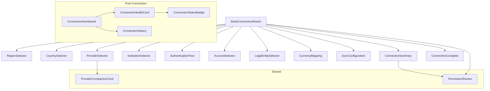

# Bank Connection Experience

## Overview

The enterprise bank connection UX enables CFOs, Treasurers, and Controllers to connect financial institutions across 6 global regions. The experience is structured as an 11-step wizard that guides users from region selection through authentication, account discovery, legal entity mapping, and sync configuration before finalizing the connection.

After completion, a connection dashboard provides ongoing health monitoring, credential management, and activity history.

The system supports 12 banking providers (Plaid, MX, Finicity, Akoya, TrueLayer, Tink, Lean Technologies, Tarabut Gateway, GoCardless, Salt Edge, Yodlee, and a custom provider placeholder) covering 25 countries across North America, Europe, the UK, the Middle East, Africa, and Asia Pacific.

### Design Philosophy

Aligned with the Perionyx Enterprise Software constitution:

- **Clarity** — each step answers one question (e.g., "Which region?", "Which institution?") with no visual noise
- **Confidence** — connection state is always visible; authentication status, account selection count, and sync config are displayed inline
- **Speed** — search filters instantly narrow results; the wizard auto-advances on valid selection
- **Beauty** — charcoal surfaces with gold accents, generous whitespace, deliberate typography
- **Trust** — every permission is visible and toggleable; authentication transparency with security indicators

## Component Architecture



### State Flow

```
Region → Country → Provider → Institution → Authenticate → Accounts
  → Entities → Currencies → Sync Config → Review → Complete
```

Each forward transition resets downstream state (e.g., changing region clears country, provider, institution, and accounts).

## All Components

### Wizard & Flow (`src/components/banking/`)

| # | Component | File | Description |
|---|---|---|---|
| 1 | `BankConnectionWizard` | `bank-connection-wizard.tsx` | Root orchestrator. Manages 11-step state machine, step progression, and back/continue navigation. Renders the active step component and step indicator bar. |
| 2 | `RegionSelector` | `region-selector.tsx` | Displays 6 global regions as tappable cards. Each card shows flag emoji, region name, country count, and description. Selection auto-advances to step 2. |
| 3 | `CountrySelector` | `country-selector.tsx` | Searchable grid of countries filtered by selected region. Shows flag + name. Selection auto-advances to step 3. |
| 4 | `ProviderSelector` | `provider-selector.tsx` | Lists providers filtered by country/region. Each card shows provider name, description, institution count, enterprise rating (color-coded latency), auth types, and capability badges. Recommended providers are marked with a gold badge. Selection advances to step 4. |
| 5 | `ProviderComparisonCard` | `provider-comparison-card.tsx` | Side-by-side table comparing up to 4 providers across 9 features (Balances, Transactions, Payments, Identity, Historical Sync, Real-time, Webhooks, Account Discovery, Statements). Also shows rating and institution count. Used inside `ProviderSelector` context. |
| 6 | `InstitutionSelector` | `institution-selector.tsx` | Searchable institution list grouped by category: Commercial, Investment, Islamic, and Digital banks. Categories have color-coded icons. Unsupported institutions are disabled with opacity. Selection advances to step 5. |
| 7 | `AuthenticationFlow` | `authentication-flow.tsx` | Simulates OAuth/Open Banking connection. Shows provider name, auth type, security assurances (encrypted, read-only, no credential storage). Loading state with spinner, success state with green checkmark and continue button. Error state with inline alert. Advances to step 6 on completion. |
| 8 | `AccountSelector` | `account-selector.tsx` | Searchable account list grouped by type (Operating, Payroll, Treasury, Investment, Credit, Savings, Escrow). Each row shows account name, type, account number, currency, and balance. Multi-select with checkmark indicators. Selection count badge. Continue button appears on selection. Advances to step 7. |
| 9 | `LegalEntitySelector` | `legal-entity-selector.tsx` | Recursive tree view of legal entity hierarchy (Enterprise → Legal Entity → Business Unit → Department). Expandable/collapsible nodes with depth-based indentation. Assigns an account to an entity. Shows account preview card. Continue on selection. Advances to step 8. |
| 10 | `CurrencyMapping` | `currency-mapping.tsx` | Per-account currency selector dropdown with 20 supported currencies. Each row shows account initial, name, flag + code + symbol. Green checkmark on mapped accounts. Continue disabled until all mapped. Advances to step 9. |
| 11 | `SyncConfiguration` | `sync-configuration.tsx` | Two-section form: Sync Frequency (Manual, Hourly, Daily, Real-time) and Historical Import (30 days, 90 days, 1 year, All). Radio-card style with icons and descriptions. Daily + 90 days are defaults. Advances to step 10. |
| 12 | `ConnectionSummary` | `connection-summary.tsx` | Review screen showing all selections in a 2-column grid (Region, Country, Provider, Institution, Accounts, Sync, Currencies, Permissions). Selected accounts list with balances. Go Back and Confirm & Connect buttons. Advances to step 11. |
| 13 | `ConnectionComplete` | `connection-complete.tsx` | Success screen with large green checkmark. Displays 4 info cards: Connection (institution + provider), Health (97% excellent), Last Sync (just now), Next Sync (based on sync mode). Capabilities summary with gold shield. Button to navigate to connection dashboard. |

### Post-Connection Dashboard (`src/components/banking/`)

| # | Component | File | Description |
|---|---|---|---|
| 14 | `ConnectionDashboard` | `connection-dashboard.tsx` | Management dashboard with 4 stat cards (Total, Healthy, Degraded, Errors). Tab switcher for Overview/History. Overview tab renders a grid of `ConnectionHealthCard` components. History tab renders `ConnectionHistory`. "Connect Bank" button to initiate new connection. |
| 15 | `ConnectionHealthCard` | `connection-health-card.tsx` | Individual connection card showing institution name, provider name, status badge, health score (color-coded), account count, last sync, next sync, credential expiry, permission status, and currencies. Degraded state shows amber warning. Manage button for drill-down. |
| 16 | `ConnectionStatusBadge` | `connection-status-badge.tsx` | Reusable status indicator with 4 states: Connected (green), Disconnected (zinc), Degraded (amber), Error (red). Each state has a colored dot, background tint, and text label. |
| 17 | `ConnectionHistory` | `connection-history.tsx` | Timeline of connection events (establishment, account discovery, syncs, rate limit warnings, credential rotations). Each entry has a status icon (success/warning/error), action name, timestamp, and details. Vertical timeline with connecting line. |

### Shared / Cross-Cutting

| # | Component | File | Description |
|---|---|---|---|
| 18 | `PermissionReview` | `permission-review.tsx` | Permission checklist with toggleable items. Shows 6 permissions: Read Balances, Read Transactions, Read Accounts, Initiate Payments, Read Credit Details, Background Sync. Required permissions are non-toggleable and marked with amber badge. Granted/not-granted visual states with check/x icons. |

## Multi-Step Wizard Flow

```
┌─────────────────────────────────────────────────────────────────────┐
│  Step 1 │ Region Selector           │ 6 regions, card selection     │
│  Step 2 │ Country Selector          │ Filtered by region, search    │
│  Step 3 │ Provider Selector         │ Filtered by country, compare  │
│  Step 4 │ Institution Selector      │ Grouped by category, search   │
│  Step 5 │ Authentication Flow       │ OAuth/Open Banking simulation │
│  Step 6 │ Account Selector          │ Multi-select by type, search  │
│  Step 7 │ Legal Entity Selector     │ Tree hierarchy, assign entity │
│  Step 8 │ Currency Mapping          │ Per-account currency override │
│  Step 9 │ Sync Configuration        │ Frequency + historical import │
│  Step 10 │ Connection Summary       │ Full review, confirm & connect│
│  Step 11 │ Connection Complete      │ Success screen, next steps    │
└─────────────────────────────────────────────────────────────────────┘
```

The step indicator bar at the top shows all 10 setup steps with icons, gold highlight for the current step, and emerald for completed steps. The total step count communicated to the user is 10 (step 11 is rendered outside the stepper as a completion view).

Back navigation is available at all intermediate steps and resets downstream state appropriately.

## Connection Dashboard Overview

The `ConnectionDashboard` (`connection-dashboard.tsx`) provides:

```
┌─────────────────────────────────────────────────────────────┐
│  Connected Banks                        [Connect Bank]      │
│  Manage your banking connections...                         │
├──────────┬──────────┬──────────┬──────────┬──────────┬──────┤
│ Total: 1 │ Healthy  │Degraded  │ Errors   │          │      │
│          │  1       │  0       │  0       │          │      │
├──────────┴──────────┴──────────┴──────────┴──────────┴──────┤
│ [Overview] [History]                    (tab switcher)      │
├─────────────────────────────────────────────────────────────┤
│ ┌─────────────┐ ┌─────────────┐ ┌─────────────┐            │
│ │ Chase Bank  │ │             │ │             │            │
│ │ via Plaid   │ │  (grid of   │ │             │            │
│ │ Health: 97% │ │  HealthCards)│ │             │            │
│ │ [Manage]    │ │             │ │             │            │
│ └─────────────┘ └─────────────┘ └─────────────┘            │
└─────────────────────────────────────────────────────────────┘
```

Each `ConnectionHealthCard` shows real-time health data, credential expiry warnings, permission status, and a "Manage Connection" button for deeper inspection.

The `ConnectionHistory` timeline provides an auditable log of all connection events with timestamps and status indicators.

## Accessibility

Every banking component follows WCAG 2.1 AA standards:

### Keyboard Navigation

| Component | Keyboard Behavior |
|---|---|
| `BankConnectionWizard` | Tab through step indicator; focus on Back/Continue buttons; Enter to activate |
| `RegionSelector` | Tab through region cards; Enter/Space to select; arrow keys for grid navigation |
| `CountrySelector` | Search input auto-focused; filtered results navigable via Tab; Enter to select |
| `ProviderSelector` | Search input auto-focused; Tab through provider cards; Shift+Tab for reverse |
| `InstitutionSelector` | Category headings skippable via Tab; institution buttons in grid; disabled items skipped |
| `AuthenticationFlow` | Focus on connect button; Escape to abort (not implemented but recommended) |
| `AccountSelector` | Search + Tab through account rows; Space to toggle selection |
| `LegalEntitySelector` | Tab through entity tree; Enter to select; Space to expand/collapse; arrow key navigation |
| `CurrencyMapping` | Tab through select elements; Enter to open dropdown |
| `SyncConfiguration` | Tab through mode and historical options; Space/Enter to select |
| `ConnectionSummary` | Tab between Go Back and Confirm & Connect |
| `ConnectionDashboard` | Tab between Connect Bank, stat cards, tab buttons, and individual health cards |

### ARIA Attributes

All components use the following ARIA attributes consistently:

- `role="group"` with `aria-label` on each step container (e.g., `aria-label="Select banking region"`)
- `role="application"` with `aria-label="Bank connection wizard"` on the wizard root
- `role="table"`, `role="columnheader"` on comparison table
- `role="alert"` on error messages
- `role="status"` on `ConnectionStatusBadge`
- `role="article"` on `ConnectionHealthCard`
- `aria-current="step"` on active step indicator
- `aria-pressed` on all selectable buttons (regions, countries, providers, institutions, accounts)
- `aria-label` with descriptive text on icon-only buttons and interactive elements
- `aria-describedby` implicitly via DOM structure (label + description pattern)
- `aria-hidden="true"` on all decorative icons (lucide-react icons)

### Screen Reader Support

- All step headings use semantic `<h2>` + descriptive `<p>` for context
- Account balances, institution names, and status changes are announced via live regions
- Required vs. optional permissions are clearly labeled with "Required" badges
- Empty states display descriptive messages ("No countries match your search", "No providers found for this country")
- Connection status badges announce state via `aria-label="Connection status: Connected"`
- All `ChevronLeft`, `ChevronRight`, `Check` icons are hidden from screen readers (`aria-hidden="true"`)

## RTL Compatibility

All 18 banking components use `cn()` (`clsx` + `tailwind-merge`) for class composition with zero hard-coded directional CSS values:

### What works for RTL

- `tailwind-merge` handles `rtl:` and `ltr:` variants when configured with `tailwindcss-rtl` plugin
- No component uses `left`, `right`, `ml-*`, `mr-*`, `pl-*`, `pr-*` in JSX — all spacing uses `gap-*` or logical padding
- Icon components (ChevronLeft, ChevronRight, ArrowRight) are marked `aria-hidden="true"` and would need icon swapping for RTL contexts (e.g., `ChevronLeft` becomes `ChevronRight` in RTL)
- The `Search` input icon uses `left-3` for positioning — this is the only directional utility found across all components and would need an `ltr:left-3 rtl:right-3` pattern
- Flexbox `gap-*` handles layout spacing direction-agnostically
- The step connector line (`h-px w-3`) is direction-neutral

### Required changes for full RTL support

1. Replace hard-coded `left-3` on search input icons with `ltr:left-3 rtl:right-3`
2. Swap `ChevronLeft`/`ChevronRight`/`ArrowRight` icon components based on `dir` context
3. The `ConnectionHistory` timeline line (`left-4`, `pl-10`) needs `ltr:left-4 rtl:right-4` and `ltr:pl-10 rtl:pr-10`
4. The `ConnectionHistory` icon positioning (`left-2.5`) needs `ltr:left-2.5 rtl:right-2.5`

## Dark Mode

The project is dark-only. All banking components follow the established palette:

- **Backgrounds**: `bg-white/[0.02]` (card surfaces), `bg-white/[0.04]` (icon containers), `bg-white/[0.06]` (borders), `bg-white/[0.08]` (active tab)
- **Text**: `text-white/[0.87]` (primary), `text-white/[0.5]` (secondary), `text-white/[0.4]` (tertiary), `text-white/[0.3]` (disabled)
- **Accents**: `text-gold` / `bg-gold` / `bg-gold/[0.05]` / `bg-gold/[0.1]` for selection states and CTAs
- **Status colors**: `text-emerald-400` (success/healthy), `text-amber-400` (warning/degraded), `text-red-400` (error)
- **Category colors**: `text-blue-400` (commercial), `text-purple-400` (investment), `text-emerald-400` (islamic), `text-cyan-400` (digital)

No `dark:` variant prefixes are used anywhere — the color values are designed for dark surfaces as the default.

## Future Provider Integration Readiness

The architecture supports adding new providers with minimal code changes:

### Data Layer (`data.ts`)

Adding a new provider requires one entry in the `PROMOTOS` array:

```typescript
{
  id: "new_provider",
  name: "New Provider",
  logo: "",
  description: "Provider description",
  coverage: "Countries — N institutions",
  capabilities: ["Balances", "Transactions", ...],
  supportedBankCount: 5000,
  authTypes: ["OAuth 2.0"],
  enterpriseRating: 4.5,
  latencyRating: "low",
  recommended: false,
  website: "https://provider.com",
  regions: ["north_america", "europe"],
}
```

### Provider-Specific Authentication

The `AuthenticationFlow` component currently simulates generic OAuth. For real provider integration, a strategy pattern can be introduced:

```typescript
interface AuthStrategy {
  type: "oauth" | "open_banking" | "mtls" | "api_key";
  initiate(): Promise<AuthSession>;
  poll(sessionId: string): Promise<AuthResult>;
  revoke(sessionId: string): Promise<void>;
}
```

Each provider would register its own strategy, keyed by `provider.id`.

### Webhook Registration

The `SyncConfiguration` component already supports "Real-time" mode. Provider-specific webhook registration would be added to the `AuthenticationFlow.handleConnect()` callback.

### Rate Limit Handling

The `ConnectionHistory` component already displays rate limit warnings (e.g., "Plaid rate limit at 85%"). Provider-specific rate limit configurations would be added to the provider data model.
