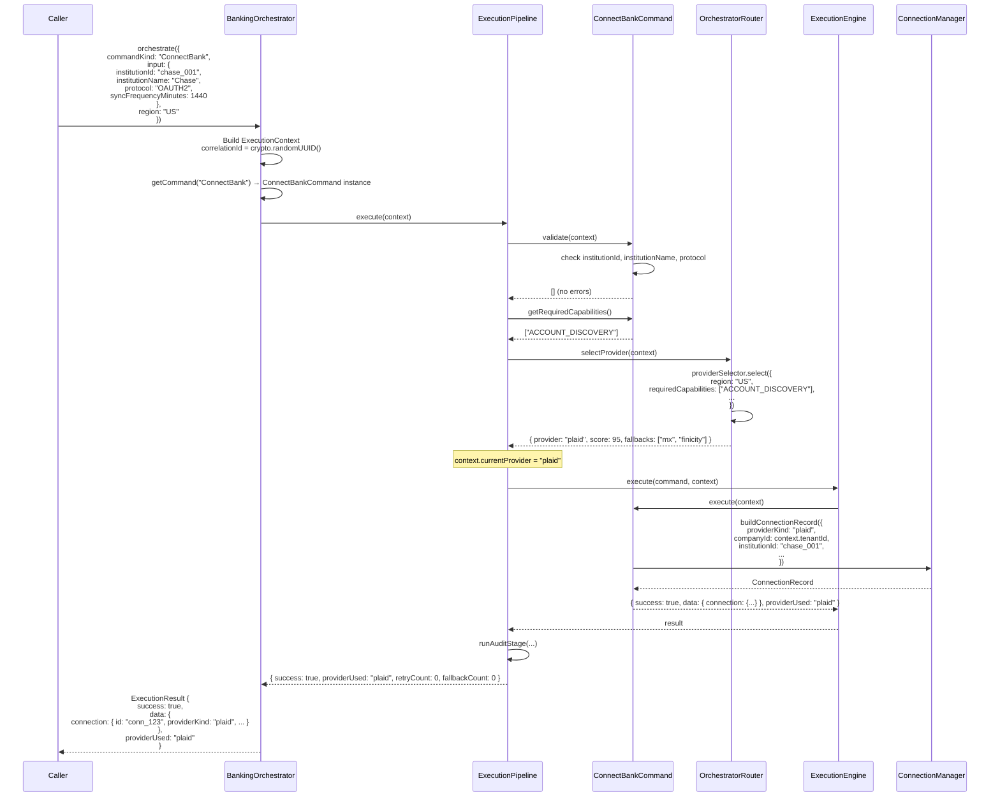

# Command Pattern

## Motivation

The orchestration layer uses the **Command Pattern** to decouple *what* an operation does from *how* it is executed, retried, and failed over. Each banking operation is encapsulated in a class that implements `OrchestratorCommand`. The pipeline treats every command identically: validate, check capabilities, select a provider, execute, and if needed, retry and fail over.

**Benefits:**

- **Uniform lifecycle** — every operation passes through the same pipeline stages
- **Pluggable** — adding a new command does not change the pipeline, router, retry engine, or failover engine
- **Self-describing** — each command declares its required capabilities, making provider selection automatic
- **Testable** — commands can be unit-tested in isolation with mocked execution contexts
- **Auditable** — every command execution is recorded with full context

## `OrchestratorCommand` Interface

Defined in `src/server/banking/orchestrator/commands/types.ts`:

```typescript
interface OrchestratorCommand {
  readonly kind: CommandKind;

  validate(context: ExecutionContext): Promise<string[]>;

  execute(context: ExecutionContext): Promise<ExecutionResult>;

  getRequiredCapabilities(): string[];
}
```

| Method | Purpose | Called By |
|---|---|---|
| `validate(context)` | Returns array of validation error strings (empty = valid) | Pipeline VALIDATION stage |
| `execute(context)` | Performs the actual operation via provider SDKs | Pipeline EXECUTION stage (and retry/failover engines) |
| `getRequiredCapabilities()` | Returns capabilities the command needs (e.g. `["ACCOUNT_DISCOVERY"]`) | Pipeline CAPABILITY_CHECK stage and router |

## Command Class Diagram

```mermaid
classDiagram
    class OrchestratorCommand {
        <<interface>>
        +kind: CommandKind
        +validate(context: ExecutionContext) Promise~string[]~
        +execute(context: ExecutionContext) Promise~ExecutionResult~
        +getRequiredCapabilities() string[]
    }

    class ConnectBankCommand {
        +kind = "ConnectBank"
        +validate(context) Promise~string[]~
        +execute(context) Promise~ExecutionResult~
        +getRequiredCapabilities() string[]
    }

    class DisconnectBankCommand {
        +kind = "DisconnectBank"
    }

    class SyncAccountsCommand {
        +kind = "SyncAccounts"
    }

    class SyncTransactionsCommand {
        +kind = "SyncTransactions"
    }

    class RefreshBalancesCommand {
        +kind = "RefreshBalances"
    }

    class ImportStatementsCommand {
        +kind = "ImportStatements"
    }

    class VerifyConnectionCommand {
        +kind = "VerifyConnection"
    }

    class RotateCredentialsCommand {
        +kind = "RotateCredentials"
    }

    class FetchCapabilitiesCommand {
        +kind = "FetchCapabilities"
    }

    class HealthCheckCommand {
        +kind = "HealthCheck"
    }

    OrchestratorCommand <|.. ConnectBankCommand : implements
    OrchestratorCommand <|.. DisconnectBankCommand : implements
    OrchestratorCommand <|.. SyncAccountsCommand : implements
    OrchestratorCommand <|.. SyncTransactionsCommand : implements
    OrchestratorCommand <|.. RefreshBalancesCommand : implements
    OrchestratorCommand <|.. ImportStatementsCommand : implements
    OrchestratorCommand <|.. VerifyConnectionCommand : implements
    OrchestratorCommand <|.. RotateCredentialsCommand : implements
    OrchestratorCommand <|.. FetchCapabilitiesCommand : implements
    OrchestratorCommand <|.. HealthCheckCommand : implements
```



## `CommandKind` Union

Defined in `src/server/banking/orchestrator/types.ts`:

```typescript
type CommandKind =
  | "ConnectBank"
  | "DisconnectBank"
  | "SyncAccounts"
  | "SyncTransactions"
  | "RefreshBalances"
  | "ImportStatements"
  | "VerifyConnection"
  | "RotateCredentials"
  | "FetchCapabilities"
  | "HealthCheck";
```

## Command Registry Pattern

Defined in `src/server/banking/orchestrator/commands/index.ts`:

```typescript
const COMMAND_REGISTRY = new Map<CommandKind, OrchestratorCommand>([
  ["ConnectBank",        new ConnectBankCommand()],
  ["DisconnectBank",     new DisconnectBankCommand()],
  ["SyncAccounts",       new SyncAccountsCommand()],
  ["SyncTransactions",   new SyncTransactionsCommand()],
  ["RefreshBalances",    new RefreshBalancesCommand()],
  ["ImportStatements",   new ImportStatementsCommand()],
  ["VerifyConnection",   new VerifyConnectionCommand()],
  ["RotateCredentials",  new RotateCredentialsCommand()],
  ["FetchCapabilities",  new FetchCapabilitiesCommand()],
  ["HealthCheck",        new HealthCheckCommand()],
]);

function getCommand(kind: CommandKind): OrchestratorCommand {
  const command = COMMAND_REGISTRY.get(kind);
  if (!command) throw new Error(`Unknown command kind: ${kind}`);
  return command;
}
```

The registry is a `Map<CommandKind, OrchestratorCommand>` — all instances are singletons. Commands are stateless by design: all per-request state lives in `ExecutionContext`, which is passed to each method.

The pipeline resolves commands lazily via `getCommand()`. This means:
- The registry can be extended without touching pipeline code
- Unknown `CommandKind` values produce a clear error at runtime
- The `getRegisteredCommands()` helper returns all available kinds for discovery

## How to Add a New Command

**Step 1**: Add the `CommandKind` to the union type in `types.ts`:

```typescript
type CommandKind = /* ... existing ... */ | "GenerateReports";
```

**Step 2**: Create the command class in `commands/`:

```typescript
// src/server/banking/orchestrator/commands/generate-reports.command.ts
import type { ExecutionContext, ExecutionResult } from "../types";
import type { OrchestratorCommand } from "./types";

export class GenerateReportsCommand implements OrchestratorCommand {
  readonly kind = "GenerateReports" as const;

  async validate(context: ExecutionContext): Promise<string[]> {
    const errors: string[] = [];
    if (!context.metadata?.reportType) errors.push("reportType is required");
    return errors;
  }

  async execute(context: ExecutionContext): Promise<ExecutionResult> {
    // Provider SDK communication happens here
    return { success: true, data: { ... }, providerUsed: context.currentProvider!, ... };
  }

  getRequiredCapabilities(): string[] {
    return ["REPORT_GENERATION"];
  }
}
```

**Step 3**: Register in `commands/index.ts`:

```typescript
import { GenerateReportsCommand } from "./generate-reports.command";

const COMMAND_REGISTRY = new Map<CommandKind, OrchestratorCommand>([
  // ... existing ...
  ["GenerateReports", new GenerateReportsCommand()],
]);

// Also export the input type if needed
export type { GenerateReportsInput } from "./types";
```

That's it. The pipeline, router, retry engine, failover engine, and audit service require zero changes.

## Input Types

Defined in `src/server/banking/orchestrator/commands/types.ts`:

```typescript
interface ConnectBankInput {
  institutionId: string;
  institutionName: string;
  protocol: string;
  syncFrequencyMinutes: number;
  credentials?: Record<string, unknown>;
}

interface SyncTransactionsInput {
  connectionId: string;
  accountIds: string[];
  startDate?: string;
  endDate?: string;
}

interface ImportStatementsInput {
  connectionId: string;
  accountId: string;
  fromDate: string;
  toDate: string;
}

interface RotateCredentialsInput {
  connectionId: string;
}
```

Inputs are passed through `ExecutionContext.metadata.input` and cast by each command. This keeps the `ExecutionContext` generic while allowing strongly-typed command inputs.

## Example: `ConnectBankCommand` Flow


